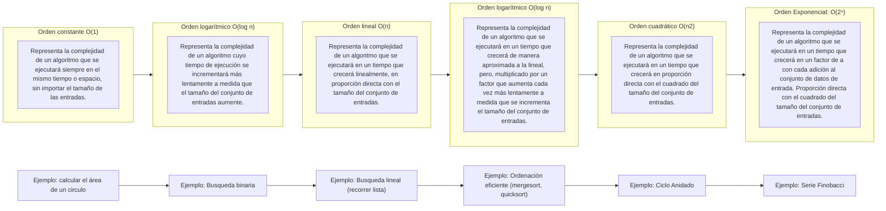
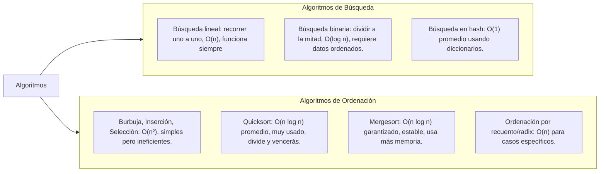

# Algoritmos

### Complejidad de un algoritmo 

+ la complejidad de un algoritmo representa la cantidad del recurso que el programa demanda para su ejecución.

+ Es más habitual hacer análisis de complejidad teóricos que prácticos, porque las condiciones cambian frecuentemente.

### Tipos de complejidad

### Espacial: 

La demanda de memoria RAM, consumo de espacio ocupado por las variables del programa.

### Temporal

+ La demanda de procesador, consumo de tiempo utilizado para ejecutar las instrucciones del programa. 

	- Es mucho más frecuente el análisis de tiempo que el de espacio.

	+ Procedimiento para calcular complejidad temporal de forma teórica
	
        + Identificar las variables que describen el tamaño del problema a resolver. Por ejemplo, si se están sumando dos matrices de dimensiones n x m, el tamaño del problema estaría descrito por la variable n (el alto de las matrices) y por la variable m (el ancho de las matrices).

		+ Definir las operaciones básicas que desea contabilizar. En el ejemplo anterior de suma de matrices, importaría contar cuántas sumas de celdas se realizan.

		+ Encontrar una función que relacione el tamaño del problema con el número de operaciones básicas ejecutadas, analizando el peor escenario posible. Esta función refleja la complejidad temporal, porque entre más operaciones se ejecuten, más tiempo se demoraría el algoritmo en ejecutar.

### Medida de eficiencia de algoritmos Notación Big O

+ La notación asintótica es una forma de representación que permite describir la eficiencia de un algoritmo en función de su tasa de crecimiento, es decir, proyecta el comportamiento del algoritmo conforme al aumento del tamaño de sus entradas.

+ se centra en un análisis del peor caso es decir, en el escenario más adverso imaginable, que haga que la función ejecute el máximo número de operaciones posible. 
Puede usarse para describir tanto complejidad temporal como espacial.

+ Dada una función f(n) se dice que un algoritmo tiene complejidad temporal O(f(n)) si la cantidad de operaciones que ejecuta siempre está por debajo de un múltiplo constante de f(n), para un valor grande de n.

### Reglas para el cálculo de complejidad

+ Para calcular la complejidad temporal de una secuencia de instrucciones, Se debe hallar la complejidad de cada instrucción por separado y tomar la más grande de estas.

+ Para calcular la complejidad temporal de una asignación, hay que hallar la complejidad del cálculo de la expresión que está siendo asignada.

+ Para calcular la complejidad temporal de un condicional, hay que hallar la complejidad de evaluar la condición de cada instrucción por separado y tomar la más grande de estas.

### Principales órdenes de complejidad

### Ejemplos de Algoritmos con su notacion Big O

### Técnicas Algorítmicas

+ Divide y vencerás: dividir problema, resolver partes, combinar.
+ Programación dinámica: memorizar subproblemas para no recalcular.
+ Algoritmos voraces (greedy): elegir lo mejor localmente.
+ Backtracking: probar opciones, retroceder si no funcionan.
+ Dos punteros: recorrer desde extremos hacia el centro.