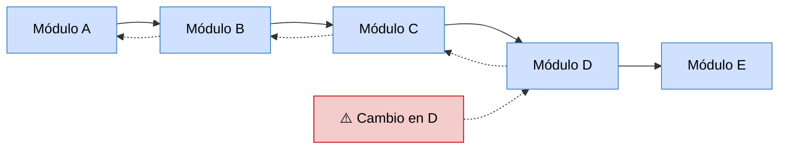
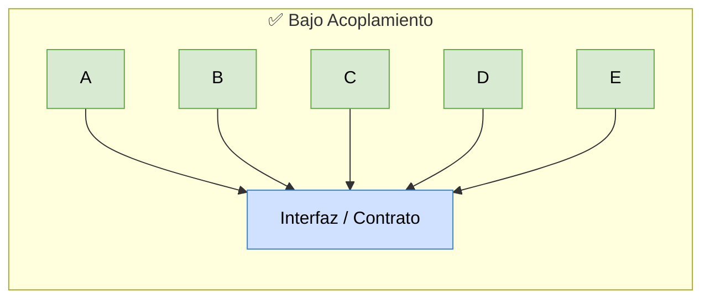
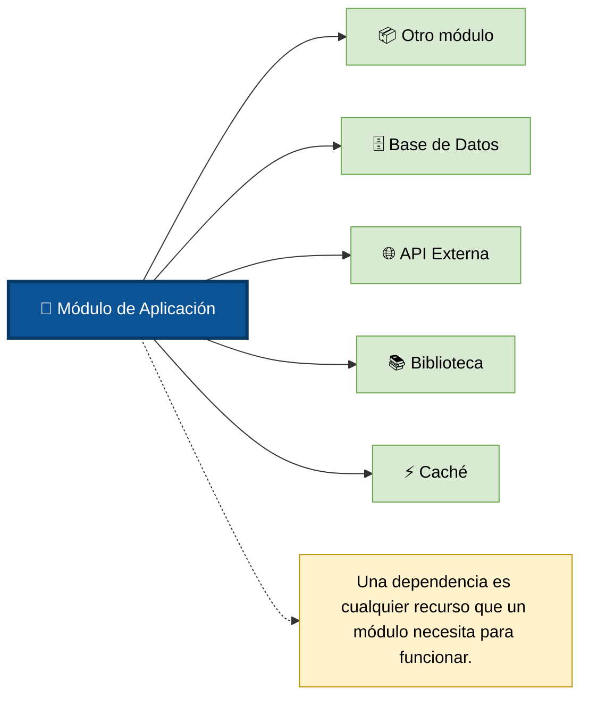
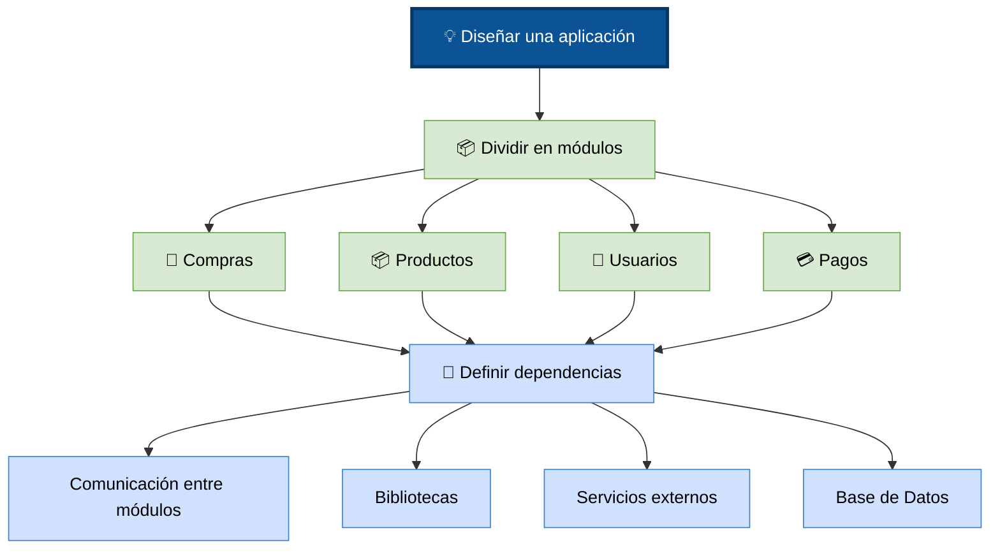

# Modularidad y Gestión de Dependencias

### ¿Qué es la modularidad?

La modularidad consiste en dividir un programa en partes pequeñas e independientes llamadas **módulos**, donde cada módulo tiene una responsabilidad bien definida.

En lugar de tener un Programa gigante se organiza así:

```
Programa

├── Usuarios
├── Productos
├── Compras
├── Pagos
├── Reportes
└── Base de datos
```
Cada módulo hace una sola cosa.

**Analogía:**

+ Imagina construir una casa.
+ No existe un trabajador que haga absolutamente todo.
+ Hay personas especializadas:
    + Electricista → Instala la electricidad
    + Plomero → Instala las tuberías
    + Carpintero → Hace puertas y muebles
    + Pintor → Pinta la casa
+ Cada uno trabaja de forma relativamente independiente.
+ En software ocurre exactamente igual.
+ Cada módulo es un especialista.

### ¿Qué problema intenta resolver?

+ Imagina que escribes un programa de 20 líneas. 
+ Todo puede estar en un solo archivo.

Ahora imagina una aplicación como:

+ WhatsApp
+ Spotify
+ Amazon
+ Instagram

*Estos sistemas tienen millones de líneas de código.*

Si todo estuviera en un solo archivo sería prácticamente imposible:

+ entender el código
+ encontrar errores
+ agregar nuevas funciones
+ trabajar en equipo

Por eso existe la modularidad. 

### ¿Qué es un módulo?

Un módulo es una parte del programa que encapsula una funcionalidad específica.

```
Aplicación bancaria

├── Login
├── Transferencias
├── Tarjetas
├── Clientes
├── Cajeros
└── Reportes
```

Cada uno puede desarrollarse por separado.

### Características de un buen módulo

1. Tener una sola responsabilidad

+ Debe encargarse de una única tarea.

    Ejemplo de lo que no seria un modulo porque hace demasiadas cosas:

    Usuario

    - iniciar sesión
    - enviar correos
    - generar reportes
    - imprimir facturas
    - hacer pagos

    Ejemplo de modulos, Cada uno tiene un propósito claro:

    - Usuario → Administra usuarios
    - Correo → Envía correos
    - Facturación → Genera facturas

    Este principio está relacionado con el Principio de **Responsabilidad Única (SRP)**

2. Ocultar detalles internos (encapsulación)

+ Los demás módulos no necesitan saber cómo funciona internamente, Solo necesitan saber cómo usarlo
+ No importa si internamente usa:
    + algoritmos complejos
    + estructuras especiales
    + optimizaciones

+ Todo eso está oculto, esto tambien se conoce como abstracción.

3. Tener interfaces claras

+ Un módulo ofrece una forma definida para comunicarse.

    + Módulo Usuarios
    + Funciones disponibles
    + CrearUsuario()
    + EliminarUsuario()
    + BuscarUsuario()

+ Los demás módulos usan esas funciones sin conocer el interior.

4. Ser reutilizable

+ Si el módulo está bien diseñado puede utilizarse en muchos proyectos.
+ No hace falta volver a escribirlo.

### ¿Qué significa "alta cohesión"?

La cohesión mide qué tan relacionadas están las responsabilidades dentro de un módulo.

**Ejemplo Alta cohesión:**

```
Módulo Matemáticas
+ - x /
```

+ Todo pertenece al mismo tema.

**Ejemplo Baja cohesión:**

```
Módulo Utilidades

    Enviar correo
    Eliminar usuarios
    Imprimir factura
    Conectar BD
    Calcular impuestos
```
+ No existe una relación clara.
+ Es difícil mantenerlo.

> La alta cohesión hace que los módulos sean más fáciles de entender y mantener.

### ¿Qué significa "bajo acoplamiento"?

El acoplamiento mide cuánto depende un módulo de otro.

**Alto acoplamiento**



Todo está conectado; Si cambias D, Puede romper: C → B → A

### Bajo acoplamiento (Este es uno de los objetivos más importantes del diseño de software)


+ Cada módulo depende lo menos posible de los demás.
+ Si cambias uno... Los demás siguen funcionando.

### Beneficios de la modularidad

La modularidad ofrece muchas ventajas.

1. Facilita el mantenimiento

    + Si hay un error en `pagos`:

    ```
    Programa
    ├── Usuarios
    ├── Productos
    ├── Pagos ← aquí
    └── Reportes
    ```
    + Solo revisas ese módulo.

2. Facilita el trabajo en equipo

    + Un desarrollador trabaja en:
        + Usuarios

    + Otro en:
        + Compras

    + Otro en:
        + Pagos

    + No necesitan modificar el mismo archivo continuamente.

3. Facilita las pruebas

    + Puedes probar cada módulo por separado.
        + Probar Login ✅
        + Probar Pagos ✅
        + Probar Reportes ⚠️

    + Después los integras.

4. Reutilización 

    + Puedes usar un módulo muchas veces.
        + Biblioteca para enviar correos, Puede servir para:
            + tienda virtual
            + banco
            + red social
            + universidad

5. Escalabilidad

    + Agregar nuevas funcionalidades resulta más sencillo.
    ```
    Programa
    ├── Usuarios
    ├── Productos
    ├── Pagos
    └── Chat
    ```
    + Solo agregas otro módulo.
    + No necesitas modificar todo.

## ¿Qué son las dependencias?

**Definición**

_**Una dependencia es cualquier recurso, módulo, biblioteca o servicio del que otro módulo necesita para funcionar.**_

+ Los módulos rara vez viven completamente aislados.
+ Normalmente necesitan utilizar otros módulos.
+ **Eso es una dependencia.**


**Ejemplo básico**
```
               Compras
                  │
          necesita utilizar
                  ▼
             Productos
```
**Ejemplo básico**
```
             Login
                │
      consulta usuarios
                ▼
          Base de Datos
```

### Dependencias internas

Son módulos creados dentro del mismo proyecto. 

```
Proyecto

├── Usuarios
├── Productos
└── Pagos
```

+ Pagos puede depender de: Usuarios y de Productos

### Dependencias externas

Son bibliotecas o herramientas desarrolladas por terceros.

Por ejemplo, en los proyectos es muy común utilizar

En JavaScript

+ React
+ Express
+ Axios
+ Lodash

En Java:

+ Spring
+ Hibernate
+ Jackson

En Python:

+ NumPy
+ Pandas
+ Django

Estas bibliotecas son dependencias externas.

### ¿Por qué gestionar las dependencias?

Cuando un proyecto crece puede tener cientos de dependencias.

Cada una tiene:

+ una versión
+ posibles actualizaciones
+ compatibilidad con otras bibliotecas
+ vulnerabilidades de seguridad
+ licencias

**Gestionarlas manualmente sería muy difícil.**

Por eso existen herramientas como:

+ npm (JavaScript)
+ Maven y Gradle (Java)
+ pip (Python)
+ Cargo (Rust)
+ NuGet (.NET)

**Estas herramientas permiten declarar qué dependencias necesita el proyecto, descargar las versiones correctas y mantenerlas actualizadas cuando sea apropiado**

### Relación entre modularidad y dependencias

Estos dos conceptos están estrechamente relacionados.



+ La modularidad responde a la pregunta: 
    + **¿Cómo divido mi programa en partes?**

+ La gestión de dependencias responde a la pregunta: 
    + **¿Cómo se relacionan esas partes y cómo incorporo componentes externos de forma organizada?**

### Ejemplo completo

```
Aplicación

├── Usuarios
│
├── Productos
│
├── Inventario
│
├── Compras
│      │
│      ├── depende de Usuarios
│      ├── depende de Productos
│      └── depende de Inventario
│
├── Pagos
│      │
│      └── depende de Compras
│
└── Reportes
       │
       ├── depende de Compras
       └── depende de Pagos
```
+ Cada módulo tiene una responsabilidad clara (modularidad), 
+ pero algunos necesitan información de otros para realizar su trabajo (dependencias).

### Ideas clave para recordar

+ Modularidad consiste en dividir un programa en módulos pequeños, cada uno con una responsabilidad específica.
+ Un buen módulo tiene alta cohesión (sus elementos están relacionados entre sí) y bajo acoplamiento (depende lo menos posible de otros módulos).
+ Los módulos interactúan mediante interfaces claras, ocultando sus detalles internos.
+ Una dependencia es cualquier módulo, biblioteca o servicio que otro módulo necesita para funcionar.
+ Las dependencias pueden ser internas (otros módulos del proyecto) o externas (bibliotecas de terceros).
+ La gestión de dependencias consiste en controlar esas relaciones y las versiones de las bibliotecas para mantener el software organizado, compatible y fácil de mantener.


