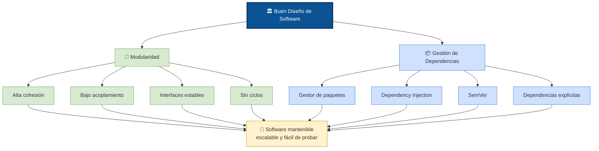

# Buenas practicas de Modularidad y Gestión de Dependencias

Las mejores prácticas exigen un bajo acoplamiento y una alta cohesión, junto con el uso de gestores de paquetes e inyección de dependencias para asegurar sistemas flexibles y desacoplados

### 🧱 Buenas Prácticas de Modularidad

**Alta cohesión:**
+ Asegúrate de que cada módulo (o clase) tenga una responsabilidad única y clara.
+ Un módulo debe hacer una sola cosa y hacerla bien.

**Bajo acoplamiento:**
+ Los módulos deben ser lo más independientes posible entre sí.
+ Los cambios en un módulo no deberían requerir modificaciones en otros

**Definir contratos estables:**
+ La comunicación entre módulos debe realizarse a través de interfaces o APIs bien definidas

**Evitar dependencias circulares**
+ Los módulos deben estructurarse en capas (ej. de presentación a datos) **en una sola dirección**

### 📦 Buenas Prácticas en Gestión de Dependencias

**Automatizar con gestores de paquetes:** 
+  Utiliza herramientas especializadas (como npm, Gradle, Maven o NuGet) para automatizar la descarga, actualización y resolución de conflictos de tus librerías.

**Usar Inyección de Dependencias (DI):** 
+ En lugar de crear instancias de tus dependencias dentro de tus clases (lo que genera alto acoplamiento), inyéctalas desde el exterior (a través de constructores o frameworks)

**Control de versiones semántico:**
+ Mantén un control estricto sobre las versiones de tus dependencias externas utilizando SemVer (Major.Minor.Patch) para predecir si una actualización traerá cambios rotundos (breaking changes).

**Mantener las dependencias explícitas:**
+  Evita las "cajas mágicas". Las dependencias de tu proyecto deben estar claramente documentadas en el archivo principal de configuración (ej. `package.json`, `pom.xml`, `build.gradle`), evitando la importación oculta de librerías.


```
🏛️ Buen Diseño de Software
│
├── 🧱 Principios de Diseño
│     ├── Alta cohesión
│     ├── Bajo acoplamiento
│     ├── Interfaces estables
│     └── Sin dependencias circulares
│
├── 📦 Gestión de Dependencias
│     ├── Gestores de paquetes
│     ├── Dependency Injection
│     ├── SemVer
│     └── Dependencias explícitas
│
└── 🎯 Resultado
      ├── Mantenible
      ├── Escalable
      ├── Flexible
      └── Fácil de probar
```

### Automatizar la gestión de librerías

**Automatización de Descargas y Actualizaciones**

En lugar de actualizar manualmente paquete por paquete, delega esta tarea a bots que se encargan de escanear tus archivos de configuración y abrir Pull Requests cada vez que sale una nueva versión.

+ **Dependabot:** Es la herramienta nativa de GitHub. Escanea vulnerabilidades e intenta mantener tus librerías actualizadas automáticamente configurando el archivo `dependabot.yml` dentro de la carpeta `.github/`

+ **Renovate:** Una alternativa mucho más flexible y potente (admitida en *GitHub, GitLab,* etc.). Te permite agrupar actualizaciones, definir horarios (para no saturar tu bandeja de entrada) e incluso fusionar automáticamente las actualizaciones si pasan tus pruebas de *CI/CD*

**Gestión y Resolución de Conflictos**

Los conflictos ocurren generalmente cuando dos dependencias requieren versiones incompatibles de una tercera librería *(conflicto de dependencias peer)* 

Ejemplos Para proyectos de Node.js (npm / Yarn)

+ **Actualiza proactivamente:** 
    + Utiliza la librería npm-check-updates (NCU) instalándola de forma global
    + Ejecuta ncu -u para actualizar tus rangos de versiones en package.json y luego npm install para que el gestor resuelva el árbol de dependencias

+ **Evita conflictos de dependencias peer:**
    + forzar la instalación utilizando el *flag* `npm install --legacy-peer-deps` (aunque se recomienda usarlo como solución temporal).

+ **Fuerza versiones anidadas:**
    + Usa el campo overrides en tu `package.json` (para *npm/pnpm*) o `resolutions` (para *Yarn*) para forzar al gestor a utilizar una versión específica de un paquete secundario

**Resolución de Conflictos en Archivos de Bloqueo (Lockfiles)**

Cuando haces merge en Git y se generan conflictos en archivos como package-lock.json o yarn.lock, resolverlos línea por línea es una mala práctica que corrompe el árbol de dependencias.

La forma automatizada y segura de resolverlos es:

1. Resuelve los conflictos en tus archivos de manifiesto originales (ej. `package.json`, `pyproject.toml`).
2. Elimina tu archivo de bloqueo existente.
3. Vuelve a ejecutar el comando de instalación de tu gestor  (ej. `npm install`, `poetry install`)  para que regenere el archivo de bloqueo automáticamente con el árbol de dependencias ya resuelto

### Inyección de dependencias (DI)

Es un patrón de diseño en el que un objeto recibe sus dependencias desde una fuente externa en lugar de crearlas por sí mismo.

El objetivo es lograr un código débilmente acoplado, modular y mucho más fácil de probar y mantener.

**¿Por qué utilizar la inyección de dependencias?**

Sin este patrón, una clase instancia directamente los recursos que necesita (ej. una base de datos o un servicio de correo). Esto crea un "acoplamiento fuerte": si la dependencia cambia, debes modificar la clase principal. La inyección de dependencias soluciona esto

1. **Desacoplamiento:**  Las clases dependen de interfaces o abstracciones, no de implementaciones concretas
2. **Pruebas (Testing):** Facilita la creación de pruebas unitarias, ya que puedes inyectar fácilmente implementaciones falsas (mocks o stubs).
3. **Mantenimiento:** Permite cambiar el comportamiento de toda la aplicación modificando un solo lugar, sin alterar las clases que usan ese servicio

**Tipos de inyección de dependencias**

Existen tres formas principales de inyectar dependencias en una clase:

1. **Por constructor:** Las dependencias se pasan como parámetros al crear el objeto. Es la forma más recomendada y común.
2. **Por método:** La dependencia se inyecta directamente en el método que la necesita, siendo útil si la dependencia solo se usa en esa acción específica.
3. **Por propiedad (Setter):** Se utiliza un método mutador para asignar la dependencia después de que el objeto ha sido construido.

### Que es SemVer (Versionado Semántico)

Es una convención de numeración de software estructurada como Mayor.Menor.Parche (ej. `2.5.1`).

Define exactamente qué tipo de cambios se incluyen en cada actualización: 
    
        indica si una nueva versión es compatible con la anterior y si añade funciones o solo corrige errores.

Propósito exacto de cada uno de sus tres componentes:

**Mayor (Major)**

+ Se incrementa cuando realizas cambios incompatibles en la API o en el código que rompen la compatibilidad con versiones anteriores *(breaking changes)*
+ Ejemplo: de `1.4.0` a `2.0.0`

**Menor (Minor)**

+ Se incrementa cuando agregas nuevas funcionalidades de forma totalmente compatible con versiones anteriores
+ Es una actualización segura que añade valor sin alterar lo que ya funciona
+ Ejemplo: de `1.4.0` a `1.5.0`

**Parche (Patch)**

+ Se incrementa al realizar correcciones de errores compatibles con versiones anteriores.
+ No añade funciones nuevas, solo estabiliza o asegura la aplicación
+ Ejemplo: de `1.4.0` a `1.4.1`

### Documentar dependencias explícitas

Sirve para evitar que librerías secundarias se importen *"de manera oculta"* (dependencias transitivas no deseadas).

El enfoque ideal es usar gestores de paquetes declarativos y bloqueos de dependencias. Esto garantiza que solo lo que declares explícitamente se instale en tu proyecto.

Mejores prácticas según el entorno de desarrollo:

**Proyectos en Node.js (npm, yarn, pnpm, bun)**

+ **Gestión Explícita:**
    + Declara siempre tus librerías en la sección dependencies de tu archivo `package.json`.

+ **Evitar importaciones ocultas:**
    + Elimina el uso de scripts globales o módulos que se instalen automáticamente por la red.

+ **Bloqueo (Lockfile)**
    + Confirma en tu sistema de control de versiones el archivo de bloqueo (`package-lock.json`, `yarn.lock`, `pnpm-lock.yaml`)
    + Esto congela el árbol exacto de dependencias, evitando que librerías de terceros actualicen sus propias dependencias de forma silenciosa

+ **Auditoría**
    +  Utiliza el comando `npm audit` para escanear vulnerabilidades y bloquear instalaciones inseguras

**Proyectos Java/Kotlin (Maven, Gradle)**

+ **Archivos Principales:**
    + Centraliza tus dependencias en el archivo `pom.xml` (Maven) o `build.gradle` / `build.gradle.kts` (Gradle)

    + **Control Transitivo:**

        + En Gradle, utiliza `implementation` en lugar de `api` para que las dependencias internas de tus librerías no se filtren a otros módulos.
        + En Maven, define el alcance como `<scope>provided</scope>` si la dependencia la provee el entorno, evitando empaquetarla de forma oculta

+ **Bloqueo de versiones:**

    + Usa mecanismos de bloqueo como `Dependency Locking` en Gradle (con el bloque `dependencyLocking`) para evitar que el compilador resuelva versiones más recientes de manera oculta

**Proyectos Python (pip, poetry)**

+ **Gestión Explícita:** Declara las librerías directamente en `requirements.txt` (con versiones fijas usando `==`) o utiliza manejadores modernos como `pyproject.toml` (Poetry).

+ **Bloqueo (Lockfile):** Utiliza los archivos generados automáticamente como `poetry.lock` o `requirements.lock` para inmovilizar estrictamente el árbol de sub-dependencias.

+ **Entornos Aislados:** Instala siempre tu proyecto en un entorno virtual (`venv` o `conda`) para evitar que el sistema tome librerías instaladas de manera global en el equipo.