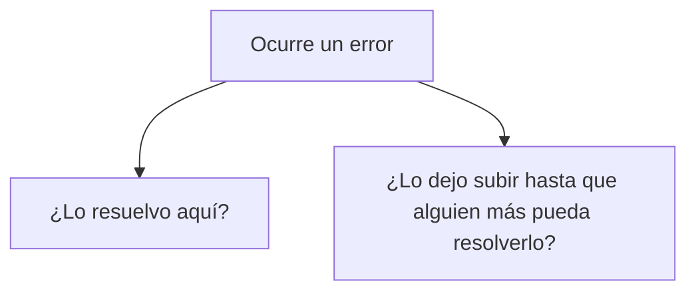
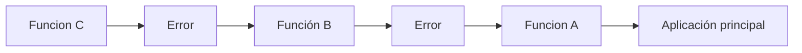
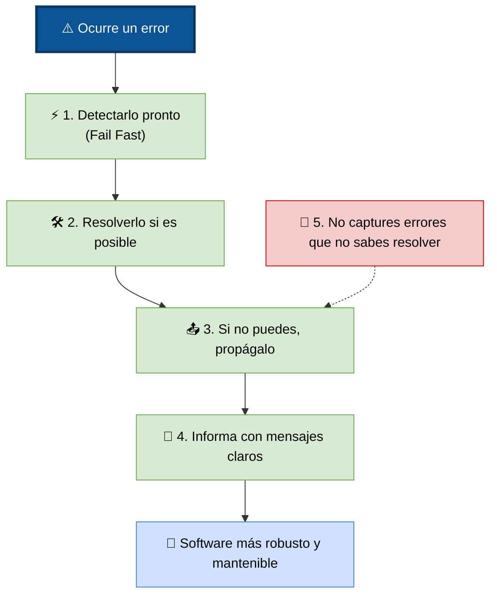

# Principios de Manejo de Errores

Los principios de manejo de errores son recomendaciones de diseño que indican cuándo detectar un error, cómo comunicarlo y quién debe responsabilizarse de resolverlo.

No son reglas estrictas, sino prácticas ampliamente aceptadas en la ingeniería de software moderna.

Los cuatro principios más importantes son:

```
Principios de Manejo de Errores
│
├── Fail Fast
├── No Atrapar Todo
├── Mensajes de Error Útiles
└── Propagar vs. Manejar
```

**Cada uno resuelve un problema diferente.**

## Fail Fast

### ¿Qué significa?

+ literalmente → "Fallar lo antes posible."

La idea es que, cuando el programa detecta que algo está mal, debe informar el problema inmediatamente, en lugar de continuar ejecutándose con datos inválidos. 

### ¿Por qué es importante?

```
Dato incorrecto → Función A → Función B → Función C → Error grave
```

Si un error no se detecta inmediatamente, puede pasar por muchas funciones hasta provocar un error mucho más difícil de localizar.

puede parecer que el problema está en la función C, aunque el origen real fue la entrada incorrecta en la función A.

### Aplicando Fail Fast

+ Lo correcto sería validar el dato apenas llega. 
+ Así el origen del problema queda claro.

**Ejemplo:**

Sin validación:

```python
# python
def dividir(a, b):
    return a / b

resultado = dividir(10, 0)
# El error aparecerá durante la división.

# Con validación temprana:

def dividir(a, b):
    if b == 0:
        raise ValueError("El divisor no puede ser cero.")
    return a / b
# La función detecta el problema desde el principio y comunica exactamente qué ocurrió.
```

**Beneficios**

+ Detecta errores cerca de su origen.
+ Facilita la depuración.
+ Evita estados inconsistentes.
+ Reduce efectos secundarios.

## No Atrapar Todo

Uno de los errores más comunes de los programadores principiantes es intentar capturar cualquier excepción.

**Por ejemplo:**

```python
# python
try:
    realizar_operacion()
except:
    pass
```

```java
//java
try {
    realizarOperacion();
}
catch(Exception e) {

}
```
+ A primera vista parece una buena idea.
+ En realidad suele ser una mala práctica.

**¿Por qué?**

**Porque no todas las excepciones significan lo mismo.**

Supongamos:
+ Archivo inexistente
    + Eso puede manejarse.

+ Memoria corrupta o Bug interno
    + requiere una estrategia para solucionarse
    
_Si capturamos todo indiscriminadamente, ocultamos problemas graves._

**Lo recomendable**

**Capturar únicamente las excepciones que realmente sabemos resolver.**

```python
# python
try:
    archivo = open("datos.txt")
except FileNotFoundError:
    print("El archivo no existe.")
```
+ Aquí el programa sabe exactamente qué hacer.
+ 🚨Si ocurre otro tipo de error inesperado, es mejor que se propague para ser investigado.🚨

**Mala práctica**

```python
# python
try:
    proceso()
except:
    pass
```

**¿Qué ocurrió?**
+ Nadie lo sabe.
+ El error desapareció.
+ Esto dificulta enormemente la depuración y puede ocultar defectos reales del software.

**Regla práctica**

_Si no puedes resolver el problema, normalmente no deberías capturarlo._

## Mensajes de Error Útiles

Cuando un error ocurre, el mensaje que se muestra es muchas veces la única pista disponible para entender el problema.

+ Un mal mensaje dificulta el diagnóstico.
+ Un buen mensaje acelera la solución.


no sirven mensajes como: `Error.` o `Algo salió mal.`

_¿Qué ocurrió? → No lo sabemos._

**Un mensaje correcto seria algo como:

`No fue posible abrir el archivo
"clientes.csv" porque no existe.`

Ahora el mensaje responde preguntas importantes:

+ ¿Qué operación falló?
+ ¿Qué recurso estaba involucrado?
+ ¿Cuál fue la causa?

¿Qué debería incluir un buen mensaje?

Normalmente:

+ qué ocurrió,
+ dónde ocurrió,
+ por qué ocurrió (si se conoce),
+ qué puede hacer el usuario.

`No se pudo conectar al servidor. 
Verifique su conexión a Internet
e intente nuevamente.`

### Lo que debe evitarse

+ No conviene mostrar al usuario información técnica innecesaria, como:

`NullPointerException at
com.company.service.UserManager.java:245`

Ese mensaje es útil para un desarrollador, pero no para un usuario final.

En una aplicación bien diseñada suele haber dos niveles:

+ Mensaje técnico, registrado en los logs para los desarrolladores.
+ Mensaje amigable, mostrado al usuario.

## Propagar vs. Manejar

### Este es probablemente el principio más importante del manejo de errores.

_Cuando ocurre un error debemos decidir:_



+ _Esta decisión determina si el error se maneja o se propaga._

### Manejar un error

**Significa que el código actual puede resolver el problema.**


+ Aquí la función sabe cómo recuperarse.
+ No necesita que otra parte del programa intervenga.

### Propagar un error

A veces la función detecta el problema, pero no sabe qué hacer.


+ Cada nivel tiene la oportunidad de manejarlo.
+ Si ninguno puede hacerlo, el error llegará al nivel superior.

**Ejemplo conceptual**

```
                 ❌ Error

             Base de Datos
                    │
                    ▼
              Repositorio
                    │
     ¿Puede resolverlo?
          │
      No  ▼
 Propagar el error
          │
          ▼
        Servicio
          │
 ¿Puede recuperarse?
      │          │
     Sí          No
      │           │
 Recuperar    Propagar
                  │
                  ▼
             Interfaz
                  │
                  ▼
       Mostrar mensaje al usuario
```

+ Si la base de datos deja de responder:
    + ¿Debe el repositorio mostrar un mensaje al usuario? → No.
        + Ni siquiera conoce al usuario.
+ Lo correcto es propagar el error.
    + Luego el servicio decide si puede recuperarse.
        + Si tampoco puede,
+ la interfaz muestra un mensaje adecuado.

### Regla práctica

Una función debería preguntarse:

**¿Tengo suficiente información y autoridad para resolver este error?**

Si la respuesta es:

+ **SI**, entonces debe `manejarlo`.
+ **NO**, entonces debe `propagarlo`.

### Relación entre los cuatro principios

Los cuatro principios trabajan juntos para producir un manejo de errores claro y consistente:
```
Ocurre un problema
        │
        ▼
¿Se detecta pronto?
        │
   Sí → Fail Fast
        │
        ▼
¿Puedo resolverlo?
        │
 ┌──────┴──────┐
 │             │
Sí             No
 │             │
 ▼             ▼
Manejar     Propagar
        │
        ▼
Si se informa,
usar mensajes útiles
        │
        ▼
No capturar errores
que no sabemos resolver
```
### Buenas prácticas combinadas

1. Fail Fast: verifica al inicio que el archivo exista.
2. No Atrapar Todo: captura únicamente el error de "archivo no encontrado", no cualquier excepción.
3. Mensajes de Error Útiles: informa claramente qué archivo falta y cómo solucionarlo.
4. Propagar vs. Manejar: si la función solo lee el archivo y no puede recuperarse, propaga el error; la aplicación 5. principal decide si usar una configuración por defecto o finalizar.



### Resumen

| Principio                    | Idea principal                                                                                                | Objetivo                                                                                              |
| ---------------------------- | ------------------------------------------------------------------------------------------------------------- | ----------------------------------------------------------------------------------------------------- |
| **Fail Fast**                | Detectar y reportar los errores tan pronto como aparezcan.                                                    | Evitar que datos inválidos propaguen problemas y facilitar la depuración.                             |
| **No Atrapar Todo**          | Capturar únicamente las excepciones que realmente sabemos manejar.                                            | No ocultar bugs ni errores críticos y mantener el comportamiento del programa predecible.             |
| **Mensajes de Error Útiles** | Proporcionar información clara, específica y adecuada al destinatario.                                        | Facilitar el diagnóstico por parte de desarrolladores y ayudar a los usuarios a entender el problema. |
| **Propagar vs. Manejar**     | Resolver el error solo si el componente puede hacerlo; en caso contrario, dejar que suba a un nivel superior. | Mantener una distribución clara de responsabilidades y un diseño más modular.                         |

### Ideas clave

principios en cuatro preguntas, serían:

1. ¿Detecté el problema lo antes posible? → Fail Fast
2. ¿Estoy capturando solo los errores que puedo resolver? → No Atrapar Todo
3. ¿El mensaje ayuda realmente a entender el problema? → Mensajes de Error Útiles
4. ¿Soy el componente adecuado para resolver este error o debo dejar que otro lo haga? → Propagar vs. Manejar

Responder correctamente a estas preguntas suele marcar la diferencia entre un software difícil de mantener y uno robusto, predecible y fácil de depurar.