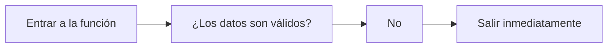
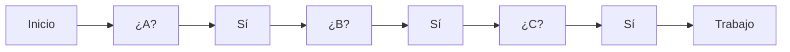
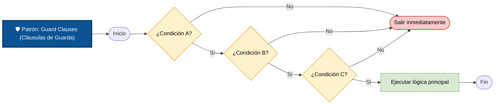

# Patrones Comunes

Un patrón **(Pattern)** es una solución reutilizable para un problema que aparece con frecuencia durante el desarrollo de software.

En el contexto del **manejo de errores**, los patrones no son mecanismos nuevos como las excepciones, sino **formas recomendadas de escribir el código para hacerlo más seguro y fácil de mantener**.

Dos de los patrones más utilizados son:

```
Patrones Comunes
│
├── Guard Clauses
└── Default Values
```

Ambos ayudan a escribir código más robusto y legible.

## Guard Clauses

### ¿Qué son?

Consisten en validar las condiciones necesarias al inicio de una función y salir inmediatamente si alguna no se cumple.

+ En lugar de permitir que la función continúe con datos inválidos, se detiene desde el principio.
+ Este patrón está directamente relacionado con el principio **Fail Fast**

### Idea principal

Las Guard Clauses hacen esto:



### ¿Por qué existen?

Cuando una función tiene muchas validaciones, es común terminar escribiendo numerosos bloques `if` anidados.

```
Si A

    Si B

        Si C

            Hacer trabajo
```
+ Mientras más validaciones existen, mayor es la profundidad de la indentación.
+ Eso hace que el código sea difícil de leer.

### Ejemplo conceptual:

**Sin Guard Clauses**

```python
# python
def procesar(usuario):

    if usuario is not None:

        if usuario.activo:

            if usuario.tiene_permiso():

                realizar_proceso()
```

**La lógica principal queda escondida entre múltiples niveles de validación.**

**Con Guard Clauses**

```python
# python
def procesar(usuario):

    if usuario is None:
        return

    if not usuario.activo:
        return

    if not usuario.tiene_permiso():
        return

    realizar_proceso()
```

**Ahora la lógica principal aparece al final y el flujo es mucho más claro.**

### Visualización

**Sin Guard Clauses**



**Con Guard Clauses**


**El flujo resulta mucho más lineal.**

### ¿Qué pueden hacer las Guard Clauses?

Dependiendo del caso, una Guard Clause puede:

```python
# python
# devolver un valor
return None

# lanzar una excepción
raise ValueError(...)

# devolver false
return False

# cancelar una operación.

# Lo importante no es cómo sale de la función, 
# sino que lo hace inmediatamente cuando detecta una condición  inválida.
```

### Ventajas

+ Reduce la indentación.
+ Facilita la lectura.
+ Detecta errores temprano.
+ Sigue el principio Fail Fast.
+ Hace evidente qué condiciones deben cumplirse.

### Desventajas

+ Si se abusa del patrón, una función puede comenzar con muchas salidas tempranas.
+ Por eso conviene utilizarlo únicamente para validar **precondiciones importantes**.

## Default Values

### ¿Qué son?

Los **Default Values** (valores por defecto) consisten en proporcionar un valor alternativo cuando el dato esperado no está disponible o resulta inválido.

**En lugar de producir un error, el programa continúa utilizando un valor seguro.**

### Idea principal

+ Supongamos que una función necesita un idioma.
+ El usuario no especifica ninguno.
+ En vez de fallar:
    ```
    Idioma = ?
    ↓
    Error
    ```
+ Se utiliza un valor por defecto.
    ```
    Idioma = ?
    ↓
    Español
    ```
+ El programa continúa funcionando.

### ¿Por qué existen?

En el mundo real es común que algunos datos:

+ sean opcionales
+ todavía no existan
+ lleguen incompletos
+ puedan omitirse.

Los valores por defecto permiten que el software siga funcionando sin obligar al usuario a proporcionar toda la información.

**Ejemplo**

Una aplicación recibe un nombre.

```Python
nombre = obtener_nombre()

# Si el usuario no escribe nada:
nombre = None

# En lugar de fallar, se usa un valor por defecto.
if nombre is None:
    nombre = "Invitado"

saludo = "Hola " + obtener_nombre
```
Ahora el programa puede mostrar:
+ `Hola Invitado`

### ¿Cuándo usar Default Values?

Cuando la ausencia del dato no representa realmente un error.

Por ejemplo:

+ idioma
+ tema visual
+ fotografía de perfil
+ configuración opcional
+ filtros de búsqueda.

### ¿Cuándo NO usarlos?

No deben utilizarse cuando el dato es obligatorio.

```
Transferencia bancaria

Monto
↓
No especificado
↓
¿Usar 100 dólares por defecto?
```

**En ese caso debe producirse un error.**

### Relación con Fail Fast

+ A primera vista, Guard Clauses y Default Values parecen contradecirse.
+ Uno falla rápidamente.
+ El otro evita fallar.
+ En realidad resuelven problemas distintos.

**Guard Clauses**

Se utilizan cuando:
+ **La operación no puede continuar correctamente.**

**Default Values**

Se utilizan cuando:
+ **La operación sí puede continuar de forma segura.**

**Comparación**

| Situación            | Guard Clause | Default Value |
| -------------------- | ------------ | ------------- |
| Usuario inexistente  | Sí           | No            |
| Contraseña vacía     | Sí           | No            |
| Color del tema       | No           | Sí            |
| Idioma               | No           | Sí            |
| Número de cuenta     | Sí           | No            |
| Fotografía de perfil | No           | Sí            |

### Ejemplo combinado

+ Imagina una función que envía un correo electrónico.

```python
# Primero valida los datos obligatorios.

if destinatario is None:
    raise ValueError("Debe indicar un destinatario.")
    # Esta es una Guard Clause.

# Luego revisa un dato opcional.

if asunto is None:
    asunto = "Sin asunto"
    # Aquí se utiliza un Default Value.
```

### Resumen

| Patrón             | Objetivo                                                                | ¿Cuándo se usa?                                                | Beneficio principal                                                                    |
| ------------------ | ----------------------------------------------------------------------- | -------------------------------------------------------------- | -------------------------------------------------------------------------------------- |
| **Guard Clauses**  | Detectar condiciones inválidas y salir inmediatamente de la función.    | Cuando una precondición obligatoria no se cumple.              | Reduce la indentación, aplica **Fail Fast** y hace el flujo más claro.                 |
| **Default Values** | Sustituir un dato ausente por un valor seguro y continuar la ejecución. | Cuando un dato es opcional y existe una alternativa razonable. | Aumenta la robustez y mejora la experiencia del usuario al evitar fallos innecesarios. |

### Ideas clave

+ **Guard Clauses responden:** _"¿Puedo continuar?"_ → Si la respuesta es no, la función termina inmediatamente.
+ **Default Values responden:** _"¿Puedo continuar con un valor alternativo?"_ → Si la respuesta es sí, se utiliza un valor por defecto y la ejecución sigue normalmente