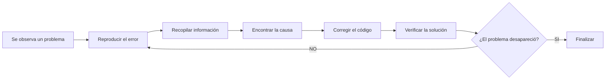
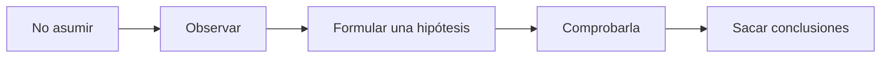
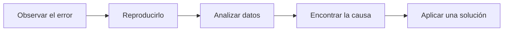
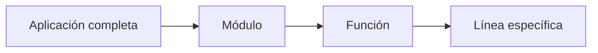
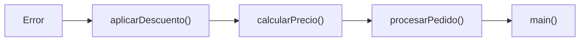

# Debugging y Resolución de Problemas

El debugging (depuración) es el proceso sistemático de identificar, localizar, comprender y corregir errores (bugs) en un programa.

No consiste simplemente en "hacer que el error desaparezca", sino en _**descubrir la causa raíz del problema y solucionarla de forma correcta.**_

Su objetivo es responder cuatro preguntas fundamentales:

+ ¿Qué ocurrió?
+ ¿Dónde ocurrió?
+ ¿Por qué ocurrió?
+ ¿Cómo evitar que vuelva a ocurrir?

### El ciclo del debugging

El proceso de depuración suele seguir un ciclo similar a este:



_Este ciclo evita hacer cambios "a ciegas" y ayuda a resolver el problema de forma metódica._

## Mentalidad de Debugging

El debugging no es únicamente una habilidad técnica, sino también una forma de pensar.

**Un desarrollador experimentado aborda los errores como un investigador**

### La mentalidad correcta

Cuando aparece un error, es recomendable seguir este enfoque:



Cada cambio debe responder a una hipótesis concreta.

### Evitar las soluciones al azar

Supongamos que un programa produce un resultado incorrecto.

Un enfoque poco efectivo sería:

```
Cambiar código
↓
Probar
↓
Sigue fallando
↓
Cambiar otra cosa
↓
Probar
↓
Sigue fallando
```

Este método consume tiempo y puede introducir 📢 **nuevos errores.**

### Un enfoque sistemático

Es preferible:



Así cada cambio tiene una justificación.

### Separar síntomas y causas

Uno de los errores más comunes al depurar es confundir el síntoma con la causa.

Ese es el síntoma. → `Pantalla en blanco`

La causa podría ser:

+ un archivo que no se cargó
+ una excepción no capturada
+ un error de lógica
+ una consulta fallida
+ una variable nula.

**Corregir el síntoma no siempre elimina la causa.**

### Reproducibilidad

Antes de intentar corregir un problema, conviene responder:

**¿Puedo reproducir el error de forma consistente?**

Si puedes repetir el problema siguiendo los mismos pasos, será mucho más fácil investigarlo.

_Por ejemplo:_

```
1. Abrir la aplicación.
2. Iniciar sesión.
3. Crear un nuevo usuario.
4. Pulsar "Guardar".

↓

El error aparece siempre.
```

_Ahora existe un escenario claro para investigar._

### Reducir el problema

Cuando el sistema es muy grande, es recomendable aislar únicamente la parte relacionada con el error.

En lugar de analizar miles de líneas de código:



Cuanto más pequeño sea el problema, más fácil será comprenderlo.

### Cambiar una sola cosa a la vez

Supongamos que modificas:

+ una consulta
+ una función
+ dos variables
+ tres configuraciones.

Si el problema desaparece, → **¿cuál de esos cambios fue el responsable?**

Por eso la recomendación es:

```
Cambiar una cosa
↓
Probar
↓
Observar resultado
↓
Repetir
```

### No asumir

Muchos errores aparecen porque damos por hecho que algo es cierto.

Ejemplo:

_"Seguro que la base de datos devolvió datos."_

+ Pero al comprobarlo descubres que la consulta devolvió una lista vacía.
+ La depuración consiste precisamente en **verificar las suposiciones.**

## Cómo Leer Mensajes de Error

+ Uno de los errores más comunes de los principiantes es ignorar el mensaje de error.

+ Sin embargo, el mensaje suele contener gran parte de la información necesaria para encontrar el problema.

+ En realidad, un mensaje de error responde varias preguntas importantes.

### ¿Qué suele incluir un mensaje?

Aunque cada lenguaje tiene un formato distinto, normalmente aparece información como:

+ Tipo de error
+ Descripción
+ Archivo
+ Línea
+ Pila de llamadas (Stack Trace)

Cada parte aporta una pista diferente.

**Ejemplo conceptual **

Supongamos el siguiente mensaje:

```
- ZeroDivisionError
- division by zero
- archivo.py
- Línea 25
```

Podemos extraer la siguiente información:

| Información         | Significado                              |
| ------------------- | ---------------------------------------- |
| `ZeroDivisionError` | Tipo de error ocurrido.                  |
| `division by zero`  | Descripción del problema.                |
| `archivo.py`        | Archivo donde ocurrió.                   |
| `Línea 25`          | Lugar aproximado donde comenzó el error. |

### El tipo de error

El tipo indica qué clase de problema ocurrió.

Ejemplos comunes:

+ Existe un error de sintaxis. → `SyntaxError`
+ No se encontró el archivo. → `FileNotFoundError`
+ Se utilizó un tipo de dato incorrecto. → `TypeError` 
+ Se intentó acceder a una posición inexistente. → `IndexError`
+ Se intentó utilizar una referencia nula (en lenguajes como Java). → `NullPointerException`

**El tipo del error suele ser la primera pista para saber qué investigar.**

### La descripción

Después del tipo suele aparecer una explicación.

_Ejemplos:_

`_Index out of range_`

+ No significa necesariamente que el programa esté mal escrito.
+ Significa que se intentó acceder a un índice que no existe.

`Permission denied`

+ El programa no tiene permisos suficientes.

**La descripción ayuda a entender el contexto.**

### Archivo y línea

Los mensajes indican normalmente dónde se detectó el problema.

_Ejemplo:_

```
Archivo:
    usuarios.py
Línea:
    128
```

+ Eso no siempre significa que esa **línea sea la causa**, pero sí indica **dónde** el programa **descubrió el problema.**
+ La causa real puede estar unas líneas antes o incluso en otra función que proporcionó datos incorrectos.

### La pila de llamadas (Stack Trace)

Cuando una función llama a otra, y esta a otra más, se forma una cadena de llamadas.

```
main()
↓
procesarPedido()
↓
calcularPrecio()
↓
aplicarDescuento()
↓
Error
```
El Stack Trace muestra ese recorrido.

Esto permite reconstruir el camino que siguió el programa hasta llegar al error.

### Cómo leer un Stack Trace

Un error frecuente es leer únicamente la primera línea.

Lo recomendable es seguir este orden:

+ Leer el tipo de error.
+ Leer la descripción.
+ Localizar el archivo y la línea.

+ _**Revisar el Stack Trace desde el punto donde ocurrió el error hacia atrás para entender cómo llegó el programa a esa situación.**_



_Así se obtiene una visión completa del problema._

### No quedarse con la primera explicación

A veces el mensaje dice:

`Variable no definida.`

La solución no siempre es `crear la variable`

En ocasiones:

+ nunca se inicializó
+ una condición evitó su creación
+ se escribió mal el nombre
+ otra función devolvió un valor inesperado.

El mensaje es una **pista**, no necesariamente el **diagnóstico completo**.

### Buenas prácticas al depurar

Cuando aparezca un error, acostúmbrate a seguir este orden:

1. Leer el mensaje completo antes de modificar el código.
2. Identificar el tipo de error.
3. Localizar el archivo y la línea donde se detectó.
4. Revisar el Stack Trace para comprender el recorrido del programa.
5. Reproducir el problema.
6. Formular una hipótesis sobre la causa.
7. Cambiar una sola cosa y volver a probar.
8. Confirmar que la solución elimina la causa y no solo el síntoma.

### Resumen

| Concepto                    | Descripción                                                                                    | Objetivo                                                                                                     |
| --------------------------- | ---------------------------------------------------------------------------------------------- | ------------------------------------------------------------------------------------------------------------ |
| **Debugging**               | Proceso sistemático para identificar, comprender y corregir errores.                           | Encontrar la causa raíz de un problema y verificar que la solución sea correcta.                             |
| **Mentalidad de Debugging** | Enfoque basado en observar, formular hipótesis, comprobarlas y cambiar una sola cosa a la vez. | Resolver problemas de forma metódica y evitar modificaciones al azar.                                        |
| **Leer Mensajes de Error**  | Analizar el tipo de error, la descripción, el archivo, la línea y el Stack Trace.              | Utilizar la información proporcionada por el lenguaje o la plataforma para localizar y entender el problema. |

### Ideas clave

+ Un desarrollador experimentado destaca porque **diagnostica errores de forma más eficiente**

+ Principios:
    + mentalidad de investigación
    + lectura cuidadosa de los mensajes de error
    + proceso sistemático de depuración