# Testing y Calidad del Código

## ¿Qué es el Testing?

El testing es el proceso de comprobar que un programa hace exactamente lo que esperamos.

No consiste únicamente en encontrar errores, sino en demostrar continuamente que el software sigue funcionando después de realizar cambios.

+ Un test no dice que el programa sea perfecto. 
    + Simplemente dice: → "Para este caso específico, el comportamiento fue el esperado."

### ¿Qué significa Calidad del Código?

La calidad del código no depende únicamente de que "funcione".

Un código de calidad también debe ser:

+ Correcto
+ Legible
+ Fácil de mantener
+ Fácil de probar
+ Escalable
+ Seguro
+ Con pocos errores

### ¿Por qué hacer Testing?

+ Sin tests → Hay que probar todo manualmente.
+ Con tests:

```
Ejecutas todos los tests.
    Si todos pasan:
        ✔ Probablemente no rompiste nada.
```
**Por eso el testing permite desarrollar mucho más rápido.**

### ¿Qué es un Test?

Un test es simplemente un pequeño programa que verifica otra parte del programa.

Por ejemplo:

```
Programa:
    sumar(2,3)
    ↓
    Resultado:
    5

Test:
    ¿El resultado es 5?
    Sí → PASS
    No → FAIL
```

### Automatización

+ En proyectos profesionales casi todos los tests son automáticos.
+ No hay una persona verificando.
+ El computador ejecuta miles de pruebas en segundos.

### La Pirámide de Testing

+ No todos los tests tienen el mismo propósito. Con el tiempo se descubrió que algunos tipos de pruebas son:
    + rápidas
    + lentas
    + costosas
    + fáciles de mantener
    + difíciles de mantener

Por eso apareció la Pirámide de Testing.

Representa cómo debería distribuirse la mayoría de las pruebas de un proyecto.


Mientras más abajo:

+ Más cantidad
+ Más rápidas
+ Más baratas

Mientras más arriba:

+ Menos cantidad
+ Más lentas
+ Más costosas

### ¿Por qué una pirámide?

Porque no tiene sentido hacer únicamente pruebas enormes.

Imagina revisar un automóvil.

Puedes comprobar:

+ si funciona el motor
+ si funcionan los frenos
+ si funcionan las luces

O puedes conducir 500 km para descubrir que un foco estaba quemado.

**Las pruebas pequeñas encuentran errores mucho antes.**

## Los tres niveles

### 1. Tests Unitarios (Base de la Pirámide)

+ Son el tipo de prueba más pequeño.
+ Verifican una única unidad de código.
    + una función
    + un método
    + una clase pequeña

_Ejemplo:_

```javascript
function sumar(a,b){
    return a+b;
}

//Test:

sumar(2,3)
    Esperado:
        5
```

+ No interviene:
    + base de datos
    + internet
    + APIs
    + archivos
    + usuarios

Solo una unidad.

### Características

Los tests unitarios son:

+ muy rápidos
+ pequeños
+ independientes
+ fáciles de ejecutar
+ Miles pueden ejecutarse en pocos segundos.

### ¿Qué verifican?

Verifican la lógica.

_Ejemplo:_

+ `calcularIVA()`
+ `descuento()`
+ `esMayorEdad()`
+ `convertirFecha()`
+ `validarCorreo()`
+ `parseJSON()`

    + No verifican servidores.
    + No verifican redes.
    + solo logica

**Ventajas**

Muchísima velocidad.
+ Ejemplo: 5000 tests → 15 segundos

Permiten detectar errores inmediatamente.

**Desventajas**

+ No verifican que todo el sistema funcione junto.
+ Pueden pasar todos los tests unitarios y aun así el programa fallar porque dos componentes no se comunican correctamente.

### 2. Tests de Integración (Mitad de la Pirámide)

Aca Se prueba cómo colaboran varias partes del sistema.

+ _Por ejemplo:_
    + Usuario → Servicio → Base de datos

Queremos comprobar que la comunicación entre ellas sea correcta.

+ Supongamos esta secuencia:
    + Crear usuario → Guardar en BD → Leer usuario → Mostrar usuario

_Un test de integración verifica que todo ese flujo funcione correctamente. Si alguno falla, el test falla._

**Ventajas**

Detectan problemas reales entre módulos.

```
La función funciona.

Pero la consulta SQL está mal.
↓
El test unitario pasa.
↓
El test de integración falla.
```
Eso es exactamente lo que queremos detectar.

**Desventajas**

+ Son más lentos. Como participan más componentes:
    + disco
    + red
    + BD
+ Más difíciles de configurar.
+ Más difíciles de mantener.

### 3. Tests End-to-End (E2E) (Cima de la Pirámide)

+ Son los más grandes.
+ Prueban el sistema completo.
+ Como si fueran un usuario real.

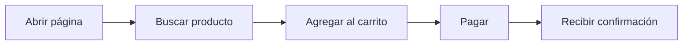

**¿Qué comprueba?**
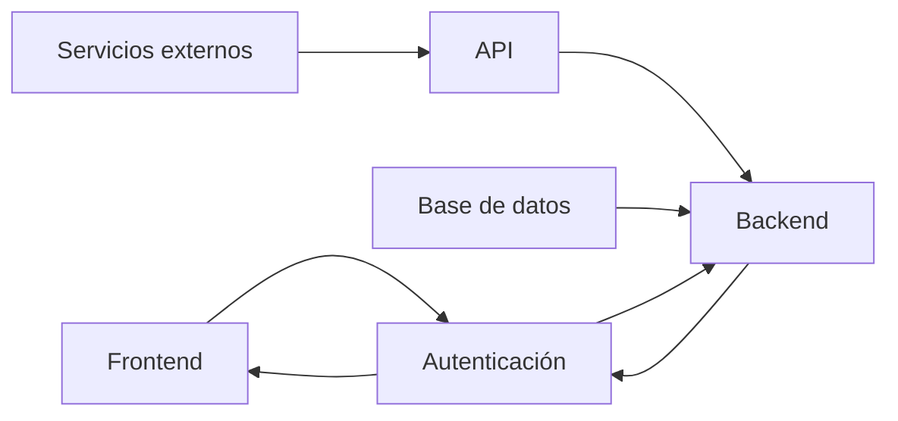

_Comprueba todas las partes y que su interaccion sea correcta_

**Ventajas**

+ Simulan exactamente lo que hace el usuario.
+ Si un test E2E pasa, existe una alta probabilidad de que ese flujo principal funcione correctamente desde la perspectiva del usuario.

**Desventajas**

+ Son los más lentos
+ También son los más costosos
    + necesitan un entorno completo
    + usan navegador
    + requieren servidor
    + requieren BD
    + requieren configuración
+ Son más frágiles; cambios pequeños en la interfaz o en el entorno pueden hacer que fallen aunque la lógica siga siendo correcta.
+ Requieren más mantenimiento.

### Comparación general

| Característica                      | Test Unitario        | Test de Integración                  | Test End-to-End (E2E)  |
| ----------------------------------- | -------------------- | ------------------------------------ | ---------------------- |
| ¿Qué prueba?                        | Una función o unidad | Varios componentes trabajando juntos | Todo el sistema        |
| Velocidad                           | Muy alta             | Media                                | Baja                   |
| Costo                               | Bajo                 | Medio                                | Alto                   |
| Dificultad                          | Baja                 | Media                                | Alta                   |
| Dependencias externas               | No                   | Algunas                              | Muchas                 |
| Cantidad recomendada                | Mucha                | Moderada                             | Poca                   |
| Detecta errores de lógica           | Sí                   | A veces                              | Sí, de forma indirecta |
| Detecta problemas entre componentes | No                   | Sí                                   | Sí                     |
| Simula al usuario final             | No                   | No                                   | Sí                     |


**Distribución típica**

+ Esta distribución no es una regla estricta, pero refleja una buena práctica ampliamente utilizada:
    + muchas pruebas rápidas
    + algunas pruebas intermedias 
    + pocas pruebas completas.

Supongamos un proyecto con 1.000 pruebas.

+ 700–800 tests unitarios: 
    + validan rápidamente la lógica del negocio.
+ 150–250 tests de integración: 
    + comprueban la interacción entre módulos importantes.
+ 20–50 tests E2E: 
    + verifican únicamente los recorridos más importantes del usuario 
        + _por ejemplo, iniciar sesión, realizar una compra o registrar un nuevo usuario_

### Ejemplo de una aplicación real

Imagina una aplicación bancaria.

**Tests unitarios**

+ Comprueban funciones individuales como:
    + Calcular intereses.
    + Validar un número de cuenta.
    + Convertir monedas.
    + Verificar un PIN.

**Tests de integración**

+ Comprueban escenarios como:
    + Registrar un cliente y almacenarlo en la base de datos.
    + Consultar el saldo a través de la API.
    + Actualizar la información del cliente

**Tests E2E**

+ Simulan el recorrido completo de un usuario:

1. Iniciar sesión.
2. Consultar el saldo.
3. Realizar una transferencia.
4. Confirmar la operación.
5. Cerrar sesión.

### Ideas clave

+ Testing consiste en verificar que el software se comporta como se espera.
+ La calidad del código incluye,
    + la corrección
    + la mantenibilidad 
    + la facilidad de pruebas.

+ **La pirámide de testing**
    + **Los tests unitarios** → muchas pruebas pequeñas y rápidas → validan una unidad aislada de código
    + **Los tests de integración** → menos pruebas de integración → verifican que distintos componentes colaboren correctamente.
    + **Los tests End-to-End (E2E)** → solo unas pocas pruebas 
        + → Sistema completo desde la perspectiva del usuario
        + → Para los flujos más importantes.

+ **Esta pirámide es una de las prácticas fundamentales del desarrollo de software moderno**

## Testing y Calidad del Código — Conceptos complementarios

### 1. Tipos de pruebas según diferentes criterios

Las pruebas de software pueden clasificarse de diferentes maneras. Estas clasificaciones no sustituyen a la Pirámide de Testing, sino que describen características diferentes de una prueba.

### 1.1 Pruebas de Caja Negra

Las pruebas de caja negra verifican el comportamiento del software sin analizar cómo está implementado internamente.

El tester conoce:

+ los datos de entrada
+ el comportamiento esperado
+ los resultados que debe producir el sistema

Pero no necesita conocer el código fuente.

**Ejemplo**

Tenemos:

```
Entrada:
Usuario: juan
Contraseña: 123456

Resultado esperado:
Inicio de sesión exitoso
```

La prueba se concentra en:

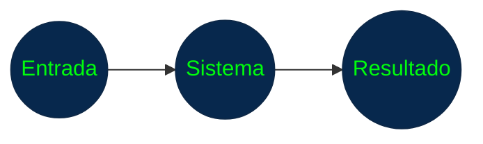

> No importa qué funciones, clases o algoritmos utiliza internamente el sistema.**

**Ventaja**

+ Permite comprobar el sistema desde una perspectiva cercana a los requisitos y al comportamiento esperado por el usuario.

### 1.2 Pruebas de Caja Blanca

Las pruebas de caja blanca analizan la estructura interna del software.

El responsable de la prueba conoce:

+ el código;
+ las condiciones;
+ los caminos de ejecución;
+ las decisiones internas.

El objetivo puede ser comprobar diferentes rutas que puede seguir el programa.

Por ejemplo:

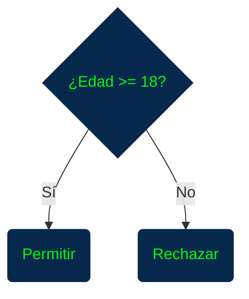

### Diferencia fundamental

+ Caja negra
    + ¿Qué hace el sistema?

+ Caja blanca
    + ¿Cómo funciona internamente?

**Las dos técnicas son complementarias.**

### 2. Pruebas Estáticas y Dinámicas

Otra clasificación depende de si el programa se ejecuta durante la prueba.

### 2.1 Pruebas Estáticas

Se realizan sin ejecutar el programa.

Pueden incluir:

+ revisión del código;
+ inspección de documentos;
+ revisión de requisitos;
+ análisis estático;
+ pruebas de escritorio.

Ejemplo:


El objetivo es detectar errores lo antes posible.

### 2.2 Pruebas Dinámicas

Se realizan ejecutando el software.

Por ejemplo:


**Los tests unitarios, de integración y E2E son ejemplos de pruebas dinámicas.**

### 3. Pruebas Manuales y Automatizadas

### 3.1 Pruebas Manuales

Una persona ejecuta los casos de prueba.

Por ejemplo:


1. Abrir aplicación
    |
    |_ 2. Introducir usuario
        |
        |_ 3. Introducir contraseña
            |
            |_ 4. Presionar "Iniciar sesión"
                |
                |_ 5. Comprobar resultado


**Son útiles especialmente para pruebas exploratorias, de usabilidad y escenarios donde la evaluación humana es importante.**

### 3.2 Pruebas Automatizadas

Un programa ejecuta automáticamente los casos de prueba.

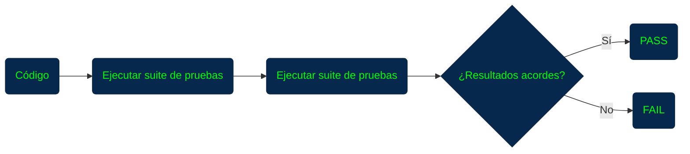

**La automatización permite repetir pruebas rápidamente y es especialmente importante para las pruebas de regresión.**

### 4. Pruebas de Regresión

Las pruebas de regresión verifican que los cambios realizados en el software no hayan roto funcionalidades que anteriormente funcionaban correctamente.

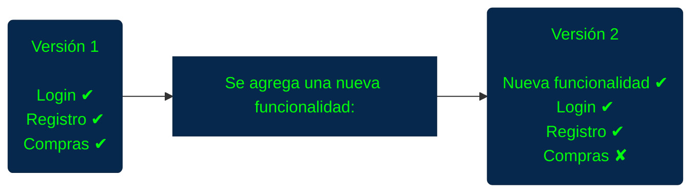

> La nueva modificación provocó un problema en una funcionalidad existente.

Las pruebas de regresión permiten detectar este tipo de situaciones.

**Relación con el desarrollo**

Cada vez que se modifica una parte importante del sistema, conviene volver a ejecutar las pruebas relevantes.

Por eso la automatización resulta especialmente útil.

### 5. Pruebas según su objetivo

Además de las pruebas unitarias, de integración y E2E, existen pruebas destinadas a evaluar características específicas del software.

### 5.1 Pruebas de Usabilidad

Evalúan si el usuario puede comprender y utilizar correctamente el sistema.

Pueden analizar:

+ facilidad de navegación;
+ claridad de los mensajes;
+ organización de las pantallas;
+ consistencia de la interfaz;
+ facilidad para completar tareas.

Ejemplo:

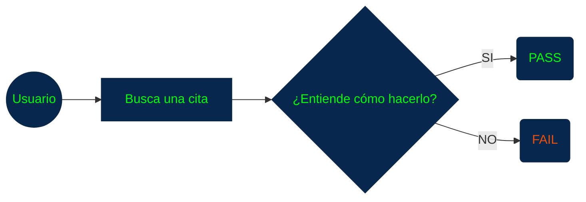

**Estas pruebas conviene realizarlas temprano, porque modificar la interfaz posteriormente puede resultar más costoso.**

### 5.2 Pruebas de Rendimiento

Evalúan cómo se comporta el sistema utilizando diferentes niveles de carga.

Algunas métricas importantes son:

+ tiempo de respuesta;
+ consumo de memoria;
+ uso de CPU;
+ utilización de red;
+ número de transacciones;
+ usuarios simultáneos;
+ operaciones de entrada/salida.

Por ejemplo:

`100 usuarios → 200 ms`
    |
    |_ `500 usuarios → 450 ms`
        |
        |_ `1000 usuarios → 1.2 s`

**Esto permite conocer cómo cambia el rendimiento a medida que aumenta la carga.**

#### 5.2.1 Pruebas de Volumen

Comprueban cómo se comporta el sistema cuando trabaja con grandes cantidades de datos.

Ejemplos:

+ millones de registros;
+ grandes cantidades de archivos;
+ colas extensas;
+ grandes cantidades de transacciones.

La preocupación principal es comprobar que el sistema pueda manejar correctamente el volumen esperado.

#### 5.2.2 Pruebas de Estrés

5.2.2 Pruebas de Estrés

Llevan el sistema más allá de los límites previstos para observar cómo responde ante una sobrecarga.

Por ejemplo:

```
Capacidad esperada:
1.000 usuarios

Prueba de estrés:
2.000
3.000
5.000 usuarios
```

Se busca descubrir:

+ puntos de fallo;
+ límites del sistema;
+ problemas de recuperación;
+ pérdida de integridad;
+ degradación del servicio.

### 5.3 Pruebas de Seguridad

Evalúan si el sistema protege correctamente:

+ información;
+ usuarios;
+ permisos;
+ autenticación;
+ operaciones críticas.

Algunos aspectos que pueden comprobarse:

+ _¿Se bloquean credenciales incorrectas?_ 
+ _¿Se registran accesos?_ 
+ _¿Se protegen operaciones críticas?_ 
+ _¿Se controlan los permisos?_
+ _¿Se generan alertas ante comportamientos sospechosos?_

**También deben considerarse aspectos como copias de seguridad, recuperación y disponibilidad.**

### 5.4 Pruebas de Compatibilidad

Comprueban que el software funcione correctamente junto con otros componentes del entorno.

Pueden involucrar:

+ sistemas operativos;
+ navegadores;
+ dispositivos;
+ bases de datos;
+ bibliotecas;
+ otros sistemas;
+ configuraciones diferentes.

Ejemplo:

Aplicación web

Chrome ✔
    |
    |_ Firefox ✔
        |
        |_ Edge ✔
            |
            |_ Safari ✔

**El objetivo es identificar problemas producidos por diferencias entre plataformas o componentes.**

### 5.5 Pruebas de Conversión y Migración

Comprueban que los datos se transfieran correctamente:


Se debe verificar que:

+ los datos no se pierdan;
+ los valores sean correctos;
+ los formatos sean compatibles;
+ los datos históricos continúen disponibles;
+ existan mecanismos para detectar errores.

**También es importante conservar mecanismos de auditoría y recuperación cuando la migración sea crítica.**

### 5.6 Pruebas de Recuperación

Determinan si el sistema puede recuperarse después de una falla.

Por ejemplo: 

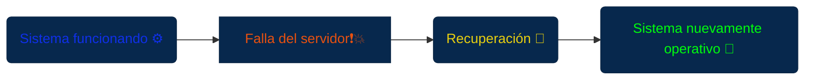

Pueden comprobar:

+ copias de seguridad;
+ restauración;
+ recuperación de transacciones;
+ puntos de restauración;
+ integridad de los datos;
+ procedimientos ante desastres.

### 5.7 Pruebas de Instalación y Despliegue

Comprueban que el software pueda instalarse, configurarse, actualizarse y, cuando corresponda, desinstalarse correctamente.

Se pueden probar:

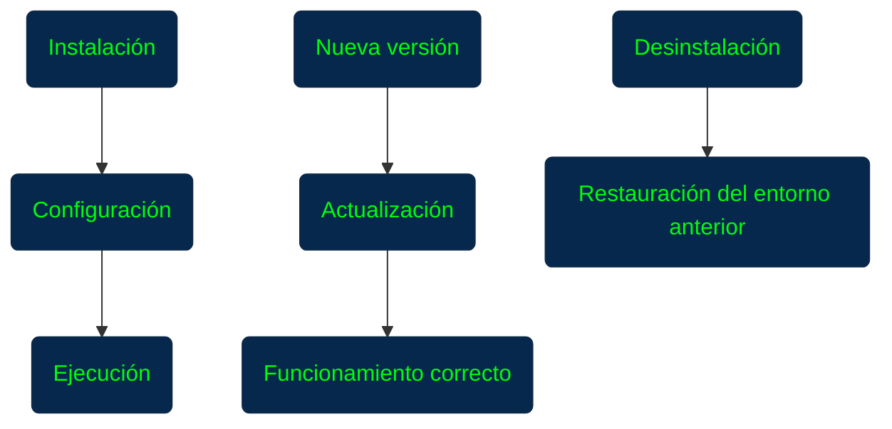

### 5.8 Pruebas de Documentación

La documentación también debe probarse.

El objetivo es verificar que:

+ los manuales sean correctos;
+ las instrucciones funcionen;
+ las imágenes correspondan con la aplicación;
+ los enlaces funcionen;
+ los mensajes descritos coincidan con los reales;
+ los ejemplos sean válidos.

Una documentación incorrecta puede provocar errores incluso cuando el software funciona correctamente.

### 5.9 Pruebas de Aceptación

Las pruebas de aceptación verifican que el sistema cumpla las necesidades y criterios establecidos para ser aceptado por el usuario o cliente.

Pueden responder a preguntas como:

+ ¿La funcionalidad solicitada existe?
+ ¿Cumple el requisito?
+ ¿El resultado es el esperado?
+ ¿El usuario puede realizar correctamente el proceso?

No deben considerarse simplemente como "la última prueba".

La participación temprana del usuario puede ayudar a detectar cambios costosos antes de llegar al final del proyecto.

### 6. Diseño de Casos de Prueba

Un caso de prueba describe qué se quiere comprobar y bajo qué condiciones.

Un caso de prueba debería incluir información como:

| Elemento              | Descripción                             |  
| ----------------------| ----------------------------------------|
| ID                    | Identificador único                     |
| Objetivo              | Qué se quiere verificar                 |
| Datos de prueba       | Información utilizada                   |
| Precondiciones        | Condiciones necesarias antes de ejecutar|
| Pasos                 | Acciones que deben realizarse           |
| Resultado esperado    | Qué debería ocurrir                     |
| Resultado obtenido    | Qué ocurrió realmente                   |
| Estado                | PASS / FAIL                             |
| Criticidad            | Importancia de la prueba                |
| Requisito relacionado | Requisito que se está validando         |

Ejemplo:

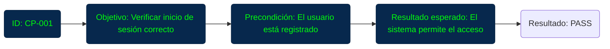

### 7. Trazabilidad de las Pruebas

Una práctica importante es relacionar:


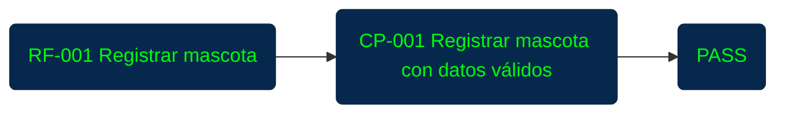

También:

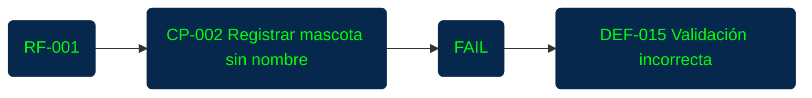

**La trazabilidad facilita el control del proyecto y permite demostrar que los requisitos importantes fueron verificados.**

### 8. Gestión y Seguimiento de Defectos

Cuando una prueba encuentra un problema, este debe registrarse y seguirse hasta su resolución.

Flujo típico:

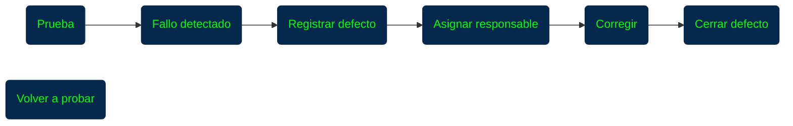

Un sistema de seguimiento puede registrar:

+ identificador;
+ descripción;
+ pasos para reproducirlo;
+ evidencia;
+ responsable;
+ estado;
+ severidad;
+ fecha;
+ versión afectada;
+ versión corregida.

### 9. Severidad de los Fallos

**No todos los defectos tienen la misma importancia.**

Puede establecerse una clasificación como:

+ <span style="color: #e81026;">Crítico</span> 
+ <span style="color: #e87c10;">Alto</span> 
+ <span style="color: #d2e810;">Medio</span> 
+ <span style="color: #30e810;">Bajo</span> 

Por ejemplo:

<span style="color: #e81026;">Crítico</span> 

+ _El sistema no puede utilizarse o existe una pérdida grave de información._

<span style="color: #e87c10;">Alto</span> 

+ _Una funcionalidad importante no funciona correctamente._

<span style="color: #d2e810;">Medio</span> 

+ _Existe un problema que afecta una funcionalidad, pero existe alguna alternativa._

<span style="color: #30e810;">Bajo</span> 

+ _Problemas menores de presentación o comportamiento que no bloquean el uso._

**La clasificación permite decidir qué defectos deben atenderse primero.**

### 10. Métricas del Proceso de Pruebas

Las métricas permiten evaluar el estado del proceso de testing.

Algunas métricas importantes son:

**Casos ejecutados**

_Casos planificados:_ `100` -> _Casos ejecutados:_ `80` -> **_Ejecución =_ 80%**

**Fallos encontrados y corregidos**

        Fallos encontrados: 20 
                |
                |
        Fallos corregidos
                |
            ____|___
           |        |
20 encontrados    15 corregidos

### Brecha de defectos

Puede calcularse de manera sencilla como:

`Fallos encontrados` - `Fallos corregidos`

En este caso:

`20 - 15 = 5`

_Existen 5 fallos pendientes._

### ¿Por qué son importantes las métricas?

Permiten observar tendencias.

Por ejemplo:

Semana 1 → 30 fallos
    |
    |__ Semana 2 → 20 fallos
            |
            |__ Semana 3 → 10 fallos
                    |
                    |__ Semana 4 → 3 fallos

La tendencia puede aportar información sobre la evolución de la calidad y ayudar a decidir si son necesarias más pruebas.

Las métricas deben utilizarse para apoyar decisiones, no simplemente para producir números.

### 11. Testing durante todo el ciclo de vida

Uno de los conceptos más importantes del material es que las pruebas no deben comenzar únicamente cuando el software está terminado.

Pueden comenzar desde:

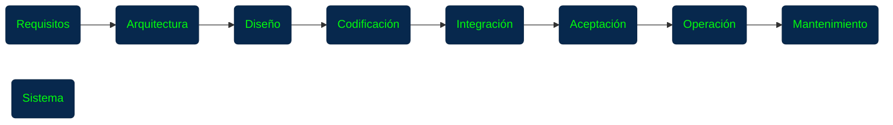

Cada etapa puede presentar problemas diferentes.

Detectarlos temprano normalmente permite reducir el costo, el esfuerzo y el tiempo necesario para corregirlos.

### 12. Ciclo de Mejora Continua PDCA

Existe una relación entre el proceso de pruebas con el ciclo **PDCA de Deming:**

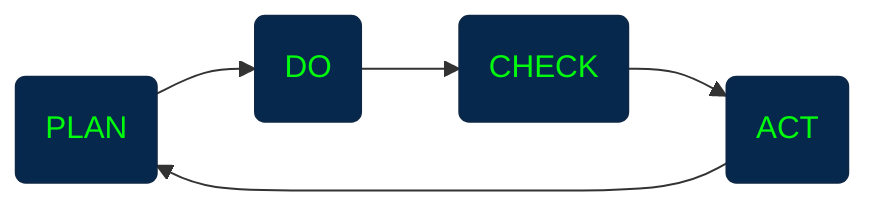

### PDCA

| **Plan — Planificar**        | **Do — Hacer**                 |  
|------------------------------|--------------------------------|
| Definir:                     | Ejecutar los casos de prueba   |
| 		               |                                |
| ¿qué se probará;             | Casos de prueba                |
| ¿cómo se probará?            |	↓                       |
| ¿cuándo?                     | Ejecución                      |
| ¿quién será responsable?     |	↓                       |
| ¿qué recursos se necesitan.? | Resultados                     |
|                              |                                |

| **Check — Verificar**        | **Act — Actuar**               |
|------------------------------|--------------------------------|
|                              | Utilizar lo aprendido para     |
| Analizar:                    | mejorar el siguiente ciclo     |
|                              |                                |
| resultados                   | actualizar casos de prueba     |
| defectos;                    | automatizar pruebas            |
| métricas                     | mejorar procedimientos         |
| cumplimiento del plan        | cambiar herramientas           |
| calidad alcanzada            | ajustar cronogramas            |
|                              | modificar responsabilidades    |
|                              | mejorar el ambiente de pruebas |

Entonces comienza nuevamente:

PLAN → DO → CHECK → ACT
          ↑         ↓
          ←─────────

La idea fundamental es que el proceso de testing también debe mejorar continuamente.

### 13. Replanificación del siguiente ciclo de pruebas

Después de cada ciclo no simplemente se continúa con las mismas pruebas.

Es necesario analizar qué cambió.

Por ejemplo:


Esto permite que las pruebas evolucionen junto con el software.

### 14. Idea fundamental: probar temprano

Una de las conclusiones más importantes:

> Cuanto antes se detecta un error, normalmente menor es el costo de corregirlo.

Por ejemplo:

```mermaid

flowchart LR

P(Error en requisitos)
D(Detectado durante requisitos)
C(Corrección relativamente temprana)

P --> D --> C

style C fill:#07284d,stroke:#0d2847,stroke-width:1px,color:#00fc0d;
style D fill:#07284d,stroke:#0d2847,stroke-width:1px,color:#00fc0d;
style P fill:#07284d,stroke:#0d2847,stroke-width:1px,color:#00fc0d;
```

Frente a:

```mermaid

flowchart LR

P(Error en requisitos)
D(No detectado)
C(Diseño)
A(Código)
M(Pruebas)
N(Producción)
O(Corrección)

P --> D --> C --> A --> M --> N --> O

style A fill:#07284d,stroke:#0d2847,stroke-width:1px,color:#00fc0d;
style C fill:#07284d,stroke:#0d2847,stroke-width:1px,color:#00fc0d;
style D fill:#07284d,stroke:#0d2847,stroke-width:1px,color:#00fc0d;
style P fill:#07284d,stroke:#0d2847,stroke-width:1px,color:#00fc0d;
style M fill:#07284d,stroke:#0d2847,stroke-width:1px,color:#00fc0d;
style N fill:#07284d,stroke:#0d2847,stroke-width:1px,color:#00fc0d;
style O fill:#07284d,stroke:#0d2847,stroke-width:1px,color:#00fc0d;
```

**Mientras más tarde se descubre, normalmente hay más elementos que modificar y más trabajo asociado.**

### 15. Concepto central

**Testing no significa simplemente "buscar errores al final".**

Es un proceso continuo que permite verificar requisitos, detectar problemas tempranamente, controlar la calidad, medir resultados, gestionar defectos y mejorar continuamente el proceso de desarrollo.