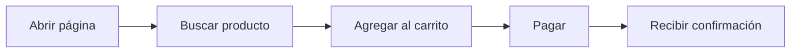
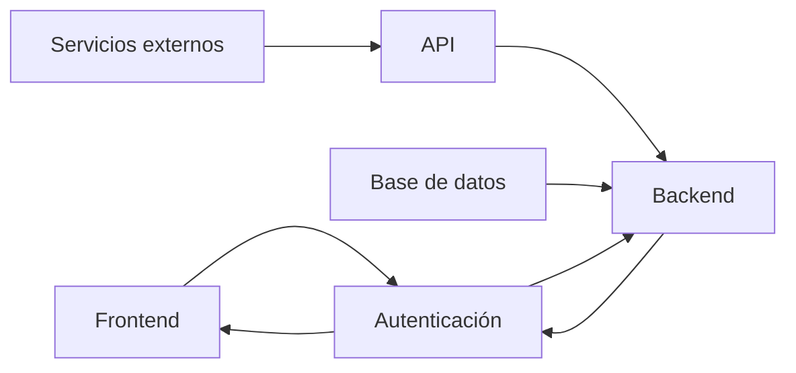

# Testing y Calidad del Código

## ¿Qué es el Testing?

El testing es el proceso de comprobar que un programa hace exactamente lo que esperamos.

No consiste únicamente en encontrar errores, sino en demostrar continuamente que el software sigue funcionando después de realizar cambios.

+ Un test no dice que el programa sea perfecto. 
    + Simplemente dice: → "Para este caso específico, el comportamiento fue el esperado."

### ¿Qué significa Calidad del Código?

La calidad del código no depende únicamente de que "funcione".

Un código de calidad también debe ser:

+ Correcto
+ Legible
+ Fácil de mantener
+ Fácil de probar
+ Escalable
+ Seguro
+ Con pocos errores

### ¿Por qué hacer Testing?

+ Sin tests → Hay que probar todo manualmente.
+ Con tests:

```
Ejecutas todos los tests.
    Si todos pasan:
        ✔ Probablemente no rompiste nada.
```
**Por eso el testing permite desarrollar mucho más rápido.**

### ¿Qué es un Test?

Un test es simplemente un pequeño programa que verifica otra parte del programa.

Por ejemplo:

```
Programa:
    sumar(2,3)
    ↓
    Resultado:
    5

Test:
    ¿El resultado es 5?
    Sí → PASS
    No → FAIL
```

### Automatización

+ En proyectos profesionales casi todos los tests son automáticos.
+ No hay una persona verificando.
+ El computador ejecuta miles de pruebas en segundos.

### La Pirámide de Testing

+ No todos los tests tienen el mismo propósito. Con el tiempo se descubrió que algunos tipos de pruebas son:
    + rápidas
    + lentas
    + costosas
    + fáciles de mantener
    + difíciles de mantener

Por eso apareció la Pirámide de Testing.

Representa cómo debería distribuirse la mayoría de las pruebas de un proyecto.


Mientras más abajo:

+ Más cantidad
+ Más rápidas
+ Más baratas

Mientras más arriba:

+ Menos cantidad
+ Más lentas
+ Más costosas

### ¿Por qué una pirámide?

Porque no tiene sentido hacer únicamente pruebas enormes.

Imagina revisar un automóvil.

Puedes comprobar:

+ si funciona el motor
+ si funcionan los frenos
+ si funcionan las luces

O puedes conducir 500 km para descubrir que un foco estaba quemado.

**Las pruebas pequeñas encuentran errores mucho antes.**

## Los tres niveles

### 1. Tests Unitarios (Base de la Pirámide)

+ Son el tipo de prueba más pequeño.
+ Verifican una única unidad de código.
    + una función
    + un método
    + una clase pequeña

_Ejemplo:_

```javascript
function sumar(a,b){
    return a+b;
}

//Test:

sumar(2,3)
    Esperado:
        5
```

+ No interviene:
    + base de datos
    + internet
    + APIs
    + archivos
    + usuarios

Solo una unidad.

### Características

Los tests unitarios son:

+ muy rápidos
+ pequeños
+ independientes
+ fáciles de ejecutar
+ Miles pueden ejecutarse en pocos segundos.

### ¿Qué verifican?

Verifican la lógica.

_Ejemplo:_

+ `calcularIVA()`
+ `descuento()`
+ `esMayorEdad()`
+ `convertirFecha()`
+ `validarCorreo()`
+ `parseJSON()`

    + No verifican servidores.
    + No verifican redes.
    + solo logica

**Ventajas**

Muchísima velocidad.
+ Ejemplo: 5000 tests → 15 segundos

Permiten detectar errores inmediatamente.

**Desventajas**

+ No verifican que todo el sistema funcione junto.
+ Pueden pasar todos los tests unitarios y aun así el programa fallar porque dos componentes no se comunican correctamente.

### 2. Tests de Integración (Mitad de la Pirámide)

Aca Se prueba cómo colaboran varias partes del sistema.

+ _Por ejemplo:_
    + Usuario → Servicio → Base de datos

Queremos comprobar que la comunicación entre ellas sea correcta.

+ Supongamos esta secuencia:
    + Crear usuario → Guardar en BD → Leer usuario → Mostrar usuario

_Un test de integración verifica que todo ese flujo funcione correctamente. Si alguno falla, el test falla._

**Ventajas**

Detectan problemas reales entre módulos.

```
La función funciona.

Pero la consulta SQL está mal.
↓
El test unitario pasa.
↓
El test de integración falla.
```
Eso es exactamente lo que queremos detectar.

**Desventajas**

+ Son más lentos. Como participan más componentes:
    + disco
    + red
    + BD
+ Más difíciles de configurar.
+ Más difíciles de mantener.

### 3. Tests End-to-End (E2E) (Cima de la Pirámide)

+ Son los más grandes.
+ Prueban el sistema completo.
+ Como si fueran un usuario real.



**¿Qué comprueba?**


_Comprueba todas las partes y que su interaccion sea correcta_

**Ventajas**

+ Simulan exactamente lo que hace el usuario.
+ Si un test E2E pasa, existe una alta probabilidad de que ese flujo principal funcione correctamente desde la perspectiva del usuario.

**Desventajas**

+ Son los más lentos
+ También son los más costosos
    + necesitan un entorno completo
    + usan navegador
    + requieren servidor
    + requieren BD
    + requieren configuración
+ Son más frágiles; cambios pequeños en la interfaz o en el entorno pueden hacer que fallen aunque la lógica siga siendo correcta.
+ Requieren más mantenimiento.

### Comparación general

| Característica                      | Test Unitario        | Test de Integración                  | Test End-to-End (E2E)  |
| ----------------------------------- | -------------------- | ------------------------------------ | ---------------------- |
| ¿Qué prueba?                        | Una función o unidad | Varios componentes trabajando juntos | Todo el sistema        |
| Velocidad                           | Muy alta             | Media                                | Baja                   |
| Costo                               | Bajo                 | Medio                                | Alto                   |
| Dificultad                          | Baja                 | Media                                | Alta                   |
| Dependencias externas               | No                   | Algunas                              | Muchas                 |
| Cantidad recomendada                | Mucha                | Moderada                             | Poca                   |
| Detecta errores de lógica           | Sí                   | A veces                              | Sí, de forma indirecta |
| Detecta problemas entre componentes | No                   | Sí                                   | Sí                     |
| Simula al usuario final             | No                   | No                                   | Sí                     |


**Distribución típica**

+ Esta distribución no es una regla estricta, pero refleja una buena práctica ampliamente utilizada:
    + muchas pruebas rápidas
    + algunas pruebas intermedias 
    + pocas pruebas completas.

Supongamos un proyecto con 1.000 pruebas.

+ 700–800 tests unitarios: 
    + validan rápidamente la lógica del negocio.
+ 150–250 tests de integración: 
    + comprueban la interacción entre módulos importantes.
+ 20–50 tests E2E: 
    + verifican únicamente los recorridos más importantes del usuario 
        + _por ejemplo, iniciar sesión, realizar una compra o registrar un nuevo usuario_

### Ejemplo de una aplicación real

Imagina una aplicación bancaria.

**Tests unitarios**

+ Comprueban funciones individuales como:
    + Calcular intereses.
    + Validar un número de cuenta.
    + Convertir monedas.
    + Verificar un PIN.

**Tests de integración**

+ Comprueban escenarios como:
    + Registrar un cliente y almacenarlo en la base de datos.
    + Consultar el saldo a través de la API.
    + Actualizar la información del cliente

**Tests E2E**

+ Simulan el recorrido completo de un usuario:

1. Iniciar sesión.
2. Consultar el saldo.
3. Realizar una transferencia.
4. Confirmar la operación.
5. Cerrar sesión.

### Ideas clave

+ Testing consiste en verificar que el software se comporta como se espera.
+ La calidad del código incluye,
    + la corrección
    + la mantenibilidad 
    + la facilidad de pruebas.

+ **La pirámide de testing**
    + **Los tests unitarios** → muchas pruebas pequeñas y rápidas → validan una unidad aislada de código
    + **Los tests de integración** → menos pruebas de integración → verifican que distintos componentes colaboren correctamente.
    + **Los tests End-to-End (E2E)** → solo unas pocas pruebas 
        + → Sistema completo desde la perspectiva del usuario
        + → Para los flujos más importantes.

+ **Esta pirámide es una de las prácticas fundamentales del desarrollo de software moderno**
