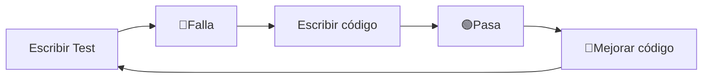
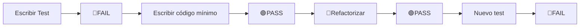
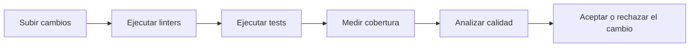

# Principios de Testing

Los principios de testing son una serie de buenas prácticas que ayudan a escribir pruebas útiles, confiables y fáciles de mantener.

No existe un único conjunto oficial, pero hay varios principios ampliamente aceptados.

### 1. Una prueba debe verificar una sola cosa

Cada test debe tener un único objetivo.

❌ Mal ejemplo:
```
Test 1:
✓ Crear usuario
✓ Iniciar sesión
✓ Comprar producto
✓ Enviar correo
```

+ Si falla... 
    + `¿Dónde estuvo el problema?`
        + No lo sabemos.

Los test deberian hacerse por separado

```
Test 1 → Crear usuario
Test 2 → Iniciar sesión
Test 3 → Comprar producto
Test 4 → Enviar correo
```

+ Ahora cada prueba tiene una responsabilidad.

### 2. Las pruebas deben ser independientes

Un test nunca debe depender de otro.

Incorrecto:
```
Test A
Crear usuario
↓
Test B
Usar el usuario creado por A
```
+ Quizá B estaba correctamente implementado.
+ Pero Si A falla → B también fallará.

Correcto:

```
Test A
Crear usuario
↓
Eliminar usuario

Test B
Crear su propio usuario
↓
Eliminar usuario
```

_Cada uno prepara su propio entorno._

### 3. Deben ser repetibles

Un test debe producir siempre el mismo resultado bajo las mismas condiciones.

Incorrecto: 

```javascript
if(Date.now() % 2 == 0)
```
+ Un día pasa. 
+ Otro día falla.

_Lo correcto es controlar los factores externos, por ejemplo usando datos fijos o simulando el reloj del sistema._

### 4. Deben ser rápidas

+ Los desarrolladores ejecutan los tests constantemente.
    + _Es mas facil ejecutar muchos test de 15 segundos que pocos de 25 minutos_

Por eso existen muchos más tests unitarios que E2E.

### 5. Deben ser automáticas

+ Las pruebas modernas se ejecutan automáticamente.
+ No debería ser necesario que una persona haga clic en botones para verificar cada cambio.
+ En un proyecto profesional es común que:
    + tras cada cambio en el código 
        + → un servidor ejecute automáticamente toda la suite de pruebas.

### 6. Deben ser fáciles de leer

Por ejemplo:

`expect`(calcularIVA(100)).`toBe`(119);

+ Incluso sin conocer la implementación, se entiende que:
    + _**"Si el valor es 100, el IVA esperado es 19 y el total debe ser 119."**_

### 7. Deben probar comportamiento, no implementación

Este es uno de los principios más importantes.

Supongamos esta función:
```javascript
function esMayorEdad(edad){
    return edad >= 18;
}
```

El test correcto verifica el comportamiento: 

+ 18 → `true` 

No importa cómo esté escrita internamente.

Si mañana cambiamos la implementación pero el resultado sigue siendo correcto, el test debería seguir pasando.

### Patrón AAA (Arrange – Act – Assert)

**1. Arrange (Preparar)**
+ Se crean los datos necesarios.
    + `let` edad = 20;

**2. Act (Actuar)**
+ Se ejecuta la función.
    + `let` resultado = esMayorEdad(edad);

**3. Assert (Verificar)**
+ Se comprueba el resultado.
    + `expect`(resultado).`toBe`(`true`);

_Este patrón hace que los tests sean claros y consistentes._

### ¿Qué NO debemos probar?

No todo merece una prueba.

Por ejemplo, normalmente no se prueban:

+ Funciones extremadamente simples que solo delegan trabajo.
+ Código generado automáticamente.
+ Bibliotecas externas ampliamente probadas.

En cambio, sí conviene probar: 

+ Reglas de negocio.
+ Algoritmos.
+ Validaciones.
+ Cálculos.
+ Transformaciones de datos.
+ Flujos importantes.

### TDD (Test Driven Development)

**¿Qué es TDD?**

+ TDD (_Test Driven Development_) significa: **Desarrollo Guiado por Pruebas.**

La idea es invertir el proceso tradicional.

+ Normalmente hacemos esto:
    + → Escribir código
        + → Probar
            + → Corregir

Con TDD hacemos exactamente lo contrario.

### El ciclo de TDD

+ **TDD** sigue un ciclo muy pequeño y repetitivo conocido como
    + _🔴Red → 🟢Green → 🔵Refactor._



### Paso 1. Red🔴 (Rojo)

Primero se escribe un test para una funcionalidad que todavía no existe.

```javascript
expect(sumar(2,3)).toBe(5);
```

+ Pero la función aún no está implementada.
    + Resultado: `FAIL`🔴
        + Eso es correcto → Queremos que falle.

### Paso 2. Green🟢 (Verde)

Ahora escribimos el código mínimo para que el test pase.

```javascript
function sumar(a,b){
    return a+b;
}
```
+ Resultado: `PASS`🟢
    + No buscamos la solución perfecta, solo la más simple que satisfaga el test.

### Paso 3. Refactor🔵

Ahora mejoramos el código sin cambiar su comportamiento.

Podemos:

+ renombrar variables
+ eliminar duplicación
+ simplificar lógica
+ reorganizar método

+ Al terminar, ejecutamos nuevamente los tests.
+ Si todos siguen pasando: Sabemos que el comportamiento no cambió.

**El ciclo completo**


**Así se construye el software poco a poco.**

### Ventajas de TDD

### 1. Obliga a pensar antes de programar

+ En lugar de preguntarte:
    + "¿Cómo escribo esta función?"
+ Te preguntas:
    + "¿Cómo debería comportarse?"

Eso lleva a diseñar mejores interfaces y responsabilidades.

### 2. Reduce errores

+ Como cada nueva funcionalidad nace con su prueba, es más difícil introducir errores sin detectarlos.

### 3. Facilita el refactoring

+ Puedes mejorar el código con mayor confianza porque los tests actúan como una red de seguridad.

### 4. Produce código más modular

+ Si una función es difícil de probar, muchas veces también es difícil de mantener. TDD incentiva escribir componentes pequeños y con pocas dependencias.

### ¿Tiene desventajas?

Sí... Al principio:

+ parece más lento,
+ requiere práctica,
+ exige aprender herramientas de testing.

## Herramientas de Calidad

Además de los tests, existen herramientas que analizan automáticamente el código para encontrar posibles problemas.

Su objetivo es mejorar la calidad incluso antes de ejecutar el programa.

### 1. Linters

Un `linter` analiza el código fuente y detecta problemas de estilo, errores comunes o patrones riesgosos.

Ejemplo:

```javascript
if(a = b)

// El linter advierte que probablemente se quería escribir:
if(a == b)
```
+ También puede detectar:
    + variables no utilizadas
    + código duplicado
    + formato inconsistente
    + errores frecuentes.

+ Algunos ejemplos populares son:
    + `ESLint` → JavaScript
    + `Pylint` → Python 
    + `RuboCop` → Ruby

### 2. Formateadores

+ Los formateadores no buscan errores lógicos.
+ Su función es mantener un estilo uniforme.
+ Por ejemplo, todos los archivos tendrán:
    + la misma indentación,
    + el mismo uso de espacios,
    + el mismo estilo de llaves,
    + el mismo formato de comillas.
+ Esto evita discusiones sobre estilo y mejora la legibilidad.
+ Herramientas conocidas:
    + `Prettier` → JavaScript 
    + `Black` → Python.

### 3. Análisis Estático

+ El análisis estático examina el código sin ejecutarlo.
+ Puede detectar problemas como:
    + posibles referencias nulas
    + variables sin inicializar
    + código inalcanzable
    + dependencias circulares
    + vulnerabilidades comunes.
+ Es especialmente útil para encontrar errores antes de que lleguen a producción.

### 4. Cobertura de Código (Code Coverage)

+ La cobertura indica qué porcentaje del código fue ejecutado por los tests.

Ejemplo:

```
Archivo
100 líneas
↓
Los tests ejecutan 80
↓
Cobertura = 80%
```
+ una cobertura alta **no garantiza calidad**
+ Lo importante es que los tests verifiquen correctamente el comportamiento esperado

### 5. Integración Continua (CI)

En la mayoría de los proyectos profesionales, todas estas herramientas se integran en un proceso de Integración Continua (Continuous Integration o CI).

Cada vez que un desarrollador envía cambios al repositorio:


De esta forma, los problemas se detectan de manera temprana y automática.

### Relación entre Testing y Herramientas de Calidad

| Herramienta          | ¿Qué verifica?                                    | ¿Ejecuta el programa? |
| -------------------- | ------------------------------------------------- | --------------------- |
| Tests unitarios      | La lógica de una unidad de código                 | Sí                    |
| Tests de integración | La colaboración entre componentes                 | Sí                    |
| Tests E2E            | El comportamiento completo del sistema            | Sí                    |
| Linter               | Errores comunes y estilo                          | No                    |
| Formateador          | Formato del código                                | No                    |
| Análisis estático    | Posibles errores y riesgos                        | No                    |
| Cobertura            | Qué parte del código fue ejercitada por los tests | Sí                    |

_Cada herramienta cumple un propósito distinto y se complementan entre sí._

### Ideas clave para recordar

+ Un buen **test** debe ser:
    + independiente
    + rápido
    + repetible
    + automático 
    + fácil de leer.
+ **TDD (Test Driven Development)** (Red → Green → Refactor).
    + escribir primero el test
    + luego el código mínimo
    + finalmente refactorizar
+ **Las herramientas de calidad** complementan a los tests
    + los linters detectan errores comunes y problemas de estilo
    + los formateadores mantienen un código consistente
    + el análisis estático identifica riesgos sin ejecutar el programa
    + la cobertura muestra cuánto código es ejercitado por las pruebas
+ **En el desarrollo profesional**, todas estas prácticas suelen integrarse en un proceso de **Integración Continua (CI)**, donde cada cambio se valida automáticamente antes de incorporarse al proyecto.