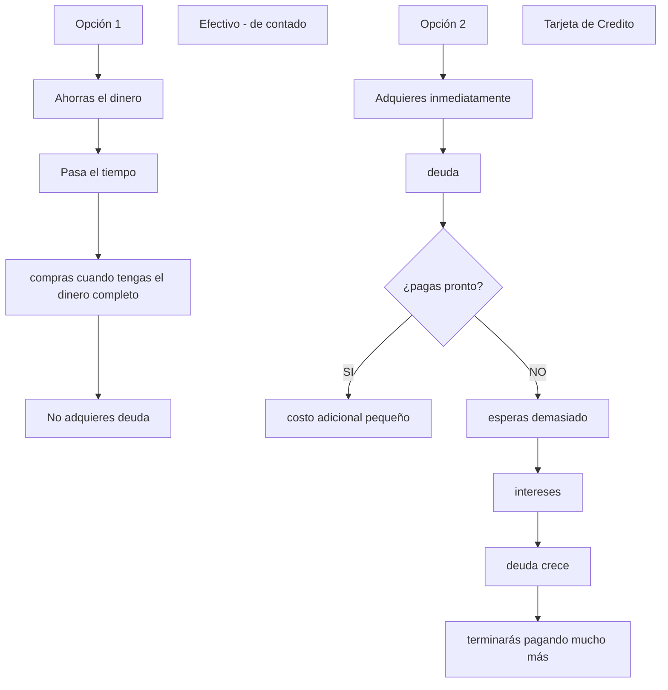
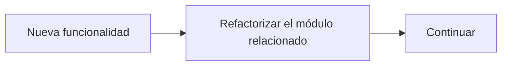
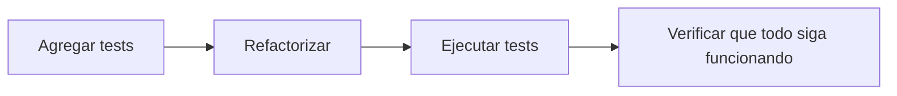
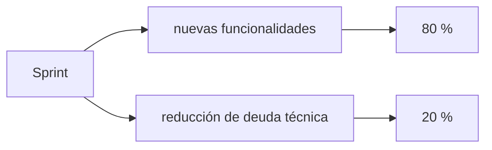
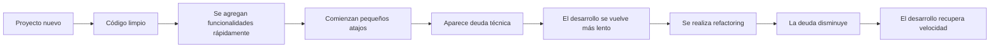

# Deuda Técnica

La deuda técnica es el costo futuro que genera tomar decisiones rápidas o soluciones temporales durante el desarrollo de software.

El término fue popularizado por _Ward Cunningham_, quien utilizó la metáfora de una deuda financiera para explicar un fenómeno común en el desarrollo de software.

### La analogía con una deuda financiera

**Imagina que necesitas comprar un producto costoso:**



_La deuda técnica funciona de forma muy parecida._

### Un ejemplo en programación

1. Supongamos que debes entregar una funcionalidad hoy.
2. La solución correcta requeriría tres días de trabajo.
3. Como el tiempo es limitado, decides escribir una solución rápida.

+ **_Funciona_ → Pero el código quedó** `desordenado`.

La aplicación cumple con el objetivo inmediato.

+ Ahora existe una deuda técnica.
+ Más adelante será necesario:
    + reorganizar el código
    + eliminar duplicaciones
    + mejorar nombres
    + agregar pruebas
    + simplificar la lógica.

### ¿Por qué existe la deuda técnica?

+ No siempre aparece por malas prácticas.
+ En muchas ocasiones es una decisión consciente.
    1. El cliente necesita una demostración mañana
    2. Se implementa una solución temporal.
    3. Después se mejora.
+ Eso puede ser una decisión válida.

_El problema surge cuando esa mejora nunca se realiza._

### ¿Qué provoca la deuda técnica?

Con el tiempo puede generar:

+ desarrollo más lento
+ mayor cantidad de errores
+ dificultad para agregar nuevas funcionalidades
+ código difícil de entender
+ mayor costo de mantenimiento.

En lugar de dedicar tiempo a desarrollar nuevas funcionalidades, los equipos comienzan a invertir gran parte de su esfuerzo en comprender y corregir el código existente.

### Ejemplos de deuda técnica

**Código duplicado**

```javascript
calcularIVA()
...
calcularIVA()
...
calcularIVA()
```
La misma lógica aparece varias veces.

**Nombres poco descriptivos**

+ `x`, `y`, `z`, `temp2`, `valor3`

El código funciona. → Pero comprenderlo requiere mucho esfuerzo.

**Funciones gigantes**
+ Una función grande suele ser **difícil de leer, probar y modificar.**

**Ausencia de pruebas**
+ Si no existen tests, cualquier cambio implica un mayor riesgo de romper funcionalidades existentes.

**Comentarios desactualizados**

+ `// Calcula el IVA del 16%`

Pero el código realmente utiliza el `19%`. → _La documentación ya no refleja el comportamiento del programa._

### ¿Toda deuda técnica es mala?

No. → Es importante distinguir entre una deuda `intencional` y una `accidental`.

**Deuda técnica intencional**

El equipo sabe que está tomando un atajo.

```
Primero construiremos un prototipo.
            ↓
Después reorganizaremos el código.
```

_Es una decisión planificada._

**Deuda técnica accidental**

Nadie quería generar deuda.

Simplemente apareció por:

+ falta de experiencia
+ malas prácticas
+ ausencia de revisiones
+ presión constante.

Esta suele ser más peligrosa porque muchas veces ni siquiera se detecta.

### ¿Cómo identificar la deuda técnica?

Algunas señales frecuentes son:

+ cambios muy difíciles de realizar
+ errores que reaparecen con frecuencia
+ funciones demasiado largas
+ clases con muchas responsabilidades
+ código duplicado
+ nombres poco claros
+ baja cobertura de pruebas
+ comentarios como:
    + `// TODO`
    + `// FIXME`
    + `// Temporal`
    + `// Pendiente mejorar`
+ Estos comentarios suelen indicar trabajo pendiente.

## ¿Cómo gestionarla?

+ La deuda técnica no puede eliminarse por completo.
+ Todos los proyectos acumulan cierta deuda con el tiempo.
+ **El objetivo es mantenerla bajo control**.

### 1. Identificarla

El primer paso es reconocer su existencia.

Durante las revisiones de código o el mantenimiento es útil anotar aspectos como:

+ duplicación
+ complejidad excesiva
+ funciones largas
+ ausencia de pruebas
+ dependencias innecesarias

Lo que no se identifica, no puede gestionarse.

### 2. Priorizar

**No toda deuda debe resolverse inmediatamente.**
+ Función poco utilizada
+ Código algo desordenado
+ Quizá pueda esperar.

**Pero:**
+ Módulo crítico
+ Errores frecuentes
+ Difícil de modificar

_Debe tener mayor prioridad._

### 3. Refactorizar poco a poco

+ No es recomendable detener un proyecto durante meses únicamente para limpiar código.
+ Es preferible mejorar el sistema de forma incremental.



Este enfoque evita grandes interrupciones.

### 4. Escribir pruebas

+ Antes de modificar código complejo es recomendable crear tests.
+ Los tests sirven como una red de seguridad.

Proceso habitual:


### 5. Realizar revisiones de código

Las revisiones permiten detectar deuda técnica antes de que llegue al repositorio principal.

Otro desarrollador puede identificar:

+ duplicación
+ nombres poco claros
+ complejidad innecesaria
+ oportunidades de simplificación.

### 6. Utilizar herramientas de análisis

+ linters
+ analizadores estáticos
+ medidores de cobertura
+ plataformas de calidad de código.

'Ayudan' a detectar problemas → 'facilitan' su identificación

### 7. Reservar tiempo para mejorar el código

Muchos equipos dedican parte de cada iteración a reducir deuda técnica.



_Esto evita que el problema crezca indefinidamente._

### ¿Qué ocurre si nunca se gestiona?

+ La deuda técnica genera un efecto acumulativo.

    + Al principio:
        + Agregar una nueva funcionalidad → 2 horas

    + Meses después:
        + La misma funcionalidad → 2 días

+ No porque la funcionalidad sea más compleja.
+ Sino porque el código es mucho más difícil de modificar.

### Ejemplo de evolución de un proyecto



### Ideas clave

+ **La deuda técnica** es el costo futuro asociado a decisiones de diseño o implementación que priorizan la rapidez sobre la calidad.
+ **No toda deuda técnica es negativa**; en ocasiones puede ser una decisión estratégica, siempre que exista un plan para resolverla.
+ La deuda técnica se manifiesta mediante:
    + código duplicado
    + funciones demasiado grandes
    + nombres poco claros
    + falta de pruebas 
    + problemas de diseño.
+ Gestionarla implica:
    1. identificarla
    2. priorizarla 
    3. reducirla de forma continua
+ **NO** se debe **ignorar** o intentar eliminarla **toda de una sola vez**.
+ **El refactoring** apoyado por una buena suite de tests automatizados, es la herramienta más importante para mantener la deuda técnica bajo control y preservar la calidad del software a largo plazo.