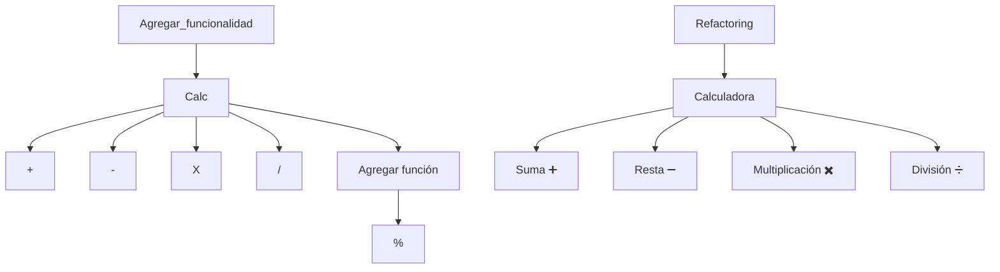
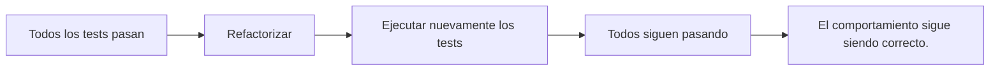

# Refactoring

### ¿Qué es Refactoring?

El Refactoring es el proceso de mejorar la estructura interna del código sin cambiar su comportamiento externo.

En otras palabras:

+ El programa sigue haciendo exactamente lo mismo.
+ Los usuarios no notan ningún cambio.
+ Solo mejora la forma en que está escrito el código.

Por ejemplo, imagina esta función:

```javascript
function calcular(a, b) {
    let x = a * 0.19;
    let y = a + x;
    return y;
}
```

+ Funciona correctamente. → _Sin embargo, los nombres de las `variables` no son muy `descriptivos`._

Después de un refactoring podría quedar así:

```javascript
function calcularTotalConIVA(precio) {
    const iva = precio * 0.19;
    const total = precio + iva;
    return total;
}
```

+ El resultado es exactamente el mismo.
    + Antes: 100 → 119
    + Después: 100 → 119
    + No cambió el comportamiento. → Solo mejoró la claridad.

### ¿Por qué hacer Refactoring?

Con el paso del tiempo, todos los proyectos crecen.

Cada nueva funcionalidad agrega:

+ nuevas clases
+ nuevas funciones
+ nuevas dependencias
+ nuevas reglas de negocio

Si nunca mejoramos el código, termina siendo difícil de entender y modificar.

### Objetivos del Refactoring

Un buen refactoring busca:

+ mejorar la legibilidad
+ reducir la duplicación
+ simplificar la lógica
+ facilitar el mantenimiento
+ facilitar las pruebas
+ reducir el riesgo de errores futuros

_Es importante notar que el objetivo no es agregar nuevas funcionalidades._

### Refactoring vs Agregar Funcionalidades



+ **Refactoring:**
    + Misma funcionalidad
    + El comportamiento no cambia.
    + pero, **Código más limpio.**

### Refactoring vs Optimización

**Tampoco son iguales.**

_¿Que busca cada uno?_

| Refactoring    | Optimización             |
| ---------------| ------------------------ |
| claridad       | mayor velocidad          | 
| mantenibilidad | menor consumo de memoria |
| simplicidad    | Errores comunes y estilo |
| Formateador    | mejor rendimiento        |

_A veces un refactoring mejora el rendimiento, pero ese no es su objetivo principal._

### ¿Cómo sabemos que no rompimos nada?

+ Aquí aparece nuevamente el testing.
+ Los tests son la red de seguridad del refactoring.



+ _Por eso se dice que el testing y el refactoring trabajan juntos._

## ¿Cuándo Refactorizar?

+ No existe una regla absoluta.
+ Sin embargo, hay situaciones donde es muy recomendable hacerlo.

### Sí refactorizar

### 1. Cuando el código es difícil de entender

```javascript
if(a==1){
    if(b==0){
        if(c>10){
            ...
```
+ Después de algunos minutos nadie entiende qué ocurre.
+ Es un buen candidato para refactoring.

### 2. Cuando hay código duplicado

```javascript
calcularIVA()
...
calcularIVA()
...
calcularIVA()
```

+ Si la misma lógica aparece en varios lugares, probablemente deba extraerse a una única función.

### 3. Antes de agregar nuevas funcionalidades

+ Imagina una función enorme.
    + Antes de agregar otra responsabilidad, conviene limpiarla.
        + Así la nueva funcionalidad será mucho más sencilla de implementar.

### 4. Después de corregir un bug

+ Muchas veces encontramos código confuso mientras solucionamos un error.
+ Ya que estamos trabajando en esa zona del sistema, suele ser un buen momento para mejorarla.

### 5. Cuando el código crece demasiado

+ Funciones de cientos de líneas.
+ Clases gigantes.
+ Archivos enormes.
+ _Todo eso suele indicar que llegó el momento de reorganizar el código._

### No refactorizar

También existen situaciones donde no es conveniente.

### 1. Si el código funciona y no volverá a modificarse

+ Proyecto antiguo → Será reemplazado el próximo mes.
    + No tiene sentido invertir tiempo en limpiarlo.

### 2. Si no existen tests

+ Sin pruebas, cada cambio aumenta el riesgo de romper el sistema.
+ En estos casos suele ser más prudente escribir primero algunos tests.

### 3. Si hay una emergencia en producción

+ Supongamos que el sistema está caído.
    + El objetivo inmediato es restaurar el servicio.
        + No es el momento para reorganizar el código.

1. Arreglar el problema.
2. Refactorizar.

### 4. Cuando el cambio aporta poco valor

+ No todo código imperfecto necesita mejorarse.
+ El tiempo también es un recurso.

## Técnicas Comunes de Refactoring

### 1. Extract Method (Extraer Método)

Es probablemente la técnica más utilizada.

+ Consiste en mover un bloque de código a una nueva función con un nombre descriptivo.

```javascript
// Antes:
function registrarUsuario(usuario) {
    console.log("Guardando usuario...");
    // guardar en base de datos

    console.log("Enviando correo...");
    // enviar correo
}

// Después:

function registrarUsuario(usuario) {
    guardarUsuario(usuario);
    enviarCorreoBienvenida(usuario);
}
```