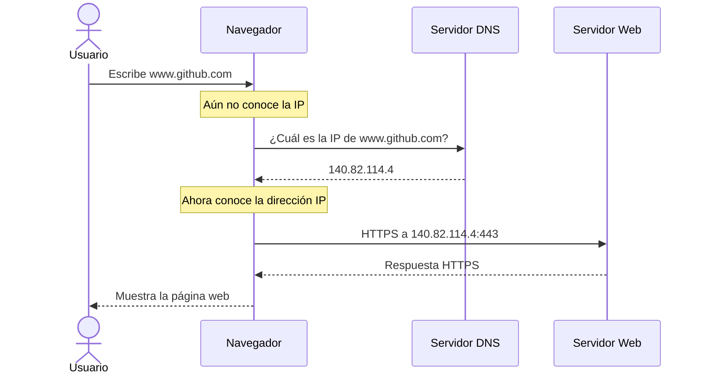
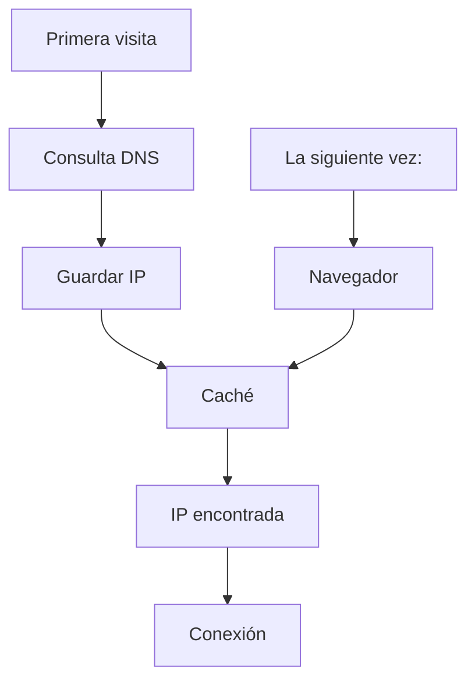

# DNS (Domain Name System)

**Cómo sabe mi navegador cuál es la dirección IP de por ejemplo**

www.google.com

www.youtube.com

Aquí es donde entra el DNS (Domain Name System).

### ¿Qué es el DNS?

El Domain Name System (DNS) es un sistema distribuido que traduce nombres de dominio fáciles de recordar en direcciones IP que los computadores pueden utilizar.

+ El DNS funciona como la "agenda telefónica" o el "directorio" de Internet.

Ejemplo:

| Nombre de dominio | Dirección IP (ejemplo)    |
| ----------------- | ------------------------- |
| `www.google.com`  | 142.250.190.78            |
| `www.github.com`  | 140.82.114.4              |
| `www.openai.com`  | 104.18.x.x (puede variar) |

Los usuarios recuerdan nombres; los routers y servidores trabajan con direcciones IP.

### ¿Por qué existe el DNS?

Imagina que cada persona del mundo solo pudiera ser contactada por su número de teléfono.

1. Sería muy difícil recordar miles de números.
2. Por eso usamos una agenda de contactos.
3. El DNS hace exactamente lo mismo con Internet.

```
Nombre ←→ IP ←→ Conexión
```

### ¿Qué es un nombre de dominio?

Un nombre de dominio es el nombre legible que identifica un sitio o servicio en Internet.

+ google.com
+ youtube.com
+ github.com
+ wikipedia.org

Estos nombres existen para facilitar el acceso a los recursos sin necesidad de memorizar direcciones IP.

### ¿Qué ocurre cuando escribes una URL?

Supongamos que escribes:

https://www.google.com

+ El navegador no se puede conectar directamente al servidor → Antes necesita conocer su dirección IP.

El proceso es el siguiente:

```
→ Usuario Escribe www.google.com 
    → Navegador Consulta DNS 
        → Obtiene IP 
            → Conexión al servidor 
                → Página Web
```
El **DNS** es el paso intermedio entre el nombre de `dominio` y la `dirección IP`.

### ¿Dónde está el DNS?

No existe un único servidor DNS.

Es un sistema distribuido formado por miles de servidores repartidos por todo el mundo.

Esto ofrece varias ventajas:

+ Alta disponibilidad.
+ Rapidez.
+ Tolerancia a fallos.
+ Escalabilidad.

Si un servidor DNS deja de funcionar, normalmente otro puede responder la consulta.

### ¿Quién proporciona el DNS?

Existen muchos proveedores de DNS.

Algunos ejemplos conocidos son:

| Proveedor     | DNS Principal  |
| ------------- | -------------- |
| Google        | 8.8.8.8        |
| Cloudflare    | 1.1.1.1        |
| Cisco OpenDNS | 208.67.222.222 |

_Tu Proveedor de Servicios de Internet (`ISP`) suele asignarte automáticamente un servidor `DNS`._

### ¿Cómo funciona una consulta DNS?

**Proceso paso a paso.**



### El DNS solo traduce nombres

+ Es importante entender que el DNS no transporta la página web.
    + Una vez obtenida la IP, el DNS deja de intervenir.
        + Después, la comunicación continúa utilizando otros protocolos, como `HTTP` o `HTTPS`.

### Caché DNS

Una caché es una memoria temporal donde se guardan respuestas recientes.

+ Imagínate que visitas Google diez veces en cinco minutos.
    + ¿El navegador preguntará al DNS diez veces?



Así se evita repetir la misma consulta constantemente, lo que mejora el rendimiento.

### ¿Por qué puede cambiar una IP?

Una misma página web puede cambiar de dirección IP por varias razones:

+ Migración a nuevos servidores.
+ Balanceo de carga.
+ Escalabilidad.
+ Mantenimiento.
+ Distribución geográfica.

### Un dominio puede tener varias IP

Un sitio web grande rara vez depende de un solo servidor.

```
                 ┌── 142.250.190.78
                 │
    google.com ——│—— 142.250.190.79
                 │
                 └—— 142.250.190.80
```

_Cuando un cliente realiza una consulta DNS, puede recibir una de varias direcciones IP disponibles._

Esto permite:

+ Distribuir el tráfico entre varios servidores (balanceo de carga).
+ Mejorar el rendimiento.
+ Aumentar la disponibilidad si alguno de los servidores falla.

### Relación entre DNS, IP y Cliente-Servidor

Cada componente cumple una función específica:

| Componente   | Función                                                                           |
| ------------ | --------------------------------------------------------------------------------- |
| DNS          | Traduce el nombre del dominio a una dirección IP.                                 |
| Dirección IP | Identifica el servidor en la red.                                                 |
| Puerto       | Identifica el servicio dentro del servidor (por ejemplo, HTTPS en el puerto 443). |
| Cliente      | Envía la solicitud.                                                               |
| Servidor     | Procesa la solicitud y envía la respuesta.                                        |

### ¿Qué pasa si el DNS falla?

+ Si el DNS no puede resolver un nombre de dominio:
+ El navegador no sabe a qué servidor conectarse, aunque el servidor esté funcionando correctamente.
+ Por eso, errores como:
    + "DNS_PROBE_FINISHED_NXDOMAIN"
    + "No se puede resolver el nombre del host"
+ normalmente indican un problema relacionado con la resolución DNS, no necesariamente con el servidor web.

### Ideas clave

+ El DNS (Domain Name System) traduce nombres de dominio en direcciones IP.
+ Permite que las personas utilicen nombres fáciles de recordar en lugar de memorizar direcciones IP.
+ Antes de conectarse a un servidor, el cliente realiza una consulta DNS para obtener la IP correspondiente.
El DNS es un sistema distribuido, compuesto por miles de servidores en todo el mundo, lo que mejora su disponibilidad y escalabilidad.
+ Las respuestas DNS suelen almacenarse temporalmente en una caché, reduciendo el tiempo de futuras consultas.
+ Un mismo dominio puede apuntar a una o varias direcciones IP, y estas pueden cambiar con el tiempo sin que el usuario tenga que hacer nada.