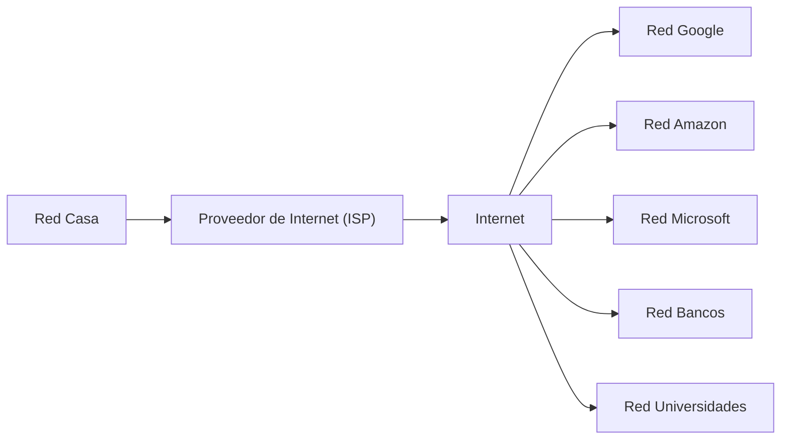
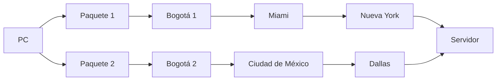
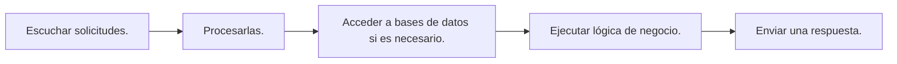
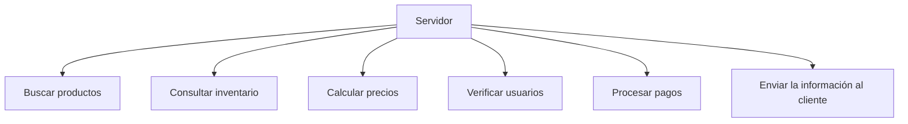
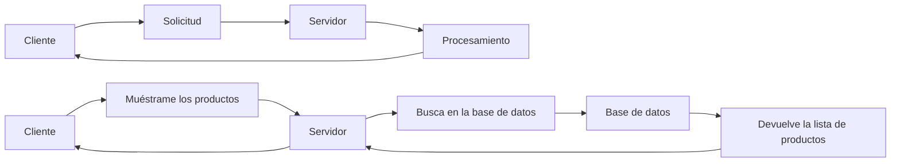
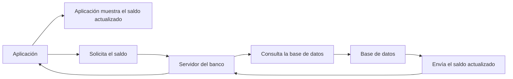

# Redes Básicas y Cómo Funciona Internet

### ¿Qué es una red?

Una red de computadoras es un conjunto de dispositivos conectados entre sí para compartir información y recursos.

Estos dispositivos pueden ser:
+ Computadores
+ Servidores
+ Teléfonos móviles
+ Cámaras
+ Dispositivos IoT

La comunicación ocurre mediante un conjunto de reglas llamadas **protocolos**.

Cada dispositivo puede enviar y recibir información.

### ¿Qué es Internet?

Internet es simplemente la red de redes.

Es millones de redes independientes alrededor del mundo conectadas entre sí.


No existe un único computador que sea "Internet".

Cada organización posee su propia red → Internet conecta todas ellas.

### ¿Qué información viaja por Internet?

Prácticamente cualquier tipo de dato.

Por ejemplo:

+ páginas web
+ imágenes
+ videos
+ correos electrónicos
+ llamadas

pero todo es enviado en datos binarios

+ `0` y `1`

### Los datos viajan en paquetes

Uno de los conceptos más importantes de las redes es que los datos no viajan completos.

+ Se dividen en pequeñas partes llamadas:

    + Paquetes (`Packets`)

Cada paquete viaja por Internet de forma independiente.

### ¿Por qué dividir los datos?

+ Porque es mucho más eficiente.
    + Si un paquete se pierde:
        + Solo se vuelve a enviar ese paquete.

_No es necesario reenviar todo el archivo._

### Los paquetes pueden tomar rutas distintas

Dos paquetes del mismo archivo pueden viajar por caminos completamente diferentes.



_Al final ambos llegan._

### ¿Quién decide la ruta?

**Routers**

Ellos analizan continuamente:

+ congestión
+ velocidad
+ disponibilidad
+ fallos

Y deciden el mejor camino.

### ¿Qué ocurre si un cable se rompe?

La red intenta buscar otra ruta.

+ `A` → `B` → `C` → `Servidor`
+ `B` → `C`
+ `A` → `D` → `E` → `Servidor`

_Internet fue diseñado para seguir funcionando incluso cuando parte de la infraestructura falla._

### ¿Qué es un protocolo?

Un protocolo es un conjunto de reglas que todos los dispositivos siguen para poder comunicarse correctamente.

Si dos equipos no hablan el mismo "idioma", no podrán entenderse.

Por ejemplo, cuando visitas una página web, tu navegador y el servidor acuerdan cómo intercambiar la información utilizando protocolos específicos

### Capas de comunicación

Las redes modernas se organizan en capas. Cada una tiene una responsabilidad concreta.

| Capa            | Responsabilidad                                                     |
| --------------- | ------------------------------------------------------------------- |
| Aplicación      | Programas como navegadores, correo o mensajería.                    |
| Transporte      | Garantiza (o no) la entrega de los datos entre aplicaciones.        |
| Internet        | Lleva los paquetes hasta la red de destino mediante direcciones IP. |
| Acceso a la red | Envía físicamente los datos por cable, fibra óptica o Wi-Fi.        |


Esta separación permite que cada capa evolucione de forma independiente y facilita el diseño y mantenimiento de las redes.

### Flujo simplificado de una petición

Cuando escribes una dirección web en tu navegador ocurre, de forma resumida, lo siguiente:

1. El navegador prepara una solicitud.
2. La solicitud se divide en paquetes.
3. Los paquetes salen de tu computador.
4. Pasan por tu router.
5. Tu proveedor de Internet (ISP) los dirige hacia Internet.
6. Diversos routers encaminan los paquetes hasta el servidor de destino.
7. El servidor procesa la solicitud.
8. Envía una respuesta, también dividida en paquetes.
9. Tu navegador reúne los paquetes y muestra la página.

### Ideas Clave

+ Una red conecta dispositivos para compartir información.
+ Internet es una enorme red formada por millones de redes interconectadas.
+ Toda la información se transmite como datos binarios (0 y 1).
+ Los datos se dividen en paquetes → que pueden seguir rutas distintas hasta llegar a su destino.
+ Los routers deciden el mejor camino para cada paquete.
+ Los protocolos establecen las reglas de comunicación entre dispositivos.
+ La comunicación en Internet se organiza por capas → donde cada una cumple una función específica.

## Arquitecturas típicas de redes de datos

Una arquitectura de red describe la forma en que los dispositivos están conectados entre sí para poder intercambiar información.

No importa si la red tiene dos computadores o miles de ellos: siempre existe una forma de organizarlos

Dos tipos importantes de redes

+ **LAN** (_Local Area Network_)
+ **WAN** (_Wide Area Network_)

### LAN (Local Area Network)

Una **LAN** es una red que cubre un área geográfica pequeña.

+ una habitación
+ una oficina
+ un edificio
+ un campus universitario

Su principal característica es que todos los dispositivos están relativamente cerca unos de otros.

**Ejemplo:**

una oficina con:

+ 20 computadores
+ una impresora
+ un servidor
+ un router

Todos están conectados mediante cables Ethernet o Wi-Fi.

Eso constituye una **LAN**.

### Topologías de red

+ Una topología es la forma física o lógica en que los dispositivos están conectados.

+ Dependiendo de cómo estén conectadas las calles, la ciudad tendrá ventajas y desventajas.

+ 4 Topologias principales

### Topología en Malla (Mesh)

En una red Mesh, cada computador está conectado directamente con todos los demás.

Por ejemplo, si existen cuatro computadores:

.png)

Cada equipo posee múltiples conexiones.

**Ventajas**
+ Muy confiable.
+ Si un cable falla, existen otros caminos.
+ Alta disponibilidad.

**Desventajas**
+ Muchísimos cables.
+ Mayor costo.
+ Mayor procesamiento.

_Por eso hoy se utiliza principalmente en situaciones especiales donde la disponibilidad es crítica._

### Topología Bus

Todos los equipos comparten un único cable principal.


Todos escuchan el mismo medio de comunicación.

**Ventajas**
+ Muy económica.
+ Fácil de instalar.

**Desventajas**
+ Si el cable principal falla, toda la red deja de funcionar.
+ Muchas colisiones.
+ Poco escalable.

_Por estas razones prácticamente ya no se utiliza._

### Topología Anillo

Cada computador está conectado únicamente con dos vecinos.


Los datos recorren el anillo hasta encontrar el destino.

**Ventajas**
+ Orden en la transmisión.
+ Menos colisiones.

**Desventajas**
+ Si el anillo se rompe, la comunicación puede detenerse.
+ _Hoy casi no se utiliza en redes Ethernet modernas._

### Topología Estrella

_Es la más utilizada actualmente._

Todos los dispositivos se conectan a un equipo central.

.png)

Generalmente ese equipo es un switch.

**Ventajas**
+ Fácil de administrar.
+ Fácil agregar nuevos equipos.
+ Si un cable falla, solo ese equipo queda desconectado

**Desventaja**
+ Si el switch falla, toda la red deja de funcionar.

### WAN (Wide Area Network)

Mientras una **LAN** cubre pequeñas distancias, una **WAN** conecta redes separadas por grandes distancias.

Por ejemplo:

+ Bogotá ↔ Medellín
+ Colombia ↔ Estados Unidos

Una WAN une varias LAN.

_Generalmente pertenece a los proveedores de Internet (`ISP`)._

### Tecnologías WAN

| RED            | AÑOS        | VELOCIDAD        | ESTANDAR                  | REFERENCIA  |
| ---------------| ----------- | -----------------| ------------------------- |------------ |
| X.25           | 1985 - 1996 | 9.6 - 64 Kbps    |                           | ITU-T CCITT |
| Frame Relay    | 1992 -      | 64 Kbps - 2 Mbps | ITU-T recomendación I.122 | ITU-T       |
| ATM            | 1996 -      | 34 - 155 Mbps    | RFC1754 - 2515 - 4454     | IETF        |
| MPLS           | 2001 -      | 20 Mbps - 10 Gbps| IETF RFC 3031             | IETF        |
| METRO-ETHERNET | 2003 -      | 1G - 40 Gbps     | IEEE802.3 – 2000          | IEEE-MEFIETF|

Cada nueva tecnología permitió:

+ mayor velocidad
+ mayor ancho de banda
+ mejor confiabilidad

La evolución respondió al aumento del tráfico de datos, como videollamadas y televisión en alta definición.

### Retardos, pérdidas y tasas de transferencia

En una red ideal los datos llegarían:

+ completos
+ sin errores
+ inmediatamente

En la realidad esto no ocurre:

+ retardos (demoras)
+ pérdidas de paquetes
+ errores de transmisión

Estos problemas aparecen porque ningún medio físico es perfecto.

### Métodos de detección y corrección de errores

**Métodos de Detección de Errores**

+ **Bit de paridad:** Añade un único bit para hacer el total de "1s" par o impar. Solo detecta errores impares.
+ **CRC** (_Cyclic Redundancy Check_): Usa división polinómica binaria. Genera un residuo matemático que detecta ráfagas de errores con alta fiabilidad

**Métodos de Corrección de Errores (FEC)**

+ **FEC** (_Forward Error Correction_): Término general para la corrección de errores en origen sin pedir retransmisión.

+ **Código de Hamming:** Inserta bits de paridad en posiciones de potencia de dos (\(1, 2, 4, 8\dots\)). Corrige errores de un solo bit.

+ **Reed-Solomon:** Código basado en bloques de bytes. Excelente para corregir ráfagas de errores consecutivas en discos o transmisiones satelitales

**Métricas de Rendimiento**

+ **BER** (_Bit Error Rate_):  Tasa de error de `bits`. Es el porcentaje de `bits` recibidos con error frente al total de `bits` transmitidos (**BER** = `bits` erróneos / `bits` totales).

**Protocolo de Acceso al Medio**

+ **CDMA** (_Code Division Multiple Access_): es una tecnología de comunicación inalámbrica que permite a múltiples usuarios transmitir datos y voz de forma simultánea a través de un mismo canal de frecuencia de radio

+ **CSMA/CD** (_Carrier Sense Multiple Access with Collision Detection_): usado en redes Ethernet cableadas para detectar choques de datos

### Capacidad del canal (Nyquist)

+ $C$ : _Es la velocidad de transmisión._
+ $BW$ : _Ancho de banda del canal._
+ $M$ : _Numero de niveles_

Criterio de Nyquist para estimar la velocidad máxima de transmisión en un canal sin ruido.

+ $C = 2BW$

Si esta señal tiene más de un nivel de bits la fórmula cambia de la siguiente manera:

+ $C = 2BW log₂ M$

### Ancho de banda efectivo

El ancho de banda mínimo para transmitir una señal digital en su primer
armónico es: 

+ $BW= Tasa de bits/2$

Una señal digital necesita un ancho de banda mínimo para poder transmitirse correctamente.

**Por ejemplo:**

+ Para una señal de **2 Mbps** se debe utilizar un ancho de banda de **500 KHz** como mínimo
+ Si se desea transmitir el primero, el tercero y el quinto se necesita un ancho de banda de:
**2,5 MHz (5 x 500 KHz)**

### Vulnerabilidades en redes

Una vulnerabilidad es una debilidad que puede ser aprovechada por un atacante.

### 1. Seguridad física

Los servidores deben protegerse físicamente.

Si alguien puede acceder al servidor, puede:

+ robar información
+ dañarla
+ apagar equipos

### 2. Software desactualizado

Los sistemas operativos y aplicaciones pueden contener fallos de seguridad. Mantenerlos actualizados reduce estos riesgos.

### 3. Phishing

Consiste en enviar correos fraudulentos para engañar a los usuarios y obtener información sensible.

### 4. Ingeniería social

El atacante manipula psicológicamente a las personas para conseguir acceso o datos.

### 5. Falta de copias de seguridad

Si no existen respaldos, una falla o un ataque puede ocasionar la pérdida definitiva de la información.

### 6. Ataques a la red

Buscan afectar el funcionamiento normal de los sistemas o intentar obtener acceso no autorizado
+ _Ping of Death_
+ _SYN Flood_

### Medidas de protección

+ seguridad física
+ actualización del software
+ copias de seguridad
+ contraseñas robustas
+ autenticación (como _AAA_, _tokens_ o _biometría_)
+ firma digital
+ _antivirus_ y _antispyware_
+ capacitación de los usuarios
+ cortafuegos (_firewalls_)
+ sistemas de detección de intrusiones
+ detectores de vulnerabilidades

### Ideas Clave

+ **LAN** conecta dispositivos dentro de un área pequeña, 
+ **WAN** interconecta redes a grandes distancias mediante la infraestructura de los _ISP_
+ **topologías de red** malla, bus, anillo y estrella -> la más utilizada en la actualidad

# Modelo Cliente-Servidor

El Modelo Cliente-Servidor es uno de los conceptos más importantes del desarrollo de software. La mayoría de las aplicaciones que usamos a diario, funcionan siguiendo este modelo.

### ¿Qué es el Modelo Cliente-Servidor?

El Modelo Cliente-Servidor es una arquitectura de comunicación donde dos tipos de programas tienen responsabilidades diferentes:

+ **Cliente:** solicita un servicio o información.
+ **Servidor:** recibe la solicitud, la procesa y envía una respuesta.

El cliente hace una petición y el servidor responde.

### ¿Qué es un Cliente?

Un cliente es un programa o dispositivo que solicita un recurso o servicio.

Puede ser:

+ Un navegador web.
+ Una aplicación móvil.
+ Un videojuego.
+ Un programa de escritorio.
+ Un servicio que consume una API.

### ¿Qué es un Servidor?

Un servidor es un programa (y normalmente también un computador donde ese programa se ejecuta) encargado de atender solicitudes de múltiples clientes.



Por ejemplo:

Cuando visitas una tienda en línea:

el servidor puede:



### Comunicación Cliente-Servidor

El flujo básico es muy sencillo:


Ejemplo: Una aplicación bancaria

Cuando consultas tu saldo:



Toda la información importante permanece en el servidor.

### Responsabilidades del Cliente

**Generalmente, "el cliente" se encarga de:**

+ Mostrar la interfaz gráfica.
+ Recibir la interacción del usuario.
+ Enviar solicitudes.
+ Mostrar respuestas.
+ Validar algunos datos sencillos (por ejemplo, que un correo tenga un formato válido).

**No suele:**
+ encargarse de almacenar información crítica
+ Aplicar reglas de negocio importantes → esto sería inseguro

### Responsabilidades del Servidor

**El servidor normalmente se encarga de:**

+ Procesar solicitudes.
+ Aplicar reglas de negocio.
+ Autenticar usuarios.
+ Autorizar acciones.
+ Acceder a bases de datos.
+ Generar respuestas.
+ Registrar eventos y errores.

Es la parte del sistema que concentra la lógica principal y protege los datos sensibles.

### Un servidor atiende muchos clientes

+ Un servidor no trabaja para un único usuario.
+ Puede atender cientos, miles o incluso millones de clientes al mismo tiempo.

```
Cliente A ──┐
            │
Cliente B ──├────► Servidor
            │
Cliente C ──┘
```
Por ejemplo:

_Un servidor de YouTube puede atender millones de reproducciones de video de forma simultánea._

### Un cliente puede comunicarse con varios servidores

De igual forma, un cliente no está limitado a un solo servidor.

Cuando abres una página web moderna, tu navegador puede contactar con varios servidores al mismo tiempo:

```
Navegador

├── Servidor de la página
├── Servidor de imágenes
├── Servidor de anuncios
├── Servidor de autenticación
└── Servidor de análisis
```

_Todo esto ocurre en segundo plano y el usuario normalmente no lo percibe._

### Desventajas del Modelo Cliente-Servidor

+ Si el servidor deja de funcionar, los clientes pueden quedarse sin servicio.
+ Un servidor muy cargado puede responder lentamente.
+ Requiere una conexión de red para la mayoría de las operaciones.
+ Es necesario implementar medidas de seguridad para proteger el servidor y la información.