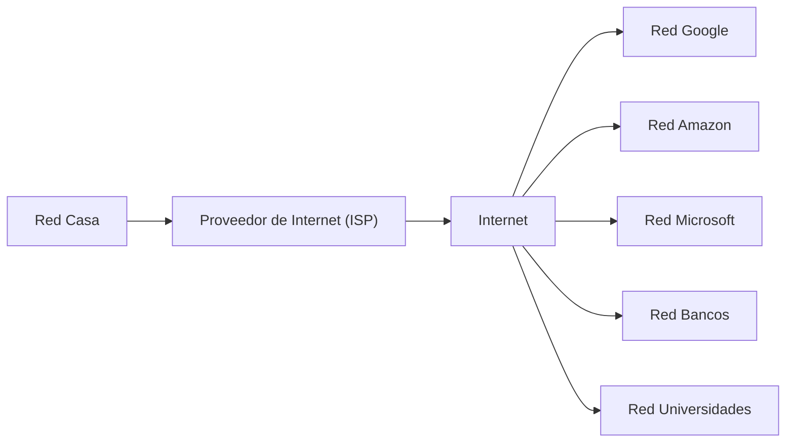
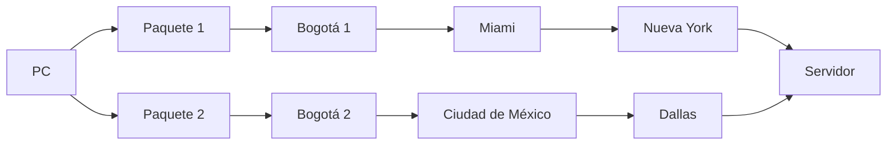

# Redes Básicas y Cómo Funciona Internet

### ¿Qué es una red?

Una red de computadoras es un conjunto de dispositivos conectados entre sí para compartir información y recursos.

Estos dispositivos pueden ser:
+ Computadores
+ Servidores
+ Teléfonos móviles
+ Cámaras
+ Dispositivos IoT

La comunicación ocurre mediante un conjunto de reglas llamadas **protocolos**.

Cada dispositivo puede enviar y recibir información.

### ¿Qué es Internet?

Internet es simplemente la red de redes.

Es millones de redes independientes alrededor del mundo conectadas entre sí.

No existe un único computador que sea "Internet".

Cada organización posee su propia red → Internet conecta todas ellas.

### ¿Qué información viaja por Internet?

Prácticamente cualquier tipo de dato.

Por ejemplo:

+ páginas web
+ imágenes
+ videos
+ correos electrónicos
+ llamadas

pero todo es enviado en datos binarios

+ `0` y `1`

### Los datos viajan en paquetes

Uno de los conceptos más importantes de las redes es que los datos no viajan completos.

+ Se dividen en pequeñas partes llamadas:

    + Paquetes (`Packets`)

Cada paquete viaja por Internet de forma independiente.

### ¿Por qué dividir los datos?

+ Porque es mucho más eficiente.
    + Si un paquete se pierde:
        + Solo se vuelve a enviar ese paquete.

_No es necesario reenviar todo el archivo._

### Los paquetes pueden tomar rutas distintas

Dos paquetes del mismo archivo pueden viajar por caminos completamente diferentes.

_Al final ambos llegan._

### ¿Quién decide la ruta?

**Routers**

Ellos analizan continuamente:

+ congestión
+ velocidad
+ disponibilidad
+ fallos

Y deciden el mejor camino.

### ¿Qué ocurre si un cable se rompe?

La red intenta buscar otra ruta.

+ `A` → `B` → `C` → `Servidor`
+ `B` → `C`
+ `A` → `D` → `E` → `Servidor`

_Internet fue diseñado para seguir funcionando incluso cuando parte de la infraestructura falla._

### ¿Qué es un protocolo?

Un protocolo es un conjunto de reglas que todos los dispositivos siguen para poder comunicarse correctamente.

Si dos equipos no hablan el mismo "idioma", no podrán entenderse.

Por ejemplo, cuando visitas una página web, tu navegador y el servidor acuerdan cómo intercambiar la información utilizando protocolos específicos

### Capas de comunicación

Las redes modernas se organizan en capas. Cada una tiene una responsabilidad concreta.

| Capa            | Responsabilidad                                                     |
| --------------- | ------------------------------------------------------------------- |
| Aplicación      | Programas como navegadores, correo o mensajería.                    |
| Transporte      | Garantiza (o no) la entrega de los datos entre aplicaciones.        |
| Internet        | Lleva los paquetes hasta la red de destino mediante direcciones IP. |
| Acceso a la red | Envía físicamente los datos por cable, fibra óptica o Wi-Fi.        |

Esta separación permite que cada capa evolucione de forma independiente y facilita el diseño y mantenimiento de las redes.

### Flujo simplificado de una petición

Cuando escribes una dirección web en tu navegador ocurre, de forma resumida, lo siguiente:

1. El navegador prepara una solicitud.
2. La solicitud se divide en paquetes.
3. Los paquetes salen de tu computador.
4. Pasan por tu router.
5. Tu proveedor de Internet (ISP) los dirige hacia Internet.
6. Diversos routers encaminan los paquetes hasta el servidor de destino.
7. El servidor procesa la solicitud.
8. Envía una respuesta, también dividida en paquetes.
9. Tu navegador reúne los paquetes y muestra la página.

### Ideas Clave

+ Una red conecta dispositivos para compartir información.
+ Internet es una enorme red formada por millones de redes interconectadas.
+ Toda la información se transmite como datos binarios (0 y 1).
+ Los datos se dividen en paquetes → que pueden seguir rutas distintas hasta llegar a su destino.
+ Los routers deciden el mejor camino para cada paquete.
+ Los protocolos establecen las reglas de comunicación entre dispositivos.
+ La comunicación en Internet se organiza por capas → donde cada una cumple una función específica.