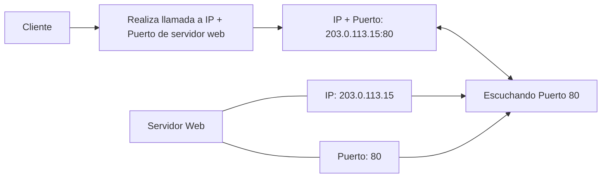
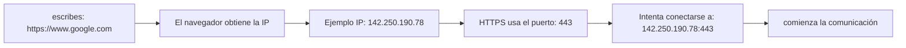

# IP y Puertos

_¿cómo sabe un cliente exactamente a qué servidor debe enviar su solicitud?_

+ Direcciones **IP** (`Internet Protocol`)
+ **Puertos** (`Ports`)

## ¿Qué es una Dirección IP?

Una Dirección IP (**Internet Protocol Address**) es un identificador único asignado a un dispositivo dentro de una red.

Así como una carta necesita una dirección para llegar a una casa, un paquete de datos necesita una dirección IP para llegar a un dispositivo.

_Sin una dirección IP, los routers no sabrían dónde enviar los paquetes._

### ¿Cómo se ve una IP?

Actualmente existen dos versiones principales.

**IPv4**

+ Es la más conocida.
+ Tiene cuatro números separados por puntos.
    + `192.168.1.20`
    + `8.8.8.8`
    + `142.250.190.78`

+ Cada número puede estar entre:
    + 0 y 255

+ Por eso una IPv4 tiene este formato:
    + _XXX.XXX.XXX.XXX_

**IPv6**

Debido a que ya no había suficientes direcciones IPv4 para todos los dispositivos del mundo, se creó **IPv6**.

+ Es una cadena larga de ocho grupos de cuatro dígitos hexadecimales (números del 0 al 9 y letras de la A a la F)
+ separados por dos puntos
+ Su formato es más largo.
    + _2001 : 0db8 : 85a3 : 0000 : 0000 : 8a2e : 0370 : 7334_ :point_left:

**Longitud:** Tiene 128 bits en total (a diferencia de los 32 bits de IPv4).

**Hextetos:** Se divide en 8 bloques o hextetos de 16 bits cada uno.

**Abreviación:**   

+ Para acortar direcciones largas, los ceros a la izquierda en un bloque se pueden omitir
+ Los bloques consecutivos de puros ceros se pueden reemplazar una sola vez por dos puntos dobles (::
    + _2001 : db8 : 85a3 :: 8a2e : 370 : 7334_ :point_left:
    + _2001 : 4860: 4860 :: 8888_

**IPv8**

+ Es una propuesta de protocolo de red presentada como borrador técnico
+ A diferencia de IPv6, que requiere una migración compleja de toda la infraestructura
+ IPv8 está diseñado para coexistir y respetar la arquitectura de IPv4 de forma nativa.

**IPv8** _Surge para ampliar las direcciones IP a 64 bits y solucionar el agotamiento de IPv4 sin romper la compatibilidad con los sistemas antiguos_

[Articulo IPv8](https://github.com/JhalexR/learning-journey/blob/main/Knowledge%20Base/2%20Articulos%20e%20investigaciones/2%20IPv8.md) :point_left:

### ¿Qué identifica una IP?

La IP identifica un **dispositivo** dentro de una red, no una aplicación.

+ PC → IP: → _192.168.1.5_

No indica qué programa debe recibir la información → Ahí es donde entran los puertos.

## ¿Qué es un Puerto?

Un puerto es un número lógico que identifica una aplicación o servicio específico dentro de un dispositivo.

+ ¿A qué dispositivo debo enviar los datos?
    + Respuesta: _Dirección_ **IP** 
        + _Ejemplo_ → **IP:** _192.168.1.5_

+ ¿A qué programa dentro de ese dispositivo debo entregarlos?
    + Respuesta: _puerto_  
        +  _Ejemplo_ → **Port:** _80_

**Analogía:** 

```
Edificio Mansion Wayne [:=:] Dirección → Calle del Error 404 - Esquina No Encontrada
    │
    │‗‗‗ Apartameno 501
    │
    │‗‗‗‗ Apartameno 401
    │
    │‗‗‗‗‗‗ Apartameno 301
    │
    │‗‗‗‗‗‗‗‗ Apartameno 201
    │
    │‗‗‗‗‗‗‗‗‗‗ Apartameno 101
```

+ Imagina un edificio.
    + La dirección del edificio sería la IP.
        + Dentro del edificio hay muchos apartamentos.
            + Cada apartamento sería un puerto.

**Ejemplo práctico**

Supongamos que un servidor tiene la IP:
+ `203.0.113.15`

Dentro de ese servidor pueden ejecutarse varias aplicaciones al mismo tiempo.
```
Servidor IP: 203.0.113.15
    │
    │‗‗‗ Puerto 80 → Servidor Web
    │
    │‗‗‗‗ Puerto 443 → Servidor Web Seguro 
    │
    │‗‗‗‗‗‗ Puerto 3306 → Base de Datos
    │
    │‗‗‗‗‗‗‗‗ Puerto 22 → SSH
    │
    │‗‗‗‗‗‗‗‗‗‗ Puerto 21 → FTP
```

_Todos comparten la misma IP, pero cada uno escucha en un puerto diferente._

### Comunicación completa

Cuando un cliente quiere conectarse a un servidor necesita ambos datos:
+ **IP: 203.0.113.15** _Puerto: 443_

La comunicación realmente ocurre hacia una combinación **IP:Puerto.**

```
203.0.113.15:443
    ↑         ↑
    IP      Puerto
```

_Eso identifica un servicio concreto dentro de un dispositivo._

### ¿Quién escucha un puerto?

Las aplicaciones servidor.



_El sistema operativo entrega esa solicitud al programa que está escuchando ese puerto._

### ¿Qué significa "escuchar un puerto"?

Una aplicación puede permanecer esperando conexiones.
```
Servidor
    Esperando...
        Esperando...
            Esperando...
                ↓
            Llega un cliente
                ↓
            Procesa la solicitud
```
A este proceso se le llama escuchar (**listen**) un puerto.

**Existen algunos puertos estandarizados para servicios muy comunes.**

+ No son obligatorios, 
    + pero seguir estos estándares 
        + facilita que clientes y servidores sepan dónde encontrar cada servicio.

| Puerto  | Servicio      |
| ------- | ------------- |
| 20 / 21 | FTP           |
| 22      | SSH           |
| 25      | SMTP (correo) |
| 53      | DNS           |
| 80      | HTTP          |
| 110     | POP3          |
| 143     | IMAP          |
| 443     | HTTPS         |
| 3306    | MySQL         |
| 5432    | PostgreSQL    |

**Ejemplo con una página web**



**Ejemplo con una API**

Supongamos que desarrollas una API.

+ Tu servidor puede ejecutarse en:
    + http://localhost:3000

+ Aquí ocurre lo siguiente:
    + **localhost** → _127.0.0.1_
    + **Puerto** → _3000_

+ En realidad el cliente se conecta a:
    + _127.0.0.1:3000_

### ¿Qué es `localhost`?

+ `localhost` es un nombre especial que siempre hace referencia al propio dispositivo desde el que se está ejecutando el programa.
+ En la mayoría de los sistemas operativos, `localhost` corresponde a la dirección IP: `127.0.0.1`

+ Cuando un desarrollador ejecuta una aplicación en su computador y accede:
    +  a http://localhost:3000, 
    + el cliente y el servidor están funcionando en la misma máquina.
    + Esto es muy útil durante el desarrollo y las pruebas.

### ¿Puede haber dos aplicaciones usando el mismo puerto?

+ En condiciones normales, solo una aplicación puede escuchar un mismo puerto en una misma dirección IP.
    + Si otro servidor intenta usar también el mismo puerto 
        + El sistema operativo impedirá que ambos ocupen el mismo puerto simultáneamente.

### ¿Quién administra los puertos?

El sistema operativo es el encargado de:
+ Asignar puertos a las aplicaciones.
+ Recibir los paquetes de red.
+ Entregar cada paquete al programa que está escuchando el puerto correspondiente.

Sistema operativo es el intrermediario
```
Aplicaciones ←→ Sistema Operativo ←→ Paquetes
```
### Relación entre IP y Puerto

| Concepto     | Función                                                                             |
| ------------ | ----------------------------------------------------------------------------------- |
| Dirección IP | Identifica un dispositivo dentro de una red.                                        |
| Puerto       | Identifica un servicio o aplicación dentro de ese dispositivo.                      |
| IP + Puerto  | Identifican un punto de comunicación específico al que un cliente puede conectarse. |

### ¿Que es IANA? 

+ **IANA** 
    + _Internet Assigned Numbers Authority_
    + _Autoridad de Números Asignados de Internet_ 

Es la organización global encargada de coordinar los identificadores técnicos únicos que permiten que todo Internet funcione de forma conectada y sin duplicaciones.

### ¿Qué funciones realiza?

El trabajo de la IANA se divide en tres áreas principales de la infraestructura de la red:

+ **Direccionamiento IP:** Controla la reserva global de direcciones IP (IPv4 e IPv6) y números de sistemas autónomos, distribuyéndolos en bloques a los registros regionales para su uso mundial

+ **Gestión de la zona raíz del DNS:** Mantiene los registros oficiales del sistema de nombres de dominio, encargándose de los dominios de nivel superior

+ **Parámetros de protocolos:** Administra los códigos, puertos y estándares técnicos que los programas y protocolos de red (como TCP o UDP) necesitan para entenderse entre sí

### ¿Quién la administra?

+ Estas tareas requieren una administración neutral y centralizada
+ Desde 1998, estas funciones son desempeñadas por la organización **ICANN**
    + _Corporación de Internet para la Asignación de Nombres y Números_

### Ideas Clave

+ Una dirección IP identifica un dispositivo en una red.
+ Un puerto identifica una aplicación o servicio dentro de ese dispositivo.
+ La combinación IP:Puerto permite que los datos lleguen exactamente al programa adecuado.
+ El sistema operativo se encarga de recibir los paquetes y entregarlos a la aplicación que está escuchando el puerto correspondiente.
+ Servicios comunes utilizan puertos estandarizados,