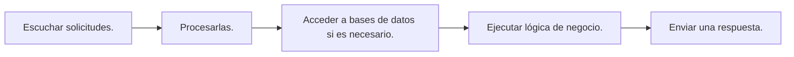
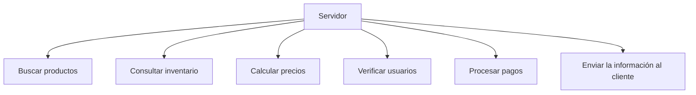
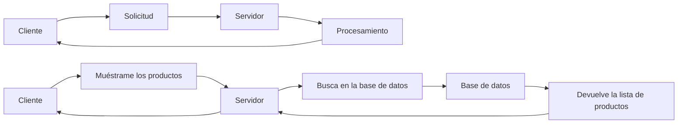
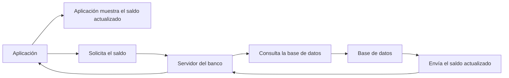

# Modelo Cliente-Servidor

El Modelo Cliente-Servidor es uno de los conceptos más importantes del desarrollo de software. La mayoría de las aplicaciones que usamos a diario, funcionan siguiendo este modelo.

### ¿Qué es el Modelo Cliente-Servidor?

El Modelo Cliente-Servidor es una arquitectura de comunicación donde dos tipos de programas tienen responsabilidades diferentes:

+ **Cliente:** solicita un servicio o información.
+ **Servidor:** recibe la solicitud, la procesa y envía una respuesta.

El cliente hace una petición y el servidor responde.

### ¿Qué es un Cliente?

Un cliente es un programa o dispositivo que solicita un recurso o servicio.

Puede ser:

+ Un navegador web.
+ Una aplicación móvil.
+ Un videojuego.
+ Un programa de escritorio.
+ Un servicio que consume una API.

### ¿Qué es un Servidor?

Un servidor es un programa (y normalmente también un computador donde ese programa se ejecuta) encargado de atender solicitudes de múltiples clientes.



Por ejemplo:

Cuando visitas una tienda en línea:

el servidor puede:



### Comunicación Cliente-Servidor

El flujo básico es muy sencillo:


Ejemplo: Una aplicación bancaria

Cuando consultas tu saldo:



Toda la información importante permanece en el servidor.

### Responsabilidades del Cliente

**Generalmente, "el cliente" se encarga de:**

+ Mostrar la interfaz gráfica.
+ Recibir la interacción del usuario.
+ Enviar solicitudes.
+ Mostrar respuestas.
+ Validar algunos datos sencillos (por ejemplo, que un correo tenga un formato válido).

**No suele:**
+ encargarse de almacenar información crítica
+ Aplicar reglas de negocio importantes → esto sería inseguro

### Responsabilidades del Servidor

**El servidor normalmente se encarga de:**

+ Procesar solicitudes.
+ Aplicar reglas de negocio.
+ Autenticar usuarios.
+ Autorizar acciones.
+ Acceder a bases de datos.
+ Generar respuestas.
+ Registrar eventos y errores.

Es la parte del sistema que concentra la lógica principal y protege los datos sensibles.

### Un servidor atiende muchos clientes

+ Un servidor no trabaja para un único usuario.
+ Puede atender cientos, miles o incluso millones de clientes al mismo tiempo.

```
Cliente A ──┐
            │
Cliente B ──├────► Servidor
            │
Cliente C ──┘
```
Por ejemplo:

_Un servidor de YouTube puede atender millones de reproducciones de video de forma simultánea._

### Un cliente puede comunicarse con varios servidores

De igual forma, un cliente no está limitado a un solo servidor.

Cuando abres una página web moderna, tu navegador puede contactar con varios servidores al mismo tiempo:

```
Navegador

├── Servidor de la página
├── Servidor de imágenes
├── Servidor de anuncios
├── Servidor de autenticación
└── Servidor de análisis
```

_Todo esto ocurre en segundo plano y el usuario normalmente no lo percibe._

### Desventajas del Modelo Cliente-Servidor

+ Si el servidor deja de funcionar, los clientes pueden quedarse sin servicio.
+ Un servidor muy cargado puede responder lentamente.
+ Requiere una conexión de red para la mayoría de las operaciones.
+ Es necesario implementar medidas de seguridad para proteger el servidor y la información.

