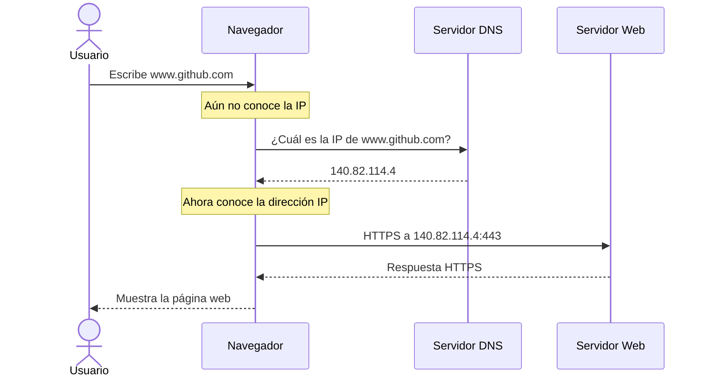
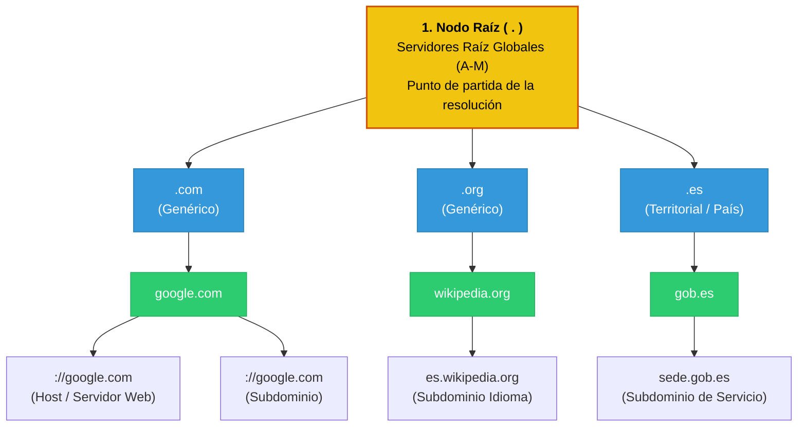
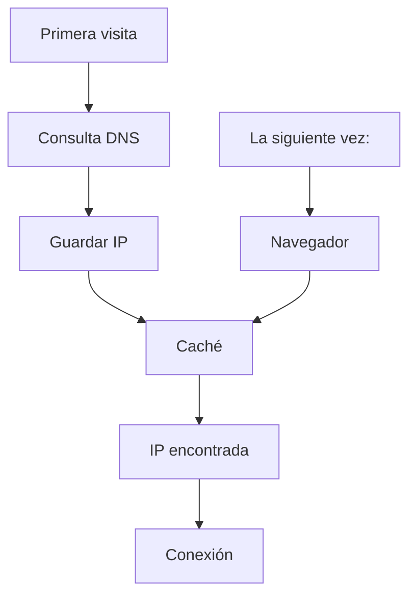

# DNS (Domain Name System)

**Cómo sabe mi navegador cuál es la dirección IP de por ejemplo**

www.google.com

www.youtube.com

Aquí es donde entra el DNS (Domain Name System).

### ¿Qué es el DNS?

El Domain Name System (DNS) es un sistema distribuido que traduce nombres de dominio fáciles de recordar en direcciones IP que los computadores pueden utilizar.

+ El DNS funciona como la "agenda telefónica" o el "directorio" de Internet.

Ejemplo:

| Nombre de dominio | Dirección IP (ejemplo)    |
| ----------------- | ------------------------- |
| `www.google.com`  | 142.250.190.78            |
| `www.github.com`  | 140.82.114.4              |
| `www.openai.com`  | 104.18.x.x (puede variar) |

Los usuarios recuerdan nombres; los routers y servidores trabajan con direcciones IP.

### ¿Por qué existe el DNS?

Imagina que cada persona del mundo solo pudiera ser contactada por su número de teléfono.

1. Sería muy difícil recordar miles de números.
2. Por eso usamos una agenda de contactos.
3. El DNS hace exactamente lo mismo con Internet.

```
Nombre ←→ IP ←→ Conexión
```

### ¿Qué es un nombre de dominio?

Un nombre de dominio es el nombre legible que identifica un sitio o servicio en Internet.

+ google.com
+ youtube.com
+ github.com
+ wikipedia.org

Estos nombres existen para facilitar el acceso a los recursos sin necesidad de memorizar direcciones IP.

### ¿Qué ocurre cuando escribes una URL?

Supongamos que escribes:

https://www.google.com

+ El navegador no se puede conectar directamente al servidor → Antes necesita conocer su dirección IP.

El proceso es el siguiente:

```
→ Usuario Escribe www.google.com 
    → Navegador Consulta DNS 
        → Obtiene IP 
            → Conexión al servidor 
                → Página Web
```
El **DNS** es el paso intermedio entre el nombre de `dominio` y la `dirección IP`.

### ¿Dónde está el DNS?

No existe un único servidor DNS.

Es un sistema distribuido formado por miles de servidores repartidos por todo el mundo.

Esto ofrece varias ventajas:

+ Alta disponibilidad.
+ Rapidez.
+ Tolerancia a fallos.
+ Escalabilidad.

Si un servidor DNS deja de funcionar, normalmente otro puede responder la consulta.

### ¿Quién proporciona el DNS?

Existen muchos proveedores de DNS.

Algunos ejemplos conocidos son:

| Proveedor     | DNS Principal  |
| ------------- | -------------- |
| Google        | 8.8.8.8        |
| Cloudflare    | 1.1.1.1        |
| Cisco OpenDNS | 208.67.222.222 |

_Tu Proveedor de Servicios de Internet (`ISP`) suele asignarte automáticamente un servidor `DNS`._

### ¿Cómo funciona una consulta DNS?

**Proceso paso a paso.**



### El DNS solo traduce nombres

+ Es importante entender que el DNS no transporta la página web.
    + Una vez obtenida la IP, el DNS deja de intervenir.
        + Después, la comunicación continúa utilizando otros protocolos, como `HTTP` o `HTTPS`.

### Resolución de nombres

Cuando escribes:

+ www.poli.edu.co

ocurre un proceso parecido a este:

```
Usuario
    │
    ▼
DNS Local
    │
    ▼
DNS Raíz
    │
    ▼
Servidor DNS del dominio
    │
    ▼
Dirección IP
```
Finalmente el navegador obtiene la IP correspondiente y puede conectarse al servidor web.

### Servidor DNS autoritativo

+ Significa que el servidor consultado es el responsable oficial de ese dominio.

    + www.poli.edu.co

+ El servidor encargado de administrar ese dominio responde directamente con la IP correcta.

+ _Esa respuesta es autoritativa._

### Respuesta no autoritativa

+ Muchas veces un servidor DNS ya conoce la respuesta porque alguien la consultó anteriormente.
+ Entonces simplemente responde desde su memoria (caché).
+ No necesita volver a preguntar.
+ _Eso se denomina respuesta no autoritativa._

### Estructura de la Jerarquía DNS

La jerarquía del DNS (Sistema de Nombres de Dominio) está organizada como un árbol invertido, donde la cúspide representa el nivel más general y las ramas inferiores se vuelven más específicas

+ **Dominio Raíz (Root):** 
    + Se ubica en la cima de la jerarquía y se representa formalmente con un punto (`.`) al final de un nombre de dominio.
    + Existen 13 servidores raíz distribuidos en todo el mundo que dirigen las consultas hacia los niveles siguientes

+ **Dominios de Nivel Superior** (_TLD - Top-Level Domain_): 
    + Es el segundo nivel del árbol, que incluye extensiones genéricas como `.com`, `.org`, `.net`
    + o geográficas como `.es` (_España_) y `.co` (_Colombia_)

+ **Dominios de Segundo Nivel** (_SLD - Second-Level Domain_):
    + Es el nombre propiamente registrado de una organización o sitio web,
        + `google` en `google`.com

+ **Subdominios y Hosts**:
    + Representan las ramificaciones más específicas, como `www` o `mail` dentro de un dominio principal
        + `://ejemplo.com`



### Caché DNS

Una caché es una memoria temporal donde se guardan respuestas recientes.

+ Imagínate que visitas Google diez veces en cinco minutos.
    + ¿El navegador preguntará al DNS diez veces?



Así se evita repetir la misma consulta constantemente, lo que mejora el rendimiento.

### ¿Por qué puede cambiar una IP?

Una misma página web puede cambiar de dirección IP por varias razones:

+ Migración a nuevos servidores.
+ Balanceo de carga.
+ Escalabilidad.
+ Mantenimiento.
+ Distribución geográfica.

### Un dominio puede tener varias IP

Un sitio web grande rara vez depende de un solo servidor.

```
                 ┌── 142.250.190.78
                 │
    google.com ——│—— 142.250.190.79
                 │
                 └—— 142.250.190.80
```

_Cuando un cliente realiza una consulta DNS, puede recibir una de varias direcciones IP disponibles._

Esto permite:

+ Distribuir el tráfico entre varios servidores (balanceo de carga).
+ Mejorar el rendimiento.
+ Aumentar la disponibilidad si alguno de los servidores falla.

### DNS utiliza UDP

DNS utiliza principalmente **UDP** para realizar las consultas.
+ _¿Por qué?_
    + Porque una consulta DNS normalmente es muy pequeña.

+ _¿Cuál es la **IP** de www.google.com?_
    + La respuesta también es pequeña.

+ No es necesario establecer una conexión **TCP** para algo tan corto.
+ Por eso **UDP** resulta más rápido.    

### Modelos de comunicación

Una aplicación puede organizar la comunicación entre equipos de distintas formas.

### 1. Cliente-Servidor

Es el modelo más común.

```Cliente  ─────────► Servidor```

+ El cliente hace solicitudes.
    + El servidor responde.
        + El servidor debe permanecer disponible todo el tiempo.

Ejemplos:

+ Navegador → servidor web.
+ Cliente de correo → servidor de correo.

### 2. Peer to Peer (P2P)

+ Aquí no existe un servidor principal.
+ Todos los equipos tienen el mismo nivel.
+ Cada uno puede actuar como cliente y servidor.

```
A ◄────► B
▲        │
│        ▼
D ◄────► C
```

### 3. Modelo híbrido

Es una combinación de los dos anteriores.
+ Primero se consulta un servidor central para localizar la información.
    + Después, la transferencia de datos ocurre directamente entre los equipos.


### Relación entre DNS, IP y Cliente-Servidor

Cada componente cumple una función específica:

| Componente   | Función                                                                           |
| ------------ | --------------------------------------------------------------------------------- |
| DNS          | Traduce el nombre del dominio a una dirección IP.                                 |
| Dirección IP | Identifica el servidor en la red.                                                 |
| Puerto       | Identifica el servicio dentro del servidor (por ejemplo, HTTPS en el puerto 443). |
| Cliente      | Envía la solicitud.                                                               |
| Servidor     | Procesa la solicitud y envía la respuesta.                                        |

### ¿Qué pasa si el DNS falla?

+ Si el DNS no puede resolver un nombre de dominio:
+ El navegador no sabe a qué servidor conectarse, aunque el servidor esté funcionando correctamente.
+ Por eso, errores como:
    + "DNS_PROBE_FINISHED_NXDOMAIN"
    + "No se puede resolver el nombre del host"
+ normalmente indican un problema relacionado con la resolución DNS, no necesariamente con el servidor web.

## Protocolos abiertos y propietarios

### Protocolos abiertos

Son públicos.

Cualquier persona puede implementarlos.

+ HTTP
+ DNS
+ SMTP

Sus especificaciones son públicas.

### Protocolos propietarios

+ Son creados por empresas.
+ No siempre publican cómo funcionan internamente.
+ Ejemplos los protocolos utilizados por aplicaciones como **Messenger** o **Skype**.

### Protocolos multimedia

Para aplicaciones multimedia (como telefonía IP), el documento indica que pueden utilizarse protocolos como:

+ SIP
+ H.323

Y que, en muchos casos, emplean RTP (Real Time Protocol) como protocolo de transporte en lugar de TCP o UDP directamente.

### ¿Es posible crear un protocolo propio?

Es posible desarrollar un protocolo de aplicación utilizando lenguajes como:

+ Java
+ C
+ C++
+ .NET

**La decisión más importante es elegir el protocolo de transporte:**

+ **TCP**, si se necesita _confiabilidad_.
+ **UDP**, si se prioriza la _rapidez_ y se tolera cierta pérdida de paquetes

### Ideas clave

+ El DNS (Domain Name System) traduce nombres de dominio en direcciones IP.
+ Permite que las personas utilicen nombres fáciles de recordar en lugar de memorizar direcciones IP.
+ Antes de conectarse a un servidor, el cliente realiza una consulta DNS para obtener la IP correspondiente.
El DNS es un sistema distribuido, compuesto por miles de servidores en todo el mundo, lo que mejora su disponibilidad y escalabilidad.
+ Las respuestas DNS suelen almacenarse temporalmente en una caché, reduciendo el tiempo de futuras consultas.
+ Un mismo dominio puede apuntar a una o varias direcciones IP, y estas pueden cambiar con el tiempo sin que el usuario tenga que hacer nada.

## ¿Qué es un socket?

Un socket es el mecanismo que utiliza un programa para comunicarse con otro programa a través de una red.

Cuando una aplicación quiere enviar o recibir datos, utiliza un socket.

### Socket TCP

**1. Establece una conexión**

Antes de enviar datos se realiza un proceso de conexión (_handshake_).

```
Cliente ───► Solicitud
Servidor ◄── Aceptación
```

**2. Flujo continuo de datos**

Una vez creada la conexión, el programador trabaja con un flujo continuo (_stream_) para leer o escribir datos.

**3. Entrega garantizada**

_TCP_ se encarga de que toda la información llegue correctamente al destino.

### Socket UDP

+ _UDP_ funciona de manera diferente.
+ No existe conexión previa
+ Cada paquete se envía directamente.

**Envía datagramas**
+ No maneja un flujo continuo como TCP.

**Best Effort**
+ El documento utiliza el término **"best effort"** (_"mejor esfuerzo"_).
    + _UDP intenta entregar los paquetes, pero no garantiza que lleguen._

+ Es responsabilidad de la aplicación decidir si necesita volver a enviarlos o puede continuar sin ellos.

### Comparación TCP vs UDP

| Característica         | TCP                     | UDP                                                                                            |
| ---------------------- | ----------------------- | ---------------------------------------------------------------------------------------------- |
| ¿Hay conexión previa?  | Sí                      | No                                                                                             |
| ¿Garantiza la entrega? | Sí                      | No                                                                                             |
| Tipo de comunicación   | Flujo continuo (stream) | Datagramas independientes                                                                      |
| Velocidad              | Menor                   | Mayor                                                                                          |
| Confiabilidad          | Alta                    | Basada en "mejor esfuerzo"                                                                     |
| Uso típico             | Web, correo, archivos   | DNS, streaming, videojuegos, VoIP (según el documento, algunos protocolos multimedia usan RTP) |