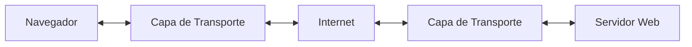
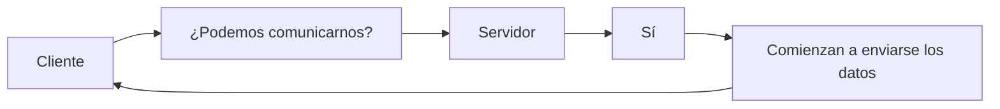

# Protocolos de la Capa de Transporte

Una vez que el cliente ya conoce la IP y el puerto del servidor, ¿cómo se envían realmente los datos?

+ La respuesta está en los protocolos de la capa de transporte, principalmente **TCP y UDP**.

La capa de transporte es la encargada de establecer la comunicación entre dos aplicaciones que se encuentran en dispositivos diferentes.

Su trabajo consiste en transportar los datos desde la aplicación del cliente hasta la aplicación del servidor (y viceversa).



+ **Dirección IP:** indica el dispositivo 
+ **Puerto:** indica a qué aplicación
+ **Capa de transporte:** define cómo viajan los datos

### Es importante distinguir dos niveles:

+ **IP** entrega un paquete al equipo (`host`) _**˟correcto˟**_.
+ **TCP** o **UDP** entregan ese paquete al programa (`proceso`) _**˟correcto˟**_ dentro del equipo.

```
Internet
      │
      ▼
Computador
      │
 ┌────┴────┐
 │ Navegador │
 │ Correo    │
 │ Spotify   │
 └───────────┘
```

+ Si llegan datos desde Internet, la capa de transporte decide a cuál de esos programas deben entregarse. 
+ Para ello utiliza los números de puerto.

## Multiplexación y Demultiplexación

Estos son dos conceptos fundamentales de la capa de transporte.

### Multiplexación

Consiste en tomar datos de varios procesos y enviarlos por un mismo canal de comunicación.

```
Navegador ─┐
Correo ────┼──► TCP/UDP ─► Internet
Spotify ───┘
```

La capa de transporte combina todos esos datos y añade la información necesaria (como los puertos) para diferenciarlos

### Demultiplexación

Es el proceso contrario.

Cuando llegan datos desde Internet, la capa de transporte determina a qué **aplicación pertenecen**.

```
Internet
     │
     ▼
 TCP/UDP
     │
 ┌───┼────────┐
 ▼   ▼        ▼
Web Correo Spotify
```

Esto permite que varios programas utilicen la red al mismo tiempo sin confundirse.

### Responsabilidades de la capa de transporte

Entre sus principales funciones se encuentran:

+ Transportar datos entre aplicaciones.
+ Dividir la información en segmentos.
+ Detectar pérdidas de datos.
+ Reenviar información cuando sea necesario.
+ Mantener el orden de los datos (cuando corresponde).
+ Controlar la velocidad de transmisión.
+ Identificar los puertos de origen y destino.

No todos los protocolos realizan todas estas tareas. Depende del protocolo utilizado.

### Los dos protocolos principales

En Internet existen muchos protocolos de transporte, pero prácticamente todas las aplicaciones utilizan uno de estos dos:

+ **TCP** _(Transmission Control Protocol)_
+ **UDP** _(User Datagram Protocol)_

| TCP                             | UDP                      |
| ------------------------------- | ------------------------ |
| Prioriza la confiabilidad.      | Prioriza la velocidad.   |
| Garantiza la entrega.           | No garantiza la entrega. |
| Verifica el orden de los datos. | No verifica el orden.    |
| Es más lento.                   | Es más rápido.           |

### ¿Por qué existen dos protocolos?

Porque no todas las aplicaciones tienen las mismas necesidades.

Por ejemplo:

Si estás descargando un archivo de instalación, no puedes permitir que falten partes del archivo.

En cambio, si estás realizando una videollamada, perder uno o dos paquetes suele ser preferible a detener la comunicación para recuperarlos.

Por eso existen dos enfoques diferentes.

## TCP (Transmission Control Protocol)

TCP es un protocolo orientado a la confiabilidad.

Su objetivo es garantizar que los datos lleguen:

+ completos
+ en el orden correcto
+ sin duplicados

Piensa en TCP como un servicio de mensajería certificada: el remitente quiere asegurarse de que cada paquete llegue correctamente.

### ¿Cómo funciona TCP?

Antes de enviar datos, TCP establece una conexión entre cliente y servidor.



Esta fase inicial permite que ambos extremos preparen la comunicación.

### Confirmación de recepción (ACK)

+ Una característica importante de TCP es que el receptor confirma la recepción de los datos.
+ Cada confirmación se conoce como ACK (Acknowledgment).

    + _El número de ACK indica el próximo byte que el receptor espera recibir, no el último byte recibido._

Ejemplo:

+ El emisor envía los bytes del 1 al 100.
+ El receptor responde con:
    + `ACK = 101`
+ Eso significa:
    + _"He recibido correctamente los bytes hasta el 100 y ahora espero el 101"._ 

### ¿Qué ocurre si un paquete se pierde?

+ Supongamos que el cliente envía tres paquetes.

```
Paquete 1 ✔

Paquete 2 ❌

Paquete 3 ✔
```

+ El servidor detecta que falta el paquete 2.
+ Entonces el cliente lo vuelve a enviar.
+ Esto garantiza que la información llegue completa.

### ¿Qué ocurre si se pierde un ACK?

También puede perderse el mensaje de confirmación.

En ese caso:

1. El emisor espera un tiempo (_timeout_).
2. Si no recibe el `ACK`, retransmite el paquete.
3. El receptor detecta que es un duplicado gracias al número de secuencia y lo descarta, reenviando la confirmación.

Así **TCP** mantiene la confiabilidad sin entregar datos duplicados a la aplicación.

### Orden correcto

TCP también garantiza el orden.

Aunque los paquetes viajen por rutas diferentes y lleguen así:

+ 3 → 2 → 1

TCP los reorganiza:

+ 1 → 2 → 3

La aplicación recibe la información exactamente en el orden original.

### Control de flujo

+ Imagina que un servidor puede procesar 100 paquetes por segundo.
+ Si un cliente envía 5.000 paquetes por segundo, el servidor podría saturarse.
+ **TCP** incorpora mecanismos para regular la velocidad de envío, evitando que el receptor reciba más información de la que puede procesar.

### ¿Por qué TCP necesita números de secuencia?

Internet no garantiza que los paquetes lleguen:

+ en orden
+ una sola vez
+ o siquiera que lleguen.

Por ello TCP asigna un número de secuencia a los datos enviados.

```
Paquete 1 → Seq = 100
Paquete 2 → Seq = 200
Paquete 3 → Seq = 300
```

Si el receptor recibe los paquetes en otro orden, puede reorganizarlos correctamente usando esos números.

### Handshake de TCP (Three-Way Handshake)

Antes de transmitir datos, TCP establece una conexión mediante tres pasos.

```
Cliente                 Servidor

SYN  ───────────────►

      ◄──────── SYN + ACK

ACK  ───────────────►
```

Durante este proceso:

+ ambos extremos generan un número de secuencia inicial aleatorio
+ sincronizan esos números
+ la conexión queda lista para transmitir datos.

La aleatoriedad dificulta que un atacante adivine los números de secuencia y manipule la comunicación.

### Ventana TCP (Window)

+ Esperar la confirmación de cada paquete antes de enviar el siguiente sería muy ineficiente.

+ TCP utiliza una ventana para permitir que haya varios paquetes "en vuelo" al mismo tiempo.

+ Existen dos ventanas:

**Ventana de envío**
+ Contiene los bytes enviados que aún no han sido confirmados.

**Ventana de recepción**
+ Indica cuántos datos puede recibir el receptor sin saturarse.

Esto permite implementar el control de flujo, evitando enviar más datos de los que el receptor puede procesar.

## Métodos de retransmisión

### Selective Repeat

+ Si un paquete se pierde:
    + solo se retransmite ese paquete.

**Ventajas:**
+ más eficiente
+ menos tráfico innecesario.

El receptor confirma individualmente cada paquete.

### Go-Back-N

Si un paquete se pierde:
+ el emisor retransmite ese paquete y todos los siguientes enviados después de él.

_Aunque es más simple de implementar, puede generar retransmisiones innecesarias._

**Ventajas de TCP**

+ Alta confiabilidad.
+ Entrega garantizada.
+ Mantiene el orden.
+ Reenvía datos perdidos.
+ Detecta errores de transmisión.

**Desventajas de TCP**

+ Mayor consumo de recursos.
+ Mayor latencia.
+ Más lento debido a las confirmaciones y retransmisiones.

### TCP según la RFC 793

TCP proporciona una comunicación confiable entre procesos y organiza su funcionamiento en varias áreas principales:

+ transferencia de datos
+ fiabilidad
+ control de flujo
+ multiplexación
+ manejo de conexiones
+ prioridad y seguridad.

### Transferencia de datos y la función PSH

**TCP** puede almacenar temporalmente datos en un `búfer` antes de enviarlos.

Cuando una aplicación necesita que los datos salgan inmediatamente, puede utilizar la función **PSH** (_Push_), que solicita al módulo **TCP** transmitir el contenido del `búfer` sin esperar más datos.

### Fiabilidad

La confiabilidad de **TCP** se basa en varios mecanismos que trabajan juntos:

+ números de secuencia
+ ACK
+ retransmisiones cuando expira el tiempo de espera
+ checksum para detectar corrupción
+ eliminación de duplicados
+ reordenamiento de segmentos.

Gracias a ellos TCP puede recuperar información perdida o desordenada durante la transmisión.

### Multiplexación mediante sockets

Cada conexión TCP se identifica mediante una combinación de cuatro datos:

```java
(IP origen,
 Puerto origen,
 IP destino,
 Puerto destino)
```

Esta combinación, conocida como una **tupla de cuatro elementos**, permite que un mismo servidor atienda simultáneamente múltiples clientes sin confundir sus conexiones.

### Indicadores (Flags) de TCP

Existen varios bits de control presentes en la cabecera **TCP**:

+ **SYN**: inicia la conexión.
+ **ACK**: confirma la recepción de datos.
+ **FIN**: solicita finalizar la conexión.
+ **PSH**: pide enviar inmediatamente los datos del búfer.
+ **URG**: indica que existen datos urgentes.
+ **RST**: reinicia o aborta una conexión cuando ocurre un error.

Estos indicadores permiten controlar el ciclo de vida de una conexión TCP.

### Verificación de números de secuencia

El receptor solo acepta segmentos cuyos números de secuencia se encuentren dentro de su **ventana de recepción**.

Esto evita aceptar datos:

+ duplicados
+ demasiado antiguos
+ fuera del rango esperado.

Si la ventana de recepción tiene tamaño cero, solo deben aceptarse segmentos de confirmación (`ACK`), mientras que los datos normales deberán esperar hasta que la ventana vuelva a abrirse.

## UDP (User Datagram Protocol)

+ UDP sigue una filosofía completamente distinta.
+ Su objetivo es enviar los datos lo más rápido posible.
+ No establece una conexión previa ni espera confirmaciones.

### ¿Cómo funciona UDP?

+ El cliente simplemente envía los datos.
+ No pregunta si el servidor está listo ni espera un mensaje de _"recibido"_.

+ **UDP** es un protocolo **no orientado a conexión**.
+ Eso significa que **no necesita establecer una conexión antes de enviar datos**.
+ Envía el datagrama y continúa.

Su funcionamiento es simple:

`Emisor ─────────► Receptor`

### ¿Qué ocurre si un paquete se pierde?

+ Simplemente se pierde.
+ El protocolo **UDP** no solicita el reenvío del paquete perdido.

### ¿Y si llegan desordenados?

+ **UDP** tampoco reorganiza los paquetes.
+ La aplicación los recibe exactamente así.
+ Si el orden es importante, será responsabilidad de la propia aplicación resolverlo.

### ¿Por qué usar UDP?

Porque hay aplicaciones donde la velocidad es mucho más importante que la perfección.

+ Durante una videollamada, si se pierde un fotograma, normalmente el usuario apenas lo nota.
+ Esperar a recuperarlo produciría pausas o congelamientos mucho más molestos.

**Características**
+ No garantiza la entrega.
+ No garantiza el orden.
+ No retransmite paquetes perdidos.
+ Es muy rápido.
+ Usa números de puerto para entregar los datos al proceso correcto.

### Comparación TCP vs UDP

| Característica            | TCP   | UDP   |
| ------------------------- | ----- | ----- |
| Establece conexión        | Sí    | No    |
| Garantiza la entrega      | Sí    | No    |
| Reenvía paquetes perdidos | Sí    | No    |
| Mantiene el orden         | Sí    | No    |
| Confirma recepción        | Sí    | No    |
| Velocidad                 | Menor | Mayor |
| Consumo de recursos       | Mayor | Menor |

### ¿Cuándo se utiliza TCP?

TCP es ideal cuando perder información no es aceptable.

+ Navegación web (HTTP/HTTPS).
+ Descarga de archivos.
+ Correo electrónico.
+ Transferencia de archivos (FTP).
+ Bases de datos.
+ APIs REST.
+ Banca en línea.

En todos estos casos, un solo dato perdido puede causar errores.

### ¿Cuándo se utiliza UDP?

UDP es ideal cuando la velocidad es más importante que la entrega perfecta.

+ Videollamadas.
+ Llamadas por Internet (VoIP).
+ Streaming en tiempo real.
+ Videojuegos multijugador.
+ Consultas DNS.

En estos escenarios, una pequeña pérdida ocasional suele ser preferible a introducir retrasos.

### ¿Qué protocolo usa una página web?

Cuando visitas una página mediante HTTP o HTTPS, el protocolo de aplicación se apoya tradicionalmente en TCP.

Esto garantiza que el HTML, las imágenes, las hojas de estilo y el resto de los recursos lleguen completos y en el orden correcto.

> Las versiones modernas basadas en HTTP/3 utilizan UDP como transporte mediante el protocolo QUIC, incorporando mecanismos propios para ofrecer confiabilidad y reducir la latencia. Esto muestra que el protocolo de aplicación puede implementar funciones adicionales sobre el protocolo de transporte cuando es necesario.

### Ideas Clave 

Los conceptos más importantes son:

+ **La capa de transporte** se encarga de mover datos entre aplicaciones que se ejecutan en dispositivos diferentes.
+ Los dos protocolos de transporte más utilizados son **TCP** y **UDP**.
+ **TCP** prioriza la confiabilidad: establece una conexión, confirma la recepción, reenvía paquetes perdidos y mantiene el orden de los datos.
+ **UDP** prioriza la velocidad: envía los datos sin establecer conexión ni esperar confirmaciones, lo que reduce la latencia.
+ La elección entre **TCP** y **UDP** depende de las necesidades de la aplicación: integridad de los datos frente a rapidez en la comunicación.