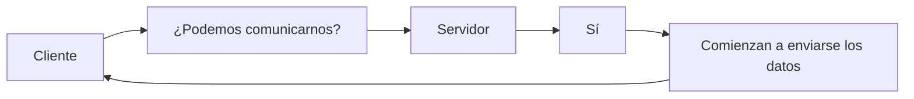

# Protocolos de la Capa de Transporte

Una vez que el cliente ya conoce la IP y el puerto del servidor, ¿cómo se envían realmente los datos?

+ La respuesta está en los protocolos de la capa de transporte, principalmente **TCP y UDP**.

La capa de transporte es la encargada de establecer la comunicación entre dos aplicaciones que se encuentran en dispositivos diferentes.

Su trabajo consiste en transportar los datos desde la aplicación del cliente hasta la aplicación del servidor (y viceversa).


+ **Dirección IP:** indica el dispositivo 
+ **Puerto:** indica a qué aplicación
+ **Capa de transporte:** define cómo viajan los datos

### Responsabilidades de la capa de transporte

Entre sus principales funciones se encuentran:

+ Transportar datos entre aplicaciones.
+ Dividir la información en segmentos.
+ Detectar pérdidas de datos.
+ Reenviar información cuando sea necesario.
+ Mantener el orden de los datos (cuando corresponde).
+ Controlar la velocidad de transmisión.
+ Identificar los puertos de origen y destino.

No todos los protocolos realizan todas estas tareas. Depende del protocolo utilizado.

### Los dos protocolos principales

En Internet existen muchos protocolos de transporte, pero prácticamente todas las aplicaciones utilizan uno de estos dos:

+ **TCP** _(Transmission Control Protocol)_
+ **UDP** _(User Datagram Protocol)_

| TCP                             | UDP                      |
| ------------------------------- | ------------------------ |
| Prioriza la confiabilidad.      | Prioriza la velocidad.   |
| Garantiza la entrega.           | No garantiza la entrega. |
| Verifica el orden de los datos. | No verifica el orden.    |
| Es más lento.                   | Es más rápido.           |

### ¿Por qué existen dos protocolos?

Porque no todas las aplicaciones tienen las mismas necesidades.

Por ejemplo:

Si estás descargando un archivo de instalación, no puedes permitir que falten partes del archivo.

En cambio, si estás realizando una videollamada, perder uno o dos paquetes suele ser preferible a detener la comunicación para recuperarlos.

Por eso existen dos enfoques diferentes.

## TCP (Transmission Control Protocol)

TCP es un protocolo orientado a la confiabilidad.

Su objetivo es garantizar que los datos lleguen:

+ completos
+ en el orden correcto
+ sin duplicados

Piensa en TCP como un servicio de mensajería certificada: el remitente quiere asegurarse de que cada paquete llegue correctamente.

### ¿Cómo funciona TCP?

Antes de enviar datos, TCP establece una conexión entre cliente y servidor.



Esta fase inicial permite que ambos extremos preparen la comunicación.

### Confirmación de recepción (ACK)

+ Una característica importante de TCP es que el receptor confirma la recepción de los datos.
+ Cada confirmación se conoce como ACK (Acknowledgment).

### ¿Qué ocurre si un paquete se pierde?

+ Supongamos que el cliente envía tres paquetes.

```
Paquete 1 ✔

Paquete 2 ❌

Paquete 3 ✔
```

+ El servidor detecta que falta el paquete 2.
+ Entonces el cliente lo vuelve a enviar.
+ Esto garantiza que la información llegue completa.

### Orden correcto

TCP también garantiza el orden.

Aunque los paquetes viajen por rutas diferentes y lleguen así:

+ 3 → 2 → 1

TCP los reorganiza:

+ 1 → 2 → 3

La aplicación recibe la información exactamente en el orden original.

### Control de flujo

+ Imagina que un servidor puede procesar 100 paquetes por segundo.
+ Si un cliente envía 5.000 paquetes por segundo, el servidor podría saturarse.
+ **TCP** incorpora mecanismos para regular la velocidad de envío, evitando que el receptor reciba más información de la que puede procesar.

**Ventajas de TCP**

+ Alta confiabilidad.
+ Entrega garantizada.
+ Mantiene el orden.
+ Reenvía datos perdidos.
+ Detecta errores de transmisión.

**Desventajas de TCP**

+ Mayor consumo de recursos.
+ Mayor latencia.
+ Más lento debido a las confirmaciones y retransmisiones.

## UDP (User Datagram Protocol)

+ UDP sigue una filosofía completamente distinta.
+ Su objetivo es enviar los datos lo más rápido posible.
+ No establece una conexión previa ni espera confirmaciones.

### ¿Cómo funciona UDP?

+ El cliente simplemente envía los datos.
+ No pregunta si el servidor está listo ni espera un mensaje de _"recibido"_.

### ¿Qué ocurre si un paquete se pierde?

+ Simplemente se pierde.
+ El protocolo **UDP** no solicita el reenvío del paquete perdido.

### ¿Y si llegan desordenados?

+ **UDP** tampoco reorganiza los paquetes.
+ La aplicación los recibe exactamente así.
+ Si el orden es importante, será responsabilidad de la propia aplicación resolverlo.

### ¿Por qué usar UDP?

Porque hay aplicaciones donde la velocidad es mucho más importante que la perfección.

+ Durante una videollamada, si se pierde un fotograma, normalmente el usuario apenas lo nota.
+ Esperar a recuperarlo produciría pausas o congelamientos mucho más molestos.

### Comparación TCP vs UDP

| Característica            | TCP   | UDP   |
| ------------------------- | ----- | ----- |
| Establece conexión        | Sí    | No    |
| Garantiza la entrega      | Sí    | No    |
| Reenvía paquetes perdidos | Sí    | No    |
| Mantiene el orden         | Sí    | No    |
| Confirma recepción        | Sí    | No    |
| Velocidad                 | Menor | Mayor |
| Consumo de recursos       | Mayor | Menor |

### ¿Cuándo se utiliza TCP?

TCP es ideal cuando perder información no es aceptable.

+ Navegación web (HTTP/HTTPS).
+ Descarga de archivos.
+ Correo electrónico.
+ Transferencia de archivos (FTP).
+ Bases de datos.
+ APIs REST.
+ Banca en línea.

En todos estos casos, un solo dato perdido puede causar errores.

### ¿Cuándo se utiliza UDP?

UDP es ideal cuando la velocidad es más importante que la entrega perfecta.

+ Videollamadas.
+ Llamadas por Internet (VoIP).
+ Streaming en tiempo real.
+ Videojuegos multijugador.
+ Consultas DNS.

En estos escenarios, una pequeña pérdida ocasional suele ser preferible a introducir retrasos.

### ¿Qué protocolo usa una página web?

Cuando visitas una página mediante HTTP o HTTPS, el protocolo de aplicación se apoya tradicionalmente en TCP.

Esto garantiza que el HTML, las imágenes, las hojas de estilo y el resto de los recursos lleguen completos y en el orden correcto.

> Las versiones modernas basadas en HTTP/3 utilizan UDP como transporte mediante el protocolo QUIC, incorporando mecanismos propios para ofrecer confiabilidad y reducir la latencia. Esto muestra que el protocolo de aplicación puede implementar funciones adicionales sobre el protocolo de transporte cuando es necesario.

### Ideas Clave 

Los conceptos más importantes son:

+ **La capa de transporte** se encarga de mover datos entre aplicaciones que se ejecutan en dispositivos diferentes.
+ Los dos protocolos de transporte más utilizados son **TCP** y **UDP**.
+ **TCP** prioriza la confiabilidad: establece una conexión, confirma la recepción, reenvía paquetes perdidos y mantiene el orden de los datos.
+ **UDP** prioriza la velocidad: envía los datos sin establecer conexión ni esperar confirmaciones, lo que reduce la latencia.
+ La elección entre **TCP** y **UDP** depende de las necesidades de la aplicación: integridad de los datos frente a rapidez en la comunicación.