# HTTP/HTTPS en Detalle

## ¿Qué es HTTP?

**HTTP** (_HyperText Transfer Protocol_) es el protocolo de aplicación que utilizan los navegadores y los servidores web para intercambiar información.

+ Mientras que **TCP** se encarga de transportar los datos de forma confiable
+ **HTTP** define qué datos se envían y cómo deben interpretarse.

| Protocolo | Responsabilidad                                   |
| --------- | ------------------------------------------------- |
| IP        | Encuentra el dispositivo.                         |
| TCP       | Transporta los datos de forma confiable.          |
| HTTP      | Define el contenido y formato de la comunicación. |

### ¿Dónde se encuentra HTTP?

```
Aplicación        ← HTTP
Transporte        ← TCP
Internet          ← IP
Acceso a Red      ← Ethernet / Wi-Fi
```

Cada protocolo utiliza los servicios de la capa inferior.

+ `HTTP` → `TCP` → `IP` → `Internet`

### ¿Cómo funciona HTTP?

**HTTP** sigue el modelo _Petición → Respuesta._

Cliente → Petición HTTP → Servidor → Respuesta HTTP → Cliente

+ El cliente siempre inicia la comunicación.
+ El servidor espera solicitudes y responde.

Ejemplo

**Escribes** → [https://www.ejemplo.com]

    ↓

**Navegador** → **HTTP** → "_Quiero la página principal_"

    ↓

**Servidor** → Devuelve `HTML`

    ↓

**Navegador** → muestra la página

### HTTP es un protocolo sin estado (Stateless)

+ Una característica muy importante de **HTTP** es que **cada petición es independiente de las anteriores**.
    + Esto significa que el servidor no recuerda automáticamente qué ocurrió en la petición anterior.
        + Para **HTTP** son dos solicitudes completamente independientes.

**¿Por qué es importante esto?**

1. Imagina que ingresas a una tienda en línea.
    + 2. Primero haces login.
        + 3. Después visitas:
            + productos
            + carrito
            + pagos

+ Si **HTTP** olvidara quién eres en cada petición, tendrías que iniciar sesión constantemente.

Por eso existen mecanismos adicionales como:

+ Cookies.
+ Tokens.
+ Sesiones.

Estos permiten que el servidor identifique al usuario entre distintas solicitudes.

### ¿Qué puede solicitar un cliente?

**HTTP** permite solicitar muchos recursos diferentes.

+ Páginas **HTML**.
+ Imágenes.
+ Videos.
+ Archivos **PDF**.
+ **APIs**.
+ Archivos **JSON**.
+ Documentos **CSS**.
+ Archivos **JavaScript**.

Todo ello mediante el mismo protocolo.

### Métodos HTTP

Una petición HTTP siempre indica qué acción **desea realizar el cliente**.

| Método | Significado            | Uso habitual                         |
| ------ | ---------------------- | ------------------------------------ |
| GET    | Obtener información    | Consultar recursos                   |
| POST   | Crear información      | Enviar formularios o crear registros |
| PUT    | Reemplazar información | Actualizar un recurso completo       |
| PATCH  | Modificar parcialmente | Actualizar parte de un recurso       |
| DELETE | Eliminar información   | Borrar recursos                      |

### GET

+ Solicita información.

+ `</>http`
    + _GET /productos_ → El servidor responde con la lista de productos.

### POST

+ Envía información al servidor.

+ `</>http`
    + _POST /usuarios_ → Se utiliza para crear un usuario nuevo..

### PUT

+ Actualiza completamente un recurso.

+ `</>http`
    + _PUT /usuarios/15_ → Reemplaza toda la información del usuario.

### PATCH

+ Actualiza únicamente algunos campos.

+ `</>http`
    + _PATCH /usuarios/15_ → Solo cambia, por ejemplo, el correo electrónico o el número de teléfono.

### DELETE

+ Solicita eliminar un recurso.

+ `</>http`
    + _DELETE /usuarios/15_

### Flujo completo de una petición
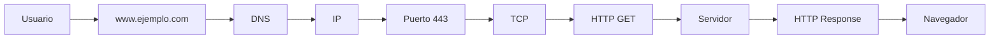
Observa cómo cada tecnología tiene una responsabilidad específica.

### HTTP utiliza texto

Una característica interesante es que **HTTP** (_especialmente HTTP/1.1_) es un protocolo basado en texto.

Una petición puede verse así:

```
GET /productos HTTP/1.1
Host: ejemplo.com
```

Y la respuesta:

```
HTTP/1.1 200 OK
Content-Type: text/html
```

Esto facilita enormemente su depuración y comprensión.

### Versiones de HTTP

A lo largo del tiempo, HTTP ha evolucionado.

**HTTP/1.1**

Durante muchos años fue la versión más utilizada.

+ Basado en texto.
+ Una petición tras otra sobre la misma conexión.
+ Muy sencillo de entender.

**HTTP/2**

Introduce mejoras importantes.

+ **Multiplexación** (varias solicitudes simultáneas sobre una misma conexión).
+ Compresión de encabezados.
+ Mayor rendimiento.

El funcionamiento para el desarrollador es prácticamente el mismo, pero es mucho más eficiente.

**HTTP/3**

Es la versión más moderna.

En lugar de utilizar **TCP**, emplea **QUIC**, que funciona sobre **UDP**.

Esto reduce la latencia y mejora el rendimiento, especialmente en conexiones inestables.

Para un desarrollador web, la diferencia suele ser transparente: el navegador y el servidor negocian automáticamente qué versión utilizar.

## ¿Qué es HTTPS?

**HTTPS** significa:

`HyperText Transfer Protocol Secure`

_No es un protocolo completamente distinto._

Es simplemente:

+ **HTTP** `+` **TLS** (_Seguridad_) = _**HTTPS**_

La principal diferencia es que **HTTPS** cifra la comunicación para proteger la información durante el tránsito por la red.

### ¿Por qué HTTPS es necesario?

Supongamos que envías una contraseña mediante **HTTP**.

+ Usuario → Contraseña → Internet

Cualquier atacante con acceso al tráfico podría leer esa información.

Con **HTTPS**:

+ Usuario → `Información cifrada` → Internet → Servidor

Aunque alguien intercepte los datos, no podrá entender su contenido sin las claves criptográficas adecuadas.

### ¿Qué protege HTTPS?

+ Contraseñas.
+ Tarjetas de crédito.
+ Información bancaria.
+ Cookies.
+ Tokens de autenticación.
+ Datos personales.
+ Información de APIs.

No solo cifra el contenido, sino que también ayuda a verificar que el cliente se está comunicando con el servidor correcto mediante `certificados digitales`.

### Ideas clave

+ **HTTP** es el protocolo de aplicación utilizado para la comunicación entre clientes y servidores web.
+ Funciona mediante un modelo de **petición → respuesta**.
+ Es un protocolo sin estado (_stateless_), por lo que cada petición es independiente.
+ Los métodos **HTTP** indican la acción que el cliente desea realizar (**GET, POST, PUT, PATCH y DELETE**).
+ **HTTPS** añade una capa de seguridad (_TLS_) sobre **HTTP**, proporcionando confidencialidad e integridad de los datos durante la comunicación.

## Estructura de una Petición HTTP 

Una petición HTTP (HTTP Request) es el mensaje que un cliente —por ejemplo, un navegador, una aplicación móvil o Postman— envía a un servidor para solicitar información o realizar alguna acción.

Una petición HTTP puede contener:

Línea de petición (Request Line)
Encabezados (Headers)
Línea en blanco
Cuerpo (Body) — opcional

```
┌──────────────────────────────────────┐
│ Línea de petición                    │
├──────────────────────────────────────┤
│ Headers                              │
│ Headers                              │
│ Headers                              │
├──────────────────────────────────────┤
│ Línea en blanco                      │
├──────────────────────────────────────┤
│ Body (opcional)                      │
└──────────────────────────────────────┘
```
### 1. Línea de petición

La primera línea indica principalmente:

+ Método HTTP
+ Recurso solicitado
+ Versión de HTTP

Por ejemplo:

```http
GET /productos HTTP/1.1
```

Podemos dividirla:

```http
GET       /productos       HTTP/1.1
│              │               │
│              │               └── Versión
│              └────────────────── Recurso
└───────────────────────────────── Método
```

**Método HTTP** 

El método indica qué quiere hacer el cliente.

Los más importantes son:

| Método   | Propósito                |
| -------- | ------------------------ |
| `GET`    | Obtener información      |
| `POST`   | Enviar/crear información |
| `PUT`    | Reemplazar un recurso    |
| `PATCH`  | Modificar parcialmente   |
| `DELETE` | Eliminar un recurso      |

```http
GET /productos HTTP/1.1
```

significa:

> "Quiero obtener el recurso /productos."

mientras:
```http
DELETE /productos/25 HTTP/1.1
```
> "Quiero eliminar el recurso /productos/25."

### 2. Recurso solicitado

Después del método aparece la ruta (path) del recurso.
```http
GET /usuarios/25 HTTP/1.1
```

La ruta es:
```http
/usuarios/25
```

Esto podría representar:
> El usuario cuyo identificador es 25.

**Ruta + parámetros**

Una petición también puede incluir parámetros en la URL.
```http
GET /productos?categoria=computadores&orden=precio HTTP/1.1
```

Aquí tenemos:
```
Ruta:
 /productos

Parámetros:
 categoria=computadores
 orden=precio
```
Estos parámetros reciben el nombre de **query parameters.**
> Son muy comunes al trabajar con APIs.

### 3. Versión HTTP

```http
HTTP/1.1
```

Esto indica la versión del protocolo utilizada para esa petición.

Históricamente encontramos:
+ HTTP/1.0 
+ HTTP/1.1
+ HTTP/2
+ HTTP/3

**En HTTP/1.1**
+ la petición se representa de forma textual

**HTTP/2 y HTTP/3**
+ utilizan representaciones binarias más eficientes

> cuando estudias la estructura de una petición, normalmente se utiliza HTTP/1.1 como ejemplo porque permite visualizar claramente sus componentes.

### 4. Headers

Después de la línea de petición vienen los _**headers (encabezados).**_

Los headers proporcionan información adicional sobre la petición.

```http
Host: ejemplo.com
User-Agent: Mozilla/5.0
Accept: text/html
Authorization: Bearer abc123
```

Cada header tiene esta estructura _**Nombre: Valor:**_

Ejemplo: Content-Type: application/json

```http
Nombre:
Content-Type

Valor:
application/json
```
**¿Para qué sirven los Headers?**

Los headers permiten comunicar información adicional entre cliente y servidor.

Pueden indicar:

+ ¿Qué tipo de contenido se solicita?
+ ¿Qué formato puede recibir el cliente?
+ ¿Qué tipo de datos se están enviando?
+ Información sobre autenticación
+ Información sobre caché
+ Cookies
+ Información del navegador
+ Información de compresión
+ Información relacionada con el idioma

### Headers importantes

### `Host`

Indica el dominio al que está dirigida la petición.

```http
Host: www.ejemplo.com
```

Es especialmente importante en HTTP/1.1 porque permite que un mismo servidor atienda múltiples dominios.

```
Servidor
   │
   ├── ejemplo.com
   ├── tienda.com
   └── api.com
```
> Todos podrían utilizar la misma dirección IP, pero el `Host` permite indicar cuál de esos sitios se está solicitando.

### `User-Agent`

Indica información sobre el cliente que realiza la petición.

```http
User-Agent: Mozilla/5.0
```

Puede proporcionar información sobre:

+ Navegador
+ Sistema operativo
+ Motor del navegador
+ Dispositivo

Por ejemplo, un servidor podría recibir una petición proveniente de Chrome en Windows o de Safari en un iPhone.

### `Accept`

Indica qué tipos de contenido puede procesar o prefiere recibir el cliente.

```http
Accept: text/html
```
> El cliente está indicando que acepta contenido HTML.

También puede aparecer:

```http
Accept: application/json
```
> Muy común cuando trabajamos con _**APIs.**_

### `Content-Type`

Indica qué tipo de contenido estamos enviando en el cuerpo de la petición.

```http
Content-Type: application/json
```

significa que el cuerpo contiene JSON:

```JSON
{
  "nombre": "Juan",
  "edad": 25
}
```

Otro caso:

```http
Authorization: Bearer eyJhbGciOi...
```

Esto es común cuando una aplicación utiliza tokens para autenticar solicitudes a una API.

Importante: un token de autenticación es información sensible y no debería compartirse públicamente.

### `Cookie`

El navegador puede enviar cookies al servidor:

```http
Cookie: sessionId=abc123
```

Esto permite, por ejemplo, que el servidor reconozca una sesión existente.

### 5. Línea en blanco

Después de los headers existe una línea vacía.

Esto es importante porque **marca el final de los encabezados.**

```http
GET /productos HTTP/1.1
Host: ejemplo.com
Accept: application/json
Authorization: Bearer abc123
                            <- linea vacia
```

La línea vacía indica:

> "Ya terminaron los headers."

Si existe un cuerpo, comienza después de esa línea.

### 6. Body

El body _(cuerpo)_ contiene los datos que el cliente quiere enviar al servidor.

No todas las peticiones tienen _body_.

Por ejemplo, normalmente un `GET` no necesita enviar un cuerpo.

Pero un `POST` frecuentemente sí.

```http
</>
POST /usuarios HTTP/1.1
Host: api.ejemplo.com
Content-Type: application/json

{
  "nombre": "Juan",
  "correo": "juan@example.com"
}
```

Aquí:

```http POST /usuarios HTTP/1.1``` 👈 son la linea de petición

```http Host: ... Content-Type: ...``` 👈 son headers.

Y esta parte👇 es el body. 
```JSON
{
  "nombre": "Juan",
  "correo": "juan@example.com"
}
```
## Petición HTTP completa

Una petición HTTP/1.1 podría verse así:

```http
POST /usuarios HTTP/1.1
Host: api.ejemplo.com
Content-Type: application/json
Accept: application/json
Authorization: Bearer abc123
User-Agent: Mozilla/5.0

{
  "nombre": "Juan",
  "correo": "juan@example.com"
}
```
Otra respresentación visual podría ser:
```
┌─────────────────────────────────────────────┐
│ POST /usuarios HTTP/1.1                     │
│                                             │
│ Host: api.ejemplo.com                       │
│ Content-Type: application/json              │
│ Accept: application/json                    │
│ Authorization: Bearer abc123                │
│ User-Agent: Mozilla/5.0                     │
│                                             │
│                                             │ ← Línea vacía
│ {                                           │
│   "nombre": "Juan",                         │
│   "correo": "juan@example.com"              │
│ }                                           │
└─────────────────────────────────────────────┘
```

**¿Qué está ocurriendo aquí? ⬆️**

El cliente está diciendo:
> "Quiero crear un usuario en /usuarios. Estoy enviando los datos en formato JSON y espero recibir una respuesta JSON."

El servidor recibe la petición y puede:

1. Validar los datos.
2. Verificar la autenticación.
3. Aplicar las reglas de negocio.
4. Guardar el usuario en una base de datos.
5. Construir una respuesta `HTTP`.

Por ejemplo:

```
Cliente
   │
   │ POST /usuarios
   │
   │ JSON
   ▼
Servidor
   │
   ├── Autenticación
   ├── Validación
   ├── Lógica de negocio
   └── Base de datos
   │
   ▼
Respuesta HTTP
```

### ¿Qué diferencia hay entre URL y HTTP Request?

Es importante no confundirlos.

Una URL puede ser:

`https://api.ejemplo.com/usuarios/25`

Mientras que la petición HTTP podría ser:

```http
GET /usuarios/25 HTTP/1.1
Host: api.ejemplo.com
Accept: application/json
```
La URL indica qué recurso queremos localizar.

La petición `HTTP` contiene además información sobre cómo queremos interactuar con ese recurso.

## ¿Qué pasa con HTTPS?

Cuando utilizas:

`https://`

la estructura lógica de la petición sigue existiendo:
+ Método
+ Ruta
+ Headers
+ Body

pero la comunicación se protege mediante `TLS`.

De forma simplificada:


Por eso, si alguien intercepta una comunicación `HTTPS` correctamente protegida, no debería poder leer directamente los _**headers y body `HTTP`**_ que viajan dentro de ella.

Supongamos que una aplicación tiene:

`POST https://api.ejemplo.com/login`

El cliente podría enviar:

```http

POST /login HTTP/1.1
Host: api.ejemplo.com
Content-Type: application/json
Accept: application/json

{
  "email": "juan@example.com",
  "password": "********"
}
```

El servidor recibe los datos y verifica las credenciales.

Posteriormente enviará una **respuesta `HTTP`**, que estudiaremos en el siguiente tema.

**Resumen visual**

```
              PETICIÓN HTTP
                    │
       ┌────────────┴────────────┐
       │                         │
       ▼                         ▼
  Request Line                Headers
       │                         │
       ├── Método                ├── Host
       ├── Ruta                  ├── Content-Type
       └── Versión               ├── Authorization
                                 └── ...
                    │
                    ▼
              Línea vacía
                    │
                    ▼
              Body (opcional)
```

Lo esencial:

> Una petición `HTTP` indica qué recurso quiere utilizar el cliente, qué operación quiere realizar, proporciona información adicional mediante **headers** y, cuando es necesario, envía datos en el **body.**

Ejemplo:

```http
POST /usuarios HTTP/1.1
Host: api.ejemplo.com
Content-Type: application/json

{
  "nombre": "Juan"
}
```

+ `POST` → acción.
+ `/usuarios` → recurso.
+ `HTTP/1.1` → versión.
+ `Host` → servidor solicitado.
+ `Content-Type` → formato del body.
+ `Línea vacía` → separa headers del body.
+ `JSON` → datos enviados al servidor.

## Estructura de una Respuesta HTTP

> ¿Cómo responde el servidor a esa petición?

**La estructura de una respuesta HTTP es muy importante porque te permitirá entender posteriormente los códigos de estado, las APIs, los errores HTTP y las herramientas de diagnóstico.**

Una respuesta `HTTP` (`HTTP Response`) es el mensaje que el servidor envía al cliente después de recibir y procesar una petición.

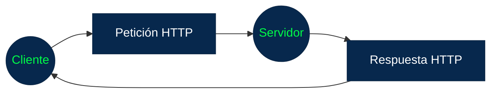

Una respuesta HTTP está compuesta principalmente por:

1. Línea de estado (Status Line)
2. Headers
3. Línea en blanco
4. Body (opcional)

```
┌──────────────────────────────────────┐
│ Línea de estado                      │
├──────────────────────────────────────┤
│ Headers                              │
│ Headers                              │
│ Headers                              │
├──────────────────────────────────────┤
│ Línea en blanco                      │
├──────────────────────────────────────┤
│ Body (opcional)                      │
└──────────────────────────────────────┘
```

### 1. Línea de estado

La primera línea de una respuesta HTTP indica el resultado de la petición.

`HTTP/1.1 200 OK`

Podemos dividirla:
```
HTTP/1.1     200       OK
   │           │        │
   │           │        └── Descripción
   │           └─────────── Código de estado
   └─────────────────────── Versión HTTP
```

**La parte más importante es el código de estado.**
> Estos códigos indican al cliente qué ocurrió con la solicitud.

### 2. Códigos de estado HTTP

Los códigos están organizados en cinco grandes categorías:

| Rango | Categoría          | Significado                           |
| ----- | ------------------ | ------------------------------------- |
| `1xx` | Informativos       | La solicitud está siendo procesada    |
| `2xx` | Éxito              | La solicitud se procesó correctamente |
| `3xx` | Redirección        | Se necesita otra acción o ubicación   |
| `4xx` | Error del cliente  | Hay un problema con la solicitud      |
| `5xx` | Error del servidor | El servidor no pudo procesarla        |

### 3. Headers de la respuesta

Después de la línea de estado aparecen los headers.

Estos proporcionan información adicional sobre la respuesta.

```http
Content-Type: application/json
Content-Length: 128
Cache-Control: max-age=3600
Set-Cookie: sessionId=abc123
```

**Al igual que en las peticiones, tienen esta estructura:**

### Headers importantes

### `Content-Type`

Indica qué tipo de contenido contiene el body.

+ `Content-Type: text/html` -> La respuesta contiene HTML.
+ `Content-Type: application/json`-> La respuesta contiene JSON.
+ `Content-Type: image/png` -> para una imagen PNG.

### `Content-Length`

Indica el tamaño del contenido de la respuesta, expresado en bytes, cuando aplica a ese mensaje.

+ `Content-Length: 1250` -> significa que el contenido tiene 1250 bytes.

### `Location`

Se utiliza principalmente cuando el servidor quiere indicar otra ubicación.

```http
HTTP/1.1 301 Moved Permanently
Location: https://www.ejemplo.com/nueva-pagina
```

> El navegador puede utilizar esa información para dirigirse a la nueva URL.

### `Set-Cookie`

Permite que el servidor solicite al cliente que almacene una cookie.

`Set-Cookie: sessionId=abc123` 

+ El navegador puede almacenar esa cookie y enviarla posteriormente en las solicitudes correspondientes.
+ Esto permite implementar mecanismos como sesiones de usuario.

### `Cache-Control`

Indica reglas relacionadas con el almacenamiento en caché.

`Cache-Control: max-age=3600`

+ indica, de forma simplificada, que el recurso puede considerarse fresco durante un período determinado.
+ La caché es importante porque evita solicitar nuevamente recursos que todavía pueden reutilizarse.

### 4. Línea en blanco

Después de los headers aparece una línea vacía:

```http
HTTP/1.1 200 OK
Content-Type: application/json
Content-Length: 42

{"nombre":"Juan","edad":25}
``` 
La línea vacía separa: `Headers` de `Body` -> Es exactamente la misma idea que vimos en las peticiones **HTTP.**

### 5. Body

El body contiene los datos que el servidor devuelve al cliente.

No todas las respuestas tienen body.

Por ejemplo, una respuesta puede contener:

+ HTML
+ JSON
+ XML
+ imágenes
+ archivos
+ texto
+ otros tipos de contenido

### Ejemplo de respuesta HTML

solictud HTTP
```http
GET /index.html HTTP/1.1
Host: ejemplo.com
```

**El servidor podría responder:**
```http
HTTP/1.1 200 OK
Content-Type: text/html
Content-Length: 48

<html>
  <body>
    <h1>Hola</h1>
  </body>
</html>
```
**Línea de estado**

+ `HTTP/1.1 200 OK`

**Headers**
+ `Content-Type: text/html`
+ `Content-Length: 48`

**body.**
```HTML
<html>
  <body>
    <h1>Hola</h1>
  </body>
</html>
```
### Ejemplo de respuesta JSON

**Las APIs suelen devolver datos en formato JSON.**

```http
HTTP/1.1 200 OK
Content-Type: application/json

{
  "id": 25,
  "nombre": "Juan",
  "activo": true
}
```
+ `200` -> indica que la solicitud fue procesada correctamente
+ `application/json` -> indica que el contenido está en formato JSON.

> Y el JSON contiene los datos que la aplicación cliente necesita.

### Ejemplo de error

`GET /usuarios/9999` 

pero ese usuario no existe.

El servidor podría responder:

```http
HTTP/1.1 404 Not Found
Content-Type: application/json

{
  "error": "Usuario no encontrado"
}
```
Tenemos:

+ `404` → código de estado
+ `Not Found` → descripción.
+ `application/json` → formato del contenido.
+ ```JSON {  "error": "Usuario no encontrado"} ``` → información adicional para el cliente.

### Petición y respuesta juntas

**Petición**

```http
POST /usuarios HTTP/1.1
Host: api.ejemplo.com
Content-Type: application/json

{
  "nombre": "Juan"
}
```
**Servidor**

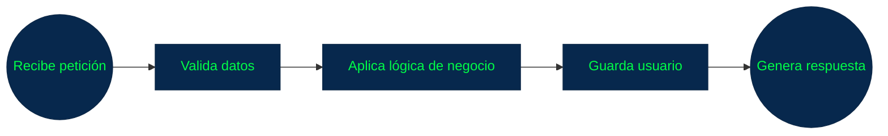

**Respuesta**
```http
HTTP/1.1 201 Created
Content-Type: application/json

{
  "id": 25,
  "nombre": "Juan"
}
```
> El cliente recibe la respuesta y puede utilizar esos datos.

### Petición vs. Respuesta

| Petición HTTP   | Respuesta HTTP  |
| --------------- | --------------- |
| Request Line    | Status Line     |
| Headers         | Headers         |
| Línea en blanco | Línea en blanco |
| Body opcional   | Body opcional   |

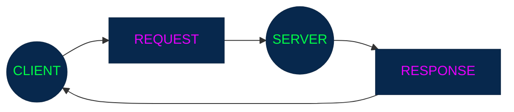

> _**«La diferencia fundamental está en la primera línea.»**_

| HTTP           | Primera Linea           |  Objetivo                    | 
| ---------------| ------------------------|------------------------------|
| Petición HTTP  | `GET /usuarios HTTP/1.1`| Qué quiere hacer el cliente. |
| Respuesta HTTP | `HTTP/1.1 200 OK`       | Qué ocurrió con la petición. |

### Un ejemplo completo

Imaginemos que una aplicación quiere obtener información de un usuario.

### 1. Cliente → Servidor

```http
GET /api/usuarios/25 HTTP/1.1
Host: api.ejemplo.com
Accept: application/json
Authorization: Bearer token123
```

El cliente está diciendo:

> _Quiero obtener el usuario 25 y espero recibir JSON._

### 2. Servidor procesa


### 3. Servidor → Cliente

```http
HTTP/1.1 200 OK
Content-Type: application/json

{
  "id": 25,
  "nombre": "Juan",
  "correo": "juan@example.com"
}
```

El cliente recibe los datos.

### ¿Qué ocurre si algo sale mal?

> Aquí aparecen los códigos de estado HTTP.

```
200 → Todo salió correctamente
201 → Se creó un recurso
400 → Petición incorrecta
401 → No autenticado
403 → No autorizado
404 → Recurso no encontrado
500 → Error interno del servidor
```
> _**Estos códigos son extremadamente importantes para los desarrolladores porque permiten saber rápidamente qué ocurrió.**_

**Por ejemplo, una aplicación podría recibir:**

+ `HTTP/1.1 401 Unauthorized` y entonces saber: -> _**"Necesito autenticar al usuario."**_
+ ó
+ `HTTP/1.1 404 Not Found` -> _indica que el recurso solicitado no fue encontrado._

### Algo muy importante: HTTP no es solamente HTML

Cuando comenzamos a estudiar HTTP es común pensar:

> HTTP sirve para obtener páginas web.

Pero actualmente HTTP se utiliza para muchísimo más.

Ejemplos:

+ Navegador -> API -> JSON
+ Una aplicación móvil puede comunicarse con un backend: 
    + Aplicación `móvil` -> `HTTPS` -> `API` -> `Base de datos`
    + Y recibir:

    ```JSON
    {
  "usuario": "Juan",
  "saldo": 150000
    }
    ```
    + No hay necesariamente una página HTML involucrada.

Por eso HTTP es fundamental para las APIs, aplicaciones móviles, sistemas distribuidos y arquitecturas modernas.

### Resumen visual

```
              RESPUESTA HTTP
                    │
       ┌────────────┴────────────┐
       │                         │
       ▼                         ▼
 Status Line                  Headers
       │                         │
       ├── Versión               ├── Content-Type
       ├── Código                ├── Content-Length
       └── Descripción           ├── Cache-Control
                                 └── ...
                    │
                    ▼
               Línea vacía
                    │
                    ▼
               Body (opcional)
```

Ejemplo:

```http
HTTP/1.1 200 OK
Content-Type: application/json
Cache-Control: max-age=3600

{
  "id": 25,
  "nombre": "Juan"
}
```

Lo esencial es:

> Una respuesta HTTP le indica al cliente qué ocurrió con su petición, proporciona información adicional mediante headers y, cuando corresponde, devuelve datos en el body.

## Códigos de Estado HTTP

Estos aparecen en la primera línea de una respuesta y permiten saber rápidamente qué ocurrió con la petición.

Cuando un servidor recibe una petición, necesita comunicarle al cliente el resultado.

`HTTP/1.1 200 OK`
☝️
Aquí:

+ `HTTP/1.1` → versión de HTTP.
+ `200` → código de estado.
+ `OK` → descripción del código.

El código numérico es lo realmente importante.

### 1. Las cinco categorías

Los códigos HTTP tienen tres dígitos y se agrupan según su primer número:

| Código | Categoría          | Significado general                                 |
| ------ | ------------------ | --------------------------------------------------- |
| `1xx`  | Informativo        | La solicitud está siendo procesada                  |
| `2xx`  | Éxito              | La solicitud se procesó correctamente               |
| `3xx`  | Redirección        | Se requiere otra acción para completar la solicitud |
| `4xx`  | Error del cliente  | La solicitud tiene algún problema                   |
| `5xx`  | Error del servidor | El servidor no pudo completar una solicitud válida  |

### 2. Códigos 1xx — Informativos

Los códigos `1xx` indican que el servidor ha recibido la solicitud y proporciona información sobre el estado del procesamiento.

Son menos comunes para un desarrollador que los códigos `2xx`, `4xx` y `5xx`.

### `100 Continue`

Indica que el servidor ha recibido los encabezados iniciales y que el cliente puede continuar enviando el contenido de la petición.

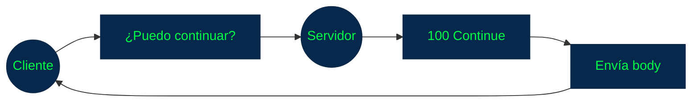

### 3. Códigos 2xx — Éxito

Estos indican que la petición fue procesada correctamente.

Los más importantes son:

+ `200 OK`
+ `201 Created`
+ `202 Accepted`
+ `204 No Content`

### `200 OK`

Es probablemente el código HTTP que encontrarás con mayor frecuencia.

Significa que la solicitud se procesó correctamente.

Ejemplo:

`GET /usuarios/25 HTTP/1.1`

Respuesta:

```http
HTTP/1.1 200 OK
Content-Type: application/json

{
  "id": 25,
  "nombre": "Juan"
}
```

Significa:

> El servidor procesó correctamente la petición y devuelve el recurso solicitado.

### `201 Created`

Indica que se creó correctamente un nuevo recurso.

Es muy habitual después de un POST.

Por ejemplo:

`POST /usuarios HTTP/1.1`

Respuesta:

```http
HTTP/1.1 201 Created
Content-Type: application/json

{
  "id": 26,
  "nombre": "Ana"
}
```

El significado sería:

> El usuario fue creado correctamente.

### `202 Accepted`

Indica que el servidor aceptó la solicitud para procesarla, pero el procesamiento todavía no necesariamente ha terminado.

Es útil para operaciones asíncronas.

Por ejemplo:

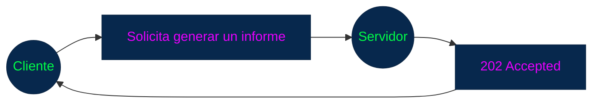

El servidor puede estar generando el informe en segundo plano.

### `204 No Content`

Significa que la operación tuvo éxito pero el servidor no necesita devolver contenido en el cuerpo de la respuesta.

Por ejemplo:

+ `DELETE /usuarios/25 HTTP/1.1`

Respuesta: 

+ `HTTP/1.1 204 No Content`

No hay un body que devolver.

### 4. Códigos 3xx — Redirecciones

Los códigos 3xx indican que el cliente necesita realizar alguna acción adicional, normalmente siguiendo otra ubicación.

Los más conocidos son:

+ `301 Moved Permanently`
+ `302 Found`
+ `304 Not Modified`
+ `307 Temporary Redirect`
+ `308 Permanent Redirect`

### `301 Moved Permanently`

Indica que el recurso se ha trasladado permanentemente a otra URL.

Ejemplo:

```http
HTTP/1.1 301 Moved Permanently
Location: https://ejemplo.com/nueva-url
```
El navegador puede dirigirse a:
`https://ejemplo.com/nueva-url`

### `302 Found`

Indica una redirección temporal.

```http
HTTP/1.1 302 Found
Location: https://ejemplo.com/temporal
```

La diferencia conceptual es:

+ `301` → cambio permanente
+ `302` → redirección temporal

### `304 Not Modified`

Este código es especialmente interesante cuando hablamos de caché.

Significa que el recurso no ha cambiado desde la versión que el cliente ya tiene almacenada.

Por ejemplo:

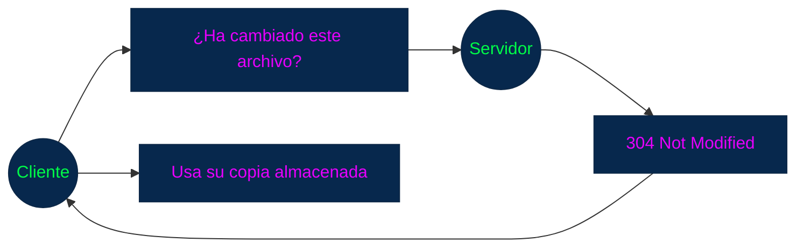

> Esto permite ahorrar ancho de banda y mejorar el rendimiento.

### 5. Códigos 4xx — Errores del cliente

Aquí encontramos algunos de los códigos más importantes para el desarrollo de aplicaciones.

Los principales son:

+ `400 Bad Request`
+ `401 Unauthorized`
+ `403 Forbidden`
+ `404 Not Found`
+ `405 Method Not Allowed`
+ `409 Conflict`
+ `422 Unprocessable Content`
+ `429 Too Many Requests`

### `400 Bad Request`

Significa que el servidor no puede procesar la petición porque está mal formada o contiene datos inválidos según las reglas de la solicitud.

```http
POST /usuarios HTTP/1.1
Content-Type: application/json

{
  "nombre":
```
El JSON está incompleto.

El servidor podría responder:

`El servidor podría responder:`

Conceptualmente:

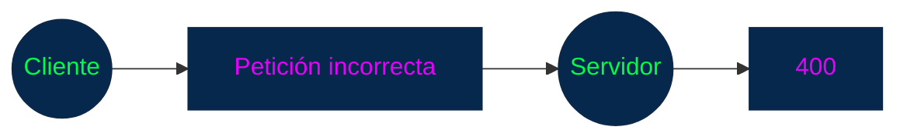
### `401 Unauthorized`

Este código suele indicar que el cliente no está autenticado correctamente para acceder al recurso.

Por ejemplo:

`GET /perfil HTTP/1.1`

pero no proporciona credenciales válidas.

Respuesta:

`HTTP/1.1 401 Unauthorized`

Una forma sencilla de recordarlo:

> 401 → necesito autenticarme.

Aunque el nombre diga `Unauthorized`, en la práctica HTTP `401` está relacionado principalmente con **autenticación**.

### `403 Forbidden`

Aquí el cliente puede estar correctamente autenticado, pero no tiene permiso para realizar esa acción.

Por ejemplo:


Una forma sencilla de distinguirlos:

```
401 → ¿Quién eres?
403 → Sé quién eres, pero no tienes permiso.
```

### `404 Not Found`

Uno de los errores más conocidos.

Significa que el servidor no encontró una representación del recurso solicitado.

Por ejemplo:

`GET /usuarios/999999`

Si ese recurso no existe:

`HTTP/1.1 404 Not Found`

También puede ocurrir: `GET /pagina-que-no-existe -> 404`

### `405 Method Not Allowed`

Indica que el servidor conoce el recurso, pero el método HTTP utilizado no está permitido para ese recurso.

Por ejemplo, una API podría permitir:

`GET /usuarios`

pero no: 

`DELETE /usuarios`

Entonces podría devolver:

`HTTP/1.1 405 Method Not Allowed`

### `409 Conflict`

Indica que existe un conflicto con el estado actual del recurso.

Un ejemplo típico:

```
Intentar crear usuario
correo = juan@example.com
```

Pero ese correo ya existe.

La API podría responder:

`HTTP/1.1 409 Conflict`

El uso exacto depende de las reglas de la API.

### `422 Unprocessable Content`

Indica que el servidor entiende la estructura de la petición, pero no puede procesar el contenido porque no cumple determinadas reglas de validación.

Por ejemplo:

```JSON
{
  "edad": -15
}
```

El JSON es válido.

Pero la aplicación puede considerar inválida esa edad.

Podría responder:

`HTTP/1.1 422 Unprocessable Content`

Es muy común encontrar este código en APIs para errores de validación.

### `429 Too Many Requests` 

Indica que el cliente ha realizado demasiadas solicitudes en un período determinado.

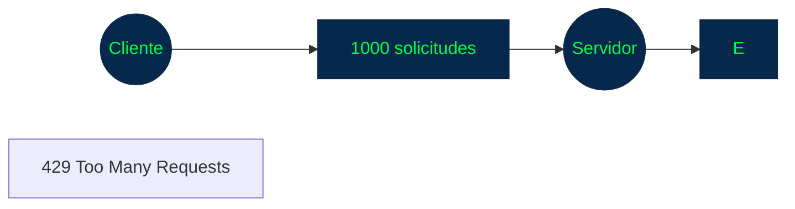

Esto está relacionado con mecanismos de rate limiting.

Una API puede limitar, por ejemplo:

> 100 solicitudes / minuto

y rechazar temporalmente solicitudes adicionales.

### 6. Códigos 5xx — Errores del servidor

Estos indican que el servidor no pudo completar una solicitud.

Los más importantes son:

+ `500 Internal Server Error`
+ `501 Not Implemented`
+ `502 Bad Gateway`
+ `503 Service Unavailable`
+ `504 Gateway Timeout`

### `500 Internal Server Error`

Es un error genérico del servidor.

Por ejemplo:

```
Cliente
   │
   │ GET /usuarios
   ▼
Servidor
   │
   ├── Error en código
   ├── Excepción
   └── Problema inesperado
   │
   ▼
500 Internal Server Error
```

El problema está del lado del servidor, aunque el código por sí solo no indica cuál fue la causa exacta.

### `502 Bad Gateway`

Este código aparece normalmente cuando un servidor que actúa como gateway o proxy recibe una respuesta inválida de otro servidor.

Se produce Si el proxy recibe una respuesta inválida o inesperada del backend:

Por ejemplo:

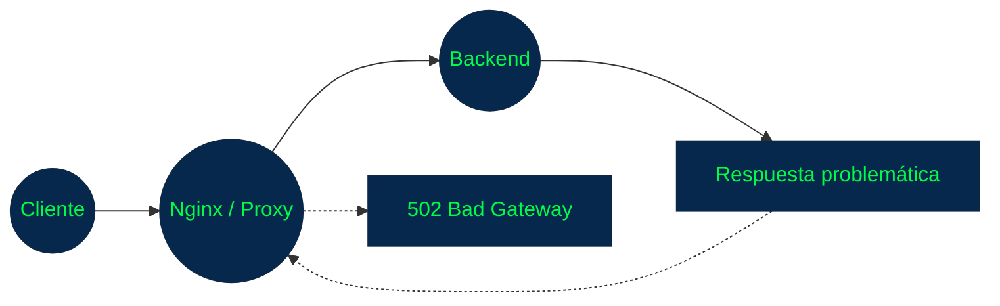

### `503 Service Unavailable`

Significa que el servidor no está disponible para procesar temporalmente la solicitud.

Puede ocurrir por situaciones como:

+ mantenimiento
+ sobrecarga 
+ servicio temporalmente no disponible.

Por ejemplo:

`HTTP/1.1 503 Service Unavailable`

### `504 Gateway Timeout`

Aparece cuando un gateway o proxy no recibe a tiempo una respuesta de otro servidor.

Por ejemplo:

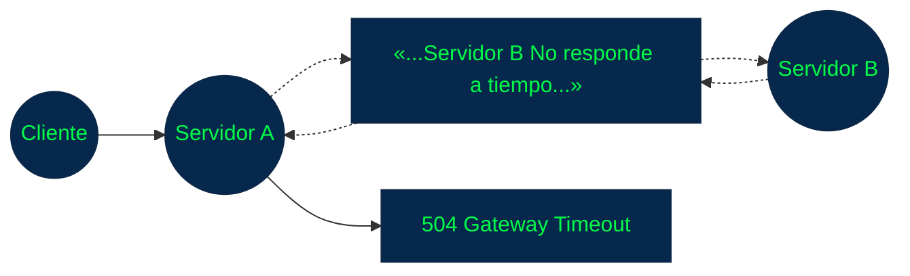

### Los códigos a memorizar primero

Para empezar como desarrollador, estos son especialmente importantes:

| Código  | Significado                        |
| ------- | ---------------------------------- |
| **200** | OK                                 |
| **201** | Recurso creado                     |
| **204** | Éxito sin contenido                |
| **301** | Redirección permanente             |
| **302** | Redirección temporal               |
| **304** | No modificado                      |
| **400** | Petición incorrecta                |
| **401** | No autenticado correctamente       |
| **403** | Sin permisos                       |
| **404** | Recurso no encontrado              |
| **405** | Método no permitido                |
| **409** | Conflicto                          |
| **422** | Contenido no procesable/validación |
| **429** | Demasiadas solicitudes             |
| **500** | Error interno del servidor         |
| **502** | Error de gateway/proxy             |
| **503** | Servicio no disponible             |
| **504** | Tiempo de espera del gateway       |

### Una forma de pensar en los códigos

Cuando aparezca un codigo HTTP mientras se esta desarrollando, se puede empezar por la siguiente pregunta:

> _**¿Con qué número comienza?**_

| Código  |        Significado                        |
| ------- | ----------------------------------------- |
| **2xx** | Éxito                                     |
| **3xx** | Redirección / caché                       |
| **4xx** | Revisar la petición del cliente           |
| **5xx** | Investigar el servidor o sus dependencias |

> Esto no significa que todo 4xx sea necesariamente culpa del programador que hizo la petición ni que todo 5xx sea causado por el código de una única aplicación; son categorías que ayudan a localizar dónde está el problema.