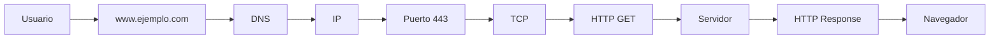

# HTTP/HTTPS en Detalle

## ¿Qué es HTTP?

**HTTP** (_HyperText Transfer Protocol_) es el protocolo de aplicación que utilizan los navegadores y los servidores web para intercambiar información.

+ Mientras que **TCP** se encarga de transportar los datos de forma confiable
+ **HTTP** define qué datos se envían y cómo deben interpretarse.

| Protocolo | Responsabilidad                                   |
| --------- | ------------------------------------------------- |
| IP        | Encuentra el dispositivo.                         |
| TCP       | Transporta los datos de forma confiable.          |
| HTTP      | Define el contenido y formato de la comunicación. |

### ¿Dónde se encuentra HTTP?

```
Aplicación        ← HTTP
Transporte        ← TCP
Internet          ← IP
Acceso a Red      ← Ethernet / Wi-Fi
```

Cada protocolo utiliza los servicios de la capa inferior.

+ `HTTP` → `TCP` → `IP` → `Internet`

### ¿Cómo funciona HTTP?

**HTTP** sigue el modelo _Petición → Respuesta._

Cliente → Petición HTTP → Servidor → Respuesta HTTP → Cliente

+ El cliente siempre inicia la comunicación.
+ El servidor espera solicitudes y responde.

Ejemplo

**Escribes** → [https://www.ejemplo.com]

    ↓

**Navegador** → **HTTP** → "_Quiero la página principal_"

    ↓

**Servidor** → Devuelve `HTML`

    ↓

**Navegador** → muestra la página

### HTTP es un protocolo sin estado (Stateless)

+ Una característica muy importante de **HTTP** es que **cada petición es independiente de las anteriores**.
    + Esto significa que el servidor no recuerda automáticamente qué ocurrió en la petición anterior.
        + Para **HTTP** son dos solicitudes completamente independientes.

**¿Por qué es importante esto?**

1. Imagina que ingresas a una tienda en línea.
    + 2. Primero haces login.
        + 3. Después visitas:
            + productos
            + carrito
            + pagos

+ Si **HTTP** olvidara quién eres en cada petición, tendrías que iniciar sesión constantemente.

Por eso existen mecanismos adicionales como:

+ Cookies.
+ Tokens.
+ Sesiones.

Estos permiten que el servidor identifique al usuario entre distintas solicitudes.

### ¿Qué puede solicitar un cliente?

**HTTP** permite solicitar muchos recursos diferentes.

+ Páginas **HTML**.
+ Imágenes.
+ Videos.
+ Archivos **PDF**.
+ **APIs**.
+ Archivos **JSON**.
+ Documentos **CSS**.
+ Archivos **JavaScript**.

Todo ello mediante el mismo protocolo.

### Métodos HTTP

Una petición HTTP siempre indica qué acción **desea realizar el cliente**.

| Método | Significado            | Uso habitual                         |
| ------ | ---------------------- | ------------------------------------ |
| GET    | Obtener información    | Consultar recursos                   |
| POST   | Crear información      | Enviar formularios o crear registros |
| PUT    | Reemplazar información | Actualizar un recurso completo       |
| PATCH  | Modificar parcialmente | Actualizar parte de un recurso       |
| DELETE | Eliminar información   | Borrar recursos                      |

### GET

+ Solicita información.

+ `</>http`
    + _GET /productos_ → El servidor responde con la lista de productos.

### POST

+ Envía información al servidor.

+ `</>http`
    + _POST /usuarios_ → Se utiliza para crear un usuario nuevo..

### PUT

+ Actualiza completamente un recurso.

+ `</>http`
    + _PUT /usuarios/15_ → Reemplaza toda la información del usuario.

### PATCH

+ Actualiza únicamente algunos campos.

+ `</>http`
    + _PATCH /usuarios/15_ → Solo cambia, por ejemplo, el correo electrónico o el número de teléfono.

### DELETE

+ Solicita eliminar un recurso.

+ `</>http`
    + _DELETE /usuarios/15_

### Flujo completo de una petición

Observa cómo cada tecnología tiene una responsabilidad específica.

### HTTP utiliza texto

Una característica interesante es que **HTTP** (_especialmente HTTP/1.1_) es un protocolo basado en texto.

Una petición puede verse así:

```
GET /productos HTTP/1.1
Host: ejemplo.com
```

Y la respuesta:

```
HTTP/1.1 200 OK
Content-Type: text/html
```

Esto facilita enormemente su depuración y comprensión.

### Versiones de HTTP

A lo largo del tiempo, HTTP ha evolucionado.

**HTTP/1.1**

Durante muchos años fue la versión más utilizada.

+ Basado en texto.
+ Una petición tras otra sobre la misma conexión.
+ Muy sencillo de entender.

**HTTP/2**

Introduce mejoras importantes.

+ **Multiplexación** (varias solicitudes simultáneas sobre una misma conexión).
+ Compresión de encabezados.
+ Mayor rendimiento.

El funcionamiento para el desarrollador es prácticamente el mismo, pero es mucho más eficiente.

**HTTP/3**

Es la versión más moderna.

En lugar de utilizar **TCP**, emplea **QUIC**, que funciona sobre **UDP**.

Esto reduce la latencia y mejora el rendimiento, especialmente en conexiones inestables.

Para un desarrollador web, la diferencia suele ser transparente: el navegador y el servidor negocian automáticamente qué versión utilizar.

## ¿Qué es HTTPS?

**HTTPS** significa:

`HyperText Transfer Protocol Secure`

_No es un protocolo completamente distinto._

Es simplemente:

+ **HTTP** `+` **TLS** (_Seguridad_) = _**HTTPS**_

La principal diferencia es que **HTTPS** cifra la comunicación para proteger la información durante el tránsito por la red.

### ¿Por qué HTTPS es necesario?

Supongamos que envías una contraseña mediante **HTTP**.

+ Usuario → Contraseña → Internet

Cualquier atacante con acceso al tráfico podría leer esa información.

Con **HTTPS**:

+ Usuario → `Información cifrada` → Internet → Servidor

Aunque alguien intercepte los datos, no podrá entender su contenido sin las claves criptográficas adecuadas.

### ¿Qué protege HTTPS?

+ Contraseñas.
+ Tarjetas de crédito.
+ Información bancaria.
+ Cookies.
+ Tokens de autenticación.
+ Datos personales.
+ Información de APIs.

No solo cifra el contenido, sino que también ayuda a verificar que el cliente se está comunicando con el servidor correcto mediante `certificados digitales`.

### Ideas clave

+ **HTTP** es el protocolo de aplicación utilizado para la comunicación entre clientes y servidores web.
+ Funciona mediante un modelo de **petición → respuesta**.
+ Es un protocolo sin estado (_stateless_), por lo que cada petición es independiente.
+ Los métodos **HTTP** indican la acción que el cliente desea realizar (**GET, POST, PUT, PATCH y DELETE**).
+ **HTTPS** añade una capa de seguridad (_TLS_) sobre **HTTP**, proporcionando confidencialidad e integridad de los datos durante la comunicación.