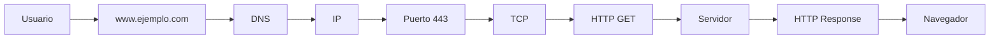

# HTTP/HTTPS en Detalle

## ¿Qué es HTTP?

**HTTP** (_HyperText Transfer Protocol_) es el protocolo de aplicación que utilizan los navegadores y los servidores web para intercambiar información.

+ Mientras que **TCP** se encarga de transportar los datos de forma confiable
+ **HTTP** define qué datos se envían y cómo deben interpretarse.

| Protocolo | Responsabilidad                                   |
| --------- | ------------------------------------------------- |
| IP        | Encuentra el dispositivo.                         |
| TCP       | Transporta los datos de forma confiable.          |
| HTTP      | Define el contenido y formato de la comunicación. |

### ¿Dónde se encuentra HTTP?

```
Aplicación        ← HTTP
Transporte        ← TCP
Internet          ← IP
Acceso a Red      ← Ethernet / Wi-Fi
```

Cada protocolo utiliza los servicios de la capa inferior.

+ `HTTP` → `TCP` → `IP` → `Internet`

### ¿Cómo funciona HTTP?

**HTTP** sigue el modelo _Petición → Respuesta._

Cliente → Petición HTTP → Servidor → Respuesta HTTP → Cliente

+ El cliente siempre inicia la comunicación.
+ El servidor espera solicitudes y responde.

Ejemplo

**Escribes** → [https://www.ejemplo.com]

    ↓

**Navegador** → **HTTP** → "_Quiero la página principal_"

    ↓

**Servidor** → Devuelve `HTML`

    ↓

**Navegador** → muestra la página

### HTTP es un protocolo sin estado (Stateless)

+ Una característica muy importante de **HTTP** es que **cada petición es independiente de las anteriores**.
    + Esto significa que el servidor no recuerda automáticamente qué ocurrió en la petición anterior.
        + Para **HTTP** son dos solicitudes completamente independientes.

**¿Por qué es importante esto?**

1. Imagina que ingresas a una tienda en línea.
    + 2. Primero haces login.
        + 3. Después visitas:
            + productos
            + carrito
            + pagos

+ Si **HTTP** olvidara quién eres en cada petición, tendrías que iniciar sesión constantemente.

Por eso existen mecanismos adicionales como:

+ Cookies.
+ Tokens.
+ Sesiones.

Estos permiten que el servidor identifique al usuario entre distintas solicitudes.

### ¿Qué puede solicitar un cliente?

**HTTP** permite solicitar muchos recursos diferentes.

+ Páginas **HTML**.
+ Imágenes.
+ Videos.
+ Archivos **PDF**.
+ **APIs**.
+ Archivos **JSON**.
+ Documentos **CSS**.
+ Archivos **JavaScript**.

Todo ello mediante el mismo protocolo.

### Métodos HTTP

Una petición HTTP siempre indica qué acción **desea realizar el cliente**.

| Método | Significado            | Uso habitual                         |
| ------ | ---------------------- | ------------------------------------ |
| GET    | Obtener información    | Consultar recursos                   |
| POST   | Crear información      | Enviar formularios o crear registros |
| PUT    | Reemplazar información | Actualizar un recurso completo       |
| PATCH  | Modificar parcialmente | Actualizar parte de un recurso       |
| DELETE | Eliminar información   | Borrar recursos                      |

### GET

+ Solicita información.

+ `</>http`
    + _GET /productos_ → El servidor responde con la lista de productos.

### POST

+ Envía información al servidor.

+ `</>http`
    + _POST /usuarios_ → Se utiliza para crear un usuario nuevo..

### PUT

+ Actualiza completamente un recurso.

+ `</>http`
    + _PUT /usuarios/15_ → Reemplaza toda la información del usuario.

### PATCH

+ Actualiza únicamente algunos campos.

+ `</>http`
    + _PATCH /usuarios/15_ → Solo cambia, por ejemplo, el correo electrónico o el número de teléfono.

### DELETE

+ Solicita eliminar un recurso.

+ `</>http`
    + _DELETE /usuarios/15_

### Flujo completo de una petición

Observa cómo cada tecnología tiene una responsabilidad específica.

### HTTP utiliza texto

Una característica interesante es que **HTTP** (_especialmente HTTP/1.1_) es un protocolo basado en texto.

Una petición puede verse así:

```
GET /productos HTTP/1.1
Host: ejemplo.com
```

Y la respuesta:

```
HTTP/1.1 200 OK
Content-Type: text/html
```

Esto facilita enormemente su depuración y comprensión.

### Versiones de HTTP

A lo largo del tiempo, HTTP ha evolucionado.

**HTTP/1.1**

Durante muchos años fue la versión más utilizada.

+ Basado en texto.
+ Una petición tras otra sobre la misma conexión.
+ Muy sencillo de entender.

**HTTP/2**

Introduce mejoras importantes.

+ **Multiplexación** (varias solicitudes simultáneas sobre una misma conexión).
+ Compresión de encabezados.
+ Mayor rendimiento.

El funcionamiento para el desarrollador es prácticamente el mismo, pero es mucho más eficiente.

**HTTP/3**

Es la versión más moderna.

En lugar de utilizar **TCP**, emplea **QUIC**, que funciona sobre **UDP**.

Esto reduce la latencia y mejora el rendimiento, especialmente en conexiones inestables.

Para un desarrollador web, la diferencia suele ser transparente: el navegador y el servidor negocian automáticamente qué versión utilizar.

## ¿Qué es HTTPS?

**HTTPS** significa:

`HyperText Transfer Protocol Secure`

_No es un protocolo completamente distinto._

Es simplemente:

+ **HTTP** `+` **TLS** (_Seguridad_) = _**HTTPS**_

La principal diferencia es que **HTTPS** cifra la comunicación para proteger la información durante el tránsito por la red.

### ¿Por qué HTTPS es necesario?

Supongamos que envías una contraseña mediante **HTTP**.

+ Usuario → Contraseña → Internet

Cualquier atacante con acceso al tráfico podría leer esa información.

Con **HTTPS**:

+ Usuario → `Información cifrada` → Internet → Servidor

Aunque alguien intercepte los datos, no podrá entender su contenido sin las claves criptográficas adecuadas.

### ¿Qué protege HTTPS?

+ Contraseñas.
+ Tarjetas de crédito.
+ Información bancaria.
+ Cookies.
+ Tokens de autenticación.
+ Datos personales.
+ Información de APIs.

No solo cifra el contenido, sino que también ayuda a verificar que el cliente se está comunicando con el servidor correcto mediante `certificados digitales`.

## Estructura de una Petición HTTP 

Una petición HTTP (HTTP Request) es el mensaje que un cliente —por ejemplo, un navegador, una aplicación móvil o Postman— envía a un servidor para solicitar información o realizar alguna acción.

Una petición HTTP puede contener:

Línea de petición (Request Line)
Encabezados (Headers)
Línea en blanco
Cuerpo (Body) — opcional

```
┌──────────────────────────────────────┐
│ Línea de petición                    │
├──────────────────────────────────────┤
│ Headers                              │
│ Headers                              │
│ Headers                              │
├──────────────────────────────────────┤
│ Línea en blanco                      │
├──────────────────────────────────────┤
│ Body (opcional)                      │
└──────────────────────────────────────┘
```
### 1. Línea de petición

La primera línea indica principalmente:

+ Método HTTP
+ Recurso solicitado
+ Versión de HTTP

Por ejemplo:

```http
GET /productos HTTP/1.1
```

Podemos dividirla:

```http
GET       /productos       HTTP/1.1
│              │               │
│              │               └── Versión
│              └────────────────── Recurso
└───────────────────────────────── Método
```

**Método HTTP** 

El método indica qué quiere hacer el cliente.

Los más importantes son:

| Método   | Propósito                |
| -------- | ------------------------ |
| `GET`    | Obtener información      |
| `POST`   | Enviar/crear información |
| `PUT`    | Reemplazar un recurso    |
| `PATCH`  | Modificar parcialmente   |
| `DELETE` | Eliminar un recurso      |

```http
GET /productos HTTP/1.1
```

significa:

> "Quiero obtener el recurso /productos."

mientras:
```http
DELETE /productos/25 HTTP/1.1
```
> "Quiero eliminar el recurso /productos/25."

### 2. Recurso solicitado

Después del método aparece la ruta (path) del recurso.
```http
GET /usuarios/25 HTTP/1.1
```

La ruta es:
```http
/usuarios/25
```

Esto podría representar:
> El usuario cuyo identificador es 25.

**Ruta + parámetros**

Una petición también puede incluir parámetros en la URL.
```http
GET /productos?categoria=computadores&orden=precio HTTP/1.1
```

Aquí tenemos:
```
Ruta:
 /productos

Parámetros:
 categoria=computadores
 orden=precio
```
Estos parámetros reciben el nombre de **query parameters.**
> Son muy comunes al trabajar con APIs.

### 3. Versión HTTP

```http
HTTP/1.1
```

Esto indica la versión del protocolo utilizada para esa petición.

Históricamente encontramos:
+ HTTP/1.0 
+ HTTP/1.1
+ HTTP/2
+ HTTP/3

**En HTTP/1.1**
+ la petición se representa de forma textual

**HTTP/2 y HTTP/3**
+ utilizan representaciones binarias más eficientes

> cuando estudias la estructura de una petición, normalmente se utiliza HTTP/1.1 como ejemplo porque permite visualizar claramente sus componentes.

### 4. Headers

Después de la línea de petición vienen los _**headers (encabezados).**_

Los headers proporcionan información adicional sobre la petición.

```http
Host: ejemplo.com
User-Agent: Mozilla/5.0
Accept: text/html
Authorization: Bearer abc123
```

Cada header tiene esta estructura _**Nombre: Valor:**_

Ejemplo: Content-Type: application/json

```http
Nombre:
Content-Type

Valor:
application/json
```
**¿Para qué sirven los Headers?**

Los headers permiten comunicar información adicional entre cliente y servidor.

Pueden indicar:

+ ¿Qué tipo de contenido se solicita?
+ ¿Qué formato puede recibir el cliente?
+ ¿Qué tipo de datos se están enviando?
+ Información sobre autenticación
+ Información sobre caché
+ Cookies
+ Información del navegador
+ Información de compresión
+ Información relacionada con el idioma

### Headers importantes

### `Host`

Indica el dominio al que está dirigida la petición.

```http
Host: www.ejemplo.com
```

Es especialmente importante en HTTP/1.1 porque permite que un mismo servidor atienda múltiples dominios.

```
Servidor
   │
   ├── ejemplo.com
   ├── tienda.com
   └── api.com
```
> Todos podrían utilizar la misma dirección IP, pero el `Host` permite indicar cuál de esos sitios se está solicitando.

### `User-Agent`

Indica información sobre el cliente que realiza la petición.

```http
User-Agent: Mozilla/5.0
```

Puede proporcionar información sobre:

+ Navegador
+ Sistema operativo
+ Motor del navegador
+ Dispositivo

Por ejemplo, un servidor podría recibir una petición proveniente de Chrome en Windows o de Safari en un iPhone.

### `Accept`

Indica qué tipos de contenido puede procesar o prefiere recibir el cliente.

```http
Accept: text/html
```
> El cliente está indicando que acepta contenido HTML.

También puede aparecer:

```http
Accept: application/json
```
> Muy común cuando trabajamos con _**APIs.**_

### `Content-Type`

Indica qué tipo de contenido estamos enviando en el cuerpo de la petición.

```http
Content-Type: application/json
```

significa que el cuerpo contiene JSON:

```JSON
{
  "nombre": "Juan",
  "edad": 25
}
```

Otro caso:

```http
Authorization: Bearer eyJhbGciOi...
```

Esto es común cuando una aplicación utiliza tokens para autenticar solicitudes a una API.

Importante: un token de autenticación es información sensible y no debería compartirse públicamente.

### `Cookie`

El navegador puede enviar cookies al servidor:

```http
Cookie: sessionId=abc123
```

Esto permite, por ejemplo, que el servidor reconozca una sesión existente.

### 5. Línea en blanco

Después de los headers existe una línea vacía.

Esto es importante porque **marca el final de los encabezados.**

```http
GET /productos HTTP/1.1
Host: ejemplo.com
Accept: application/json
Authorization: Bearer abc123
                            <- linea vacia
```

La línea vacía indica:

> "Ya terminaron los headers."

Si existe un cuerpo, comienza después de esa línea.

### 6. Body

El body _(cuerpo)_ contiene los datos que el cliente quiere enviar al servidor.

No todas las peticiones tienen _body_.

Por ejemplo, normalmente un `GET` no necesita enviar un cuerpo.

Pero un `POST` frecuentemente sí.

```http
</>
POST /usuarios HTTP/1.1
Host: api.ejemplo.com
Content-Type: application/json

{
  "nombre": "Juan",
  "correo": "juan@example.com"
}
```

Aquí:

```http POST /usuarios HTTP/1.1``` 👈 son la linea de petición

```http Host: ... Content-Type: ...``` 👈 son headers.

Y esta parte👇 es el body. 
```JSON
{
  "nombre": "Juan",
  "correo": "juan@example.com"
}
```
## Petición HTTP completa

Una petición HTTP/1.1 podría verse así:

```http
POST /usuarios HTTP/1.1
Host: api.ejemplo.com
Content-Type: application/json
Accept: application/json
Authorization: Bearer abc123
User-Agent: Mozilla/5.0

{
  "nombre": "Juan",
  "correo": "juan@example.com"
}
```
Otra respresentación visual podría ser:
```
┌─────────────────────────────────────────────┐
│ POST /usuarios HTTP/1.1                     │
│                                             │
│ Host: api.ejemplo.com                       │
│ Content-Type: application/json              │
│ Accept: application/json                    │
│ Authorization: Bearer abc123                │
│ User-Agent: Mozilla/5.0                     │
│                                             │
│                                             │ ← Línea vacía
│ {                                           │
│   "nombre": "Juan",                         │
│   "correo": "juan@example.com"              │
│ }                                           │
└─────────────────────────────────────────────┘
```

**¿Qué está ocurriendo aquí? ⬆️**

El cliente está diciendo:
> "Quiero crear un usuario en /usuarios. Estoy enviando los datos en formato JSON y espero recibir una respuesta JSON."

El servidor recibe la petición y puede:

1. Validar los datos.
2. Verificar la autenticación.
3. Aplicar las reglas de negocio.
4. Guardar el usuario en una base de datos.
5. Construir una respuesta `HTTP`.

Por ejemplo:

```
Cliente
   │
   │ POST /usuarios
   │
   │ JSON
   ▼
Servidor
   │
   ├── Autenticación
   ├── Validación
   ├── Lógica de negocio
   └── Base de datos
   │
   ▼
Respuesta HTTP
```

### ¿Qué diferencia hay entre URL y HTTP Request?

Es importante no confundirlos.

Una URL puede ser:

`https://api.ejemplo.com/usuarios/25`

Mientras que la petición HTTP podría ser:

```http
GET /usuarios/25 HTTP/1.1
Host: api.ejemplo.com
Accept: application/json
```
La URL indica qué recurso queremos localizar.

La petición `HTTP` contiene además información sobre cómo queremos interactuar con ese recurso.

## ¿Qué pasa con HTTPS?

Cuando utilizas:

`https://`

la estructura lógica de la petición sigue existiendo:
+ Método
+ Ruta
+ Headers
+ Body

pero la comunicación se protege mediante `TLS`.

De forma simplificada:


Por eso, si alguien intercepta una comunicación `HTTPS` correctamente protegida, no debería poder leer directamente los _**headers y body `HTTP`**_ que viajan dentro de ella.

Supongamos que una aplicación tiene:

`POST https://api.ejemplo.com/login`

El cliente podría enviar:

```http

POST /login HTTP/1.1
Host: api.ejemplo.com
Content-Type: application/json
Accept: application/json

{
  "email": "juan@example.com",
  "password": "********"
}
```

El servidor recibe los datos y verifica las credenciales.

Posteriormente enviará una **respuesta `HTTP`**, que estudiaremos en el siguiente tema.

**Resumen visual**

```
              PETICIÓN HTTP
                    │
       ┌────────────┴────────────┐
       │                         │
       ▼                         ▼
  Request Line                Headers
       │                         │
       ├── Método                ├── Host
       ├── Ruta                  ├── Content-Type
       └── Versión               ├── Authorization
                                 └── ...
                    │
                    ▼
              Línea vacía
                    │
                    ▼
              Body (opcional)
```

Lo esencial:

> Una petición `HTTP` indica qué recurso quiere utilizar el cliente, qué operación quiere realizar, proporciona información adicional mediante **headers** y, cuando es necesario, envía datos en el **body.**

Ejemplo:

```http
POST /usuarios HTTP/1.1
Host: api.ejemplo.com
Content-Type: application/json

{
  "nombre": "Juan"
}
```

+ `POST` → acción.
+ `/usuarios` → recurso.
+ `HTTP/1.1` → versión.
+ `Host` → servidor solicitado.
+ `Content-Type` → formato del body.
+ `Línea vacía` → separa headers del body.
+ `JSON` → datos enviados al servidor.

### Ideas clave

+ **HTTP** es el protocolo de aplicación utilizado para la comunicación entre clientes y servidores web.
+ Funciona mediante un modelo de **petición → respuesta**.
+ Es un protocolo sin estado (_stateless_), por lo que cada petición es independiente.
+ Los métodos **HTTP** indican la acción que el cliente desea realizar (**GET, POST, PUT, PATCH y DELETE**).
+ **HTTPS** añade una capa de seguridad (_TLS_) sobre **HTTP**, proporcionando confidencialidad e integridad de los datos durante la comunicación.