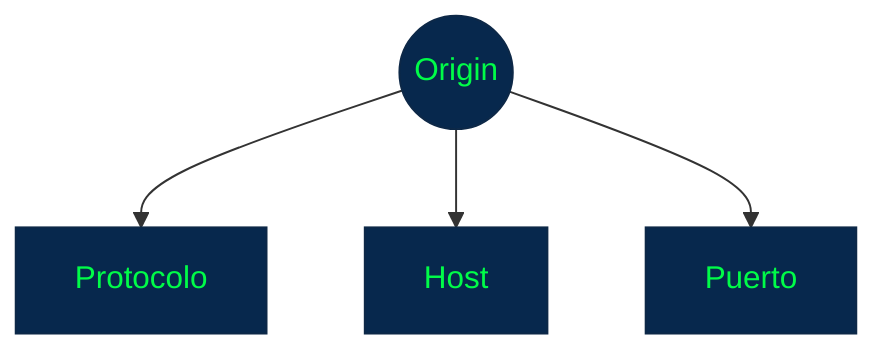
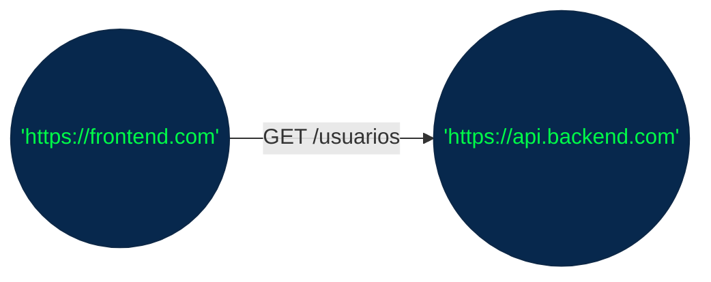
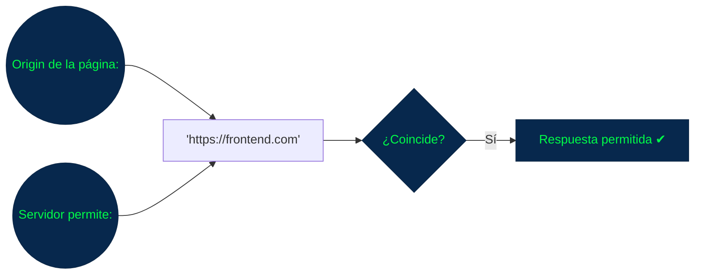
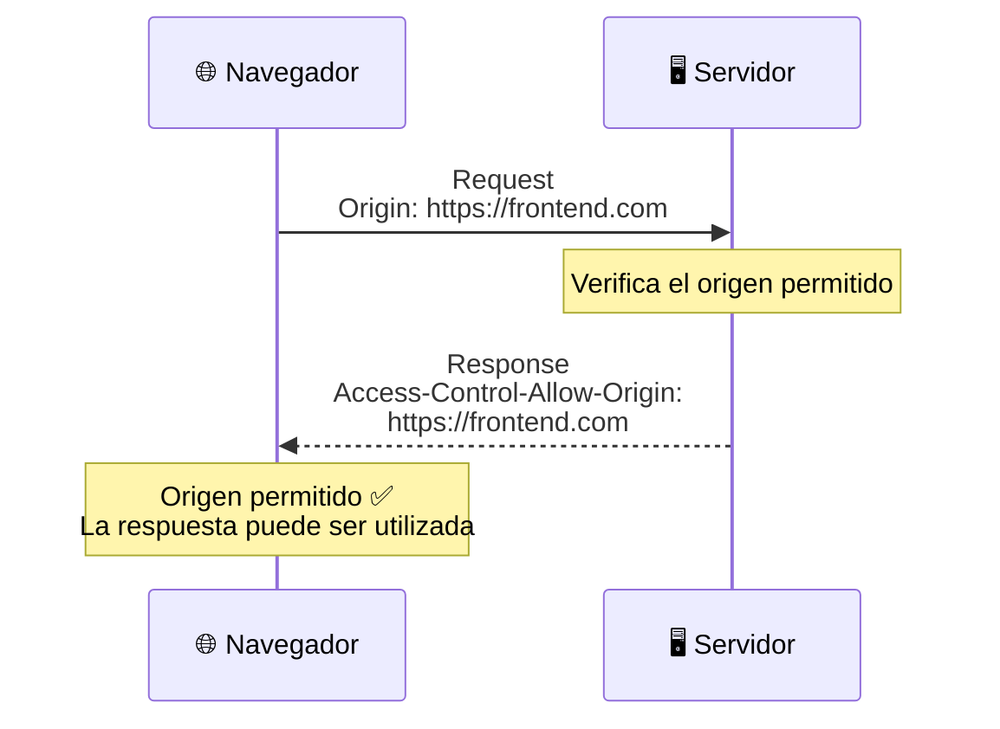
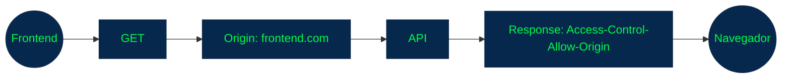
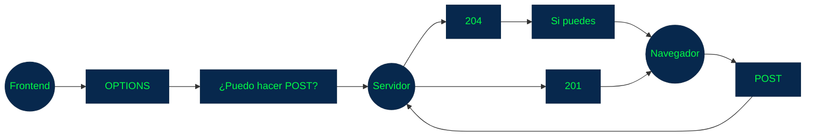
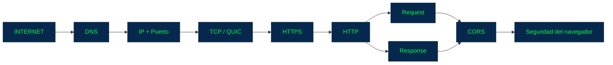
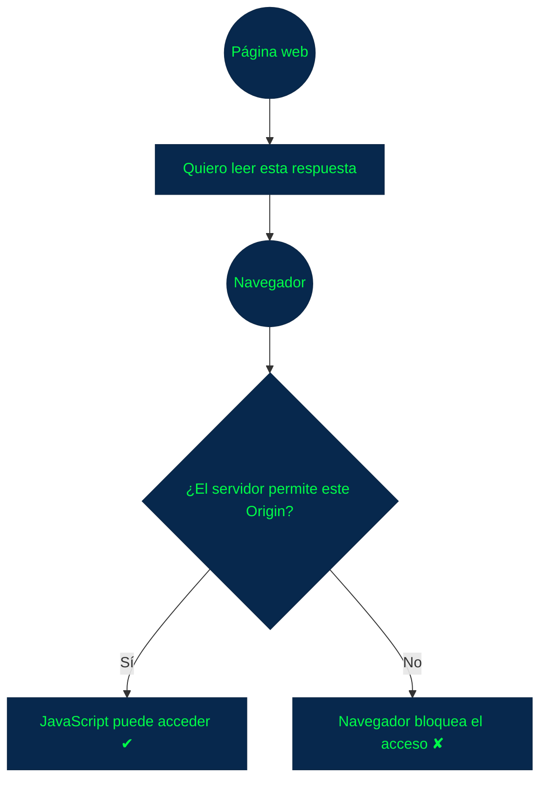
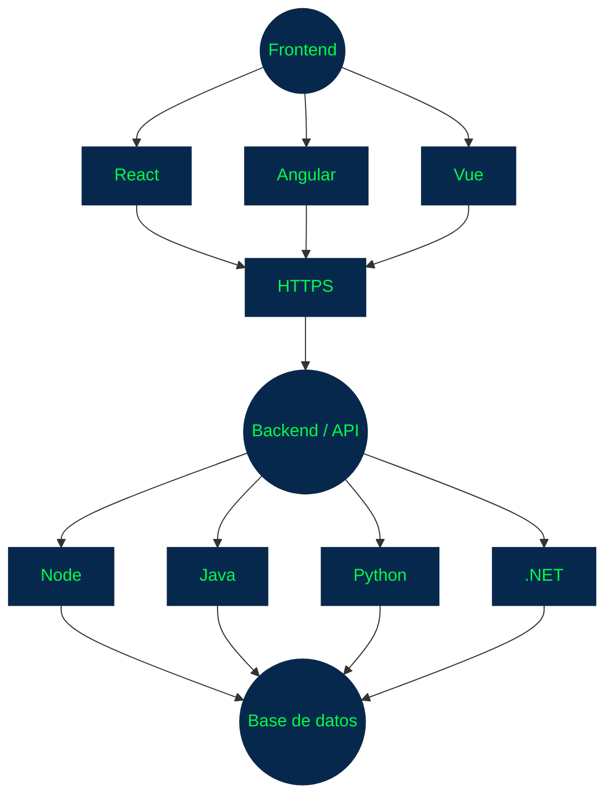

## CORS — Cross-Origin Resource Sharing

### 1. ¿Qué es CORS?

CORS (Cross-Origin Resource Sharing) es un mecanismo de seguridad de los navegadores que controla cuándo una página web puede realizar solicitudes a un servidor que pertenece a un origen diferente.

La idea fundamental es:

> Un navegador no permite libremente que una página web lea respuestas provenientes de cualquier origen.


Aunque ambos utilizan HTTPS, son **orígenes diferentes.**

El navegador puede bloquear que `miapp.com` lea la respuesta de `api.ejemplo.com` si la API no indica explícitamente que permite ese origen.

Ahí entra _**CORS**_.

### 2. Antes de CORS: ¿qué es un Origin?

Para entender CORS primero necesitas entender _**origin**_.

Un origin está compuesto por tres elementos:



Por ejemplo:

`https://ejemplo.com:443`

Tenemos:

+ Protocolo → https
+ Host      → ejemplo.com
+ Puerto    → 443

Si cualquiera de estos cambia, tenemos un origen diferente.

### 3. Ejemplos de diferentes Origins

ejemplos:

**Cambia el protocolo**

`https://ejemplo.com` -> `http://ejemplo.com`

+ `HTTP`  ≠  `HTTPS` <- Son diferentes

**Cambia el dominio**

`https://api.ejemplo.com`-> `https://ejemplo.com`

+ Aunque tengan un dominio relacionado, los hosts son distintos. son diferentes origins

**Cambia el puerto**

`https://ejemplo.com:443`-> `https://ejemplo.com:8080` 

+ `443`  ≠  `8080` <- También son diferentes origins.

### 4. Same-Origin Policy

Para entender por qué existe CORS necesitamos conocer la **Same-Origin Policy (SOP).**

Es una política de seguridad aplicada por los navegadores que restringe cómo un documento o aplicación web puede interactuar con recursos de otro origen.

Por ejemplo:


El navegador no debería permitir automáticamente que una página lea libremente información protegida proveniente de otra.

> Esto ayuda a evitar ataques en los que una página maliciosa intenta acceder a información de otros sitios utilizando las credenciales o sesión del usuario.

### 5. Entonces, ¿qué hace CORS?

Idea central:


CORS permite que el servidor indique al navegador:

+ **"Acepto solicitudes provenientes de este origen."**

Por ejemplo:

`Access-Control-Allow-Origin: https://miapp.com`

El servidor está diciendo:
+ **"Permito que una página cuyo origin es `https://miapp.com` acceda a esta respuesta."**

### 6. Un ejemplo completo

**Frontend:** `https://frontend.com`

**API:** `https://api.backend.com`

El frontend hace:

```javascript
fetch("https://api.backend.com/usuarios")
```

El navegador realiza la petición:



El servidor responde:

```http
HTTP/1.1 200 OK
Content-Type: application/json
Access-Control-Allow-Origin: https://frontend.com
```

El navegador observa:



### 7. ¿Qué ocurre si el servidor no permite ese Origin?

Supongamos que el servidor responde:

```http
HTTP/1.1 200 OK
Content-Type: application/json
```

pero no incluye:

```http
Access-Control-Allow-Origin
```

El servidor puede haber procesado correctamente la petición, pero el navegador puede impedir que el código JavaScript de la página lea la respuesta.

Esto produce uno de los errores más conocidos:

```
Access to fetch at 'https://api.backend.com'
from origin 'https://frontend.com'
has been blocked by CORS policy
```

Aquí hay una idea extremadamente importante:

> CORS es principalmente una restricción aplicada por el navegador al acceso de una página a una respuesta cross-origin.

### 8. CORS no es un protocolo de transporte

CORS no reemplaza `HTTP`.

No es: TCP, UDP, HTTP, CORS

como si fueran capas equivalentes.

seria mas correcto decir: 


> CORS es un mecanismo de seguridad relacionado con cómo los navegadores permiten que JavaScript acceda a recursos de otros origins.

### 9. El header `Origin`

Cuando corresponde, el navegador puede incluir un header como:

```http
Origin: https://frontend.com
```

Por ejemplo:

```http
GET /usuarios HTTP/1.1
Host: api.backend.com
Origin: https://frontend.com
```

El servidor puede utilizar ese valor para decidir si permite la solicitud **cross-origin.**

Puede responder:

```http
Access-Control-Allow-Origin: https://frontend.com
```

La relación sería:



### 10. `Access-Control-Allow-Origin`

Este es uno de los headers más importantes de CORS.

Por ejemplo:

```http
Access-Control-Allow-Origin: https://frontend.com
```

Indica que ese origen está permitido para el acceso correspondiente desde el navegador.

También puede aparecer:

```http
Access-Control-Allow-Origin: *
```

El `*` significa que se permite el acceso desde cualquier origen para los casos en que ese valor sea aplicable.

Pero hay una consideración importante:

> `*` no puede combinarse con credenciales de navegador como cookies en `Access-Control-Allow-Origin.`

Por eso no debes pensar simplemente:

`*` = siempre la mejor solución

> La configuración debe corresponder a las necesidades de seguridad de la aplicación.

### 11. ¿Qué es una Simple Request?

```http
GET /usuarios
```

con headers simples.

Conceptualmente:



### 12. ¿Qué es un Preflight Request?

Aquí aparece uno de los conceptos más importantes de CORS.

Para determinadas solicitudes, el navegador realiza primero una petición preflight.

Esta petición utiliza:

`OPTIONS`

El navegador pregunta esencialmente:

> "¿Me permites realizar esta solicitud cross-origin con estas características?"

**Ejemplo de Preflight**

Supongamos que JavaScript quiere realizar:

```http
POST /usuarios
Content-Type: application/json
Authorization: Bearer token
```

El navegador puede enviar primero:

```http
OPTIONS /usuarios HTTP/1.1
Host: api.backend.com
Origin: https://frontend.com
Access-Control-Request-Method: POST
Access-Control-Request-Headers: authorization, content-type
```

El servidor puede responder:

```http
HTTP/1.1 204 No Content
Access-Control-Allow-Origin: https://frontend.com
Access-Control-Allow-Methods: POST
Access-Control-Allow-Headers: authorization, content-type
```

El navegador interpreta:

+ `Origin` permitido ✔
+ `POST` permitido ✔
+ `Headers` permitidos ✔

Entonces permite que continúe la solicitud real.

**14. Flujo completo del Preflight**




Por eso, cuando estés depurando una API, puedes ver dos solicitudes:

+ OPTIONS
+ POST

y pensar:

> "¿Por qué mi POST se está ejecutando dos veces?"

En realidad, la primera puede ser el preflight de CORS.

### 15. Headers importantes de CORS 

Los principales que encontrarás son:

**Solicitud**
+ `Origin`

**durante un preflight:**

```http
Access-Control-Request-Method
Access-Control-Request-Headers
```

Respuesta:

```http
Access-Control-Allow-Origin
Access-Control-Allow-Methods
Access-Control-Allow-Headers
Access-Control-Allow-Credentials
Access-Control-Expose-Headers
```

No necesitas memorizar todos inmediatamente. Los más importantes para comenzar son:

```
Origin
Access-Control-Allow-Origin
Access-Control-Allow-Methods
Access-Control-Allow-Headers
```

### 16.`Access-Control-Allow-Methods`

Indica qué métodos pueden utilizarse en el contexto CORS permitido.

```http
Access-Control-Allow-Methods: GET, POST, PUT, DELETE
```

> Significa que esos métodos están permitidos para ese contexto.

### 17. `Access-Control-Allow-Headers`

Indica qué headers puede utilizar la solicitud cross-origin.

Por ejemplo:

```http
Access-Control-Allow-Headers: Content-Type, Authorization
```

Esto es particularmente importante cuando utilizas:

```http
Authorization: Bearer ...
```

```http
Content-Type: application/json
```

en una solicitud que requiere preflight.

### 18. CORS y credenciales

Las solicitudes pueden involucrar credenciales como:

+ cookies
+ certificados de cliente
+ mecanismos de autenticación propios del navegador

Por ejemplo, desde JavaScript:

```javascript
fetch("https://api.ejemplo.com/perfil", {
    credentials: "include"
});
```

En estos casos el servidor debe configurar adecuadamente:

```http
Access-Control-Allow-Credentials: true
```

y no puede responder con:

```http
Access-Control-Allow-Origin: *
```

para una solicitud con credenciales.

En aplicaciones reales esto es muy importante.

### 19. ¿CORS protege al servidor?

Esta es una de las confusiones más importantes.

CORS no es un mecanismo de autenticación.

CORS tampoco reemplaza:

+ HTTPS
+ Autorización
+ Tokens
+ Sesiones
+ Control de acceso

**Su función principal es controlar cómo un navegador permite a una página web acceder a recursos de otro origen.**

### Errores CORS comunes

Ahora podemos pasar a la segunda parte.

Cuando trabajas con frontend + API, algunos errores aparecen constantemente.

**Error 1** — Falta `Access-Control-Allow-Origin`

El frontend realiza:

```
https://frontend.com
        ↓
https://api.com
```

Pero el servidor no proporciona:

`Access-Control-Allow-Origin`

El navegador bloquea el acceso de JavaScript a la respuesta.

**Solución conceptual**

Configurar el servidor para permitir el origen correspondiente:

`Access-Control-Allow-Origin: https://frontend.com`

### Error 2 — Origin incorrecto

El frontend está en:

`https://frontend.com`

pero el servidor permite:

`Access-Control-Allow-Origin: https://otro-frontend.com`

No coinciden.

Resultado:

```
frontend.com
      ≠
otro-frontend.com
```

**El navegador bloquea el acceso.**

### Error 3 — Problemas con el Preflight

El navegador envía:

`OPTIONS /usuarios`

pero el servidor:

+ no responde correctamente
+ devuelve un error
+ no permite OPTIONS
+ no incluye los headers CORS necesarios

Por ejemplo:

```
OPTIONS
   ↓
405 Method Not Allowed
```

Entonces la solicitud real:

`POST`

ni siquiera llega a ejecutarse como esperabas.

### Error 4 — Falta `Access-Control-Allow-Methods`

El navegador solicita:

`Access-Control-Request-Method: PUT`

pero el servidor responde:

`Access-Control-Allow-Methods: GET, POST`

`PUT` no está permitido.

Resultado:

+ PUT ✘

### Error 5 — Falta `Access-Control-Allow-Headers`

El cliente quiere enviar:

`Authorization: Bearer token`

pero el servidor no permite ese header en la respuesta al preflight.

Por ejemplo:

`Access-Control-Allow-Headers: Content-Type`

No incluye:

`Authorization`

Entonces el navegador puede bloquear la solicitud.

### Error 6 — Usar `*` con credenciales

Un error muy común es configurar:

```http
Access-Control-Allow-Origin: *
Access-Control-Allow-Credentials: true
```

Esta combinación no es válida para permitir credenciales en CORS.

Cuando utilizas cookies o credenciales, normalmente debes especificar explícitamente el origen permitido.

Por ejemplo:

```http
Access-Control-Allow-Origin: https://frontend.com
Access-Control-Allow-Credentials: true
```

### Error 7 — Confundir CORS con un problema del servidor

Imagina que ves en DevTools:

`CORS error`

Eso no significa necesariamente:

> "La API está caída."

Puede significar:


Incluso puedes encontrarte con situaciones donde el backend procesó una solicitud, pero el navegador bloqueó el acceso de la aplicación a la respuesta.

Por eso, al depurar CORS es importante revisar la solicitud y la respuesta reales en Network, no únicamente el mensaje mostrado en la consola.

### Un ejemplo completo de problema

Supongamos:

`Frontend: http://localhost:3000`

`API: http://localhost:8080`

Aunque ambos sean `localhost`, tienen puertos diferentes:

+ `localhost:3000`
+ `localhost:8080`

Por tanto:

`Origin A ≠ Origin B`

El frontend ejecuta:

```Javascript
fetch("http://localhost:8080/api/usuarios")
```

El navegador realiza la solicitud.

Si la API no está configurada para permitir:

`http://localhost:3000`

aparecerá un error CORS

### Una observación muy importante

Muchos principiantes piensan:

> "Si estoy usando `localhost`, no debería existir CORS."

Pero:

`localhost:3000` y `localhost:8080`

son diferentes origins porque el puerto forma parte del origin.

Esto es extremadamente común durante el desarrollo.

Por ejemplo:

+ `Frontend → localhost:3000`
+ `Backend  → localhost:8080`

**CORS** aparece constantemente en este escenario.

### Resumen de CORS relacionado a los concpetos anteriores



CORS aparece encima de HTTP/HTTPS desde la perspectiva de las aplicaciones web y del navegador.

### Conceptos para recordar

### 1. Origin

Un origin está formado por:

+ `esquema + host + puerto`

Ejemplo:

+ `https://ejemplo.com:443`

###  2. Same-Origin Policy

+ El navegador restringe determinadas interacciones entre diferentes origins.

### 3. CORS

+ Permite establecer excepciones controladas a esas restricciones.

### 4. Headers

Los principales son:

+ `Origin`
+ `Access-Control-Allow-Origin`
+ `Access-Control-Allow-Methods`
+ `Access-Control-Allow-Headers`
+ `Access-Control-Allow-Credentials`

5. Preflight

Algunas solicitudes provocan primero:

`OPTIONS`

para comprobar si la operación cross-origin está permitida.

### comparación

Se puede pensar en `CORS` como un control de acceso del navegador



Y esto explica por qué CORS es especialmente importante cuando tienes una arquitectura como:

