## HTTPS y Seguridad

### 1. ¿Qué es HTTPS?

HTTPS (HyperText Transfer Protocol Secure) es HTTP funcionando sobre una conexión protegida mediante TLS (Transport Layer Security).

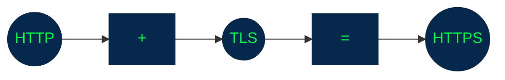

cuando visitas: `https://ejemplo.com` estás utilizando `HTTP` protegido mediante `TLS`, La idea fundamental es:
+ **`HTTPS` protege los datos mientras viajan entre el cliente y el servidor.**

### 2. HTTP vs HTTPS

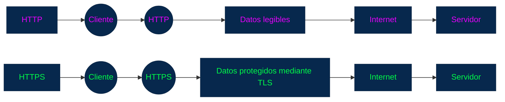

> Un atacante que consiga observar el tráfico de una conexión HTTPS correctamente establecida no debería poder interpretar directamente el contenido HTTP que está protegido por TLS.

### 3. ¿Qué problemas intenta solucionar HTTPS?

HTTPS proporciona principalmente tres propiedades de seguridad:

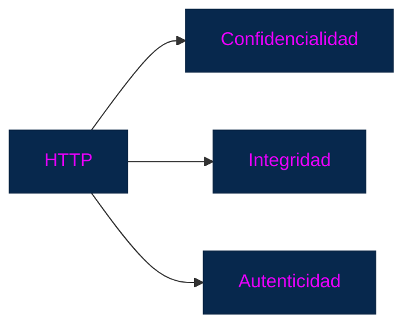

### 4. Confidencialidad

Con HTTP:

Los datos podrían transmitirse sin cifrado.


Con HTTPS:


TLS protege el contenido durante el transporte.

### 5. Integridad

La integridad significa que los datos no deberían ser modificados silenciosamente durante el tránsito.


TLS proporciona mecanismos criptográficos para detectar modificaciones del tráfico protegido.


Si los datos fueron alterados, la conexión protegida puede detectar que el contenido ya no corresponde a lo que se esperaba.

### 6. Autenticidad

HTTPS también ayuda al cliente a comprobar que está comunicándose con el servidor correspondiente.

Aquí entran los `certificados digitales`.

Por ejemplo:

`https://banco.com`

El navegador necesita tener mecanismos para verificar que el servidor realmente está autorizado para ese dominio.

Esto ayuda a proteger contra ataques como los de tipo man-in-the-middle (MITM).

### 7. ¿Qué es un ataque Man-in-the-Middle?

Un ataque **Man-in-the-Middle (_MITM_)** ocurre cuando un atacante intenta colocarse entre dos participantes de una comunicación.


TLS utiliza criptografía y certificados para dificultar este tipo de ataque.

### 8. ¿Qué es TLS?

**_TLS_ (Transport Layer Security)** es el protocolo criptográfico que proporciona la seguridad utilizada por `HTTPS`.

**Es importante distinguir:**

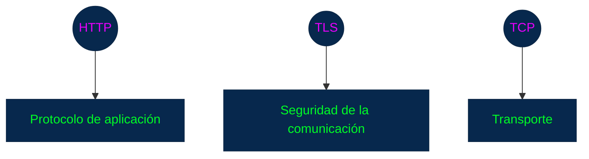

### HTTPS sobre HTTP Segun su versión 

**HTTPS en HTTP/1.1 o HTTP/2:**

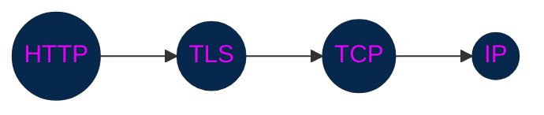

**En HTTP/3, el transporte cambia porque HTTP/3 utiliza QUIC, que funciona sobre UDP:**

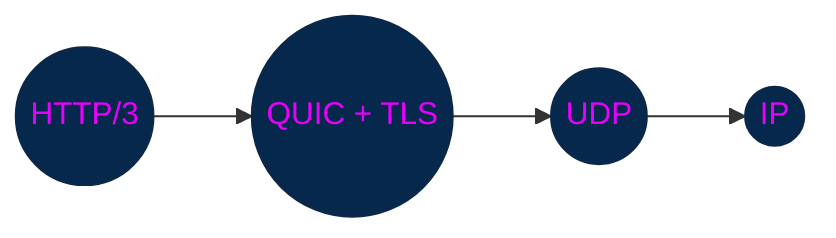

### 9. ¿Qué es un certificado digital?

Un certificado digital permite asociar una identidad, como un dominio, con una clave pública.


El certificado contiene información que permite al cliente verificar la identidad asociada a esa clave.

### 10. ¿Quién emite los certificados?

Los certificados utilizados públicamente suelen ser emitidos por entidades llamadas:

**Certificate Authorities (CA)** o Autoridades de Certificación.

Por ejemplo, conceptualmente:

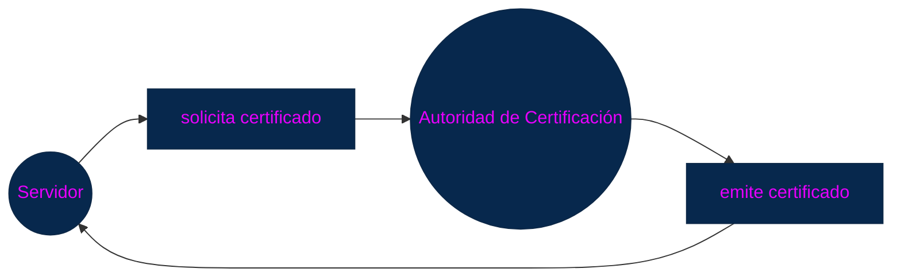

**El navegador dispone de una lista de autoridades de certificación en las que confía.**
    + el navegador puede comprobar la cadena de confianza del certificado.

### 11. La cadena de confianza

Existe normalmente una cadena de certificados:


**El navegador utiliza esta cadena para verificar que el certificado presentado por el servidor procede de una autoridad que considera confiable.**

### 12. ¿Qué ocurre cuando visitas HTTPS?

Simplificando:

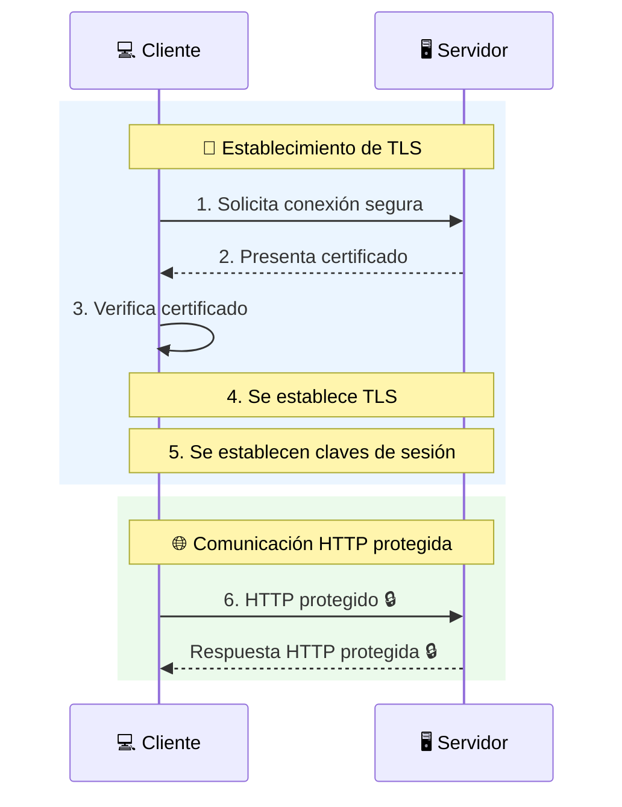

A esta fase inicial se le conoce como **TLS handshake**.

### 13. TLS Handshake

El handshake es el proceso mediante el cual cliente y servidor negocian los parámetros necesarios para establecer una conexión segura.

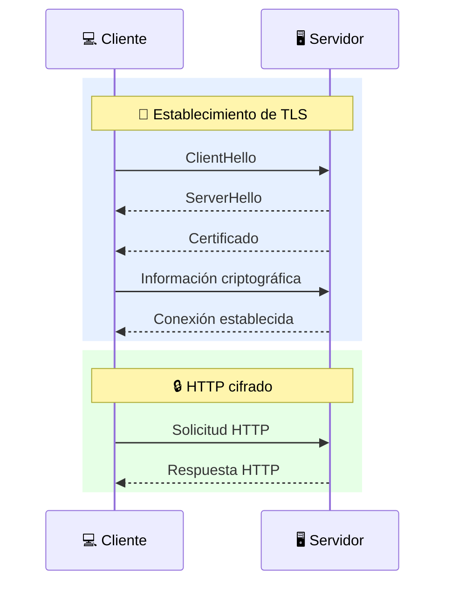

**Proposito:** Establecer una conexión segura y acordar las claves criptográficas que posteriormente protegerán la comunicación.

### 14. Criptografía asimétrica y simétrica

TLS utiliza diferentes técnicas criptográficas para diferentes propósitos.

**14. Criptografía asimétrica**

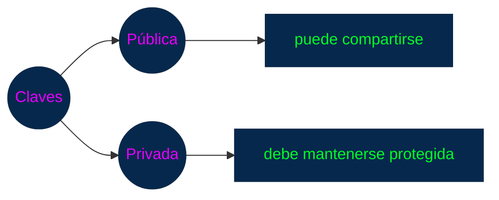

Los certificados digitales están relacionados con este sistema de claves.

**15. Criptografía simétrica**

Utiliza una clave compartida para proteger la comunicación.

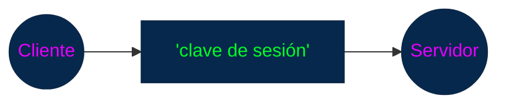

Una vez establecida la conexión segura, la comunicación utiliza algoritmos simétricos porque son mucho más eficientes para cifrar grandes cantidades de datos.


Esta combinación permite obtener tanto seguridad como eficiencia.

### 16. ¿HTTPS cifra todo?

**HTTPS** protege el contenido de la comunicación `HTTP`, pero no significa que absolutamente toda la información de red sea secreta.

Por ejemplo, existen metadatos que pueden ser observables, dependiendo del protocolo y de la configuración.

En términos básicos, `HTTPS` protege principalmente:

+ `HTTP Request -> Headers -> Body`
+ `HTTP Response -> Headers -> Body`

mientras viajan por la conexión protegida.

### 17. HTTPS y las contraseñas

Una aplicación debería evitar enviar credenciales mediante HTTP sin protección.

Incorrecto: `http://ejemplo.com/login`

Preferible: `https://ejemplo.com/login` 

`HTTPS` no hace que una aplicación sea automáticamente segura.

Protege la comunicación, pero no corrige vulnerabilidades en el código del servidor.

### 18. HTTPS no reemplaza la autenticación

| Concepto           | Función                    |
| -------------------| ---------------------------|
| HTTPS:             | Protege la comunicación    |
| Autenticación:     | Determina quién eres       |
| Autorización:      | Determina qué puedes hacer |

### 19. HTTPS tampoco reemplaza CORS

| Concepto  | Función                                           |
| ----------| --------------------------------------------------|
| CORS:     | Control del acceso cross-origin desde el navegador| 
| HTTPS:    | Protección criptográfica de la comunicación       | 

Por tanto:

`HTTPS ≠ CORS` pero Puedes tener: `HTTPS + CORS`

y es algo extremadamente habitual en aplicaciones web modernas.

### 20. ¿Por qué aparece el candado del navegador?

Cuando visitas un sitio mediante `HTTPS`, el navegador normalmente muestra un indicador de conexión segura.

🔒 `https://ejemplo.com`

siginifica: _"La conexión HTTPS/TLS cumple las condiciones de seguridad que el navegador pudo verificar."_

Pero, Un sitio puede utilizar HTTPS y aun así tener:

+ errores de programación
+ vulnerabilidades
+ contenido malicioso
+ problemas de autenticación
+ configuraciones incorrectas

### 21. HTTP Strict Transport Security — HSTS

Existe además un mecanismo llamado HSTS (HTTP Strict Transport Security).

Permite que un sitio indique al navegador que debe utilizar HTTPS para ese dominio.

por ejemplo:

```http
Strict-Transport-Security: max-age=31536000
```

Esto ayuda a reducir ciertos riesgos relacionados con conexiones HTTP no protegidas.

### 22. HTTP → HTTPS

Imagina que alguien entra en:

`http://ejemplo.com`

El servidor puede responder con una redirección:

```http
HTTP/1.1 301 Moved Permanently
Location: https://ejemplo.com
```

Entonces:

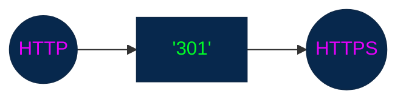

Pero una redirección por sí sola no significa que la primera conexión HTTP haya sido protegida. Por eso mecanismos como HSTS son importantes para reforzar el uso de HTTPS.

```mermaid

flowchart LR

A["INTERNET"]
B["Navegador"]
C(("HTTPS"))
D["API"]
E["Base datos"]

A --> B --> C --> D --> E

I["HTTPS protege principalmente el tramo:"]
F["Navegador"]
G(("HTTPS/TLS"))
H["API"]

F --> G --> H

style A fill:#07284d,stroke:#0d2847,stroke-width:1px,color:#e700fc;
style B fill:#07284d,stroke:#0d2847,stroke-width:1px,color:#e700fc;
style C fill:#07284d,stroke:#0d2847,stroke-width:1px,color:#00fc26;
style D fill:#07284d,stroke:#0d2847,stroke-width:1px,color:#e700fc;
style E fill:#07284d,stroke:#0d2847,stroke-width:1px,color:#e700fc;
style F fill:#07284d,stroke:#0d2847,stroke-width:1px,color:#e700fc;
style G fill:#07284d,stroke:#0d2847,stroke-width:1px,color:#00fc26;
style H fill:#07284d,stroke:#0d2847,stroke-width:1px,color:#e700fc;
style H fill:#07284d,stroke:#0d2847,stroke-width:1px,color:#002efc;
```

**La comunicación entre API y base de datos también debe protegerse adecuadamente cuando corresponda, pero eso depende de la arquitectura y de los protocolos utilizados.**

### 24. HTTPS y seguridad de APIs

Una API normalmente debería exponerse mediante HTTPS:

```mermaid

flowchart LR

A(("Frontend"))
C(("HTTPS"))
D(("API"))

A --> B --> C 

style A fill:#07284d,stroke:#0d2847,stroke-width:1px,color:#e700fc;
style B fill:#07284d,stroke:#0d2847,stroke-width:1px,color:#e700fc;
style C fill:#07284d,stroke:#0d2847,stroke-width:1px,color:#00fc26;
```

+ `POST http://api.ejemplo.com/login`  ❌
+ `POST https://api.ejemplo.com/login` ✅

Esto es particularmente importante cuando se transmiten:

+ contraseñas
+ tokens
+ cookies
+ información personal
+ datos financieros
+ información confidencial.

### 25. Algo que debes evitar: "HTTPS = cifrado de extremo a extremo"

HTTPS protege la comunicación entre el cliente y el servidor mediante TLS.

No significa automáticamente que los datos estén cifrados de extremo a extremo entre todos los componentes internos de una arquitectura.

```mermaid

flowchart LR

A(("Cliente"))
C(("HTTPS"))
D(("Load Balancer"))
E(("Backend"))
F(("Base de datos"))

A --> C --> D --> E --> F

style A fill:#07284d,stroke:#0d2847,stroke-width:1px,color:#00fc26;
style C fill:#07284d,stroke:#0d2847,stroke-width:1px,color:#fc00eb;
style D fill:#07284d,stroke:#0d2847,stroke-width:1px,color:#00fc26;
style E fill:#07284d,stroke:#0d2847,stroke-width:1px,color:#00fc26;
style F fill:#07284d,stroke:#0d2847,stroke-width:1px,color:#00fc26;
```

Puede existir TLS entre algunos o todos estos segmentos dependiendo de la arquitectura y configuración.

Esto se conoce en ciertos contextos como TLS termination cuando un componente termina la conexión TLS.

Es un concepto que podrás estudiar más adelante cuando veamos arquitectura de sistemas.

### 26 Diferencia entre los conceptos

|**Concepto**| **¿Qué protege o resuelve?**|
|---------------|-----------------------------|
|HTTP| Comunicación entre cliente y servidor|
|HTTPS| Protege esa comunicación mediante TLS|
|TLS| Proporciona seguridad criptográfica|
|Certificado| Ayuda a verificar la identidad del servidor|
|CORS| Determina quién es el usuario|
|Autenticación| Determina qué puede hacer|
|Autorización| Refuerza el uso de HTTPS|
|HSTS| Refuerza el uso de HTTPS|

### 27. Lo esencial para recordar

+ **HTTPS:** HTTPS es HTTP protegido mediante TLS.
+ **TLS:** proporciona mecanismos criptográficos para proteger la comunicación.
+ **Confidencialidad:** Evita que terceros puedan leer directamente el contenido protegido.
+ **Integridad:** Permite detectar modificaciones del tráfico protegido.
+ **Autenticidad:** Ayuda al cliente a verificar la identidad del servidor mediante certificados y una cadena de confianza.
+ **Certificado:** Asocia una identidad, como un dominio, con una clave pública y está respaldado por una cadena de confianza.
+ **HTTPS** ≠ seguridad total
+ **HTTPS** protege el canal de comunicación, pero no elimina las vulnerabilidades de la aplicación.