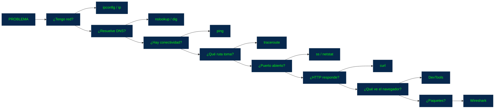

## Herramientas de Diagnóstico

### 1. ¿Qué significa "diagnosticar" una red?

Supongamos que intentas entrar a:

`https://ejemplo.com` y no funciona. no siempre se debe a la misma causa

Puede haber problemas en muchos lugares:


Las herramientas de diagnóstico permiten ir comprobando cada una de esas etapas.

### 2. Una idea fundamental: diagnosticar por capas

Cuando algo falla, puedes investigar de abajo hacia arriba:
```
1. ¿Tengo conexión de red?
       ↓
2. ¿Tengo configuración IP?
       ↓
3. ¿Funciona DNS?
       ↓
4. ¿Existe una ruta hasta el destino?
       ↓
5. ¿El puerto responde?
       ↓
6. ¿HTTPS funciona?
       ↓
7. ¿HTTP devuelve una respuesta?
       ↓
8. ¿La API / aplicación funciona?
```

Cada herramienta está especializada en una parte diferente.

### 3. DevTools del navegador

la herramienta más importante para desarrollo web.

Los navegadores como Chrome, Edge y Firefox tienen herramientas llamadas:

+ **Developer Tools (DevTools)**

Puedes abrirlas normalmente con: `F12` ó `Ctrl + Shift + I`

### 4. Network de DevTools

Dentro de DevTools existe una pestaña llamada: `Network` Esta herramienta permite observar las peticiones de red realizadas por la página.

Por ejemplo:

```
Página web
   │
   ├── GET /index.html
   ├── GET /styles.css
   ├── GET /app.js
   ├── GET /api/usuarios
   ├── GET /imagen.png
   └── POST /api/login
```

Puedes seleccionar cualquiera y ver sus detalles.

### 5. ¿Qué puedes observar en Network?

Request 

+ `GET /api/usuarios` 

Request Headers

```
Host
Accept
Authorization
Cookie
Origin
```

Response

+ `200 OK`

Response Headers

```
Content-Type
Cache-Control
Access-Control-Allow-Origin
```

Response Body

```JSON
{
  "id": 25,
  "nombre": "Juan"
}
```

### 6. Network y CORS

Esta herramienta es especialmente útil para los problemas de CORS.

Por ejemplo, puedes encontrar:

`OPTIONS /api/usuarios`

y después:

`POST /api/usuarios`

Puedes revisar:

```
Origin
Access-Control-Allow-Origin
Access-Control-Allow-Methods
Access-Control-Allow-Headers
```

Así puedes averiguar exactamente qué parte de la configuración de CORS está causando el problema

### 7. Network y códigos HTTP

También puedes detectar inmediatamente:

`200 - 201 - 301 - 304 - 400 - 401 - 403 - 404 - 500 - 502 - 503`

Por ejemplo:

```
GET /api/usuarios → 200
GET /api/productos/999 → 404
POST /api/login → 401
POST /api/productos → 500
```

### 8. Network y tiempos de respuesta

DevTools también permite observar cuánto tarda cada solicitud.

Por ejemplo:

```
DNS        20 ms
Connect    30 ms
TLS        50 ms
Request    10 ms
Response  100 ms
------------------
Total     210 ms
```

Los detalles exactos dependen del navegador y de la conexión, pero la idea es poder identificar dónde se está consumiendo el tiempo.

Esto sirve para detectar:

+ servidores lentos
+ APIs lentas
+ archivos muy grandes
+ problemas de red
+ múltiples solicitudes innecesarias

### 9. `ping`

`ping` es una de las herramientas de diagnóstico más conocidas.

Se utiliza para comprobar si existe conectividad de red hacia un destino que responde a ICMP.

Por ejemplo:

```Bash
ping google.com
```

Podrías obtener algo parecido a:
```
Reply from 142.250.x.x:
time=20ms
```

Esto proporciona información sobre:

+ si existe conectividad hacia ese destino
+ tiempo aproximado de ida y vuelta
+ pérdida de paquetes, según el sistema y la prueba

### 10. ¿Qué NO demuestra `ping`?

```Bash
ping ejemplo.com
```
Si funciona: no significa automáticamente que la página web funcione.

Puede ocurrir:

+ Ping ✔
+ HTTPS ✘

porque el servidor puede responder a ICMP pero tener el servicio web caído.

porque el servidor puede responder a ICMP pero tener el servicio web caído.

+ Ping ✘
+ HTTPS ✔

porque algunos servidores, firewalls o redes bloquean ICMP mientras el servicio web sigue disponible.

Por eso `ping` sirve para una parte concreta del diagnóstico, no para comprobar una aplicación completa.

### 11. nslookup

Esta herramienta permite consultar `DNS`. 

Por ejemplo:

```Bash
nslookup ejemplo.com
```

Podrías obtener:

```
Name:    ejemplo.com
Address: 93.184.216.34
```

Esto te permite comprobar:

+ _¿El nombre de dominio está resolviendo correctamente a una dirección IP?_

### 12. `dig`

`dig` realiza consultas DNS de forma más detallada y es muy utilizada para diagnóstico.

Ejemplo:

```Bash
dig ejemplo.com
```

Puedes encontrar información como:

+ servidores DNS consultados
+ registros
+ dirección IP
+ TTL
+ tiempos de consulta

```Bash
dig A ejemplo.com
```

consulta el registro A, utilizado para direcciones IPv4.

```Bash
dig AAA ejemplo.com
```

para IPv6.

### 13. `traceroute` / `tracert`

Estas herramientas permiten observar, de forma aproximada, el camino que siguen los paquetes hacia un destino.

En Linux/macOS:

```Bash
traceroute ejemplo.com
```

En Windows:

```cmd
tracert ejemplo.com
```

Podrías ver algo parecido a:

1. router-local
2. proveedor
3. nodo-isp
4. ...
5. destino

Esto es útil cuando sospechas que existe un problema en algún punto intermedio de la ruta.

### 14. ipconfig / ifconfig / ip

Estas herramientas permiten conocer la configuración de red de tu propio equipo.

En Windows:

```cmd
ipconfig
```

En Linux:

```Bash
ip addr
```

En sistemas Unix también puedes encontrar:

```Bash
ifconfig
```

Puedes consultar información como:

```
Dirección IP
Máscara de red
Gateway
DNS
Interfaces
```

Por ejemplo:

```
IPv4:    192.168.1.20
Gateway: 192.168.1.1
```

Esto es útil cuando el problema está en tu propia configuración de red.

### 15. `netstat` / `ss`

Estas herramientas permiten observar conexiones y puertos utilizados por el sistema.

En Linux es común:

```Bash
ss -tuln
```

En Windows puedes utilizar:

```cmd
netstat -ano
```

Podrías ver algo como:

```
0.0.0.0:80
0.0.0.0:443
127.0.0.1:3000
```

Esto ayuda a responder:

+ **¿Hay realmente un programa escuchando en ese puerto?**


### 16. Ejemplo con `localhost`

Supongamos que estás desarrollando una API:

`http://localhost:3000`

Tu navegador dice:

`ERR_CONNECTION_REFUSED`

```Bash
Puedes comprobar si existe un proceso escuchando:
```

```cmd
ss -tuln
```

o en Windows:

```cmd
netstat -ano
```

Si no aparece:

`:3000`

posiblemente tu aplicación no está ejecutándose o no está escuchando en ese puerto.

### 17. `curl`

`curl` es una herramienta extremadamente importante para un desarrollador.

Permite realizar solicitudes HTTP desde la terminal.

Por ejemplo:

```Bash
curl https://ejemplo.com
```

El servidor podría devolver HTML directamente en la consola.

### 18. `curl` y APIs

Supongamos que tienes:

`GET /api/usuarios`

Puedes realizar:

```Bash
curl https://api.ejemplo.com/usuarios
```

Y podrías recibir:

```JSON
[
  {
    "id": 1,
    "nombre": "Juan"
  }
]
```

Esto permite probar la API sin necesidad de abrir un navegador.

### 19. `curl` mostrando headers

Una opción muy útil:

```Bash
curl -i https://ejemplo.com
```

Puedes ver algo parecido a:

```http
HTTP/1.1 200 OK
Content-Type: text/html
Cache-Control: max-age=3600

<html>
...
```

Esto conecta directamente con lo que estudiaste sobre:

+ status codes
+ headers
+ body

### 20. `curl` para probar métodos HTTP

GET

```Bash
curl https://api.ejemplo.com/usuarios
```

POST

```Bash
curl -X POST https://api.ejemplo.com/usuarios
```

Enviar JSON

```Bash
curl -X POST https://api.ejemplo.com/usuarios \
  -H "Content-Type: application/json" \
  -d '{"nombre":"Juan"}'
```

Ahora puedes probar directamente la estructura que aprendiste en Estructura de una Petición HTTP.

### 21. Postman

Postman es una herramienta orientada principalmente al trabajo con APIs.

En lugar de utilizar la terminal:

```Bash
curl ...
```

puedes construir una solicitud visualmente.

Por ejemplo:

```
POST
https://api.ejemplo.com/usuarios
```

Headers:

```
Content-Type: application/json
Authorization: Bearer ...
```

Body:

```JSON
{
  "nombre": "Juan"
}

Y luego observar:

Status:
201 Created

Headers:
...

Response:
{
   ...
}
```

### 22. ¿Postman y `curl` hacen lo mismo?

En muchos casos pueden realizar pruebas similares, pero tienen enfoques diferentes.

|`curl`| **Postman**|
|---------------|-----------------------------|
|Terminal| Interfaz gráfica|
|Muy ligero| Más orientado a colecciones y pruebas|
|Excelente para scripts| Excelente para explorar APIs|
|Automatizable| Cómodo para trabajo manual|
|Muy usado en servidores y DevOps| Muy usado durante desarrollo y pruebas|

No necesitas elegir uno exclusivamente.

Como desarrollador es útil conocer ambos.

### 23. Wireshark

Ahora entramos a un nivel más profundo.

Wireshark permite capturar y analizar paquetes de red.

En lugar de mirar:

`HTTP Request`

puedes observar el tráfico a un nivel mucho más cercano a la red.

Por ejemplo:


### 24. ¿Qué puedes hacer con Wireshark?

Puedes analizar:

+ paquetes
+ direcciones IP
+ puertos
+ TCP
+ UDP
+ DNS
+ algunos protocolos de aplicación
+ retransmisiones
+ errores de comunicación
+ tiempos

Es una herramienta potentísima.

Pero para tu nivel actual no necesitas dominarla todavía.

Basta con comprender:

**Wireshark permite observar y analizar el tráfico de red a nivel de paquetes.**

### 25. HTTPS y Wireshark

Aquí aparece una diferencia importante.

Si capturas tráfico HTTPS correctamente protegido:

`TLS -> Datos cifrados`

no puedes simplemente leer el contenido HTTP como si fuera texto plano.

Puedes observar metadatos y partes del intercambio TLS, pero el contenido protegido requiere las condiciones adecuadas para poder ser inspeccionado.

Esto explica por qué:

`HTTP → puedes observar fácilmente el contenido`

`HTTPS → el contenido está protegido por TLS`

### 26. Herramientas según el problema

| Problema                                 | Herramienta                  |
| ---------------------------------------- | ---------------------------- |
| ¿Tengo configuración IP?                 | `ipconfig`, `ip addr`        |
| ¿Puedo llegar al destino?                | `ping`                       |
| ¿DNS está resolviendo?                   | `nslookup`, `dig`            |
| ¿Qué ruta toman los paquetes?            | `traceroute`, `tracert`      |
| ¿Hay un proceso escuchando en un puerto? | `netstat`, `ss`              |
| ¿HTTP/HTTPS responde?                    | `curl`                       |
| ¿Qué envía el navegador?                 | DevTools → Network           |
| ¿Hay un problema de CORS?                | DevTools → Network / Console |
| ¿Cómo funciona una API?                  | Postman / `curl`             |
| ¿Qué paquetes están viajando?            | Wireshark                    |
| ¿Qué devuelve una página?                | DevTools / `curl`            |

### 27. Un ejemplo real de diagnóstico

Imagina que intentas abrir:

`https://api.ejemplo.com`

y no funciona.

No empezarías inmediatamente modificando código.

Podrías seguir este proceso:

**Paso 1 — DNS**

```Bash
nslookup api.ejemplo.com
```

Pregunta:

> ¿El dominio resuelve correctamente?

**Paso 2 — conectividad**

```Bash
ping api.ejemplo.com
```

Pregunta:

> ¿Tengo conectividad hacia ese destino?

Recuerda que un fallo aquí no demuestra por sí solo que HTTPS esté caído.

**Paso 3 — ruta**

```cmd
tracert api.ejemplo.com
```

o:

```Bash
traceroute api.ejemplo.com
```

Pregunta:

> ¿Hay algún problema aparente en el camino?

**Paso 4 — HTTP/HTTPS**

```Bash
curl -I https://api.ejemplo.com
```

Pregunta:

> ¿El servidor HTTPS responde y qué status devuelve?

Podrías encontrar:

```
200
301
403
404
500
503
```

**Paso 5 — navegador**

Abres:

`DevTools → Network`

y revisas:

```
Request
Headers
Status
Response
Timing
CORS
```

**Paso 6 — API**

Puedes reproducir la solicitud con:

`Postman` ó `curl

Así puedes determinar si el problema está relacionado con el navegador, `CORS` o con la propia **API**.

### 28. Diagnóstico por capas



### 29. Una herramienta no prueba todo

Esto es fundamental para no sacar conclusiones incorrectas.

Por ejemplo:

+ `ping` ✔ no demuestra: `HTTPS` ✔ 
    + ↓
+ `nslookup` ✔ no demuestra: `API` ✔ 
    + ↓
+ `curl` ✔ no garantiza: `Frontend JavaScript` ✔

> Cada herramienta responde preguntas diferentes.

### 30. Ejemplo de diagnóstico de CORS

Supongamos que tienes:

```
Frontend:
http://localhost:3000

API:
http://localhost:8080
```

El navegador muestra:

`CORS policy blocked...`

Podrías abrir:

```
DevTools
   ↓
Network
   ↓
OPTIONS /api/usuarios
```

Y encontrar:

`Origin: http://localhost:3000`

Pero el servidor responde:

`Access-Control-Allow-Origin: http://localhost:5173`

Entonces inmediatamente descubres el problema:

```
Permitido:
localhost:5173

Solicitado:
localhost:3000
```

**No coinciden.**

### 31. Herramientas para aprender primero

**Nivel 1 — Imprescindibles**

```
DevTools → Network
curl
nslookup / dig
ping
```
**Nivel 2 — Muy útiles**

```
ipconfig / ip
tracert / traceroute
netstat / ss
Postman
```
**Nivel 3 — Más profundo**

`Wireshark`

### 32. Lo esencial de las herramientas de diagnostico


+ `ipconfig / ip` → configuración de red local
+ `ping` → conectividad mediante **ICMP**
+ `nslookup` / dig → resolución **DNS**
+ `tracert / traceroute` → ruta hacia el destino
+ `netstat / ss` → conexiones y puertos
+ `curl` → pruebas **HTTP/HTTPS** desde terminal
+ `DevTools` → inspección de **requests, responses, headers, CORS, tiempos y recursos del navegador**
+ `Postman` → pruebas y exploración de _**APIs**_
+ `Wireshark` → captura y análisis de paquetes