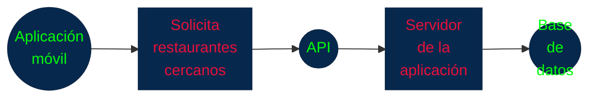
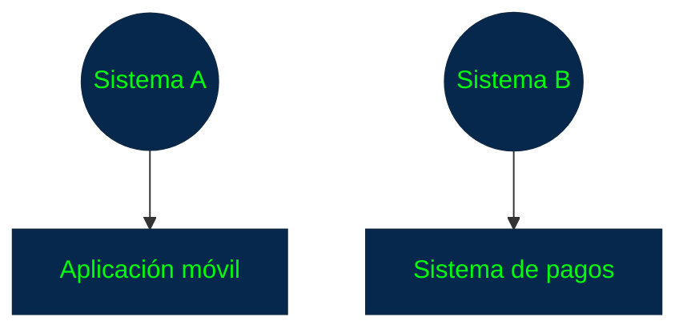
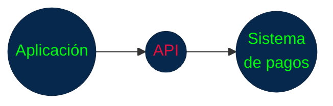
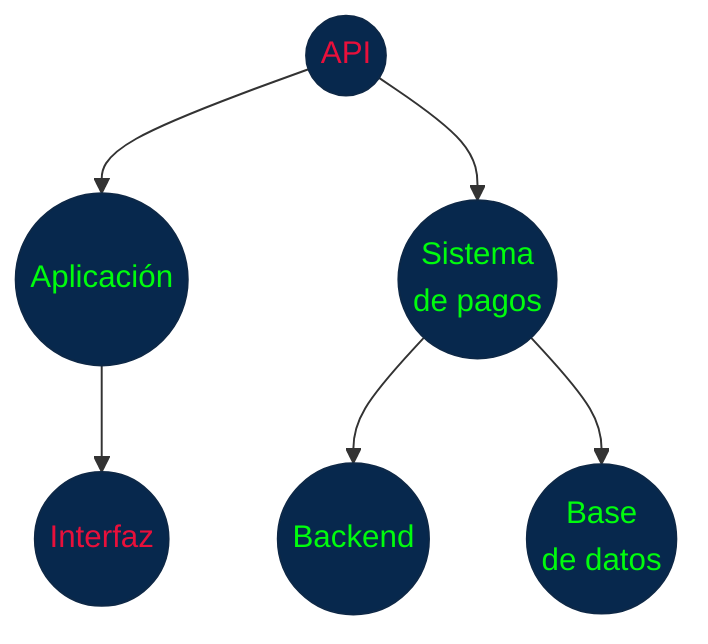
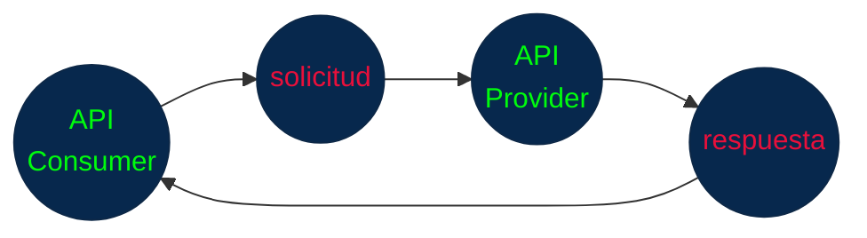
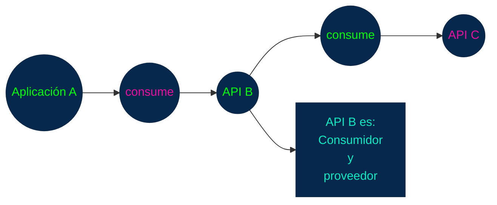
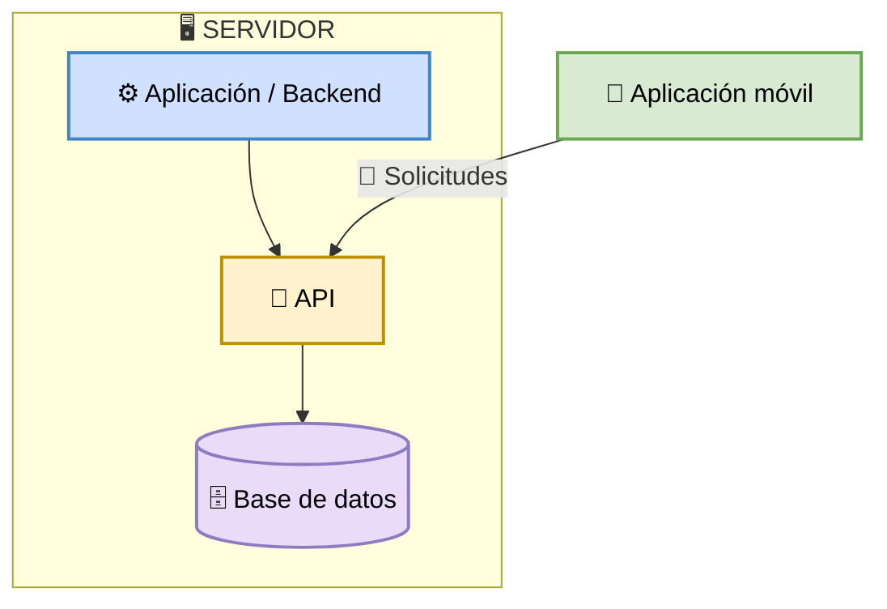
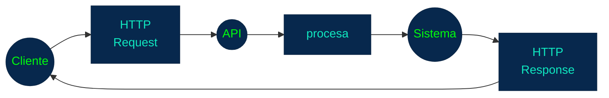
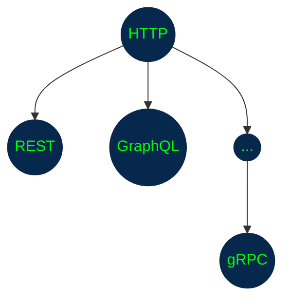
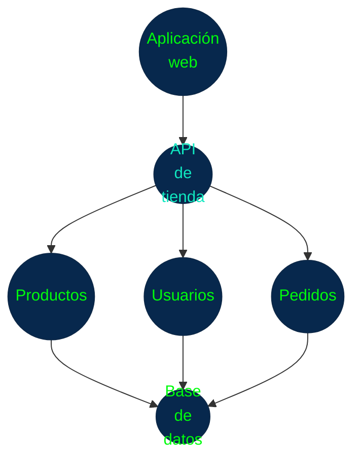

## 1. APIs y Comunicación entre Sistemas

### 1.1 ¿Qué es una API?

**API** significa **Application Programming Interface** (_Interfaz de Programación de Aplicaciones_).

Una **API** es un conjunto de reglas y mecanismos que permite que un programa pueda comunicarse con otro programa.

> Una API define cómo un sistema puede solicitar información o acciones a otro sistema.



**La aplicación móvil no necesita acceder directamente a la base de datos.**

En cambio, realiza una solicitud a la API:

`GET /restaurants?location=Bogota`

Y la API puede responder:

```JSON
[
  {
    "id": 1,
    "name": "Restaurante A"
  },
  {
    "id": 2,
    "name": "Restaurante B"
  }
]
```

La aplicación recibe los datos y los utiliza para construir su interfaz.

**La idea fundamental**

Define cosas como:

+ ¿Qué operaciones están disponibles?
+ ¿Qué información se puede solicitar?
+ ¿Qué datos deben enviarse?
+ ¿Qué formato tienen los datos?
+ ¿Qué respuestas puede devolver el sistema?
+ ¿Qué condiciones deben cumplirse para acceder?

### 1.2 ¿Por qué necesitamos APIs?

Imagina que tienes dos sistemas independientes:



La aplicación necesita realizar un pago.

Podría intentar acceder directamente a la base de datos del sistema de pagos, pero eso **sería una mala arquitectura**.

En lugar de eso:



La **API** establece una **interfaz controlada** entre ambos sistemas.

Esto permite que cada sistema **mantenga su propia implementación interna**.

Por ejemplo:



La aplicación no necesita saber:

+ ¿Qué lenguaje utiliza el sistema de pagos?
+ ¿Cómo está estructurada su base de datos?
+ ¿Qué framework utiliza?
+ ¿Cómo procesa internamente las transacciones?

Solo necesita conocer el contrato de la **API**.

### 1.3 API como contrato

Una API puede establecer algo como:

`POST /users`

Y especificar:

**Entrada**

```JSON
{
  "name": "Juan",
  "email": "juan@example.com"
}
```

**Salida**

```JSON
{
  "id": 123,
  "name": "Juan",
  "email": "juan@example.com"
}
```

El consumidor de la API sabe:

> "Si envío estos datos siguiendo estas reglas, puedo solicitar la creación de un usuario y recibiré una respuesta con esta estructura."

**No necesita conocer cómo se implementó internamente.**

Por eso se suele hablar de una API como un **contrato entre consumidor y proveedor**.

### 1.4 Consumidor y proveedor de una API

En una comunicación mediante **API** normalmente podemos distinguir dos participantes.

**API Provider**

Es el sistema que ofrece la API.

Por ejemplo:

```
Servidor de una tienda
       │
       └── API de productos
```

**API Consumer**

Es el sistema que utiliza la **API**.

Por ejemplo:

```
Aplicación móvil
       │
       └── consume API de productos
```



Un mismo sistema puede ser consumidor y proveedor simultáneamente.



> Esto es muy común en arquitecturas modernas.

### 1.5 API no significa necesariamente API web

**API y API HTTP no son exactamente lo mismo.**

Una API es un concepto general.

Puede existir una API para:

+ una biblioteca de programación
+ un sistema operativo
+ una base de datos
+ un dispositivo
+ una aplicación
+ un servicio remoto

Por ejemplo, cuando utilizas una función de una biblioteca:

```Python
lista.append(10)
```

estás utilizando una interfaz proporcionada por esa biblioteca.

Sin embargo, en desarrollo web cuando hablamos de API normalmente nos referimos a una API accesible mediante una red, frecuentemente mediante HTTP.

Es ahí donde aparecen:

+ **`REST`**
+ **`GraphQL`**
+ **`gRPC`***

**`API HTTP` es un tipo específico de API que funciona exclusivamente a través de internet usando el protocolo HTTP**

### 1.6 API, aplicación y servidor no son lo mismo

Es muy importante no confundir estos conceptos.

**Aplicación**

+ Es el software que realiza una determinada función.

**Servidor**

+ Es el sistema que recibe solicitudes y proporciona servicios o recursos.

**API**

+ Es la interfaz mediante la cual otros sistemas pueden interactuar con una aplicación o servicio.

Por ejemplo:



La `API` es **una parte de la arquitectura**, no necesariamente un programa independiente.

### 1.7 API como capa de abstracción

Una de las ventajas más importantes de las APIs es la abstracción.

Supongamos que una API permite:

`GET /products/123`

El consumidor solamente necesita saber:

> "_Este endpoint me devuelve el producto 123._"

No necesita saber si internamente el servidor hace:

```
API
 │
 ├── consulta PostgreSQL
 │
 ├── ejecuta lógica empresarial
 │
 ├── consulta Redis
 │
 ├── llama otro servicio
 │
 └── construye respuesta
```

Todo eso está oculto detrás de la API.

Por eso podemos pensar:

```
                 API
                  │
       ┌──────────┴──────────┐
       │                     │
    Exterior               Interior
       │                     │
       │              implementación
       │              del sistema
       │
   contrato
```

El consumidor depende del contrato, no de la implementación interna.

### 1.8 ¿Dónde entra HTTP?

> HTTP puede utilizarse como mecanismo de transporte para una API web.

Por ejemplo:



Y sobre HTTP podemos construir diferentes **estilos de API**.



Aunque **`REST, GraphQL y gRPC`** no son simplemente **"tres versiones de HTTP"**. Cada uno tiene una forma diferente de diseñar la comunicación entre sistemas.

### 1.9 Una API no es solamente un endpoint

_Una URL o endpoint_ puede formar parte de una `API`, pero una `API` es **mucho más amplia**.

Por ejemplo:

```
API de usuarios
│
├── GET /users
├── GET /users/{id}
├── POST /users
├── PUT /users/{id}
├── DELETE /users/{id}
│
├── reglas de datos
├── autenticación
├── autorización
├── formatos
├── errores
└── documentación
```

La `API` comprende el **conjunto de reglas** que permiten utilizar ese servicio.

### 1.10 Ejemplo completo



El frontend podría solicitar:

+ `GET /products`

Para crear un pedido:

+ `POST /orders`

Para consultar un usuario:

+ `GET /users/25`

Y para cancelar un pedido:

+ `DELETE /orders/150`

Estas operaciones forman parte del contrato de la API.

## 2. Estilos de API

¿Existe una única manera correcta de diseñar esa API?

+ **No.**

Existen diferentes formas de diseñar la comunicación entre sistemas.

Los tres estilos que son especialmente importantes:

| Estilo      | Idea principal                                                                                  |
| ----------- | ----------------------------------------------------------------------------------------------- |
| **REST**    | Trabajar con recursos mediante una interfaz uniforme                                            |
| **GraphQL** | El cliente especifica exactamente los datos que necesita                                        |
| **gRPC**    | Comunicación basada en llamadas a procedimientos/servicios, con contratos fuertemente definidos |

