## REST — Representational State Transfer

### 1. ¿Qué es REST?

**REST** significa _Representational State Transfer_.

**REST** es un _estilo arquitectónico_ para diseñar sistemas que se comunican mediante una red.

Esto es importante:

Es un conjunto de **principios y restricciones arquitectónicas** que permiten diseñar `APIs` de manera consistente.

**RESTful API**

+ Se usa para referirnos a una `API` que sigue los principios de **REST**.

### 2. La idea fundamental de REST

La idea central de REST es que un sistema expone **recursos** que pueden ser identificados y manipulados mediante una interfaz uniforme.

Por ejemplo, una aplicación de una tienda:

**Recursos"
```
Usuarios
Productos
Pedidos
Categorías
Reseñas
```

Cada recurso puede tener una representación accesible mediante la API.

```
/users
/products
/orders
/reviews
```

Podemos imaginarlo así:

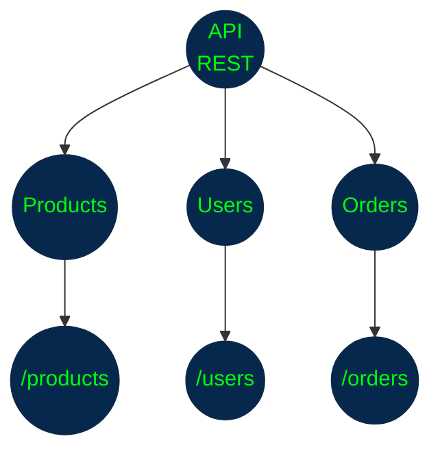

La API no debería diseñarse pensando principalmente en:

**"¿Qué funciones tiene mi programa?"**

sino en:

**"¿Qué recursos estoy exponiendo y cómo se relacionan?"**

Esta diferencia es fundamental.

### 3. Recursos

Un recurso es cualquier entidad que el sistema puede identificar y gestionar.

```
Usuario
Producto
Pedido
Factura
Comentario
Categoría
```

+ Supongamos que tenemos: `Producto #25` -> Podríamos identificarlo mediante: `/products/25`

+ Mientras que todos los productos podrían estar representados por: `/products` Por tanto: `/products` representa la colección de productos. -> Y `/products/25` representa un producto específico.

**Ejemplo**

```
/products
/products/10
/products/25
/products/80
```

Conceptualmente:

```
/products
    │
    ├── 10
    ├── 25
    └── 80
```

### 4. Recursos vs. acciones

Esta es una de las diferencias más importantes al diseñar REST.

Una **API** tradicional podría diseñarse así:

```
/getUsers
/createUser
/deleteUser
/updateUser
```

Aquí los endpoints están expresando acciones.

`REST` propone representar principalmente recursos:

```
/users
/users/25
```

Y utilizar el método HTTP para indicar la operación.

Por ejemplo:

| Operación            | Recurso     |
| -------------------- | ----------- |
| Obtener usuarios     | `/users`    |
| Obtener usuario 25   | `/users/25` |
| Crear usuario        | `/users`    |
| Modificar usuario 25 | `/users/25` |
| Eliminar usuario 25  | `/users/25` |

El verbo ya está expresado mediante HTTP.

Por eso normalmente evitamos:

```
/createUser
/deleteUser
/updateUser
```

y preferimos:

```
POST   /users
DELETE /users/25
PUT    /users/25
```

### 5. Identificación de recursos

Cada recurso debería poder identificarse de manera clara.

Por ejemplo:

```
/users
/users/15

/products
/products/827

/orders
/orders/5001
```

También podemos tener relaciones entre recursos:

`/users/15/orders`

que conceptualmente significa:
> Los pedidos asociados al usuario 15.

O:

`/orders/5001/items`
> Los elementos que pertenecen al pedido 5001.

Esto permite expresar relaciones entre recursos mediante la estructura de la `API`.

### 6. Representaciones

Aquí aparece una palabra muy importante de **REST**:

**Representation — Representación**

**REST** no necesariamente expone directamente el objeto interno del servidor.

Expone una representación del recurso.

Por ejemplo, internamente el servidor podría tener:

```
User
├── id
├── name
├── email
├── passwordHash
├── createdAt
└── internalMetadata
```

Pero la API podría representar ese usuario así:

```JSON
{
  "id": 15,
  "name": "Juan",
  "email": "juan@example.com"
}
```

Esta es una representación del recurso.

El recurso real existe dentro del sistema, mientras que el cliente recibe una representación de él.

### 7. ¿Por qué se llama Representational State Transfer?

El nombre puede parecer complicado, pero podemos dividirlo:

**Representational**

El cliente recibe una representación del recurso

```JSON
{
  "id": 15,
  "name": "Juan"
}
```

**State**

La representación refleja un determinado estado del recurso.

```
Usuario 15
Nombre: Juan
Estado: activo
```

Si posteriormente el usuario cambia su nombre:

```
Usuario 15
Nombre: Carlos
Estado: activo
```

la representación cambia.

**Transfer**

Esa representación se **transfiere entre cliente y servidor**.

```
Servidor
   │
   │ representación
   ▼
Cliente
```

Por eso:
> Representational State Transfer = transferencia de representaciones del estado de recursos.

### 8. La restricción Stateless

Esta es una de las características fundamentales de `REST`.

**Stateless** significa que cada solicitud debe contener la información necesaria para que el servidor pueda procesarla.

El servidor no debería depender de un estado de sesión almacenado entre solicitudes para interpretar qué significa una nueva solicitud.

Por ejemplo:

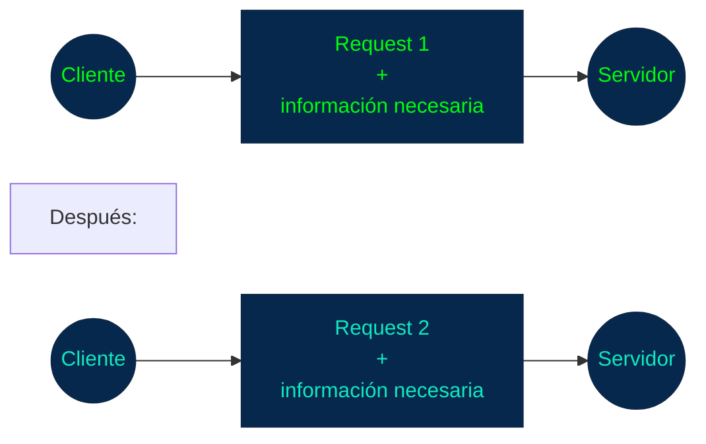

El servidor no debería necesitar recordar:
> "Este cliente hizo anteriormente la solicitud X, por lo tanto ahora debo interpretar Y."

**Cada solicitud debe poder entenderse por sí misma.**

### 9. Stateless no significa "sin estado"

Esta confusión es muy común.

**REST** no significa que el sistema no tenga datos ni estados.

Un servidor puede tener perfectamente:

```
Usuarios
Pedidos
Productos
Sesiones
Configuraciones
```

Lo que significa Stateless es que:
> **el servidor no debe depender del estado de una conversación previa entre cliente y servidor para comprender una solicitud.**

Por ejemplo:

```
Servidor
│
├── Base de datos
│   ├── usuarios
│   ├── productos
│   └── pedidos
│
└── No depende de una sesión conversacional
    para interpretar cada request
```

### 10. Ejemplo de Stateless

Imaginemos una API protegida mediante un token.

El cliente realiza:

```
GET /orders/500
Authorization: Bearer TOKEN
```

El servidor puede utilizar la información de esa solicitud para determinar:

```
¿Quién realiza la solicitud?
        ↓
¿Qué recurso solicita?
        ↓
¿Tiene permiso?
        ↓
¿Qué debe devolver?
```

No necesita depender de que el cliente haya realizado previamente:

`POST /login`

en esa misma conexión o conversación para saber quién es.

El token permite transportar la información necesaria para procesar la solicitud.

### 11. Interfaz uniforme

Otra restricción fundamental de REST es la **Uniform Interface.**

La idea es que los recursos se manipulen mediante una interfaz consistente y predecible.

GET    /products
GET    /products/25
POST   /products
PUT    /products/25
DELETE /products/25

Una persona que conoce REST puede comprender rápidamente qué hace cada operación.

No necesita aprender una función completamente diferente para cada recurso.

Por ejemplo, 

```
GET    /products
GET    /products/25
POST   /products
PUT    /products/25
DELETE /products/25
```

Una persona que conoce REST puede comprender rápidamente qué hace cada operación.

No necesita aprender una función completamente diferente para cada recurso.

sería menos consistente tener:

```
GET /getAllProducts
POST /makeNewProduct
POST /removeProduct
GET /fetchSingleProduct
```

La uniformidad facilita:

+ aprendizaje
+ mantenimiento
+ documentación
+ integración
+ reutilización
+ evolución de la API

### 12. Separación Cliente-Servidor

REST también establece una separación entre Cliente y Servidor.

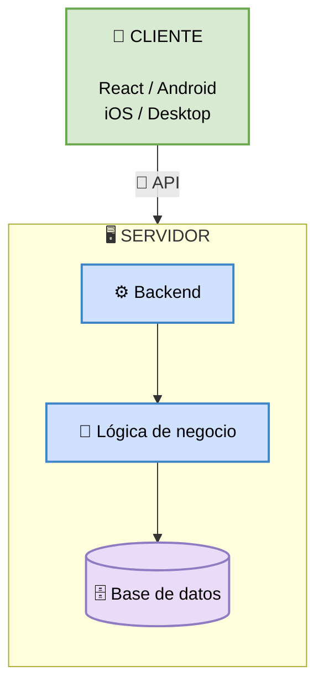

+ El cliente se ocupa principalmente de la interacción con el usuario.

+ El servidor se ocupa de proporcionar los datos y servicios.

+ **Esto permite que diferentes clientes consuman la misma API.**

```
              API REST
             /    |    \
            /     |     \
           ▼      ▼      ▼
        Web     Android   iOS
```

Los tres clientes pueden utilizar el mismo backend.

### 13. Cacheable

**REST** también establece que las respuestas deberían indicar si pueden ser almacenadas temporalmente en caché.

Esto puede mejorar:

+ rendimiento
+ latencia
+ consumo de red
+ carga del servidor

Por ejemplo

`GET /products/25`

Si el producto cambia muy pocas veces, una respuesta podría ser reutilizada durante determinado período.

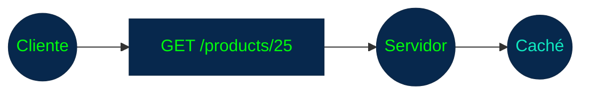

La siguiente solicitud puede evitar una nueva operación contra el servidor dependiendo de las reglas de caché.

Esto es especialmente útil para recursos relativamente estáticos.

### 14. Sistema por capas

**REST** también permite una arquitectura organizada en capas.

Por ejemplo:

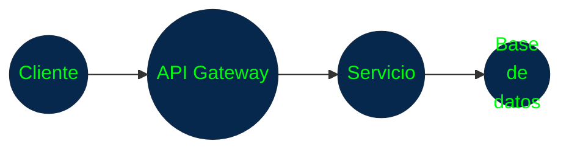

El cliente no necesariamente sabe cuántas capas existen detrás de la API.

Puede existir:

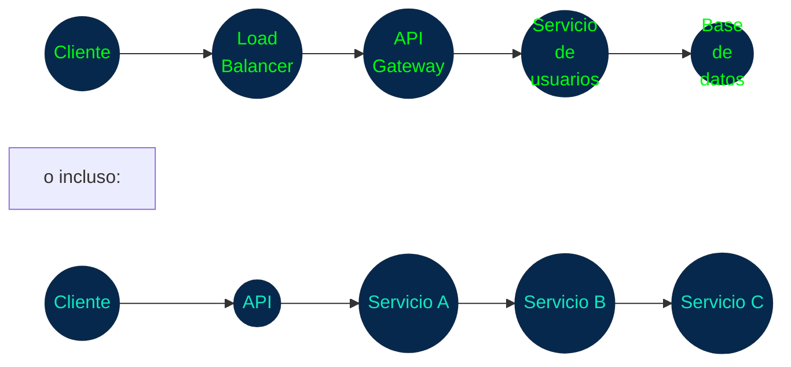

Cada capa puede encargarse de una responsabilidad diferente.

### 15. Idempotencia

Este concepto es muy importante en APIs REST.

Una operación es idempotente cuando realizarla varias veces produce el mismo efecto final que realizarla una sola vez.

Por ejemplo:

`PUT /users/25`

con:

```JSON
{
  "name": "Juan"
}
```

Si ejecutamos la misma operación:

+ 1 vez
+ 2 veces
+ 10 veces
+ 100 veces

el estado final debería seguir siendo:

```
Usuario 25
Nombre: Juan
```

No debería convertirse en:

`Juan Juan Juan...`

**Métodos y la idempotencia**

De forma general:

| Método | Idempotente      |
| -------| -----------------|
| GET    | Sí               |
| PUT    | Sí               |
| DELETE | Sí               |
| POST   | No necesariamente| 

Esto tiene importantes implicaciones en _**sistemas distribuidos**_.

Por ejemplo, si una solicitud falla debido a un problema de red, un cliente puede necesitar decidir si es seguro repetirla.

### 16. REST no significa CRUD

**CRUD** significa:

+ Create
+ Read
+ Update
+ Delete

**REST** es un estilo arquitectónico mucho más amplio.

**CRUD** puede encajar muy bien con REST:

```
Create → POST
Read   → GET
Update → PUT/PATCH
Delete → DELETE
```

**REST** también involucra:

+ recursos
+ representaciones
+ interfaz uniforme
+ statelessness
+ separación cliente-servidor
+ cacheabilidad
+ sistema por capas
+ hipermedia/HATEOAS

### 17. REST y JSON

`REST` **no obliga a utilizar JSON.**

Una **API REST** puede utilizar diferentes formatos de representación:

```
JSON
XML
HTML
texto
otros formatos
```

Sin embargo, **JSON es extremadamente común en APIs REST modernas.**

Por ejemplo:

```JSON
{
  "id": 25,
  "name": "Laptop",
  "price": 2500000
}
```

**JSON es un formato de representación frecuente en REST, pero JSON y REST no son sinónimos.**

### 18. HATEOAS

Este es uno de los conceptos más avanzados de **REST**.

Significa:

**Hypermedia As The Engine Of Application State**

La idea es que una representación de un recurso puede incluir enlaces hacia las acciones o recursos relacionados que el cliente puede seguir.

Por ejemplo:

```JSON
{
  "id": 25,
  "name": "Laptop",
  "links": {
    "self": "/products/25",
    "reviews": "/products/25/reviews",
    "category": "/categories/10"
  }
}
```

El cliente obtiene información no solamente sobre el recurso, sino también sobre **qué puede hacer o consultar a continuación**.

Conceptualmente:

```
Producto
   │
   ├── self
   ├── reviews
   └── category
```

**HATEOAS** es parte de la visión original de `REST`, aunque muchas APIs llamadas _"REST"_ en la práctica **no implementan HATEOAS completamente.**

Esto es importante porque en el mundo real encontrarás muchas **APIs** descritas como `RESTful` que siguen solamente una parte de las restricciones `REST`.

### 19. ¿Qué hace que una API sea RESTful?

Ideas principales:

```
API RESTful
│
├── Recursos identificables
│
├── Representaciones
│
├── Interfaz uniforme
│
├── Cliente / servidor separados
│
├── Stateless
│
├── Cacheable
│
├── Arquitectura por capas
│
└── HATEOAS
```

**No todas las APIs que utilizan HTTP y JSON cumplen todas estas características.**

Por eso hay una diferencia entre:

+ `API HTTP` y `API RESTful`

Una API puede utilizar HTTP pero no seguir completamente los principios REST.

### 20. Ejemplo completo

Imaginemos una API para una tienda.

**Colección**

`/products`

**Producto individual**

`/products/25`

**Obtener productos**

`GET /products`

**Obtener un producto**

`GET /products/25`

**Crear producto**

`POST /products`

**Actualizar producto**

`PUT /products/25`

**Eliminar producto**

`DELETE /products/25`

Y una respuesta podría ser:

```JSON
{
  "id": 25,
  "name": "Laptop",
  "price": 2500000
}
```

Podemos representar la arquitectura así:

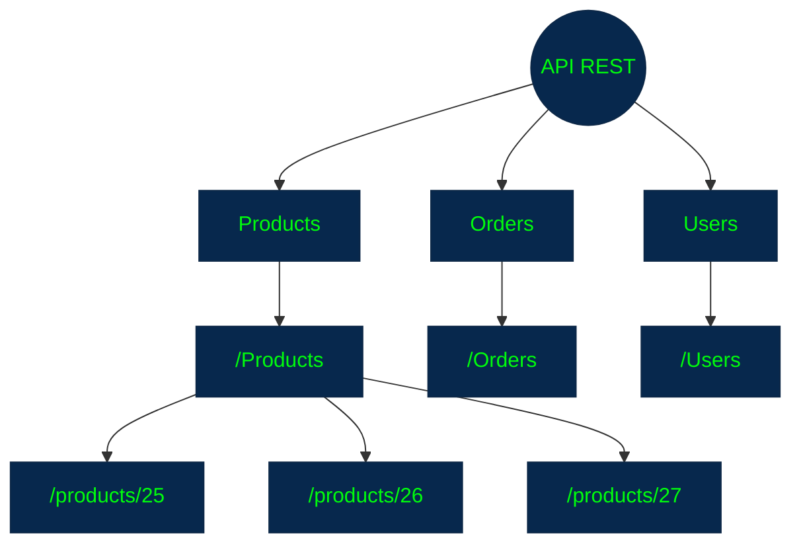

### 21. REST vs. API HTTP tradicional

|Característica	                     |API HTTP genérica	|	API RESTful	                |
|------------------------------------|------------------|-------------------------------|
|Utiliza HTTP	                     |Puede       	    |Sí, normalmente                |
|Recursos	                         |No necesariamente	|Sí	                            |
|Interfaz uniforme                   |No necesariamente	|Sí	                            |
|Stateless	                         |No necesariamente	|Sí     	                    |
|JSON                                |Puede	            |Frecuente, pero no obligatorio	|
|Endpoints orientados a recursos     |No necesariamente	|Sí	                            |
|HATEOAS	                         |No	            |Forma parte de REST	        |
|Arquitectura por capas	             |Puede	            |Permitida por REST	            |

### 22. Lo más importante para recordar

### 1. REST es un estilo arquitectónico

No es:

+ ❌ lenguaje
+ ❌ protocolo
+ ❌ framework
+ ❌ librería

Es: ✅ conjunto de restricciones/principios arquitectónicos

### 2. REST piensa en recursos

En lugar de:

```
/createUser
/deleteUser
/updateUser
```

pensamos:

```
/users
/users/25
```

### 3. HTTP proporciona la interfaz de comunicación

+ REST aprovecha mecanismos de HTTP, pero REST no es HTTP.

### 4. Stateless es fundamental

+ Cada solicitud debe contener la información necesaria para ser procesada independientemente de solicitudes anteriores.

### 5. JSON no es REST

+ JSON es simplemente uno de los formatos de representación más utilizados.

### 6. No toda API HTTP es RESTful

+ Puede existir:

`API HTTP ≠ API RESTful`

### Mapa mental

```
                        REST
                          │
           ┌──────────────┼──────────────┐
           │              │              │
       Recursos       Representación   HTTP
           │              │              │
       /users          JSON/XML      GET/POST/...
           │
     ┌─────┴─────┐
     │           │
  Colección    Recurso
  /users       /users/25
     │
     └───────────────┐
                     │
              Restricciones
                     │
       ┌─────────────┼──────────────┐
       │             │              │
   Stateless    Uniform Interface  Cache
       │             │
       └─────────────┼──────────────┘
                     │
              Cliente/Servidor
                     │
                 Capas
                     │
                  HATEOAS
```

## Diseño práctico de una API RESTful

Vamos a imaginar durante toda esta sección que estamos diseñando una API para una tienda en línea.

Tendremos recursos como:

```
/users
/products
/categories
/orders
/reviews
```

La idea es aprender a tomar decisiones de diseño que hagan que una **`API`** sea **consistente, predecible y fácil de consumir.**

### 1. Diseñar primero los recursos

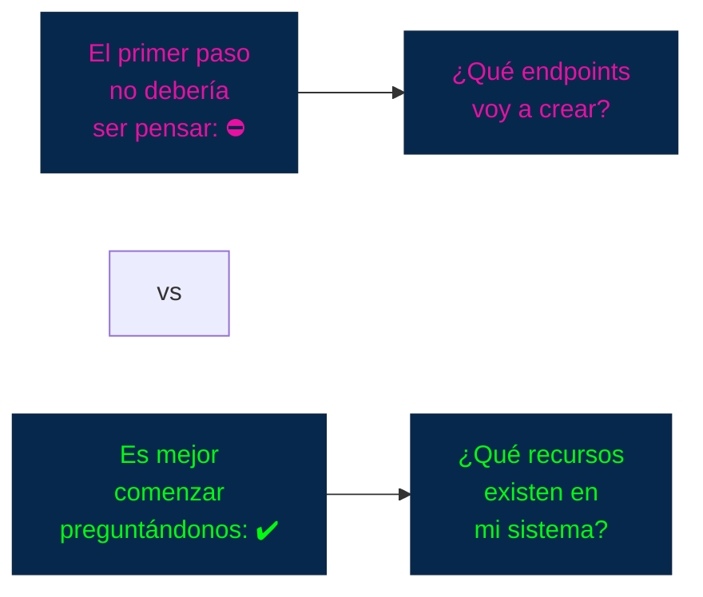

Por ejemplo, en nuestra tienda:

```
Usuario
Producto
Categoría
Pedido
Reseña
```

Podemos representarlos:

```
/users
/products
/categories
/orders
/reviews
```

Esto constituye el modelo de recursos de nuestra API.

### 2. Nombrar recursos correctamente

**Una buena práctica es utilizar sustantivos, no verbos.**

❌ Menos recomendable

```
/getUsers
/createProduct
/deleteOrder
/updateUser
```

✅ Más apropiado

```
/users
/products
/orders
```

La acción ya puede determinarse mediante el método HTTP.

Por ejemplo:

```
GET    /users
POST   /users

GET    /products
POST   /products

GET    /orders
POST   /orders
```

Esto produce una interfaz más uniforme.

### 3. Colecciones y recursos individuales

Normalmente diferenciamos entre:

**Colección**

+ `/products`

> _Representa el conjunto de productos._

**Recurso individual**

+ `/products/25`

Representa específicamente el producto `25`.

```
/products
   │
   ├── /1
   ├── /2
   ├── /25
   └── /80
```

Por tanto:

`GET /products` 

> puede devolver una colección.

Mientras:

`GET /products/25`

> devuelve un producto concreto.

### 4. Identificadores

Los recursos individuales necesitan una forma de identificarlos.

Por ejemplo:

```
/products/25
/users/10
/orders/983
```

El identificador puede ser:

+ entero
+ UUID
+ cadena
+ otro identificador único

Por ejemplo:

`/products/25` o: `/products/550e8400-e29b-41d4-a716-446655440000`

Lo importante es que el identificador sea **estable y permita distinguir el recurso.**

### 5. Relaciones entre recursos

Aquí empieza una parte muy importante del diseño.

Supongamos que:

```
Usuario
   │
   └── tiene muchos pedidos
```

Podríamos representar la relación mediante:

`/users/15/orders`

Esto significa:

> Los pedidos asociados al usuario 15.

De manera similar:

`/products/25/reviews`

significa:

> Las reseñas asociadas al producto 25.

Otro ejemplo:

`/orders/500/items`

> representaría los elementos del pedido 500.

### 6. ¿Cuándo usar recursos anidados?

Los recursos anidados son útiles cuando existe una relación clara entre ellos.

Por ejemplo:

`/users/15/orders`

tiene sentido porque estamos preguntando por:

> los pedidos del usuario 15.

Pero no debemos abusar de la anidación.

Por ejemplo, podríamos terminar con algo excesivamente complejo:

`/users/15/orders/500/items/3/reviews/8`

Aunque técnicamente podría diseñarse así, resulta difícil de consumir y mantener.

Una alternativa podría ser:

`/orders/500/items/3` o: `/reviews/8`

dependiendo del modelo de recursos.

**Regla práctica**

> **Usa anidamiento cuando ayude a expresar claramente una relación; evita cadenas excesivamente profundas.**

### 7. No utilizar acciones en las URLs

Supongamos que queremos cancelar un pedido.

Una `API` podría tener:

`POST /cancelOrder/500`

Pero desde una perspectiva **RESTful**, normalmente conviene modelar el estado o la acción como un recurso.

Por ejemplo, dependiendo del dominio:

`PATCH /orders/500`

con:

```JSON
{
  "status": "cancelled"
}
```

O, si la cancelación tiene comportamiento propio y reglas complejas, puede modelarse como una operación/recurso específico:

`POST /orders/500/cancellation`

Esto demuestra algo importante:

> **REST no significa que absolutamente todos los endpoints deban ser sustantivos simples.**

Lo importante es que el diseño represente correctamente el dominio.

### 8. PUT vs. PATCH

Esta es una de las decisiones prácticas más importantes.

### PUT

Generalmente se utiliza para **reemplazar la representación de un recurso.**

Por ejemplo:

`PUT /users/25`

```JSON
{
  "name": "Juan",
  "email": "juan@example.com",
  "active": true
}
```

Conceptualmente:

```
Estado anterior
      ↓
  reemplazo
      ↓
Nuevo estado
``` 

### 9. PATCH

`PATCH` se utiliza para realizar una modificación parcial.

Por ejemplo:

`PATCH /users/25`

```JSON
{
  "active": false
}
```

No estamos diciendo:

> "Aquí está el usuario completo."

Estamos diciendo:

> "Modifica esta parte del usuario."

Por tanto:

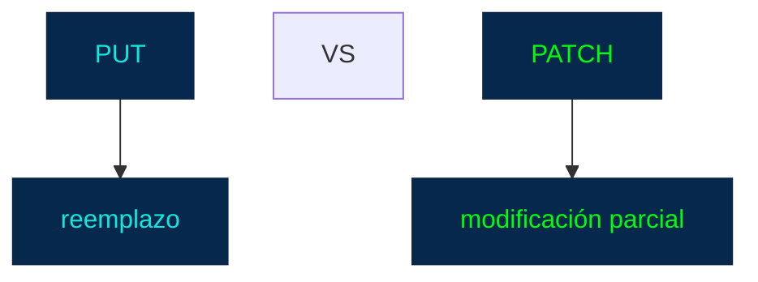

### 10. Ejemplo PUT vs. PATCH

Supongamos:

```JSON
{
  "id": 25,
  "name": "Juan",
  "email": "juan@example.com",
  "active": true
}
```

Queremos solamente cambiar:

`active: false`

Con **`PATCH`**:

`PATCH /users/25`

```JSON
{
  "active": false
}
```

**Es una modificación parcial.**

Con **`PUT`**, dependiendo del contrato de la **API**, normalmente enviaríamos la **representación completa que queremos establecer:**

`PUT /users/25`

```JSON
{
  "name": "Juan",
  "email": "juan@example.com",
  "active": false
}
```

### 11. POST vs. PUT

Otra confusión frecuente.

### POST

Normalmente se utiliza para crear un nuevo recurso dentro de una colección:

`POST /products`

El servidor puede generar el identificador:

```JSON
{
  "name": "Laptop",
  "price": 2500000
}
```

y responder con:

```JSON
{
  "id": 100,
  "name": "Laptop",
  "price": 2500000
}
```

### PUT

Puede utilizarse cuando el cliente conoce la URI del recurso que quiere crear o reemplazar:

`PUT /products/100`

```JSON
{
  "name": "Laptop",
  "price": 2500000
}
```

La diferencia conceptual es importante:

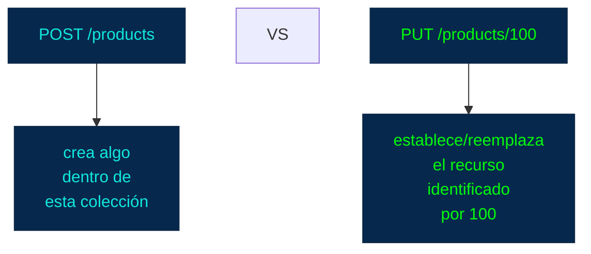

### 12. Diseñar consultas: filtros

Supongamos que tenemos miles de productos.

No queremos descargar todos.

Podemos utilizar parámetros de consulta:

`GET /products?category=computers`

O:

`GET /products?minPrice=1000000&maxPrice=3000000`

Esto permite expresar:

> Dame los productos que cumplen determinadas condiciones.

### 13. Búsqueda

Podemos utilizar un parámetro como:

`GET /products?search=laptop` O `GET /products?q=laptop`

Lo importante no es tanto el nombre exacto del parámetro como que la API tenga una convención consistente y documentada.

Por ejemplo:

```
GET /products?search=laptop
GET /products?search=keyboard
GET /products?search=monitor
```

### 14. Ordenamiento

También podemos permitir ordenar resultados:

`GET /products?sort=price` o: `GET /products?sort=-price`

donde el signo `-` podría representar orden descendente.

Otra posibilidad:

`GET /products?sort=price&order=desc`

No existe una única sintaxis universal.

La regla importante es:

> **elige una convención y úsala consistentemente en toda la API.**

### 15. Paginación

La paginación es fundamental cuando una colección puede tener muchos elementos.

Imaginemos:

`/products`

y tenemos:

`1.000.000 productos`

Sería absurdo devolverlos todos en una sola respuesta.

Podemos utilizar:

`GET /products?page=1&limit=20`

Esto significa:

> Dame la primera página con 20 productos.

Después:

`GET /products?page=2&limit=20`

### 16. Offset y limit

Otra estrategia común:

`GET /products?offset=20&limit=20`

Conceptualmente:

```
Productos

0 ───────── 19     página 1
20 ──────── 39     página 2
40 ──────── 59     página 3
```

Es sencilla y útil, aunque tiene algunas limitaciones cuando los datos cambian frecuentemente.

### 17. Cursor pagination

En sistemas grandes también es frecuente utilizar **cursor pagination.**

En lugar de decir:

`page=2`

la **API** devuelve un cursor:

```JSON
{
  "data": [
    ...
  ],
  "nextCursor": "eyJpZCI6MjB9"
}
```

El cliente utiliza ese cursor:

`GET /products?cursor=eyJpZCI6MjB9`

Esto puede ser más eficiente para determinados conjuntos de datos grandes o dinámicos.

No necesitas memorizar todavía todos los detalles de implementación; lo importante es reconocer:

```
Offset pagination
        vs.
Cursor pagination
```

### 18. Una respuesta paginada

Una API podría devolver:

```JSON
{
  "data": [
    {
      "id": 1,
      "name": "Laptop"
    },
    {
      "id": 2,
      "name": "Monitor"
    }
  ],
  "pagination": {
    "page": 1,
    "limit": 2,
    "total": 150,
    "totalPages": 75
  }
}
```

La estructura exacta depende del diseño de la API.

Lo importante es que el consumidor pueda comprender:

+ ¿Qué datos recibió?
+ ¿cuántos resultados hay?
+ ¿Dónde está dentro de la colección?
+ ¿Cómo obtener más resultados?

### 19. Códigos de estado coherentes

**Creación exitosa**

```
POST /products
        ↓
201 Created
```

**Consulta exitosa**

```
GET /products/25
        ↓
200 OK
```

**Recurso inexistente**

```
GET /products/999999
        ↓
404 Not Found
```

**Solicitud inválida**

```
POST /products
        ↓
400 Bad Request
```

**No autenticado**

```
GET /profile
        ↓
401 Unauthorized
```

**Autenticado pero sin permisos**

```
DELETE /users/25
        ↓
403 Forbidden
```

La elección coherente de códigos facilita mucho el trabajo del consumidor.

### 20. Diseñar errores de forma consistente

Una **API** no debería devolver errores completamente diferentes en cada endpoint.

**❌ Poco consistente**

```JSON
{
  "error": "Something went wrong"
}
```

Otro endpoint:

```JSON
{
  "message": "Invalid user"
}
```

Y otro:

```JSON
{
  "problem": "Product doesn't exist"
}
```

Esto dificulta el desarrollo del cliente.

Es mejor establecer una estructura común.

Por ejemplo:

```JSON
{
  "error": {
    "code": "PRODUCT_NOT_FOUND",
    "message": "The requested product does not exist."
  }
}
```

Otro error:

```JSON
{
  "error": {
    "code": "INVALID_EMAIL",
    "message": "The email address is invalid."
  }
}
```

El consumidor puede programar contra una estructura predecible.

### 21. Errores de validación

Supongamos que creamos un usuario:

`POST /users`

y enviamos:

```JSON
{
  "name": "",
  "email": "correo-no-valido"
}
```

La API puede devolver información específica:

```JSON
{
  "error": {
    "code": "VALIDATION_ERROR",
    "message": "The request contains invalid fields.",
    "fields": {
      "name": "Name is required.",
      "email": "Email must be valid."
    }
  }
}
```

Esto es mucho más útil para el frontend.

### 22. Versionado de una API

Las APIs evolucionan.

Imaginemos que tenemos:

`/api/v1/products`

Posteriormente hacemos cambios incompatibles.

Podemos introducir:

`/api/v2/products`

De esta forma:

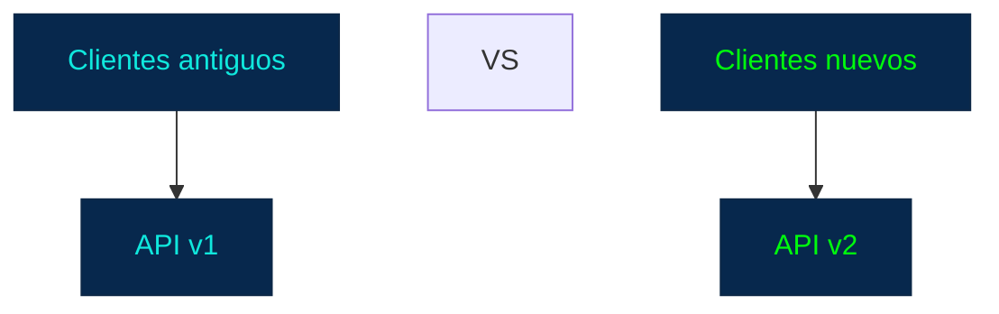

Otra estrategia consiste en versionar mediante headers u otros mecanismos.

No existe una única forma universal.

Lo importante es tener una estrategia clara para gestionar breaking changes.

### 23. ¿Qué es un breaking change?

Es un cambio que puede hacer que un consumidor existente deje de funcionar correctamente.

Por ejemplo, originalmente:

```JSON
{
  "name": "Juan"
}
```
y posteriormente cambiamos:

```JSON
{
  "fullName": "Juan Pérez"
}
```

Un frontend que espera:

`response.name`

puede dejar de funcionar.

Por eso las **APIs** públicas deben evolucionar cuidadosamente.

### 24. Consistencia de nombres

Una API debería establecer convenciones.

Por ejemplo:

```
/users
/products
/orders
```

y no:

```
/users
/product
/order-list
```

Si decidimos utilizar plural:

```
/users
/products
/orders
```

lo ideal es mantener esa convención.

También debemos decidir cuestiones como:

```
camelCase
snake_case
```

Por ejemplo:

```JSON
{
  "firstName": "Juan",
  "createdAt": "..."
}
```

o:

```JSON
{
  "first_name": "Juan",
  "created_at": "..."
}
```

Ambas son posibles.

Lo importante es:

> **consistencia.**

### 25. Evitar respuestas innecesariamente grandes

Supongamos que:

`GET /users/25`

devuelve:

```JSON
{
  "id": 25,
  "name": "Juan",
  "email": "juan@example.com",
  "address": "...",
  "phone": "...",
  "orders": [...],
  "payments": [...],
  "reviews": [...],
  "internalMetadata": {...}
}
```

Puede ser demasiado.

Una API bien diseñada debería intentar devolver la información necesaria para el caso de uso.

En sistemas más complejos puede ser necesario introducir mecanismos como:

`?fields=id,name,email`

o endpoints especializados, dependiendo del diseño.

Esto también conecta posteriormente con GraphQL, donde el cliente puede especificar explícitamente qué campos quiere.

### 26. Documentación

Una API sin documentación es difícil de consumir.

La documentación debería explicar como mínimo:

```
Endpoint
Método
Parámetros
Headers
Request body
Response
Errores
Autenticación
Ejemplos
```

Por ejemplo:

```
GET /products/{id}

Descripción:
Obtiene un producto específico.

Parámetros:
id → identificador del producto

Respuesta:
200 → producto encontrado
404 → producto inexistente
```

Una herramienta muy importante en este ámbito es **OpenAPI**, que permite describir **APIs** de forma estructurada.

Más adelante podremos dedicar una lección específica a **OpenAPI/Swagger**.

### 27. Ejemplo de diseño completo

Supongamos que vamos a construir una API para nuestra tienda.

**Recursos**

```
/users
/products
/categories
/orders
/reviews
```

**Productos**

```
GET    /products
GET    /products/{id}
POST   /products
PUT    /products/{id}
PATCH  /products/{id}
DELETE /products/{id}
```

**Filtros**

```
GET /products?category=computers
GET /products?minPrice=1000000
GET /products?search=laptop
```

**Ordenamiento**

`GET /products?sort=price`

**Paginación**

`GET /products?page=2&limit=20`

**Reseñas de un producto**

`GET /products/25/reviews`

**Crear reseña**

`POST /products/25/reviews`

Esto ya empieza a parecerse a una API real.

### 28. Arquitectura resultante

Podemos visualizar nuestro diseño:

```
   API REST
                            │
        ┌───────────────────┼───────────────────┐
        │                   │                   │
      Users              Products             Orders
        │                   │                   │
     /users             /products            /orders
        │                   │                   │
        │            ┌──────┴──────┐            │
        │            │             │            │
        │        /products/25   /products?      │
        │                         filters       │
        │
        └───────────────────────────────────────┐
                                                │
                                           Base de datos
```

### 29. Checklist para diseñar una API RESTful

Cuando diseñes una API, puedes hacerte estas preguntas:

**Recursos**

¿Cuáles son las entidades principales?
¿Están claramente identificadas?
¿Estoy utilizando sustantivos?

**URLs**
+ ¿Las rutas son consistentes?
+ ¿Distinguen colecciones y recursos individuales?
+ ¿Las relaciones están representadas de forma clara?
+ ¿Estoy evitando anidamientos innecesarios?

**Métodos**
+ ¿Estoy utilizando correctamente GET, POST, PUT, PATCH y DELETE?
+ ¿Estoy considerando la idempotencia?

**Consultas**
+ ¿Tengo filtros?
+ ¿Búsqueda?
+ ¿Ordenamiento?
+ ¿Paginación?

**Respuestas**
+ ¿Las estructuras son consistentes?
+ ¿Los códigos HTTP representan correctamente el resultado?
+ ¿Los errores tienen un formato uniforme?

**Evolución**
+ ¿Cómo manejaré breaking changes?
+ ¿Tengo una estrategia de versionado?

**Documentación**
+ ¿Otro desarrollador podría utilizar mi API sin preguntarme cómo funciona?

### 30. Una regla mental muy útil

Cuando estés diseñando una API REST, piensa en este orden:

```
1. ¿Qué recursos tengo?
                     ↓
          2. ¿Cómo los identifico?
                     ↓
          3. ¿Cómo se relacionan?
                     ↓
          4. ¿Qué operaciones necesito?
                     ↓
          5. ¿Qué datos recibe/devuelve?
                     ↓
          6. ¿Cómo filtro y pagino?
                     ↓
          7. ¿Cómo manejo errores?
                     ↓
          8. ¿Cómo evolucionará la API?
                     ↓
          9. ¿Cómo la documento?
```

Esto evita caer en el error de comenzar simplemente inventando URLs.