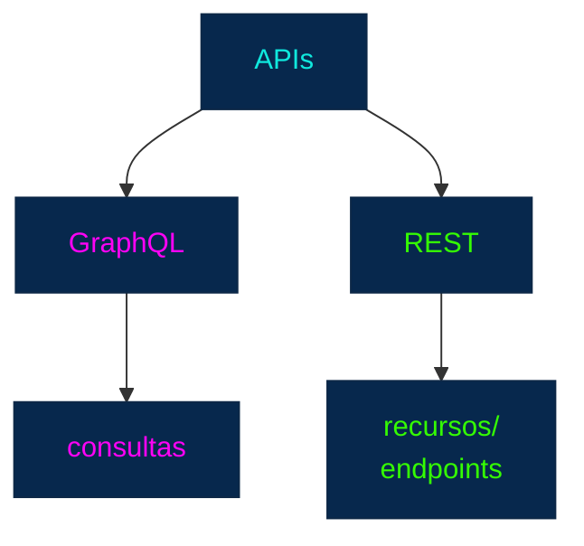
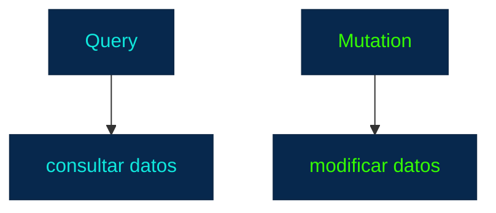
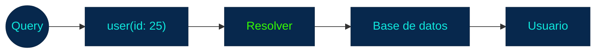
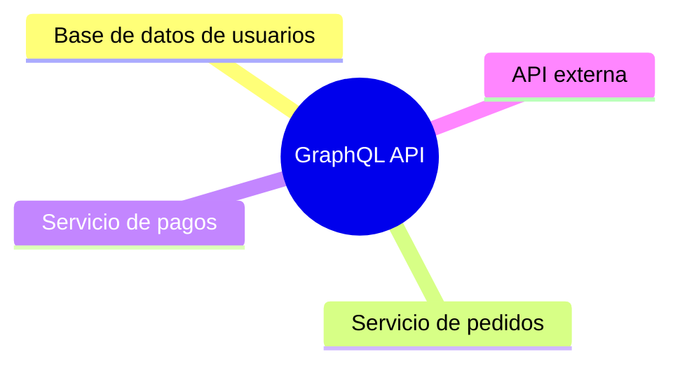
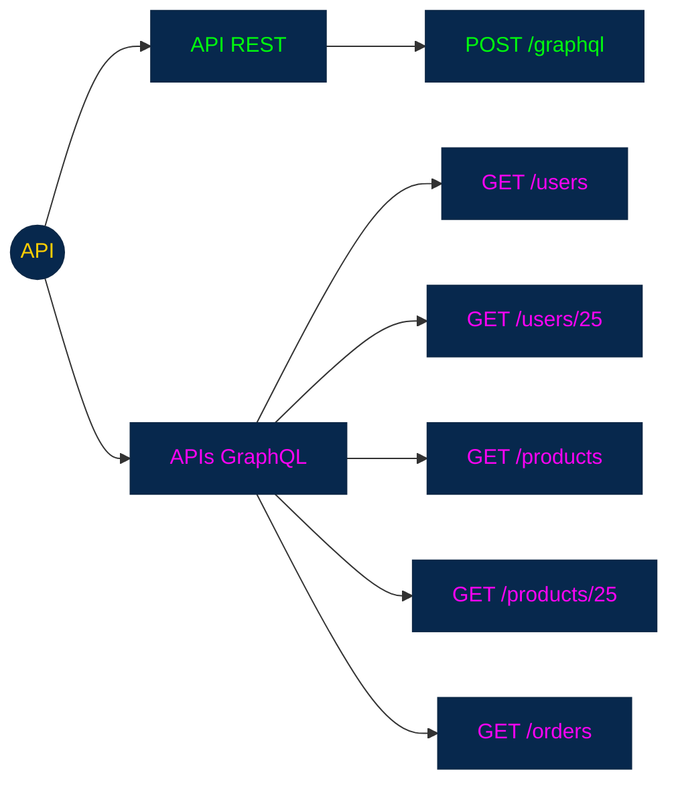
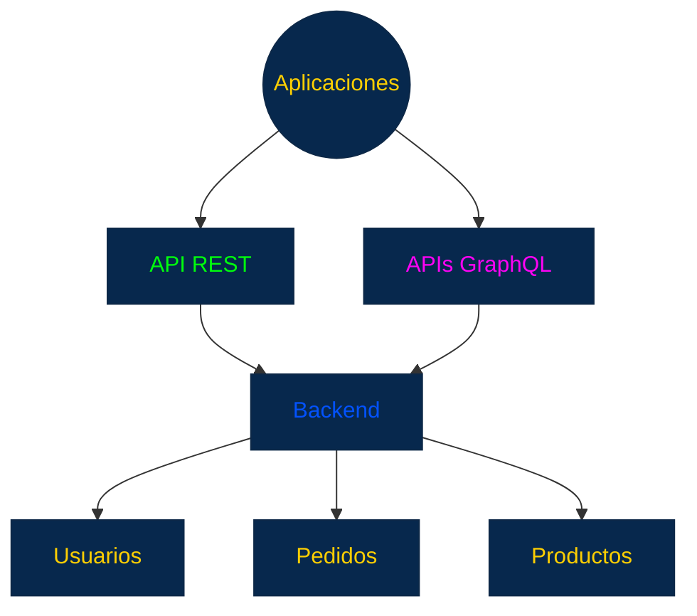

## GraphQL

### 1. ¿Qué es GraphQL?

**GraphQL** es un lenguaje de consulta para **APIs** y también una **especificación** para ejecutar esas consultas sobre los datos de un servidor.

Fue creado originalmente por Facebook y posteriormente pasó a ser un proyecto de código abierto bajo la Linux Foundation.

La idea fundamental de **GraphQL** es diferente a la de una API REST tradicional:

> **En GraphQL, el cliente puede especificar exactamente qué datos necesita.**

Por ejemplo, imagina que queremos obtener un usuario.

En una API REST podríamos tener:

`GET /users/25`

Y el servidor podría devolver:

```JSON
{
  "id": 25,
  "name": "Juan",
  "email": "juan@example.com",
  "age": 25,
  "address": "...",
  "phone": "...",
  "createdAt": "...",
  "updatedAt": "..."
}
```

Pero quizás el cliente solamente necesita:

```
id
name
email
```

**GraphQL** permite expresar esa necesidad directamente:

```GraphQL
query {
  user(id: 25) {
    id
    name
    email
  }
}
```

El servidor puede devolver únicamente esos campos:

```JSON
{
  "data": {
    "user": {
      "id": 25,
      "name": "Juan",
      "email": "juan@example.com"
    }
  }
}
```

Esta es la idea que debes recordar inicialmente:

> **REST suele definir qué recursos puede solicitar el cliente; GraphQL permite que el cliente especifique qué datos necesita de esos recursos.**

### 2. GraphQL no es REST

Esta distinción es fundamental.

`GraphQL` y `REST` son **formas diferentes de diseñar APIs.**

Podemos representarlo:



+ "GraphQL es una versión nueva de REST." ❌ -> **No lo es**.

Son enfoques diferentes para resolver el problema de:
+ > **¿Cómo permitimos que diferentes sistemas se comuniquen y obtengan datos de un backend?**

### 3. La idea principal: el cliente solicita los campos

3. La idea principal: **el cliente solicita los campos**

Supongamos que tenemos:

```
Usuario
├── id
├── nombre
├── email
├── teléfono
├── dirección
├── fechaCreación
└── pedidos
```

El cliente puede solicitar:

```GraphQL
query {
  user(id: 25) {
    id
    name
  }
}
```

Y obtener:

```JSON
{
  "data": {
    "user": {
      "id": 25,
      "name": "Juan"
    }
  }
}
```

Si posteriormente necesita:

```
id
name
email
phone
```

puede solicitar esos campos.

El servidor no necesita crear necesariamente un endpoint diferente para cada combinación de campos.

### 4. ¿Qué problema intenta solucionar GraphQL?

Uno de los problemas que **GraphQL** intenta solucionar es el **over-fetching.**

### Over-fetching

Significa recibir más información de la que realmente necesitas.

Por ejemplo:

```
Cliente necesita:
id
name

Servidor devuelve:
id
name
email
phone
address
age
createdAt
updatedAt
...
```

El cliente recibe datos innecesarios.

**GraphQL** permite reducir este problema porque el cliente especifica los campos que quiere.

```GraphQL
query {
  user(id: 25) {
    id
    name
  }
}
```

### 5. Under-fetching

También existe el problema contrario:

**under-fetching.**

Imagina que necesitamos:

`Usuario + Pedidos + Productos de esos pedidos`

En una API REST podríamos necesitar varias solicitudes:

```
GET /users/25
GET /users/25/orders
GET /orders/500/products
```

Conceptualmente:

```
Cliente
  │
  ├──→ API
  │
  ├──→ API
  │
  └──→ API
```

Dependiendo del diseño de la **API**, esto puede implicar múltiples solicitudes.

**GraphQL** permite expresar relaciones en una sola consulta:

```GraphQL
query {
  user(id: 25) {
    name
    orders {
      id
      products {
        name
      }
    }
  }
}
```

El servidor se encarga de resolver esa consulta.

Esto puede reducir la cantidad de viajes necesarios entre cliente y servidor, aunque **no significa que una consulta GraphQL compleja sea necesariamente más eficiente**. La complejidad debe ser gestionada por el servidor.

### 6. GraphQL utiliza un esquema

Otro concepto fundamental es el **Schema**.

El **schema** describe:

qué datos y operaciones están disponibles en la API y qué tipos tienen.

Por ejemplo, conceptualmente podríamos tener:

```GraphQL 
type User {
  id: ID!
  name: String!
  email: String!
}
```


Esto indica que existe un tipo:

`User`

con:

```
id
name
email
```

Y cada campo tiene un tipo.

Por ejemplo:

```
id     → ID
name   → String
email  → String
```

Y cada campo tiene un tipo.

Por ejemplo:

```
id     → ID
name   → String
email  → String
```

### 7. GraphQL es fuertemente tipado

Esto es muy importante.

**GraphQL** utiliza un sistema de tipos.

Por ejemplo:

```GraphQL
type Product {
  id: ID!
  name: String!
  price: Float!
  available: Boolean!
}
```

Tenemos:

| Campo       | Tipo      |
| ----------- | --------- |
| `id`        | `ID`      |
| `name`      | `String`  |
| `price`     | `Float`   |
| `available` | `Boolean` |

El sistema sabe qué tipo de información corresponde a cada campo.

Esto permite detectar ciertos errores antes de ejecutar una consulta.

### 8. Tipos básicos de GraphQL

Entre los tipos escalares incorporados encontramos:

```
Int
Float
String
Boolean
ID
```

Por ejemplo:

```GraphQL
type User {
  id: ID!
  name: String!
  age: Int
  active: Boolean
}
```

**El signo: `!`**

significa que el campo es **no nulo**.

Por ejemplo:

```GraphQL 
name: String!
```

significa que `name` debe tener un valor.

Mientras:

```GraphQL
age: Int
```

puede ser `null`.

### 9. Objetos

También podemos definir tipos complejos.

Por ejemplo:

```GraphQL
type User {
  id: ID!
  name: String!
  email: String!
}
```

Y:

```GraphQL
type Product {
  id: ID!
  name: String!
  price: Float!
}
```

Entonces podemos tener relaciones:

```GraphQL
type Order {
  id: ID!
  user: User!
  products: [Product!]!
}
```

Conceptualmente:

```
Order
 │
 ├── User
 │
 └── Products
       ├── Product
       ├── Product
       └── Product
```

Esto es una de las características que hacen que **GraphQL** sea especialmente adecuado para representar **datos relacionados**.

### 10. Queries

Una **Query** representa una operación de lectura.

Por ejemplo:

```GraphQL
query {
  user(id: 25) {
    id
    name
    email
  }
}
```

Conceptualmente:

```
Query
 │
 └── user
      │
      ├── id
      ├── name
      └── email
```

El cliente declara qué información necesita.

### 11. Mutations

Las **Mutations** representan operaciones que modifican datos.

Por ejemplo:

```GraphQL
mutation {
  createUser(
    name: "Juan"
    email: "juan@example.com"
  ) {
    id
    name
    email
  }
}
```

La diferencia conceptual es:



Una mutation puede:

+ crear
+ actualizar
+ eliminar
+ ejecutar una operación que cambie el estado del sistema

### 12. Subscriptions

**GraphQL** también define Subscriptions.

Su objetivo es permitir recibir actualizaciones cuando ocurre determinado evento.

Por ejemplo:

```GraphQL
subscription {
  orderUpdated {
    id
    status
  }
}
```

Conceptualmente:

```
Servidor
   │
   │ evento
   ▼
Cliente
   │
   │ actualización
   ▼
Interfaz
```

Esto puede ser útil para aplicaciones que necesitan información en tiempo real, como:

+ chats
+ notificaciones
+ seguimiento de pedidos
+ dashboards
+ sistemas colaborativos

No todas las implementaciones de **GraphQL** utilizan subscriptions, pero forman parte del modelo de **GraphQL**.

### 13. El concepto de resolver

Aquí aparece uno de los conceptos más importantes del lado del servidor:

**Resolver.**

Un resolver es la lógica que determina cómo obtener el valor de un campo solicitado.

Por ejemplo:

```GraphQL
query {
  user(id: 25) {
    name
  }
}
```

Podemos imaginar:



El **resolver** podría consultar:

+ una base de datos
+ otro servicio
+ una API externa
+ un archivo
+ memoria
+ múltiples fuentes

**GraphQL** no obliga a que todos los datos procedan de una única base de datos.

### 14. GraphQL puede combinar múltiples fuentes

Esto es una capacidad muy interesante.



El cliente puede realizar una consulta:

```GraphQL
query {
  user(id: 25) {
    name
    orders {
      id
      total
    }
  }
}
```

Y **GraphQL** puede coordinar la obtención de esa información.

Conceptualmente:

Esto resulta especialmente interesante en arquitecturas con múltiples servicios.

### 15. Un endpoint frente a múltiples endpoints

Una diferencia conceptual muy conocida es que muchas **APIs GraphQL** utilizan un endpoint principal para las consultas.

Por ejemplo:

`POST /graphql`

Mientras una API REST puede tener:



puede recibir consultas diferentes.

Por ejemplo:

```GraphQL
query {
  user(id: 25) {
    name
  }
}
```

o:

```GraphQL
query {
  product(id: 50) {
    name
    price
  }
}
```

El endpoint puede ser el mismo, pero **la consulta cambia**.

Importante:

> **Esto es una característica habitual de GraphQL, pero GraphQL no debe reducirse simplemente a "una API con un endpoint".**

Lo verdaderamente importante es:

**El lenguaje de consultas** + 
**schema** + 
**sistema de tipos** +
**ejecución de esas consultas** 

### 16. Selección de campos

Una de las características más poderosas de **GraphQL** es la selección explícita de campos.

Por ejemplo:

```GraphQL
query {
  product(id: 10) {
    name
    price
  }
}
```

El cliente está diciendo:

> Necesito name y price.

Si necesita más información:

```GraphQL
query {
  product(id: 10) {
    name
    price
    description
    category {
      name
    }
  }
}
```

La consulta puede navegar por las relaciones definidas en el schema.

### 17. Variables

Las consultas no tienen que contener valores directamente.

Podemos utilizar variables:

```GraphQL
query GetUser($id: ID!) {
  user(id: $id) {
    id
    name
    email
  }
}
```

Y enviar las variables separadamente:

```JSON
{
  "id": "25"
}
```

Esto permite reutilizar la misma consulta con diferentes valores.

### 18. Aliases

**GraphQL** también permite utilizar aliases.

Esto es útil cuando necesitamos solicitar campos similares o la misma operación varias veces.

Conceptualmente:

```GraphQL
query {
  firstUser: user(id: 25) {
    name
  }

  secondUser: user(id: 50) {
    name
  }
}
```

La respuesta podría ser:

```JSON
{
  "data": {
    "firstUser": {
      "name": "Juan"
    },
    "secondUser": {
      "name": "Carlos"
    }
  }
}
```

### 19. Fragments

Cuando una selección de campos se repite, **GraphQL** permite utilizar **fragments**.

Por ejemplo:

```GraphQL
fragment UserInfo on User {
  id
  name
  email
}
```

Después:

```GraphQL
query {
  user(id: 25) {
    ...UserInfo
  }
}
```

Los fragments ayudan a reutilizar selecciones de campos y mantener las consultas organizadas.

### 20. Introspection

Una característica muy importante de **GraphQL** es la introspección.

El cliente puede consultar información sobre el propio schema.

Conceptualmente:

```
Cliente
   │
   │ ¿Qué tipos existen?
   │ ¿Qué campos existen?
   │ ¿Qué operaciones existen?
   ▼
GraphQL Schema
```

Esto permite que herramientas puedan descubrir automáticamente la estructura de la **API**.

Por eso herramientas de **GraphQL** pueden ofrecer funcionalidades como:

+ autocompletado
+ documentación interactiva
+ validación de consultas
+ exploración del schema

### 21. Validación antes de ejecutar

Gracias al schema y al sistema de tipos, una consulta puede validarse.

Supongamos:

```GraphQL
query {
  user(id: 25) {
    name
    nonexistentField
  }
}
```

Si `nonexistentField` no existe en el tipo `User`, **GraphQL** puede detectar el problema.

Conceptualmente:

```
Consulta
   │
   ▼
Validación contra Schema
   │
   ├── válida → ejecutar
   │
   └── inválida → error
```

Esto es una ventaja importante del modelo fuertemente tipado.

### 22. Respuestas GraphQL

Una respuesta típica tiene una estructura como:

```JSON
{
  "data": {
    "user": {
      "id": "25",
      "name": "Juan"
    }
  }
}
```

También puede incluir:

```JSON
{
  "data": {
    "user": null
  },
  "errors": [
    {
      "message": "User not found"
    }
  ]
}
```

Esto es interesante porque **GraphQL** tiene un modelo de **errores parciales**.

Una consulta puede solicitar diferentes campos y producir datos en algunas partes mientras otra parte presenta un error, dependiendo del caso y de las reglas de nulabilidad del schema.

### 23. GraphQL vs. REST: diferencia conceptual

Ahora podemos comparar ambos estilos sin decidir que uno sea "mejor".

| Concepto          | REST                                              | GraphQL                          |
| ----------------- | ------------------------------------------------- | -------------------------------- |
| Modelo principal  | Recursos                                          | Grafo de datos/tipos             |
| Acceso            | Endpoints                                         | Consultas                        |
| Datos solicitados | Definidos por el endpoint                         | Seleccionados por el cliente     |
| Schema            | Puede existir, pero no es parte inherente de REST | Fundamental                      |
| Tipado            | Depende de la API                                 | Fuertemente tipado               |
| Operaciones       | HTTP + recursos                                   | Query / Mutation / Subscription  |
| Relaciones        | Endpoints/representaciones                        | Campos relacionados              |
| Endpoint          | Normalmente varios                                | Frecuentemente uno               |
| Over-fetching     | Puede ocurrir                                     | Puede reducirse                  |
| Under-fetching    | Puede ocurrir                                     | Puede reducirse                  |
| Introspección     | No inherente                                      | Característica importante        |
| Caché HTTP        | Muy natural                                       | Requiere estrategias específicas |

### 24. GraphQL y REST no son mutuamente excluyentes

Una arquitectura puede incluso utilizar ambos.

Por ejemplo:



También puede existir:

```
Frontend
   │
   ▼
GraphQL
   │
   ├── REST API interna
   ├── Microservicio
   ├── Base de datos
   └── API externa
```

Por eso no debemos pensar que elegir **GraphQL*** significa necesariamente eliminar **REST** de toda la arquitectura.

### 25. Ventajas de GraphQL

Entre sus características potencialmente útiles:

**Selección precisa de datos**
+ El cliente solicita los campos que necesita.

**Reducción de over-fetching**
+ Puede evitar recibir grandes cantidades de datos innecesarios.

**Consultas de datos relacionados**
+ Permite expresar relaciones de forma natural.

**Schema fuertemente tipado**
+ Hace explícita la estructura de la API.

**Introspección**
+ Facilita herramientas de desarrollo y documentación.

**Evolución del schema**
+ Puede agregarse funcionalidad sin necesariamente crear una nueva versión completa de la API.

### 26. Desafíos de GraphQL

También tiene complejidades.

**Consultas demasiado complejas**

Un cliente podría construir una consulta muy profunda:

```
User
 └── Orders
      └── Products
           └── Reviews
                └── Users
                     └── Orders
                          └── ...
```

El servidor debe controlar la complejidad de las consultas.

**Caché**

> El modelo de caché puede ser menos directo que con `endpoints` `REST` tradicionales.

**Seguridad**

Hay que controlar:

+ profundidad
+ complejidad
+ autorización por campo
+ consultas costosas

**Complejidad del servidor**
+ El servidor **GraphQL** debe resolver las consultas y coordinar sus datos.

### 27. N+1 Query Problem

Este es uno de los problemas técnicos importantes que encontrarás al estudiar **GraphQL**.

Imagina:

```GraphQL
query {
  users {
    name
    orders {
      id
    }
  }
}
```

Supongamos que tenemos:

`100 usuarios`

Una implementación ingenua podría hacer:

```
1 consulta → obtener usuarios

100 consultas → obtener pedidos de cada usuario
```

Total:

`101 consultas` 

Esto se conoce como:

> **N+1 Query Problem**

GraphQL no provoca necesariamente este problema, pero su modelo de resolución puede hacerlo aparecer si no se diseña adecuadamente.

Existen técnicas como `DataLoader` para agrupar y optimizar determinadas consultas.

Por ahora basta con que conozcas el concepto.

### 28. Una forma sencilla de visualizar GraphQL

Puedes pensar en **GraphQL** como un grafo de información:

```
                     User
                    /    \
                   /      \
              Orders      Profile
               /   \
              /     \
        Products    Payment
            │
            │
         Category
```

El cliente puede navegar por ese grafo mediante una consulta:

```GraphQL
query {
  user(id: 25) {
    name
    orders {
      id
      products {
        name
        category {
          name
        }
      }
    }
  }
}
```

### 29. Mapa mental de GraphQL

```
                         GraphQL
                            │
             ┌──────────────┼──────────────┐
             │              │              │
           Schema         Queries       Mutations
             │              │              │
        ┌────┴────┐         │              │
        │         │         │              │
      Types    Fields    Lectura        Escritura
        │
        ├── Scalar
        ├── Object
        ├── Enum
        ├── Input
        └── List
                            │
                     Selección de campos
                            │
                       Variables
                            │
                       Fragments
                            │
                       Resolvers
                            │
                       Introspection
                            │
                       Subscriptions
```

### 30. Lo más importante que debes conservar

Si estás registrando estos conceptos en tus apuntes, yo conservaría especialmente estas ideas:

1. **GraphQL** es un lenguaje de consulta para APIs y un sistema para ejecutar esas consultas.
2. El cliente especifica qué campos necesita.
3. **GraphQL** utiliza un schema fuertemente tipado.
4. Sus operaciones principales son:
    + `Query` → lectura.
    + `Mutation` → modificación.
    + `Subscription` → actualizaciones/eventos.
5. **Los resolvers** determinan cómo se obtienen los datos solicitados.
6. **GraphQL** puede representar y consultar relaciones entre datos.
7 **Over-fetching** = recibir más datos de los necesarios.
8. **Under-fetching** = necesitar múltiples solicitudes para obtener toda la información necesaria.
9. **Introspection** permite consultar información sobre el **schema**.
10. **GraphQL** puede reducir algunos problemas de obtención de datos, pero introduce otros desafíos como:
    + complejidad de consultas
    + caché
    + autorización
    + N+1
    + rendimiento