## gRPC

### 1. ¿Qué es gRPC?

gRPC es un framework de comunicación entre sistemas desarrollado originalmente por Google.

El nombre viene de:

> **gRPC = Google Remote Procedure Call**

Su objetivo principal es permitir que un programa pueda invocar una operación que está ejecutándose en otro sistema como si fuera una llamada a una función o método local.

La idea fundamental es:

```
Aplicación A
     │
     │ "ejecuta esta operación"
     ▼
   gRPC
     │
     ▼
Aplicación B
     │
     │ ejecuta operación
     ▼
Resultado
```

Por ejemplo, la aplicación A podría solicitar:

`getUser(25)`

aunque realmente `getUser()` se esté ejecutando en un servidor remoto.

### 2. ¿Qué significa Remote Procedure Call?

Para entender **gRPC** primero hay que entender **RPC**.

**Remote Procedure Call** significa:
> **Llamada a Procedimiento Remoto.**

Supongamos que dentro de nuestro programa tenemos:

`getUser(25)`

Normalmente esta función se ejecutaría dentro del mismo programa:

```
Aplicación
   │
   ▼
getUser(25)
   │
   ▼
Resultado
```

Con RPC, esa operación puede estar en otro sistema:

```
Aplicación A
   │
   │ getUser(25)
   ▼
Red
   │
   ▼
Aplicación B
   │
   ▼
getUser(25)
   │
   ▼
Resultado
```

La idea es hacer que la comunicación remota se parezca conceptualmente a una **llamada de procedimiento**.

### 3. La idea detrás de gRPC

Podemos compararlo con otros estilos: 

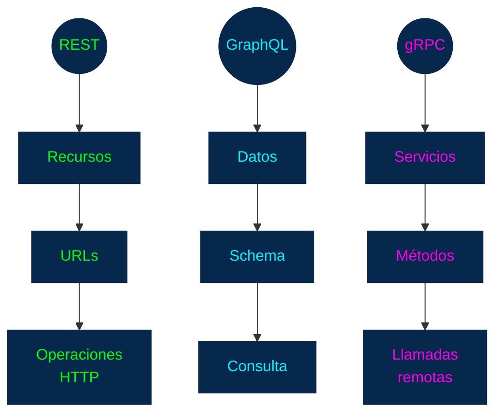

Ejemplos:

**REST:** 
+ `GET /users/25`´

**GraphQL:** 

```GraphQL
query {
  user(id: 25) {
    name
  }
}
```

**gRPC**

```
UserService
    │
    └── GetUser(25)
```

Esta diferencia conceptual es muy importante.

### 4. gRPC está orientado a servicios

En **gRPC** normalmente definimos un servicio.

Por ejemplo:

`UserService`

Y ese servicio puede proporcionar diferentes métodos:

```
UserService
│
├── GetUser
├── CreateUser
├── UpdateUser
└── DeleteUser
```

Otro servicio podría ser:

```
OrderService
│
├── GetOrder
├── CreateOrder
└── CancelOrder
```

La arquitectura puede verse así:

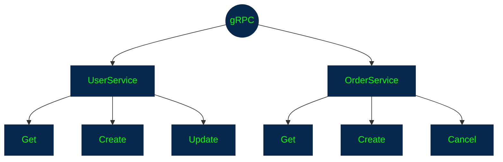

### 5. El contrato del servicio

Una característica fundamental de **gRPC** es que normalmente se define primero un **contrato**.

Ese contrato describe:

+ ¿Qué servicios existen?
+ ¿Qué métodos ofrecen?
+ ¿Qué datos reciben?
+ ¿Qué datos devuelven?

Por ejemplo, conceptualmente:

```
UserService

GetUser
    Entrada: UserRequest
    Salida: UserResponse

CreateUser
    Entrada: CreateUserRequest
    Salida: UserResponse
```

Esto permite que cliente y servidor tengan una definición común de cómo comunicarse.

### 6. Protocol Buffers

Uno de los conceptos **más importantes de gRPC:**

> **Protocol Buffers**, normalmente abreviado como **Protobuf.**

Protobuf es un mecanismo de **serialización de datos estructurados** desarrollado por Google.

Podemos pensar en él como una forma de definir:

+ ¿Qué datos existen?
+ ¿Qué tipos tienen?
+ ¿Cómo se representan?

Por ejemplo:

```protobuf
message User {
  int32 id = 1;
  string name = 2;
  string email = 3;
}
```

Esto describe un mensaje llamado:

`User`

User

```
id
name
email
```

### 7. ¿Qué es un mensaje en Protobuf?

Un **message** representa una estructura de datos.

```protobuf
message UserRequest {
  int32 id = 1;
}
```

Podríamos interpretarlo como:

```
UserRequest
│
└── id
```

Y:

```protobuf
message UserResponse {
  int32 id = 1;
  string name = 2;
  string email = 3;
}
```

sería:

```
UserResponse
│
├── id
├── name
└── email
```

Estos mensajes sirven como estructura de los datos intercambiados entre cliente y servidor.

### 8. ¿Por qué no simplemente JSON?

Esta es una pregunta natural después de haber estudiado **REST**.

**REST** utiliza frecuentemente `JSON`

**gRPC** utiliza normalmente `Protocol Buffers`

JSON:

```JSON
{
  "id": 25,
  "name": "Juan"
}
```

Protobuf utiliza una representación **binaria**.

Esto tiene consecuencias importantes:

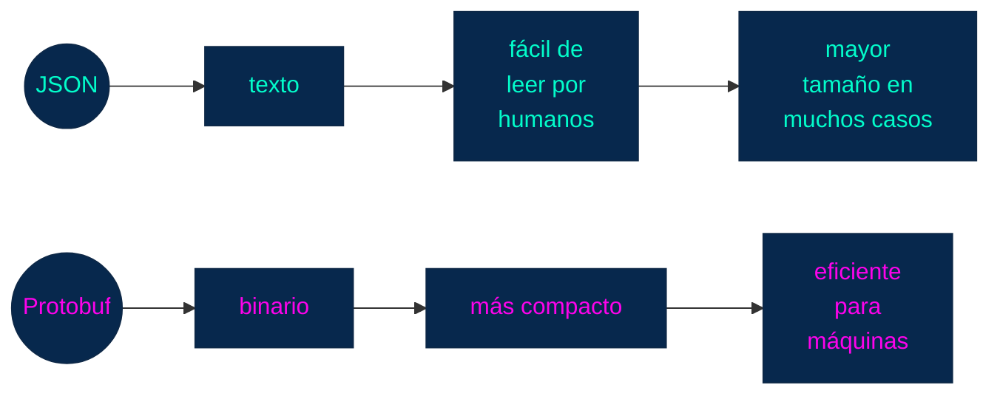

Por eso **gRPC** resulta especialmente atractivo para determinadas comunicaciones entre servicios.

### 9. Serialización y deserialización

Esto conecta directamente con el tema de **Formatos de Datos**

Supongamos que tenemos:

```
Objeto
{
  id: 25,
  name: "Juan"
}
```

Para enviarlo por una red necesitamos convertirlo a una representación que pueda transmitirse.

Esto es:

> **Serialización**

Conceptualmente:

```
Objeto
  │
  ▼
Serialización
  │
  ▼
Datos transmitibles
```
Cuando llegan al otro extremo:

```
Datos transmitidos
       │
       ▼
Deserialización
       │
       ▼
Objeto
```

**gRPC utiliza Protobuf** como uno de sus mecanismos principales para esta serialización.

### 10. Definir un servicio gRPC

Aquí podemos unir **servicios + mensajes**.

Un archivo `.proto` podría describir conceptualmente:

```protobuf
service UserService {
  rpc GetUser(UserRequest) returns (UserResponse);
}
```

Y los mensajes:

```protobuf
message UserRequest {
  int32 id = 1;
}

message UserResponse {
  int32 id = 1;
  string name = 2;
  string email = 3;
}
```

No necesitas aprender todavía la sintaxis completa.

Lo importante es entender la estructura:

### 11. El archivo .proto

El archivo donde normalmente definimos estos contratos tiene extensión: `.proto` Por ejemplo: `user.proto` 

Puede contener:

```
Mensajes
Servicios
Métodos
Tipos
Enumeraciones
```

El archivo `.proto` se convierte en la base para generar código.

### 12. Generación de código

Esta es otra característica muy importante de **gRPC**.

A partir del contrato `.proto`, las herramientas de **gRPC** pueden generar código para diferentes lenguajes.

Por ejemplo:

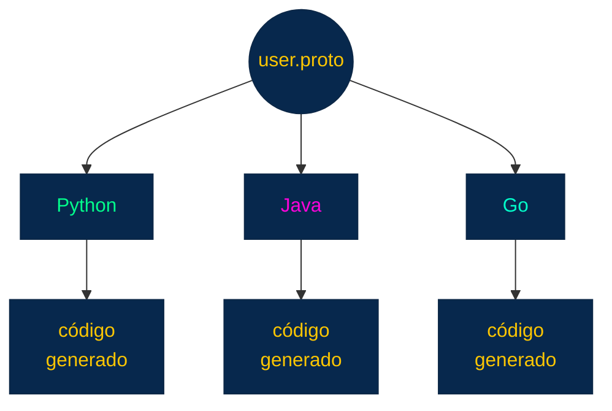

Esto significa que cliente y servidor pueden trabajar con estructuras y métodos generados a partir del mismo contrato.

### 13. Comunicación entre diferentes lenguajes

Esta capacidad es especialmente importante en arquitecturas distribuidas.

Podemos tener:

```
Frontend / Servicio A
       │
       │ gRPC
       ▼
Servicio B
```

Pero:

```
Servicio A → Java
Servicio B → Go
Servicio C → Python
Servicio D → C#
```

Todos pueden comunicarse utilizando el mismo contrato `.proto`

```
              user.proto
                  │
       ┌──────────┼──────────┐
       ▼          ▼          ▼
      Java       Go       Python
       │          │          │
       └─────── gRPC ────────┘
```

Esto es una de las razones por las que gRPC es popular en sistemas con múltiples servicios y lenguajes.

### 14. Stub

Un **stub** es código generado que permite al cliente comunicarse con el servicio remoto sin tener que construir manualmente toda la lógica de comunicación


Desde el punto de vista del desarrollador, puede parecer que simplemente llama:

`GetUser(25)`

El **stub** se encarga de parte de la complejidad necesaria para convertir esa llamada en una comunicación remota.

### 15. Arquitectura cliente-servidor gRPC

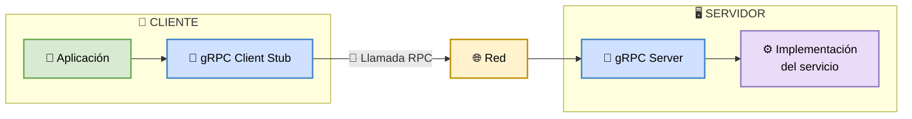

### 16. HTTP/2

**gRPC** está diseñado para utilizar principalmente `HTTP/2` como transporte.

Por tanto:

```
gRPC
  │
  ▼
HTTP/2
  │
  ▼
Red
```

`HTTP/2` proporciona características que resultan muy útiles para **gRPC**, como:

+ multiplexación
+ comunicación bidireccional
+ streams
+ compresión de headers
+ una conexión que puede transportar múltiples solicitudes

`HTTP/2` es la capa de _transporte/protocolo_ utilizada habitualmente por **gRPC**, mientras que **gRPC** define el modelo de comunicación _RPC_ y los contratos de servicio.

### 17. Tipos de RPC en gRPC

Esta es una de las características que diferencia bastante a **gRPC**.

**gRPC** soporta cuatro modalidades principales de comunicación.

### 17.1 Unary RPC

Es la comunicación más sencilla:

```
Cliente → Solicitud → Servidor
Cliente ← Respuesta ← Servidor
```

Conceptualmente:

```
GetUser(25)
      │
      ▼
   Servidor
      │
      ▼
UserResponse
```

Se parece conceptualmente a una llamada tradicional: `request → response` Se parece conceptualmente a una llamada tradicional

### 18. Server Streaming RPC

Aquí el cliente realiza una solicitud y el servidor puede devolver **múltiples respuestas**.

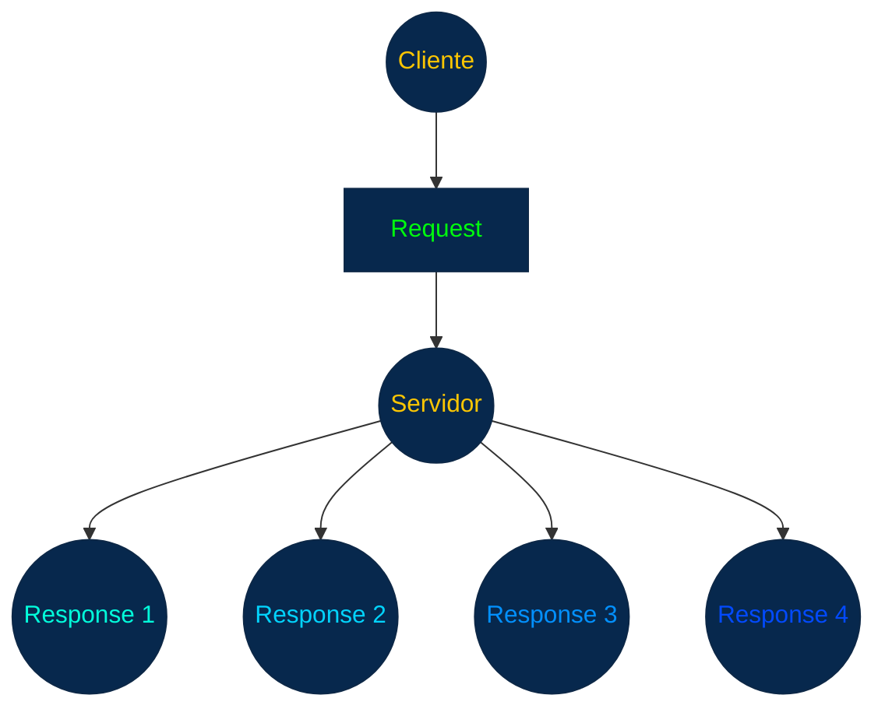

Puede ser útil cuando el servidor tiene una secuencia de datos que debe enviar progresivamente.

Por ejemplo:

```
Solicitar eventos
        ↓
Evento 1
Evento 2
Evento 3
Evento 4
...
```
### 19. Client Streaming RPC

Aquí ocurre lo contrario.

El cliente puede enviar **múltiples mensajes** y el servidor responde posteriormente.

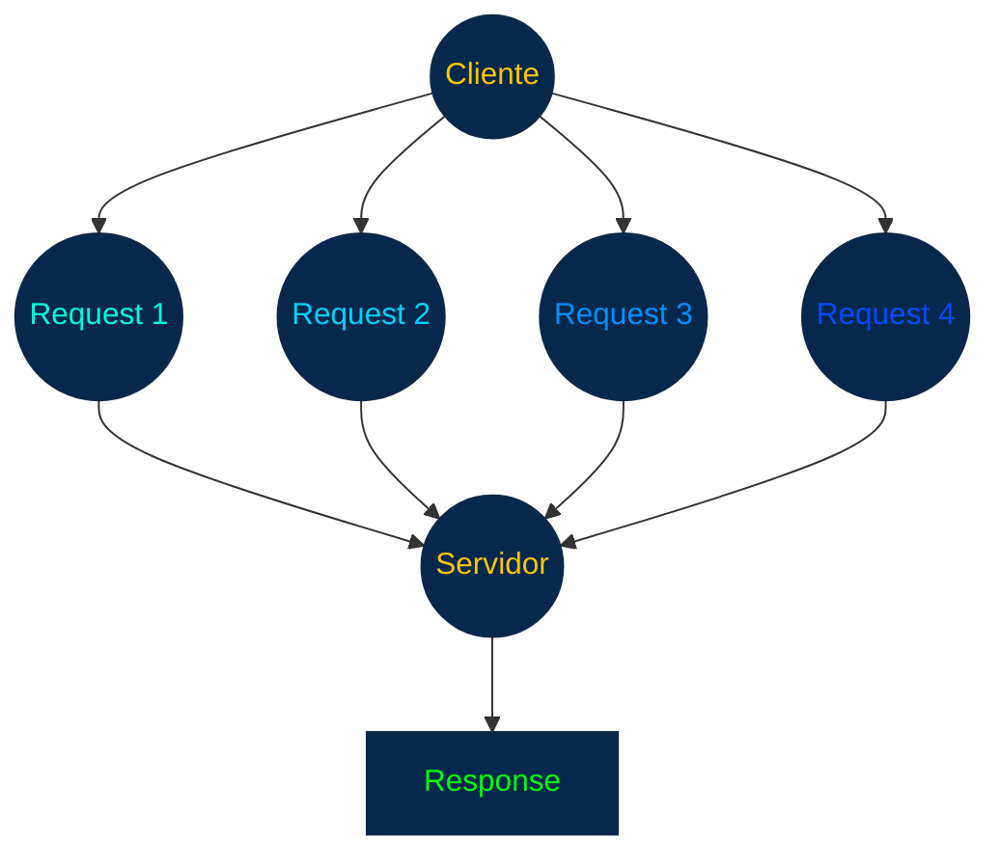

Puede ser útil para enviar grandes cantidades de información en un flujo.

### 20. Bidirectional Streaming RPC

Es la modalidad más flexible.

Cliente y servidor pueden enviar múltiples mensajes independientemente:

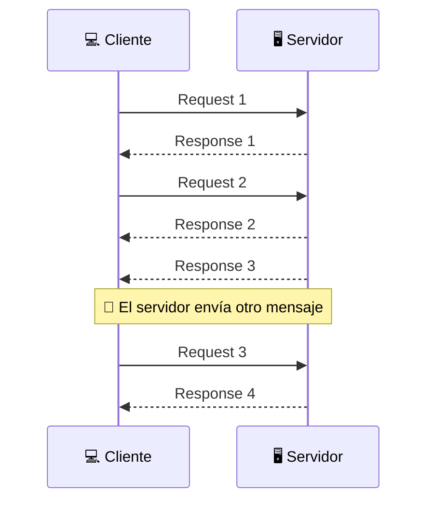

Esto puede ser útil para:

+ comunicación en tiempo real
+ chats
+ transmisión de eventos
+ colaboración
+ procesamiento continuo de datos

### 21. Resumen de los cuatro tipos

| **Tipo**                 | **Cliente**          |**Servidor**          |
| -------------------------|----------------------|----------------------|
| Unary                    | 1 solicitud	  |1 respuesta           |
| Server streaming 	   | 1 solicitud	  |múltiples respuestas  |
| Client streaming  	   | múltiples solicitudes|1 respuesta           |
| Bidirectional streaming  | múltiples     	  |múltiples             |

```
Unary

C ──────► S
C ◄────── S


Server streaming

C ──────► S
C ◄────── S
C ◄────── S
C ◄────── S


Client streaming

C ──────► S
C ──────► S
C ──────► S
C ◄────── S


Bidirectional

C ──────► S
C ◄────── S
C ──────► S
C ◄────── S
```

### 22. Contratos fuertemente tipados

Una de las principales diferencias de **gRPC** frente a **APIs REST** _tradicionales_ es el énfasis en el **contrato**.

En **REST** puedes documentar:

`GET /users/{id}`

GET /users/{id}

```
Response:
{
   id: integer,
   name: string
}
```

En **gRPC**, el _contrato_ se define formalmente:

```protobuf
rpc GetUser(UserRequest) returns (UserResponse);
```

y:

```protobuf
message UserRequest {
  int32 id = 1;
}
```

Esto proporciona una especificación estructurada que puede utilizarse para generar código.

### 23. gRPC y JSON

No debemos pensar:

```
REST = JSON
gRPC = Protobuf
```

como si fueran equivalencias obligatorias.

Es mejor pensar:

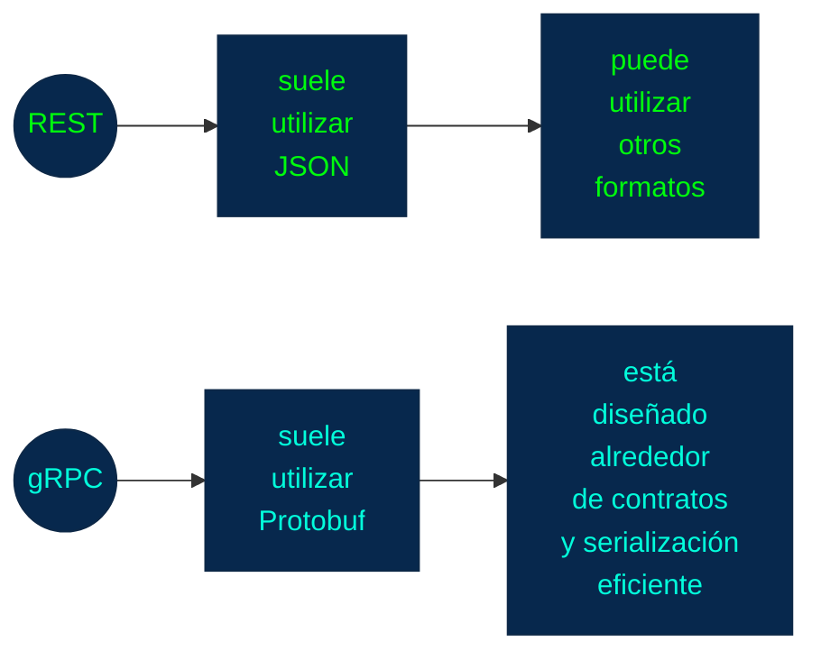

La diferencia fundamental no es simplemente el formato de datos.

Es el **modelo de comunicación**.

### ¿Dónde suele utilizarse gRPC?

**gRPC** resulta especialmente interesante en arquitecturas donde existen muchos servicios comunicándose entre sí.

Por ejemplo:

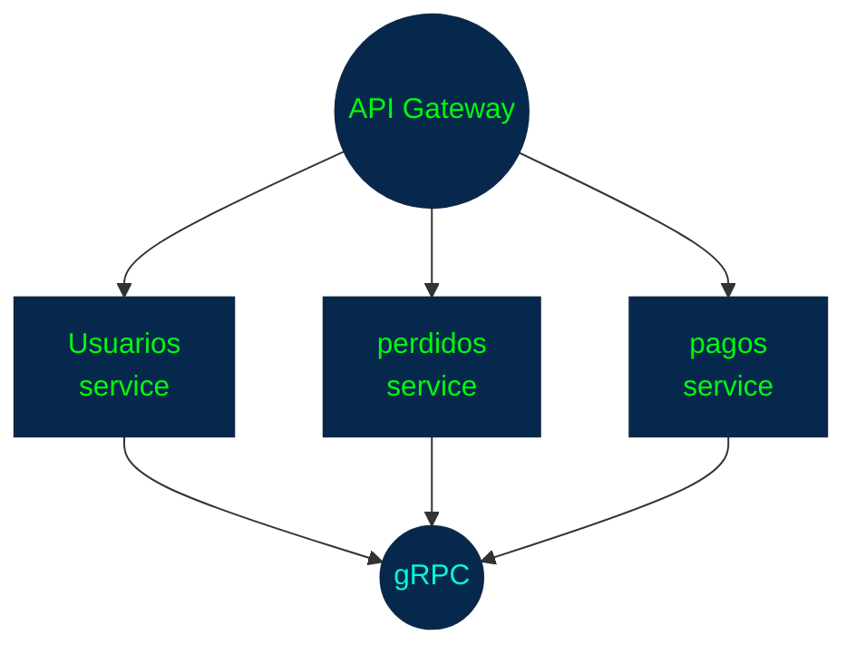

Podemos tener:

```
User Service
     │
     │ gRPC
     ▼
Order Service
     │
     │ gRPC
     ▼
Payment Service
```

Este patrón es frecuente en arquitecturas de **microservicios**.

### 27. gRPC y microservicios

Aquí existe una conexión importante.

Supongamos:

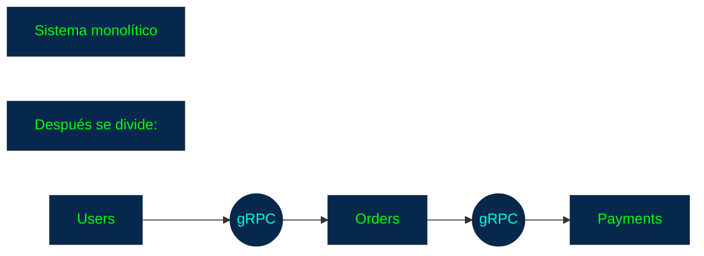

### 27. gRPC y microservicios

Aquí existe una conexión importante.

Supongamos:

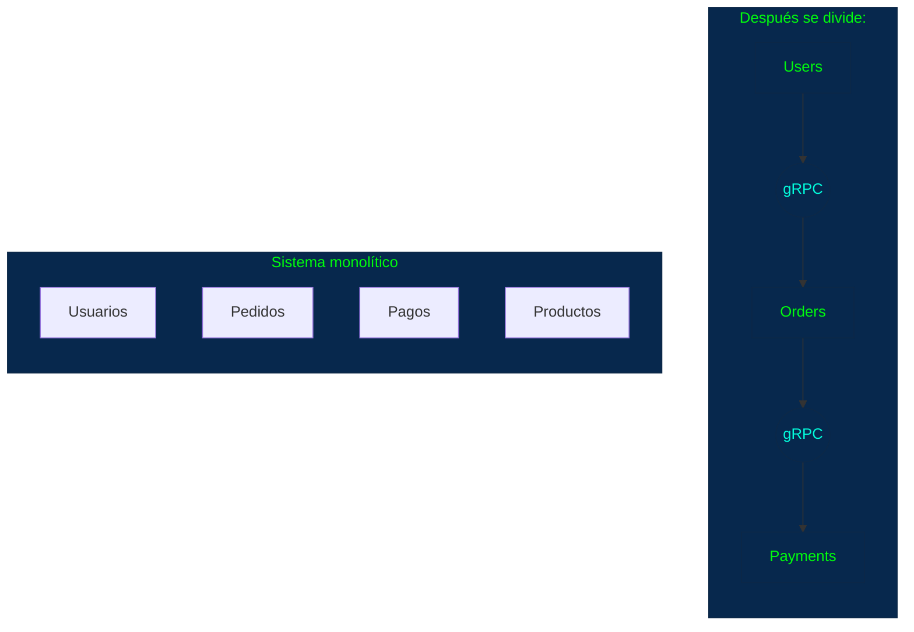

Aquí **gRPC** puede proporcionar una comunicación eficiente y fuertemente tipada entre servicios.

### 28. Ventajas de gRPC

Entre sus características potencialmente ventajosas:

**Alto rendimiento**
+ `Protobuf` es compacto y eficiente.

**Contratos fuertes**
+ Los servicios y mensajes están formalmente definidos.

**Generación de código**
+ Reduce trabajo repetitivo y facilita la comunicación entre lenguajes.

**Streaming**
+ Ofrece los cuatro modelos de comunicación que vimos.

**HTTP/2**
+ Aprovecha características de HTTP/2.

**Comunicación entre microservicios**
+ Es especialmente adecuado para determinados escenarios internos de sistemas distribuidos.

### 29. Desafíos de gRPC

También tiene limitaciones o complejidades.

**Menor legibilidad**
+ Los mensajes`Protobuf` son _binarios_ en la comunicación normal, por lo que no son tan fáciles de inspeccionar como `JSON`.

**Navegadores**
+ Los navegadores no consumen **gRPC** tradicional de la misma forma que una **API REST HTTP/JSON**. Para escenarios web existen tecnologías como **gRPC-Web**.

**Mayor complejidad inicial**
+ Hay que trabajar con:
```
.proto
Protobuf
generación de código
stubs
servicios
```

**Acoplamiento al contrato**
+ El **contrato** fuerte es una ventaja, pero también significa que los cambios deben gestionarse cuidadosamente.

**Herramientas**
+ El ecosistema de herramientas es diferente al de las **APIs REST** tradicionales.

### 30. gRPC no significa "siempre mejor rendimiento"

Es importante evitar una conclusión simplista:

> **"gRPC es más rápido que REST, por lo tanto siempre es mejor."**

No.

El rendimiento real depende de:

+ tamaño de mensajes 
+ frecuencia de comunicación 
+ latencia 
+ implementación 
+ infraestructura 
+ serialización 
+ red 
+ carga del sistema 
+ patrón de comunicación 

Lo correcto es entender que:

> **gRPC está diseñado con características que pueden hacerlo muy eficiente para determinados patrones de comunicación, especialmente entre servicios.**

### 31. Mapa mental de gRPC

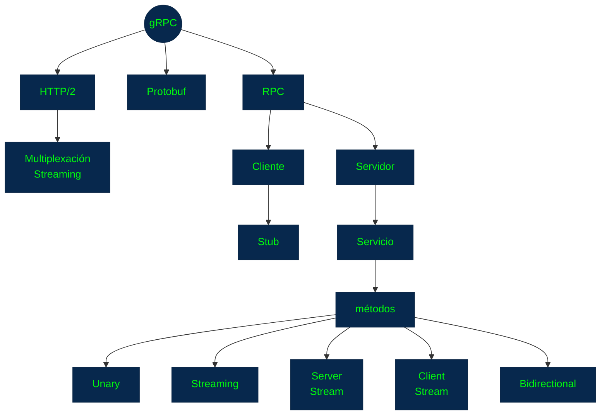