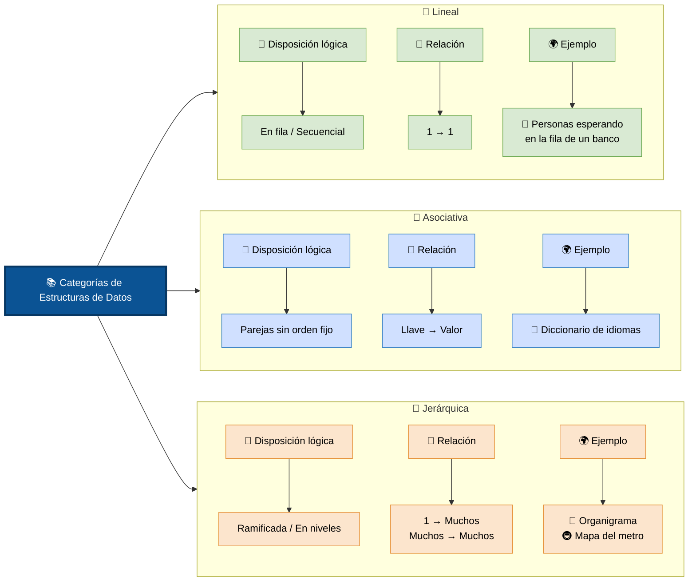
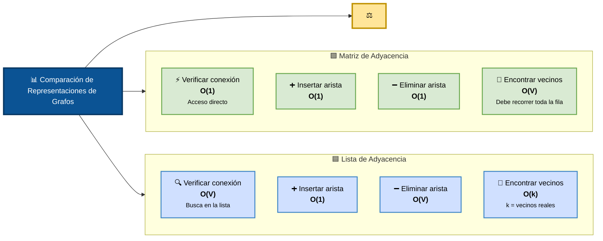

# Estructuras de Datos

>> _Elegir la estructura correcta puede significar la diferencia entre un programa que funciona instantáneamente y uno que tarda minutos._

*Las estructuras de datos son formas de organizar información en memoria.*

### Categoria de estructuras

### Estructuras Lineales

En estas estructuras, los elementos están secuenciados uno detrás del otro, en una sola línea recta. Cada elemento (excepto el primero y el último) tiene un único "antecesor" y un único "sucesor".

#### Arrays (Arreglos/Vectores)

*Arrays* Es el término general para una colección de elementos del mismo tipo almacenados en posiciones contiguas de memoria (uno al lado del otro). 

> _Las matrices y los vectores son simplemente casos especiales o extensiones de la estructura general del array_

Tienen un tamaño fijo desde que los creas.

+ *La analogia:* Una hilera de casilleros numerados del 0 al 9.
+ *Fortalezas:* Si sabes el número de casillero (el índice), abres la puerta al instante. El acceso es directo.
+ *Debilidades:* Si quieres meter un elemento al principio o en medio, tienes que mover todos los demás casilleros un espacio hacia atrás. Además, si te quedas sin espacio, tienes que comprar un bloque de casilleros nuevo más grande y mudar todo
+ *Complejidad temporal:* 
    + Acceso/Lectura O(1) 
    + Búsqueda (Desordenado) O(n) 
    + Búsqueda (Ordenado) O(logn) 
    + Inserción / Eliminación O(n) 
    + Inserción (Al final) O(1) 

#### Listas Enlazadas (Linked Lists)

A diferencia del arreglo, aquí los elementos no están juntos en la memoria. Cada elemento (llamado nodo) tiene dos partes: el dato en sí y un "puntero" (una flecha o dirección) que dice dónde está el siguiente elemento en la memoria. _Las listas dinámicas pueden crecer_

+ *La analogia:* Una búsqueda del tesoro. Cada pista que encuentras te dice exactamente dónde buscar la siguiente pista
+ *Fortalezas:* Son dinámicas. Si quieres agregar un elemento en medio, solo cambias las "flechas" para que apunten al nuevo nodo. No hay que mover nada más de lugar en la memoria.
+ *Debilidades:* No puedes saltar directo al elemento número 5. Tienes que empezar desde el primero e ir siguiendo las pistas una por una hasta llegar al que buscas.
+ *Complejidad temporal:* 
    + Acceso por índice O(n) 
    + Búsqueda (por valor) O(n) 
    + Inserción (al principio) O(1) 
    + Inserción (en medio) O(n) 
    + Inserción (al final) O(n) 
    + Eliminación (cabeza) O(1) 
    + Eliminación (cola) O(n) 

#### Pilas (Stacks)

Es una estructura lineal que sigue el principio LIFO (Last In, First Out - El último en entrar es el primero en salir).

+ *La analogia:* Una pila de platos para lavar. El último plato que pones arriba de la pila es obligatoriamente el primero que vas a quitar para lavar.
+ *Operaciones clave:* Push (meter arriba) y Pop (sacar de arriba).
+ *Complejidad temporal:*  
    + ofrecen una complejidad temporal constante O(1) para sus operaciones principales (Push y pop), ya que siempre actúan sobre el extremo superior. 
    + las operaciones de búsqueda o acceso a un elemento arbitrario requieren recorrer la estructura, lo que eleva el tiempo a O(n)

#### Colas (Queues)

Siguen el principio FIFO (First In, First Out - El primero en entrar es el primero en salir).

+ *La analogia:* La fila del banco o del supermercado. El primer cliente que llega es el primero en ser atendido y el primero en irse.
+ *Operaciones clave:* Operaciones: enqueue (añadir al final), dequeue (sacar del frente).
+ *Complejidad temporal:*  
    + Sus operaciones principales tienen una complejidad temporal de O(1), (enqueue y dequeue)

### Estructuras Asociativas

Aquí no existe un "orden" de primero, segundo o tercer lugar. Los datos se guardan emparejando una llave (Key) con un valor (Value). Para encontrar un dato, no recorres una fila; simplemente entregas la llave y la estructura te devuelve el valor inmediatamente.

#### Tablas Hash / Mapas / Diccionarios

Asocian una clave con un valor. Utilizan una función matemática (función hash) que transforma la clave (por ejemplo, el texto "usuario_123") en una dirección de memoria exacta donde se guarda su valor.

> Diccionarios o Mapas: Es el concepto de alto nivel. Su nombre exacto depende simplemente del lenguaje de programación en el que se estan construyendo. Ambos términos se refieren a una estructura de datos abstracto (una lista de pares clave-valor) que almacena información en pares de clave-valor. Permite acceder, insertar y eliminar datos rápidamente buscando por su clave única 

> Tabla hash es el motor que hace funcionar un diccionario o mapa de manera súper eficiente, es la estructura de datos que se utiliza comúnmente para implementarlo por detrás. es estrictamente una estructura de datos concreta

+ *La analogia:* El inventario de una tienda de ropa donde buscas directamente por el código de barras para saber el precio.
+ *Fortalezas:* Es absurdamente rápida para buscar, insertar y borrar. No importa si tienes 10 o 1 millón de registros, la búsqueda toma prácticamente el mismo tiempo.
+ *Operaciones clave:* 
    + Inserción: Guarda un par clave-valor convirtiendo la clave en un índice numérico mediante la función hash, 
    + Búsqueda: Localiza y recupera el valor asociado a una clave específica aplicando la misma función hash,
    + Eliminación: Remueve un par clave-valor de la estructura identificando su posición en la memoria a través del mismo mecanismo de cálculo hash
+ *Complejidad temporal:*  
    + La complejidad temporal de las tablas hash varía según el escenario, pero en condiciones ideales es la más rápida posible:
    + Promedio: O(1) para búsqueda, inserción y eliminación.
    + Peor de los casos: O(n) para todas las operaciones.

        + _El peor de los casos ocurre cuando se producen colisiones frecuentes_
        + _Si dos claves generan el mismo índice, se produce una colisión que se resuelve mediante encadenamiento o direccionamiento abierto_

#### Conjuntos (sets)

Es una estructura de datos abstracta que permite almacenar colecciones de elementos únicos y desordenados

No permite duplicados y sus elementos no tienen una posición o índice asignado.

Suelen usarse para eliminar redundancias y realizar operaciones matemáticas.

+ *La analogia:* Los sets imitan a los conjuntos matemáticos.
+ *Fortalezas:* Si intentas insertar un valor que ya existe, la estructura lo ignora. Están optimizados para verificar en milisegundos si un elemento pertenece a ellos (operación de búsqueda)
+ *Debilidades:* Desordenados: No garantizan el orden en el que se ingresan los datos.
+ *Operaciones clave:* 
    + Unión: Combina todos los elementos de dos conjuntos (eliminando duplicados).
    + Intersección: Retorna únicamente los elementos que están presentes en ambos conjuntos.
    + Diferencia: Retorna los elementos que están en un conjunto pero no en el otro
+ *Complejidad temporal:*  
    + La complejidad temporal de los conjuntos (Sets) depende fundamentalmente de la estructura de datos subyacente utilizada para implementarlos _(tablas hash o árboles de búsqueda binaria balanceados)._

### Estructuras Jerárquicas

A diferencia de las lineales, aquí los datos no van en fila; se organizan en niveles o relaciones de parentesco (padre e hijo). Un elemento puede ramificarse en múltiples elementos descendientes.

#### Arboles (Trees)

Tienen un nodo raíz (el inicio) del cual ramifican nodos hijos. El más común en desarrollo es el Árbol Binario de Búsqueda (BST), donde cada nodo tiene máximo dos hijos (izquierdo para menores, derecho para mayores), lo que permite búsquedas sumamente rápidas.

##### Conceptos Clave

Una estructura en árbol se comprende mejor conociendo sus componentes principales

+ Nodo: Unidad básica que contiene información y referencias a sus elementos descendientes.
+ Raíz: El nodo principal y origen del árbol; es el único que no tiene padre.
+ Padre/Hijo: Relación de dependencia directa entre nodos. Un nodo padre tiene referencias a sus nodos hijos.
+ Hojas: Nodos terminales en la parte inferior del árbol que no tienen hijos.
+ Nivel: La distancia generacional desde la raíz. La raíz está en el nivel 0, sus hijos en el nivel 1, y así sucesivamente

+ *La analogia:* Tienen la forma de un arbol invertido.
+ *Fortalezas:* Destacan por su alta eficiencia en búsquedas y son ampliamente usados en bases de datos, sistemas de archivos y representación del DOM 
+ *Debilidades:* 
    + desbalanceo: que ocurre cuando los datos se insertan de forma ordenada (por ejemplo, 1, 2, 3, 4). Esto convierte al árbol en una lista enlazada, destruyendo su eficiencia y elevando la complejidad de búsqueda de O(log n) a O(n).
    + Complejidad de implementación: Requieren una lógica algorítmica avanzada para programar sus operaciones y mantener el balanceo 
    + Consumo de memoria: Cada nodo debe almacenar el valor y múltiples punteros (padre, hijo izquierdo, hijo derecho).
    + Falta de acceso directo: No permiten acceder a un elemento de forma inmediata por su índice; siempre es necesario recorrer la estructura desde la raíz.

##### *Operaciones clave:* 

##### Operaciones de gestión de nodos
    + Inserción: Añade un nuevo nodo en la posición correcta según las reglas del árbol.
    + Eliminación: Remueve un nodo del árbol. 
    + Búsqueda: Recorre el árbol comparando valores para localizar un nodo específico.

##### Operaciones de recorrido (Traversals)

    A diferencia de las estructuras lineales, los árboles se pueden recorrer de diferentes formas para visitar todos sus nodos exactamente una vez.

##### Recorridos en profundidad (DFS)

        Preorden: Visita primero la raíz, luego el subárbol izquierdo y al final el derecho
        Inorden: Visita el subárbol izquierdo, luego la raíz y al final el derecho.
        Postorden: Visita el subárbol izquierdo, luego el derecho y al final la raíz

##### Recorridos en amplitud (BFS)

        Por niveles: Visita los nodos nivel por nivel, de arriba hacia abajo y de izquierda a derecha utiliza una estructura de cola para su implementación.

##### Operaciones de consulta y estado

        Altura: Calcula el número máximo de niveles desde la raíz hasta la hoja más lejana.
        Tamaño: Cuenta la cantidad total de nodos presentes en el árbol.
        Balanceo: Verifica la diferencia de altura entre los subárboles para determinar si el árbol necesita ser reestructurado

+ *Complejidad temporal:*  
    + La complejidad temporal en los árboles es altamente variable, ya que depende directamente del balanceo de la estructura.

        + Caso promedio (Árbol balanceado): Su complejidad es O(log n). Al estar equilibrado, cada decisión tomada en un nodo descarta la mitad de los elementos restantes.
        + Peor caso (Árbol degenerado): Su complejidad cae a O(n). Si los datos se insertan en orden (por ejemplo: 10, 20, 30, 40).

#### Grafos

es un tipo de dato abstracto que modela redes complejas, compuesto por un conjunto de vértices (nodos) y aristas (enlaces).

#### Componentes Principales

+ Vértices (V): Las entidades o puntos de datos (ej. ciudades, personas).
+ Aristas (E): Las conexiones o relaciones entre los vértices.

+ *La analogia:* red de transporte aéreo (aerolíneas)
    + Los vértices (nodos): Son las ciudades o aeropuertos (ej. Bogotá, Madrid, Tokio), son lugares fijos y específicos.
    + Las aristas (enlaces): Son los vuelos directos que conectan esos aeropuertos.

+ *Fortalezas:* Destacan por su alta eficiencia en búsquedas y son ampliamente usados en bases de datos, sistemas de archivos y representación del DOM 
+ *Debilidades:* según la forma en que se estructuran en memoria y el tipo de problema que intentan resolver. Su principal desventaja es el compromiso de eficiencia (trade-off) entre el uso de espacio en memoria y el tiempo de ejecución.

    + El dilema de la representación en memoria:
        + No existe una forma perfecta de almacenar un grafo; debes elegir entre dos estructuras que sacrifican algo (Matriz de adyacencia, Lista de adyacencia).

    + Alta complejidad algorítmica:
        + Los algoritmos que operan sobre grafos suelen ser costosos computacionalmente debido a la impredecibilidad de sus conexiones.

    + Dificultad de escalabilidad y distribución:
        + Cuando un grafo se vuelve masivo (como el mapa global de Google Maps o la red de Facebook), procesarlo en una sola computadora es imposible, Dividir un grafo para guardarlo en varios servidores es matemáticamente complejo

*Complejidad temporal:*  

Depende de la combinacion de dos variables:

+ el número de vértices (V) 
+ el número de aristas (E) 

Operaciones básicas según la estructura:

El tiempo que tarda una computadora en realizar tareas simples cambia drásticamente según cómo guardes el grafo en memoria:

>>>> _(El DOM (Document Object Model) es la interfaz que utiliza el navegador para representar la estructura interna de una página web)_