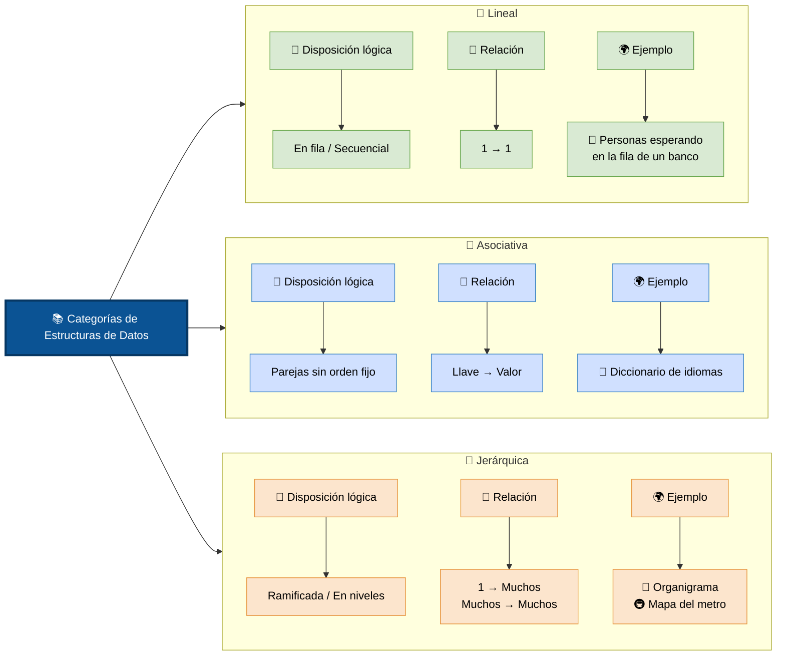

# Estructuras de Datos

>> _Elegir la estructura correcta puede significar la diferencia entre un programa que funciona instantáneamente y uno que tarda minutos._

*Las estructuras de datos son formas de organizar información en memoria.*

### Categoria de estructuras

### Estructuras Lineales

En estas estructuras, los elementos están secuenciados uno detrás del otro, en una sola línea recta. Cada elemento (excepto el primero y el último) tiene un único "antecesor" y un único "sucesor".

#### Arrays (Arreglos/Vectores)

*Arrays* Es el término general para una colección de elementos del mismo tipo almacenados en posiciones contiguas de memoria (uno al lado del otro). 

> _Las matrices y los vectores son simplemente casos especiales o extensiones de la estructura general del array_

Tienen un tamaño fijo desde que los creas.

+ *La analogia:* Una hilera de casilleros numerados del 0 al 9.
+ *Fortalezas:* Si sabes el número de casillero (el índice), abres la puerta al instante. El acceso es directo.
+ *Debilidades:* Si quieres meter un elemento al principio o en medio, tienes que mover todos los demás casilleros un espacio hacia atrás. Además, si te quedas sin espacio, tienes que comprar un bloque de casilleros nuevo más grande y mudar todo
+ *Complejidad temporal:* 
    + Acceso/Lectura O(1) 
    + Búsqueda (Desordenado) O(n) 
    + Búsqueda (Ordenado) O(logn) 
    + Inserción / Eliminación O(n) 
    + Inserción (Al final) O(1) 

#### Listas Enlazadas (Linked Lists)

A diferencia del arreglo, aquí los elementos no están juntos en la memoria. Cada elemento (llamado nodo) tiene dos partes: el dato en sí y un "puntero" (una flecha o dirección) que dice dónde está el siguiente elemento en la memoria. _Las listas dinámicas pueden crecer_

+ *La analogia:* Una búsqueda del tesoro. Cada pista que encuentras te dice exactamente dónde buscar la siguiente pista
+ *Fortalezas:* Son dinámicas. Si quieres agregar un elemento en medio, solo cambias las "flechas" para que apunten al nuevo nodo. No hay que mover nada más de lugar en la memoria.
+ *Debilidades:* No puedes saltar directo al elemento número 5. Tienes que empezar desde el primero e ir siguiendo las pistas una por una hasta llegar al que buscas.
+ *Complejidad temporal:* 
    + Acceso por índice O(n) 
    + Búsqueda (por valor) O(n) 
    + Inserción (al principio) O(1) 
    + Inserción (en medio) O(n) 
    + Inserción (al final) O(n) 
    + Eliminación (cabeza) O(1) 
    + Eliminación (cola) O(n) 

#### Pilas (Stacks)

Es una estructura lineal que sigue el principio LIFO (Last In, First Out - El último en entrar es el primero en salir).

+ *La analogia:* Una pila de platos para lavar. El último plato que pones arriba de la pila es obligatoriamente el primero que vas a quitar para lavar.
+ *Operaciones clave:* Push (meter arriba) y Pop (sacar de arriba).
+ *Complejidad temporal:*  
    + ofrecen una complejidad temporal constante O(1) para sus operaciones principales (Push y pop), ya que siempre actúan sobre el extremo superior. 
    + las operaciones de búsqueda o acceso a un elemento arbitrario requieren recorrer la estructura, lo que eleva el tiempo a O(n)

#### Colas (Queues)

Siguen el principio FIFO (First In, First Out - El primero en entrar es el primero en salir).

+ *La analogia:* La fila del banco o del supermercado. El primer cliente que llega es el primero en ser atendido y el primero en irse.
+ *Operaciones clave:* Operaciones: enqueue (añadir al final), dequeue (sacar del frente).
+ *Complejidad temporal:*  
    + Sus operaciones principales tienen una complejidad temporal de O(1), (enqueue y dequeue)

### Estructuras Asociativas

Aquí no existe un "orden" de primero, segundo o tercer lugar. Los datos se guardan emparejando una llave (Key) con un valor (Value). Para encontrar un dato, no recorres una fila; simplemente entregas la llave y la estructura te devuelve el valor inmediatamente.

#### Tablas Hash / Mapas / Diccionarios

Asocian una clave con un valor. Utilizan una función matemática (función hash) que transforma la clave (por ejemplo, el texto "usuario_123") en una dirección de memoria exacta donde se guarda su valor.

+ *La analogia:* El inventario de una tienda de ropa donde buscas directamente por el código de barras para saber el precio.
+ *Fortalezas:* Es absurdamente rápida para buscar, insertar y borrar. No importa si tienes 10 o 1 millón de registros, la búsqueda toma prácticamente el mismo tiempo.
+ *Operaciones clave:* 
    + Inserción: Guarda un par clave-valor convirtiendo la clave en un índice numérico mediante la función hash, 
    + Búsqueda: Localiza y recupera el valor asociado a una clave específica aplicando la misma función hash,
    + Eliminación: Remueve un par clave-valor de la estructura identificando su posición en la memoria a través del mismo mecanismo de cálculo hash
+ *Complejidad temporal:*  
    + La complejidad temporal de las tablas hash varía según el escenario, pero en condiciones ideales es la más rápida posible:
    + Promedio: O(1) para búsqueda, inserción y eliminación.
    + Peor de los casos: O(n) para todas las operaciones.

        + _El peor de los casos ocurre cuando se producen colisiones frecuentes_
        + _Si dos claves generan el mismo índice, se produce una colisión que se resuelve mediante encadenamiento o direccionamiento abierto_