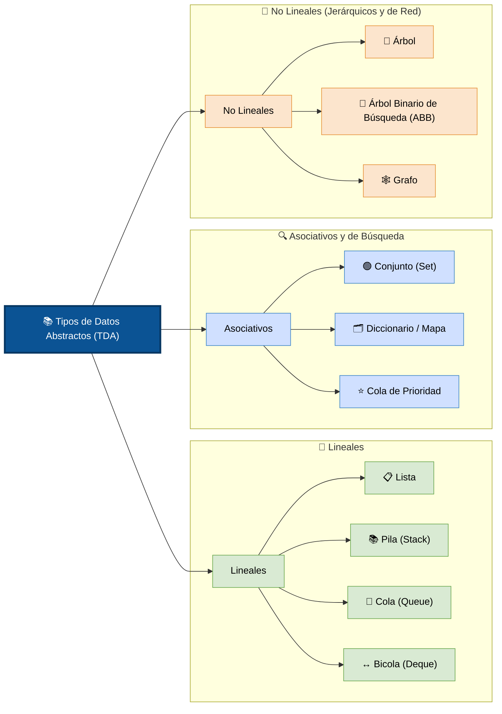
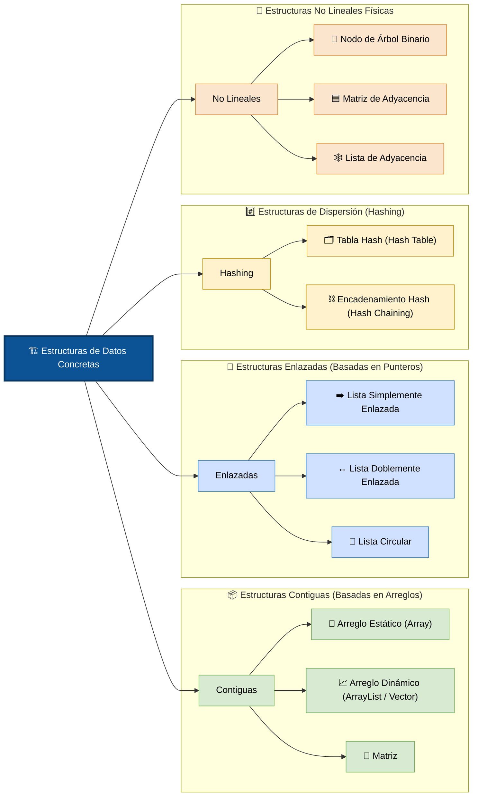

# Estructuras de datos abstractas y lineales

El Tipo de Dato Abstracto (TDA) es un modelo matemático que define un conjunto de datos y las operaciones que se pueden realizar sobre ellos, sin importar cómo se programen en memoria

## Principales TDA 

### TDA Lineales

Los elementos se organizan de forma secuencial, donde cada uno tiene un único predecesor y un único sucesor.

+ **Lista:** Colección ordenada de elementos donde se pueden insertar o eliminar datos en cualquier posición.
+ **Pila (Stack):** Estructura que sigue el principio LIFO (Last In, First Out); el último elemento en entrar es el primero en salir.
+ **Cola (Queue):** Estructura que sigue el principio FIFO (First In, First Out); el primer elemento en entrar es el primero en salir.
+ **Bicola (Deque):** Variante de la cola donde las inserciones y eliminaciones se pueden realizar tanto por el principio como por el final.

### TDA Asociativos y de Búsqueda

Asocian claves con valores o gestionan colecciones basándose en la eficiencia de localización

+ **Conjunto (Set):** Colección de elementos únicos que no admite duplicados y permite operaciones matemáticas como unión e intersección.
+ **Diccionario / Mapa:** Estructura basada en parejas clave-valor, donde cada clave es única y se usa para acceder a su valor asociado.
+ **Cola de Prioridad:** Variante de la cola donde cada elemento tiene una prioridad asignada y se despachan primero los de mayor prioridad

### TDA No Lineales (Jerárquicos y de Red)

Los elementos se conectan de formas más complejas que una simple secuencia.

+ **Árbol:** Estructura jerárquica que imita un árbol invertido, compuesta por un nodo raíz y nodos hijos, sin ciclos.
+ **Árbol Binario de Búsqueda (ABB):** Variante del árbol donde cada nodo tiene máximo dos hijos, organizados de forma que los menores van a la izquierda y los mayores a la derecha.
+ **Grafo:** Red flexible compuesta por vértices y aristas (como la que analizamos anteriormente), capaz de modelar cualquier tipo de relación compleja con o sin ciclos.

## Principales estructuras de datos concretas 

Son las implementaciones físicas y reales en la memoria de la computadora de los conceptos abstractos (TDA). Determinan exactamente cómo se acomodan los bits y los punteros en el hardware

### Estructuras Contiguas (Basadas en Arreglos)

Almacenan los elementos en bloques de memoria física que están completamente juntos, uno al lado del otro.

+ **Arreglo Estático (Array):** Colección de tamaño fijo indexada numéricamente. Ofrece acceso instantáneo a cualquier posición, pero no puede crecer una vez creado.
+ **Arreglo Dinámico (ArrayList / Vector):** Un arreglo que imita un tamaño variable. Cuando se llena, la computadora crea automáticamente un arreglo el doble de grande tras bambalinas y copia los datos.
+ **Matriz: Un arreglo bidimensional (o multidimensional)** que organiza los datos en filas y columnas utilizando bloques de memoria contiguos.

### Estructuras Enlazadas (Basadas en Punteros)

Los elementos están dispersos en diferentes partes de la memoria y se conectan entre sí mediante direcciones o referencias (punteros).

+ **Lista Simplemente Enlazada:** Cada nodo contiene el dato y un puntero que apunta exclusivamente al siguiente nodo.
+ **Lista Doblemente Enlazada:** Cada nodo contiene el dato, un puntero al nodo siguiente y otro puntero al nodo anterior, facilitando el recorrido bidireccional.
+ **Lista Circular:** Una lista enlazada (simple o doble) donde el último nodo se conecta directamente con el primero, eliminando los extremos

### Estructuras de Dispersión (Hashing)

Utilizan fórmulas matemáticas para transformar un dato de entrada en una dirección de memoria exacta.

+ **Tabla Hash (Hash Table):** Estructura que mapea llaves a posiciones en un arreglo mediante una función hash. Permite búsquedas, inserciones y eliminaciones casi instantáneas.
+ **Encadenamiento Hash (Hash Chaining):** Un arreglo físico donde cada celda apunta a una lista enlazada, técnica utilizada para resolver colisiones cuando dos llaves dan la misma posición.

### Estructuras No Lineales Físicas

+ **Nodo de Árbol Binario:** Estructura de celda que almacena el dato junto con dos punteros obligatorios: izquierdo y derecho.
+ **Matriz de Adyacencia:** Un arreglo bidimensional de tamaño V × V utilizado para representar físicamente las conexiones de un grafo.
+ **Lista de Adyacencia:** Un arreglo de listas enlazadas donde cada posición del arreglo representa un nodo y la lista contiene sus vecinos

