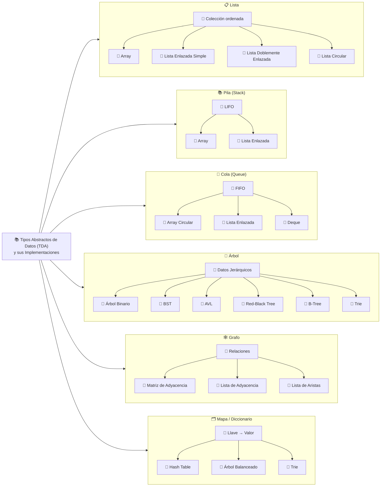
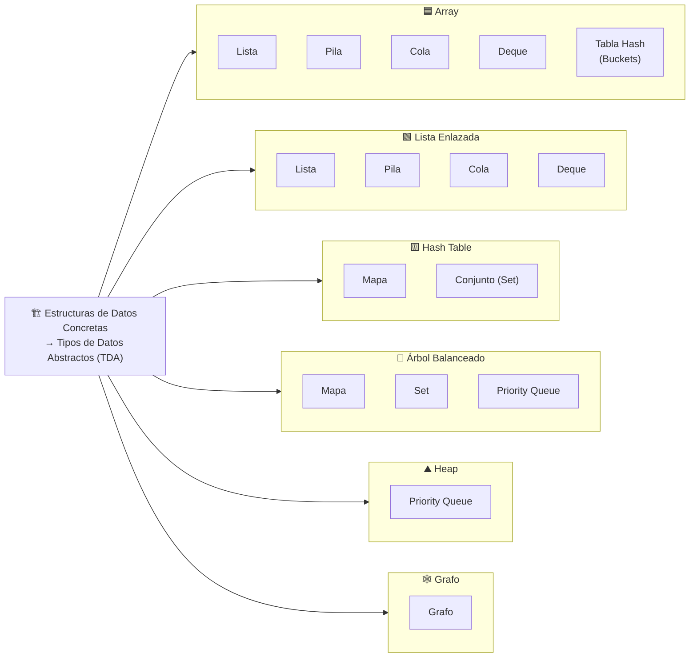

# Diferenciar las estructuras de datos abstractas de las concretas

Para diferenciar las estructuras de datos abstractas de las concretas, la clave está en separar el "qué hace" del "cómo lo hace".

A nivel profesional, a las abstractas las llamamos _**TDA (Tipos de Datos Abstractos)**_ y a las concretas, Estructuras de Datos Concretas o _**Implementaciones**_.

### Una analogía de la vida real

**El Concepto Abstracto:** "El Transporte de Pasajeros". La regla abstracta es: "Subes personas en el punto A, se mueven, y bajan en el punto B". No te dice qué motor usa, ni si va por tierra o aire.

**La Implementación Concreta:** Puede ser un Autobús eléctrico (memoria por carretera) o un Avión comercial (memoria por aire). Ambos cumplen el concepto abstracto, pero su infraestructura física y "costo de operación" (complejidad algorítmica) son completamente distintos.

### ¿Por qué importa esta diferencia al programar?

Porque cuando diseñas software, primero piensas en abstracto: "Aquí necesito una Cola para procesar estos reportes en orden". Después, evalúas el rendimiento y decides lo concreto: "Como van a ser millones de reportes y no sé cuántos llegarán, la implementaré concretamente usando una Lista Enlazada para que la memoria sea dinámica".

```mermaid
flowchart LR

    A["🎯 1. Comprender el problema"]
    B["📋 2. Identificar las operaciones necesarias"]
    C["🧩 3. Elegir el Tipo de Dato Abstracto (TDA)"]
    D["⚙️ 4. Elegir la implementación concreta"]
    E["📊 5. Analizar complejidad<br/>Tiempo y memoria"]
    F["💻 6. Implementar el algoritmo"]

    A --> B
    B --> C
    C --> D
    D --> E
    E --> F

    classDef inicio fill:#0B5394,color:#fff,stroke:#073763,stroke-width:3px;
    classDef proceso fill:#D9EAD3,stroke:#6AA84F,color:#000;
    classDef decision fill:#FFF2CC,stroke:#BF9000,color:#000;
    classDef final fill:#D0E0FF,stroke:#3D85C6,color:#000;

    class A inicio;
    class B,C,D proceso;
    class E decision;
    class F final;
```

### 1. Estructuras de Datos Abstractas (El "Qué")

Un Tipo de Dato Abstracto (TDA) es un modelo puramente teórico o conceptual.

Define qué datos puede almacenar y qué operaciones se pueden realizar con ellos, pero no le importa en absoluto el código ni cómo se guarda en la memoria. Es un contrato o una interfaz.

* Se define por su comportamiento y sus reglas lógicas.
* Pregunta que responde; ¿Qué operaciones me permite hacer esta estructura?
* Ejemplos clásicos:
    * **Pila (Stack):** Solo te dice que el último elemento en entrar debe ser el primero en salir (LIFO). No te dice si debes usar un arreglo o nodos enlazados para lograrlo.
    * **Cola (Queue):** Solo te dice que el primero en llegar es el primero en salir (FIFO).
    * **Diccionario / Mapa:** Te dice que puedes guardar pares de llave-valor y buscar por llave.

### 2. Estructuras de Datos Concretas (El "Cómo")

Es la implementación física y real en código.

Es la forma en que los datos se acomodan verdaderamente dentro de los chips de memoria RAM de la computadora y cómo se programan los algoritmos para manipularlos.

* Se define por la asignación de memoria (si es continua o dispersa) y el lenguaje de programación.
* Pregunta que responde; ¿Cómo se guardan físicamente los bytes y cómo se escribe el código?
* Ejemplos clásicos:
    * **Arreglos (Arrays):** Bloque de memoria físico continuo.
    * **Listas Enlazadas (Linked Lists):** Nodos dispersos en memoria conectados por punteros/direcciones.

### El Puente: ¿Cómo se relacionan?

> ## Un mismo TDA puede implementarse de diferentes maneras concretas.

**Regla de oro:** Una estructura abstracta (TDA) se materializa en tu código a través de una estructura concreta.

### Implementaciones mas comunes para cada TDA

### Estructuras de datos abstractos y algunas de sus posibles implementaciones

> ### **No existe una correspondencia uno a uno entre una estructura concreta y un TDA. 
>> #### Una misma implementación puede servir para varios TDA, y un mismo TDA puede implementarse con distintas estructuras concretas. Esa flexibilidad es uno de los conceptos fundamentales del diseño de estructuras de datos.