# Pasos para elegir la mejor opción en estructuras de datos

## Flujo recomendado

```mermaid
flowchart LR

    A["🎯 1. Comprender el problema"]
    B["📋 2. Identificar las operaciones necesarias"]
    C["🧩 3. Elegir el Tipo de Dato Abstracto (TDA)"]
    D["⚙️ 4. Elegir la implementación concreta"]
    E["📊 5. Analizar complejidad<br/>Tiempo y memoria"]
    F["💻 6. Implementar el algoritmo"]

    A --> B
    B --> C
    C --> D
    D --> E
    E --> F

    classDef inicio fill:#0B5394,color:#fff,stroke:#073763,stroke-width:3px;
    classDef proceso fill:#D9EAD3,stroke:#6AA84F,color:#000;
    classDef decision fill:#FFF2CC,stroke:#BF9000,color:#000;
    classDef final fill:#D0E0FF,stroke:#3D85C6,color:#000;

    class A inicio;
    class B,C,D proceso;
    class E decision;
    class F final;
```

### 1. Comprender el problema
+ ¿Qué se quiere resolver?
+ ¿Qué datos se van a manejar?
+ ¿Qué restricciones existen?
+ Cantidad de datos:
    + Memoria disponible.
    + Tiempo de respuesta requerido.
    + Concurrencia.
    + Persistencia.

### 2. Identificar las operaciones principales
+ ¿Se busca mucho?
+ ¿Se inserta mucho?
+ ¿Se elimina mucho?
+ ¿Se necesita mantener orden?
+ ¿Se accede por índice?
+ ¿Se necesita prioridad?
+ ¿Se recorren todos los elementos?
+ ¿Hay relaciones jerárquicas?
+ ¿Hay relaciones entre muchos elementos (grafos)?

### 3. Elegir el Tipo de Dato Abstracto (TDA)

| Necesidad              | TDA            |
| ---------------------- | -------------- |
| Colección ordenada     | Lista          |
| Último en entrar       | Pila           |
| Primero en entrar      | Cola           |
| Prioridades            | Priority Queue |
| Clave → Valor          | Mapa           |
| Valores únicos         | Set            |
| Relaciones jerárquicas | Árbol          |
| Redes                  | Grafo          |

### 4. Elegir la implementación concreta

Ahora decides cómo implementar ese TDA.

Ejemplos:

    Lista

        Array
        Linked List

    Mapa

        Hash Table
        AVL Tree
        Red Black Tree

    Priority Queue

        Binary Heap
        Fibonacci Heap

### 5. Analizar la complejidad

Comparar:
+ Inserción
+ Eliminación
+ Búsqueda
+ Recorrido
+ Uso de memoria

6. Implementar el algoritmo

Finalmente escribes el código.