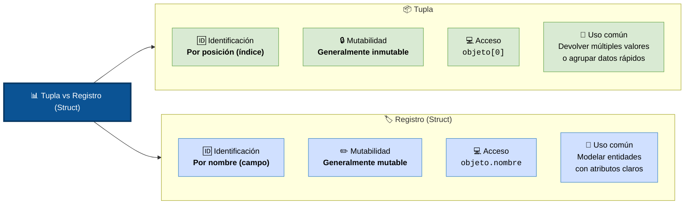

# Tuplas y Registros

Tanto las tuplas como los registros son estructuras de datos concretas y estáticas que permiten agrupar múltiples elementos bajo un solo nombre, pero se diferencian en la forma en que accedes a su información.

## ¿Qué es una Tupla?

Una tupla es una secuencia ordenada de elementos que pueden ser de diferentes tipos de datos (enteros, texto, booleanos, etc.) y cuyo tamaño es fijo.

+ **Acceso por posición:** Para obtener un dato, debes usar su índice numérico (su posición).
+ **Inmutabilidad:** En la mayoría de los lenguajes (como Python), una vez que creas una tupla, no puedes cambiar sus valores, agregar ni eliminar elementos.

Ejemplo en python:

```python
# Una tupla que representa las coordenadas y nombre de un lugar
punto = (4.71, -74.07, "Bogotá")

# Se accede por su índice numérico
print(punto[2])  # Imprime: Bogotá
```
## ¿Qué es un Registro (Record / Struct)?

Un registro (conocido como struct en C/C++ o Record en Java/C#) es una estructura que agrupa varias variables relacionadas (llamadas campos), donde cada una tiene su propio tipo de dato y un nombre explícito.

+ **Acceso por nombre:** En lugar de usar números ([0], [1]), accedes a los datos directamente escribiendo el nombre del campo mediante la nomenclatura de punto (.).
+ **Mutabilidad:** Por lo general, sus campos sí se pueden modificar después de ser creados, a menos que el lenguaje especifique lo contrario.

```c
// Se define la estructura del registro
struct Persona {
    char nombre[50];
    int edad;
    float estatura;
};

// Se crea el registro y se accede por el nombre del campo
struct Persona usuario1 = {"Carlos", 28, 1.75};
printf("%s", usuario1.nombre);  // Imprime: Carlos
```

### Diferencias clave
