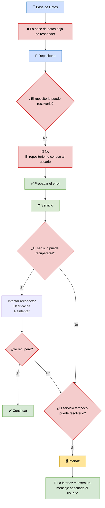

```mermaid
flowchart TB

DB["🗄️ Base de Datos"]

R["📂 Repositorio"]

S["⚙️ Servicio"]

UI["🖥️ Interfaz"]

ERR1["❌ La base de datos deja de responder"]

Q1{"¿El repositorio puede resolverlo?"}

A1["🚫 No<br/>El repositorio no conoce al usuario"]

GOOD["✅ Propagar el error"]

Q2{"¿El servicio puede recuperarse?"}

A2["Intentar reconectar<br/>Usar caché<br/>Reintentar"]

Q3{"¿Se recuperó?"}

OK["✔️ Continuar"]

Q4{"¿El servicio tampoco puede resolverlo?"}

SHOW["📢 La interfaz muestra un mensaje adecuado al usuario"]

DB --> ERR1

ERR1 --> R

R --> Q1

Q1 -->|No| A1

A1 --> GOOD

GOOD --> S

S --> Q2

Q2 -->|Sí| A2

A2 --> Q3

Q3 -->|Sí| OK

Q3 -->|No| Q4

Q2 -->|No| Q4

Q4 -->|Sí| UI

UI --> SHOW

classDef db fill:#D0E0FF,stroke:#3D85C6,color:#000;
classDef service fill:#D9EAD3,stroke:#6AA84F,color:#000;
classDef ui fill:#FFE599,stroke:#BF9000,color:#000;
classDef error fill:#F4CCCC,stroke:#CC0000,color:#000;
classDef success fill:#D5E8D4,stroke:#6AA84F,color:#000;

class DB,R db;
class S service;
class UI ui;
class ERR1,Q1,A1,Q2,Q3,Q4 error;
class GOOD,OK,SHOW success;
```