# Cuando la información falla: una reflexión desde una experiencia hospitalaria 🏥

### _Un ejercicio de pensamiento de ingeniería de software_ 🤔

> _...antes de continuar, una situación real me hizo detenerme a pensar en para qué sirven realmente todos estos conceptos..._

## 1. Introducción 🤒

A principios del mes de agosto tuve que pausar mi estudio debido a algunos síntomas de salud que me impidieron continuar; fui hospitalizado y durante la estancia en la clínica tuve la oportunidad de observar algo que, aunque inicialmente parecía ser simplemente una diferencia de criterios entre miembros del personal, terminó haciéndome _**pensar en un problema de ingeniería de software.**_

### 1.1 Una experiencia que me hizo pensar 🚑

En diferentes momentos recibí indicaciones que parecían _contradictorias o confusas:_

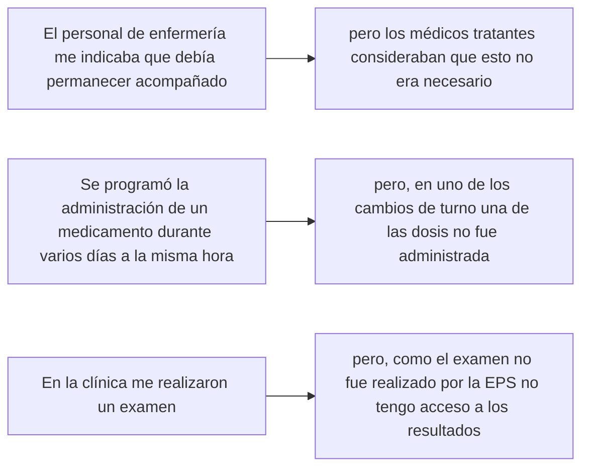

### 1.2 El antecedente: mi proyecto de arquitectura de software 🔙

En mi universidad el año pasado en la asignatura de arquitectura de software, nos pidieron crear un pequeño proyecto aplicando un patron de diseño de software con el fin de solucionar problemas específicos.

En mi caso escogí el patrón _**pub/sub**_ para resolver el siguiente problema:

Una compañía de salud que gestiona historias clínicas electrónicas utiliza una estructura orientada a servicios, pero se ha detectado un problema vinculado con la interoperabilidad entre sistemas internos y externos.

+ El acceso a resultados de laboratorio, la programación de citas y el historial médico se llevan a cabo de manera independiente; debido a que no tienen una comunicación estandarizada.

+ Esto provoca incoherencias en la información, duplicación de datos y demoras en el acceso resultados clínicos para los médicos y pacientes.

**En el ejercicio hipotético imaginaba:**
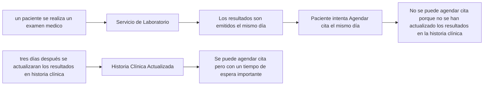

**Solución con el patrón _pub/sub:_**

En cuanto se emitan los resultados el servicio de laboratorio - _**publicador**_ - enviaría un mensaje.

Los dos suscriptores:
+ servicio agendamiento de citas - _**suscriptor 1**_
+ servicio historial médico - _**suscriptor 2**_

Actualizarían sus bases de datos con los resultados de laboratorio después de recibir el mensaje

> _Al aplicar el patrón (Pub/Sub) se solucionarían los problemas de: incoherencias en la información, duplicación de datos y demoras en el acceso resultados clínicos_

### 1.3 La conexión entre ambas experiencias

Mientras estaba en la clínica fue inevitable recordar lo estudiado en arquitectura de software, _**nunca imagine que pudiera estar en una situación tan similar a algo que solamente había imaginado.**_

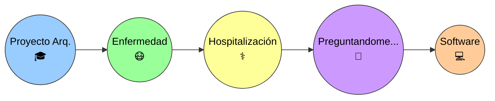

A pesar de todo me sentí muy bien atendido en la clínica y sé que estas situaciones son muy poco comunes y se producen más por temas administrativos o burocráticos que por descuido por parte del personal médico.

Finalmente, nada de lo sucedido tuvo una repercusión seria en mi caso. Sin embargo, como estudiante de ingeniería de software, me hicieron reflexionar desde otro punto de vista 👇

## 2. Del problema observado al problema de ingeniería

Lo acontecido me llevó a preguntarme cómo funcionan los sistemas de información de hospitales para lograr la comunicación y la continuidad durante la atención hospitalaria, y encontré una definición de la que aprendí algo muy importante: 

> _"un ingeniero de software no debería empezar pensando: **¿qué aplicación puedo programar?**"_

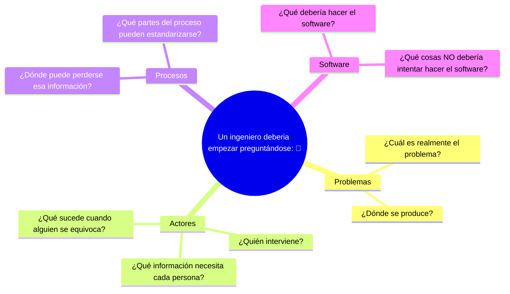

### 2.1 ¿Qué observé?

Las preguntas que yo me hacía eran:

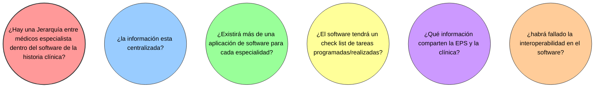

Aunque las preguntas que me hice son diferentes, creo que haber empezado preguntándome sobre el funcionamiento del sistema antes de imaginar algo como el código, el paradigma, las tecnologías etc... fue una mejor decisión.

### 2.2 ¿Cuál podría ser el problema?

El problema podría no estar necesariamente en una persona o en una acción concreta, sino en la forma en que la información, interactua dentro de un sistema como el de una institución medica.

Un paciente puede ser atendido por diferentes profesionales, Cada uno puede generar o necesitar información diferente, pero las decisiones y acciones de unos pueden depender de la información registrada por otros.

Por lo tanto, una posible representación del problema sería:

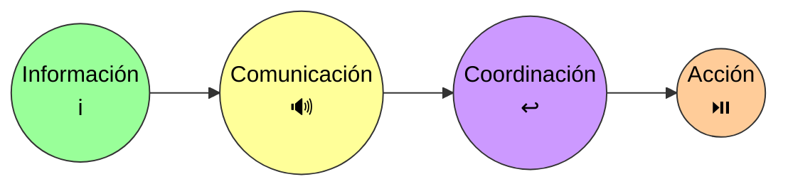

+ Si la información no está disponible, no se encuentra actualizada o no llega oportunamente a la persona que la necesita, la comunicación puede verse afectada. 

+ Y cuando la comunicación falla, también puede verse afectada la coordinación de las acciones que deben realizarse.

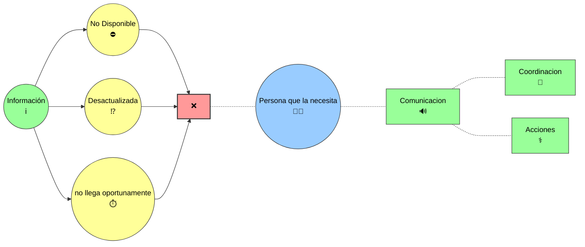

Esto me llevó a pensar que una posible solución de software no debería limitarse simplemente a almacenar información: 

> _sino que debería ayudar a que la información correcta esté disponible para las personas correspondientes, en el momento adecuado y dentro del contexto en el que necesitan utilizarla._

Desde esta perspectiva, el problema que intentaría abordar no sería simplemente _"falta de comunicación"_, sino algo más amplio:

_**¿Cómo podría diseñarse un sistema de información que facilite que las personas involucradas?**_

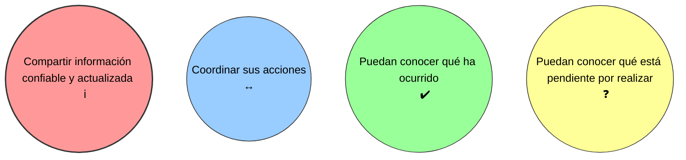

> **Esta sería, desde mi perspectiva actual y con los conocimientos que tengo, la pregunta inicial para comenzar a plantear una posible solución de software.**

### 2.3 Alcance de esta reflexión

<table>
<tr>
<td width="70%">
Esta reflexión no busca plantear una solución definitiva ni diseñar un sistema completo, sino realizar un ejercicio de pensamiento de ingeniería de software a partir de una situación real.
</td>

<td width="30%" align="center">

## 🖥️ 🎯 ⚙️ 💡
</td>
</tr>
</table>

<table>
<tr>

<td width="30%" align="center">

## 🔬 🧬 🧪 💊 
</td>

<td width="70%" >
El objetivo es identificar el problema desde una perspectiva general y explorar cómo podría plantearse una solución que mejore la comunicación, el manejo de la información y la coordinación entre los diferentes actores involucrados en la atención de un paciente.
</td>
</tr>
</table>

## 3. Entender el sistema antes de diseñarlo

Antes de pensar en una posible solución de software, considero necesario entender cómo funciona actualmente el sistema y cómo se relacionan las diferentes personas, procesos e información que participan en la atención de un paciente.

Para ello, intentaré analizar cinco aspectos principales: 
+ **quiénes participan,**
+ **qué información necesitan y generan,**
+ **cómo fluye esa información,**
+ **dónde se requiere coordinación** 
+ **y en qué puntos podrían producirse fallas o pérdidas de información.**

### 3.1 Actores

En la atención de un paciente intervienen diferentes actores, cada uno con responsabilidades y necesidades de información particulares. Entre ellos pueden encontrarse médicos tratantes y especialistas, personal de enfermería, terapeutas, personal administrativo, laboratorios, la EPS y el propio paciente.

Identificar estos actores permite comprender quién genera información, quién la necesita y entre quiénes debe existir comunicación y coordinación.

### 3.2 Información

Cada actor puede generar, consultar o necesitar información diferente durante la atención de un paciente. Esta información debe estar disponible de manera clara, actualizada y accesible para las personas que realmente la necesitan.

Algunos ejemplos pueden ser: **historia clínica, diagnósticos, medicamentos, resultados de exámenes, órdenes médicas, procedimientos, citas y tareas pendientes**.

Más que preguntarme únicamente dónde se almacena la información, considero importante entender **qué información existe, quién la genera, quién la necesita y en qué momento debe estar disponible**.

| Información            | Quién la genera      | Quién podría necesitarla      |
| ---------------------- | -------------------- | ----------------------------- |
| Historia clínica       | Médicos              | Personal médico y asistencial |
| Medicamentos           | Médicos / enfermería | Enfermería, médicos           |
| Resultados de exámenes | Laboratorio          | Médicos, paciente             |
| Órdenes médicas        | Médicos              | Enfermería, terapeutas        |
| Tareas pendientes      | Personal asistencial | Personal involucrado          |

### 3.3 Flujo de información

La información no solo debe existir, sino también llegar al actor adecuado en el momento en que la necesita. Por ello, es importante comprender cómo se genera, registra, comparte y utiliza la información durante la atención de un paciente.

Un mismo dato puede ser utilizado por diferentes actores y, dependiendo de cómo se transmita, pueden producirse retrasos, duplicaciones o pérdida de información. Entender este flujo permite identificar dónde podría ser necesario mejorar la comunicación y la coordinación.

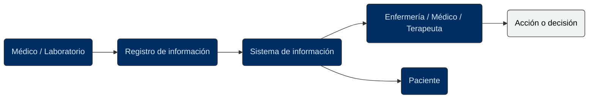

### 3.4 Puntos de coordinación

Durante la atención de un paciente existen momentos en los que diferentes actores deben coordinarse para realizar una acción o tomar una decisión. Estos puntos pueden involucrar, por ejemplo, la administración de medicamentos, la realización de exámenes, los cambios de turno o la comunicación de resultados.

Identificar estos momentos permite observar dónde la información debe estar disponible y ser comprendida por las personas involucradas para que la atención pueda continuar de manera coordinada.

| Situación                      | Actores involucrados                       | ¿Qué debe coordinarse?                                       |
| ------------------------------ | ------------------------------------------ | ------------------------------------------------------------ |
| Cambio de turno                | Enfermería / personal médico               | Información sobre el estado del paciente y tareas pendientes |
| Administración de medicamentos | Médico / enfermería                        | Orden, medicamento, horario y administración                 |
| Resultado de un examen         | Laboratorio / médico                       | Disponibilidad y comunicación del resultado                  |
| Traslado o procedimiento       | Médicos / enfermería / otros profesionales | Preparación, información y responsabilidades                 |

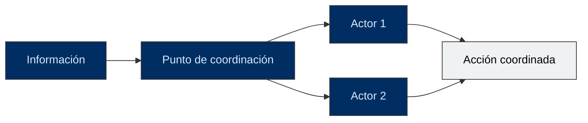

### 3.5 Posibles puntos de falla

Al analizar el flujo de información y los puntos de coordinación, también es importante identificar dónde podrían producirse fallas. La información podría no registrarse, estar desactualizada, no llegar al actor correspondiente o llegar demasiado tarde.

Estas situaciones no necesariamente implican un error de una persona; pueden ser consecuencia de procesos poco claros, sistemas que no se comunican correctamente o falta de mecanismos para verificar que una acción fue realizada.

Identificar estos posibles puntos de falla permite comenzar a pensar en qué aspectos debería ayudar a prevenir o detectar una posible solución de software.

| Posible falla                            | Posible consecuencia                      |
| ---------------------------------------- | ----------------------------------------- |
| Información no registrada                | El siguiente actor desconoce lo ocurrido  |
| Información desactualizada               | Se toman decisiones con datos incorrectos |
| Información no compartida                | Se interrumpe la coordinación             |
| Acción no registrada como realizada      | Puede repetirse o quedar pendiente        |
| Cambio de turno sin información completa | Se pierde continuidad en la atención      |

## 4. Principios para una posible solución

A partir de los problemas y puntos de falla identificados, puedo establecer algunos principios que deberían orientar una posible solución de software. Estos principios no representan todavía una arquitectura o una tecnología específica, sino criterios que considero importantes para que el sistema realmente ayude a mejorar la comunicación, la información y la coordinación.

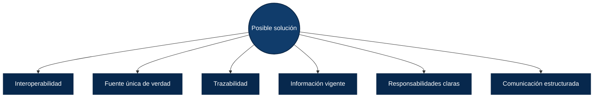

### 4.1 Interoperabilidad

En un sistema de salud pueden existir diferentes sistemas y aplicaciones utilizados por hospitales, laboratorios, EPS y otros actores. La interoperabilidad permitiría que estos sistemas puedan **intercambiar y utilizar información de manera adecuada**, evitando que los datos queden aislados en diferentes sistemas.

Para esta reflexión, considero que una posible solución debería facilitar que la información relevante pueda llegar al actor que la necesita, independientemente del sistema en el que haya sido generada.

![Diagrama Interoperabilidad]

### 4.2 Fuente única de verdad

### 4.3 Trazabilidad

### 4.4 Información vigente

### 4.5 Responsabilidades claras

### 4.6 Comunicación estructurada

## 5. ¿Qué podría hacer el software?

### 5.1 Centralizar información

### 5.2 Registrar acciones

### 5.3 Gestionar tareas pendientes

### 5.4 Notificar eventos importantes

### 5.5 Mantener historial de cambios

### 5.6 Facilitar la coordinación

## 6. Una arquitectura conceptual

### 6.1 Actores

### 6.2 Sistema central

### 6.3 Servicios

### 6.4 Eventos

### 6.5 Integración con sistemas externos

### 6.6 Mi antiguo ejemplo de Pub/Sub aplicado

## 7. Seguridad y privacidad

## 8. ¿Qué pasa cuando el software falla?

## 9. El software no reemplaza los procesos humanos

## 10. Lo que aprendí de este ejercicio

## 11. Reflexión final

### Glosario

+ **EHR / EMR (Historia Clínica Electrónica / Registros Médicos Electrónicos):** Sistemas digitales para almacenar, organizar y consultar el historial médico de los pacientes.

+ Interoperabilidad: Capacidad de los diferentes sistemas de información en salud para intercambiar datos de manera segura y estandarizada

+ **SaMD (Software como Dispositivo Médico):** Programas informáticos que cumplen funciones médicas sin necesidad de estar alojados en un hardware físico exclusivo

+ **SiMD (Software en Dispositivo Médico):** Es el software que viene integrado dentro de un aparato físico para controlarlo o hacer funcionar su hardware.

+ **Ley HITECH (2008):** Impulsó la adopción de tecnologías de información sanitaria y el uso de HCE por parte de los médicos mediante incentivos y normativas de interoperabilidad.

+ **Ley HIPAA:** Protege la privacidad y seguridad de la información médica contenida en las HCE mediante estrictas normas de divulgación.

+ **la Ley 2015 de 2020:** Crea y regula la Historia Clínica Electrónica Interoperable (IHCE). _(Colombia)_

+ **Interoperabilidad:** permite que la información sanitaria electrónica pueda intercambiarse y utilizarse entre diferentes sistemas y organizaciones, con el objetivo de facilitar una atención segura y coordinada

## Referencias

> Normatividad. (s/f). Gov.co. Recuperado el 1 de septiembre de 2026, de https://www.minsalud.gov.co/ihce/Paginas/Normatividad.aspx

> ONC - Office of the National Coordinator for Health IT. (2025, enero 10). Interoperability. ONC - Office of the National Coordinator for Health Information Technology. https://healthit.gov/interoperability/

> (S/f-a). Caseguard.com. Recuperado el 1 de septiembre de 2026, de https://caseguard.com/es/articles/la-ley-hitech-y-la-implementacion-de-las-historias-clinicas-electronicas/

> (S/f-b). Cprcare.com. Recuperado el 1 de septiembre de 2026, de https://cprcare.com/es/course/hipaa/6/