# Cuando la información falla: una reflexión desde una experiencia hospitalaria 🏥

### _Un ejercicio de pensamiento de ingeniería de software_ 🤔

> _...antes de continuar, una situación real me hizo detenerme a pensar en para qué sirven realmente todos estos conceptos..._

## 1. Introducción 🤒

A principios del mes de agosto tuve que pausar mi estudio debido a algunos síntomas de salud que me impidieron continuar; fui hospitalizado y durante la estancia en la clínica tuve la oportunidad de observar algo que, aunque inicialmente parecía ser simplemente una diferencia de criterios entre miembros del personal, terminó haciéndome _**pensar en un problema de ingeniería de software.**_

### 1.1 Una experiencia que me hizo pensar 🚑

En diferentes momentos recibí indicaciones que parecían _contradictorias o confusas:_

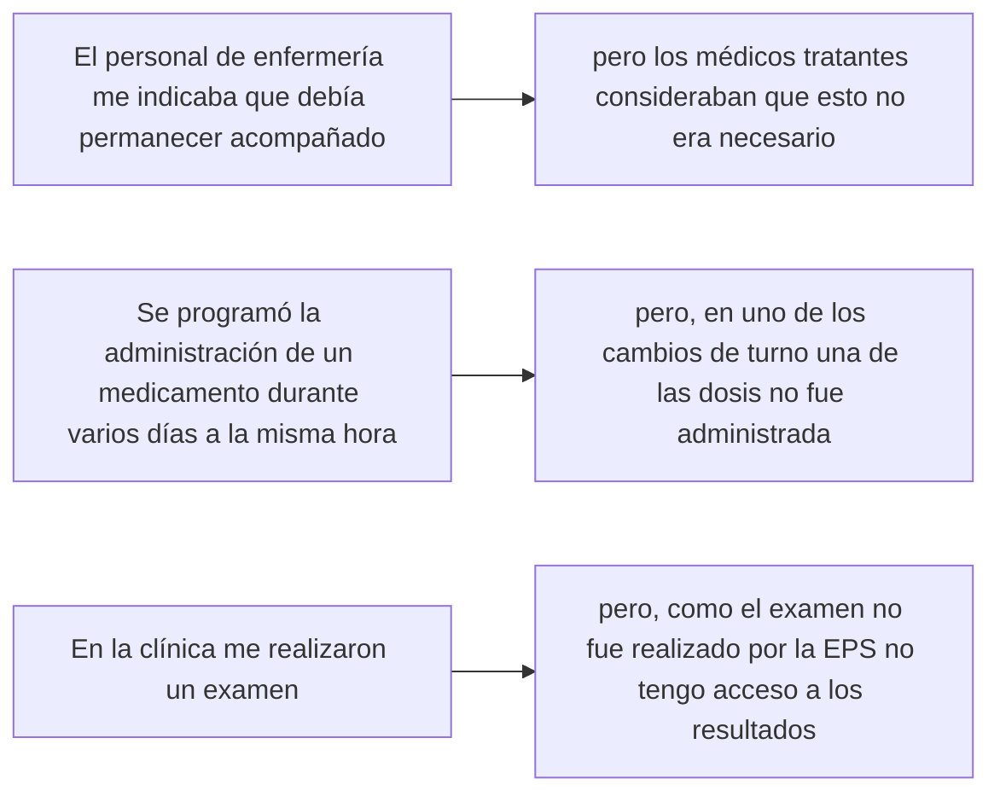

### 1.2 El antecedente: mi proyecto de arquitectura de software 🔙

En mi universidad el año pasado en la asignatura de arquitectura de software, nos pidieron crear un pequeño proyecto aplicando un patron de diseño de software con el fin de solucionar problemas específicos.

En mi caso escogí el patrón _**pub/sub**_ para resolver el siguiente problema:

Una compañía de salud que gestiona historias clínicas electrónicas utiliza una estructura orientada a servicios, pero se ha detectado un problema vinculado con la interoperabilidad entre sistemas internos y externos.

+ El acceso a resultados de laboratorio, la programación de citas y el historial médico se llevan a cabo de manera independiente; debido a que no tienen una comunicación estandarizada.

+ Esto provoca incoherencias en la información, duplicación de datos y demoras en el acceso resultados clínicos para los médicos y pacientes.


**En el ejercicio hipotético imaginaba:**
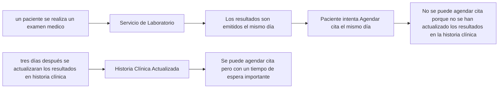

**Solución con el patrón _pub/sub:_**

En cuanto se emitan los resultados el servicio de laboratorio - _**publicador**_ - enviaría un mensaje.

Los dos suscriptores:
+ servicio agendamiento de citas - _**suscriptor 1**_
+ servicio historial médico - _**suscriptor 2**_

Actualizarían sus bases de datos con los resultados de laboratorio después de recibir el mensaje

> _Al aplicar el patrón (Pub/Sub) se solucionarían los problemas de: incoherencias en la información, duplicación de datos y demoras en el acceso resultados clínicos_


Link al repositorio del proyecto ➡️ https://github.com/JhAlexP/Patron_Pub_Sub/tree/main 

### 1.3 La conexión entre ambas experiencias

Mientras estaba en la clínica fue inevitable recordar lo estudiado en arquitectura de software, _**nunca imagine que pudiera estar en una situación tan similar a algo que solamente había imaginado.**_

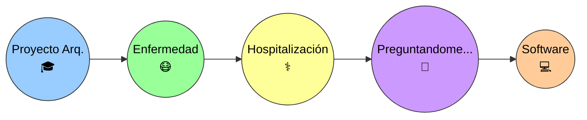

A pesar de todo me sentí muy bien atendido en la clínica y sé que estas situaciones son muy poco comunes y se producen más por temas administrativos o burocráticos que por descuido por parte del personal médico.

Finalmente, nada de lo sucedido tuvo una repercusión seria en mi caso. Sin embargo, como estudiante de ingeniería de software, me hicieron reflexionar desde otro punto de vista 👇

## 2. Del problema observado al problema de ingeniería

Lo acontecido me llevó a preguntarme cómo funcionan los sistemas de información de hospitales para lograr la comunicación y la continuidad durante la atención hospitalaria, y encontré una definición de la que aprendí algo muy importante: 

> _"un ingeniero de software no debería empezar pensando: **¿qué aplicación puedo programar?**"_

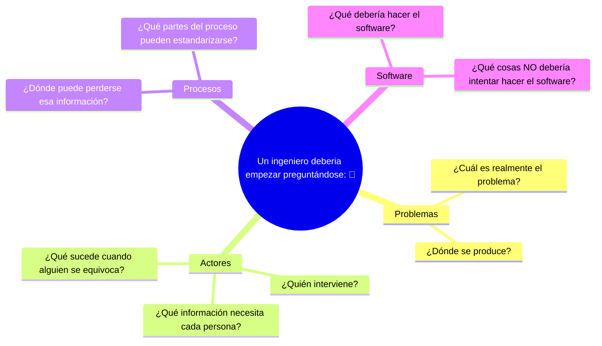

### 2.1 ¿Qué observé?

Las preguntas que yo me hacía eran:

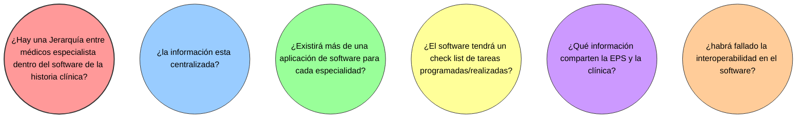

Aunque las preguntas que me hice son diferentes, creo que haber empezado preguntándome sobre el funcionamiento del sistema antes de imaginar algo como el código, el paradigma, las tecnologías etc... fue una mejor decisión.

### 2.2 ¿Cuál podría ser el problema?

El problema podría no estar necesariamente en una persona o en una acción concreta, sino en la forma en que la información, interactua dentro de un sistema como el de una institución medica.

Un paciente puede ser atendido por diferentes profesionales, Cada uno puede generar o necesitar información diferente, pero las decisiones y acciones de unos pueden depender de la información registrada por otros.

Por lo tanto, una posible representación del problema sería:

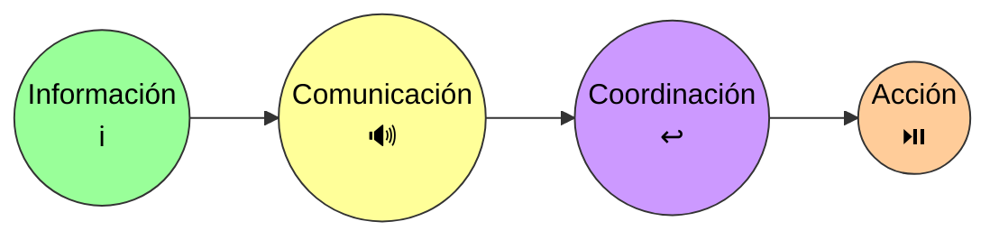

+ Si la información no está disponible, no se encuentra actualizada o no llega oportunamente a la persona que la necesita, la comunicación puede verse afectada. 

+ Y cuando la comunicación falla, también puede verse afectada la coordinación de las acciones que deben realizarse.

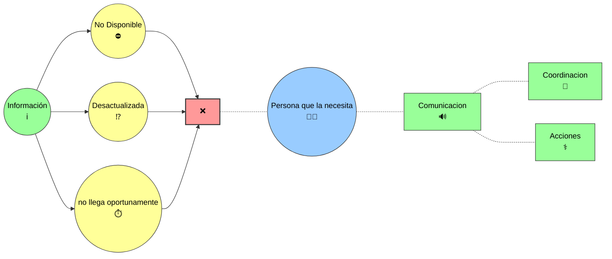

Esto me llevó a pensar que una posible solución de software no debería limitarse simplemente a almacenar información: 

> _sino que debería ayudar a que la información correcta esté disponible para las personas correspondientes, en el momento adecuado y dentro del contexto en el que necesitan utilizarla._

Desde esta perspectiva, el problema que intentaría abordar no sería simplemente _"falta de comunicación"_, sino algo más amplio:

_**¿Cómo podría diseñarse un sistema de información que facilite que las personas involucradas?**_

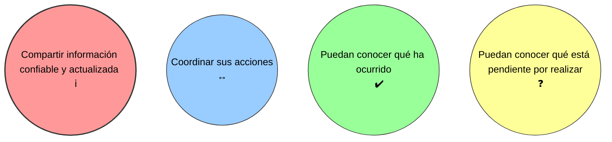

> **Esta sería, desde mi perspectiva actual y con los conocimientos que tengo, la pregunta inicial para comenzar a plantear una posible solución de software.**

### 2.3 Alcance de esta reflexión

<table>
<tr>
<td width="70%">
Esta reflexión no busca plantear una solución definitiva ni diseñar un sistema completo, sino realizar un ejercicio de pensamiento de ingeniería de software a partir de una situación real.
</td>

<td width="30%" align="center">

## 🖥️ 🎯 ⚙️ 💡
</td>
</tr>
</table>

<table>
<tr>

<td width="30%" align="center">

## 🔬 🧬 🧪 💊 
</td>

<td width="70%" >
El objetivo es identificar el problema desde una perspectiva general y explorar cómo podría plantearse una solución que mejore la comunicación, el manejo de la información y la coordinación entre los diferentes actores involucrados en la atención de un paciente.
</td>
</tr>
</table>

## 3. Entender el sistema antes de diseñarlo

Antes de pensar en una posible solución de software, considero necesario entender cómo funciona actualmente el sistema y cómo se relacionan las diferentes personas, procesos e información que participan en la atención de un paciente.

Para ello, intentaré analizar cinco aspectos principales: 
+ **quiénes participan,**
+ **qué información necesitan y generan,**
+ **cómo fluye esa información,**
+ **dónde se requiere coordinación** 
+ **y en qué puntos podrían producirse fallas o pérdidas de información.**

### 3.1 Actores

En la atención de un paciente intervienen diferentes actores, cada uno con responsabilidades y necesidades de información particulares. Entre ellos pueden encontrarse médicos tratantes y especialistas, personal de enfermería, terapeutas, personal administrativo, laboratorios, la EPS y el propio paciente.

Identificar estos actores permite comprender quién genera información, quién la necesita y entre quiénes debe existir comunicación y coordinación.


### 3.2 Información

Cada actor puede generar, consultar o necesitar información diferente durante la atención de un paciente. Esta información debe estar disponible de manera clara, actualizada y accesible para las personas que realmente la necesitan.

Algunos ejemplos pueden ser: **historia clínica, diagnósticos, medicamentos, resultados de exámenes, órdenes médicas, procedimientos, citas y tareas pendientes**.

Más que preguntarme únicamente dónde se almacena la información, considero importante entender **qué información existe, quién la genera, quién la necesita y en qué momento debe estar disponible**.


| Información            | Quién la genera      | Quién podría necesitarla      |
| ---------------------- | -------------------- | ----------------------------- |
| Historia clínica       | Médicos              | Personal médico y asistencial |
| Medicamentos           | Médicos / enfermería | Enfermería, médicos           |
| Resultados de exámenes | Laboratorio          | Médicos, paciente             |
| Órdenes médicas        | Médicos              | Enfermería, terapeutas        |
| Tareas pendientes      | Personal asistencial | Personal involucrado          |

### 3.3 Flujo de información

La información no solo debe existir, sino también llegar al actor adecuado en el momento en que la necesita. Por ello, es importante comprender cómo se genera, registra, comparte y utiliza la información durante la atención de un paciente.

Un mismo dato puede ser utilizado por diferentes actores y, dependiendo de cómo se transmita, pueden producirse retrasos, duplicaciones o pérdida de información. Entender este flujo permite identificar dónde podría ser necesario mejorar la comunicación y la coordinación.

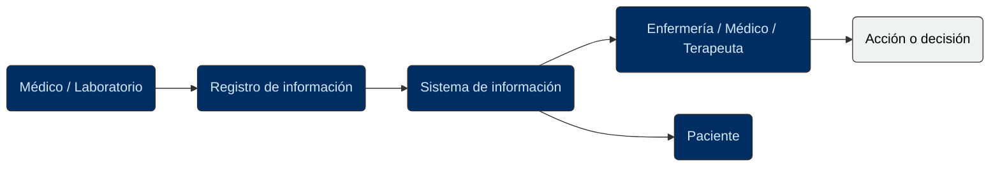

### 3.4 Puntos de coordinación

Durante la atención de un paciente existen momentos en los que diferentes actores deben coordinarse para realizar una acción o tomar una decisión. Estos puntos pueden involucrar, por ejemplo, la administración de medicamentos, la realización de exámenes, los cambios de turno o la comunicación de resultados.

Identificar estos momentos permite observar dónde la información debe estar disponible y ser comprendida por las personas involucradas para que la atención pueda continuar de manera coordinada.

| Situación                      | Actores involucrados                       | ¿Qué debe coordinarse?                                       |
| ------------------------------ | ------------------------------------------ | ------------------------------------------------------------ |
| Cambio de turno                | Enfermería / personal médico               | Información sobre el estado del paciente y tareas pendientes |
| Administración de medicamentos | Médico / enfermería                        | Orden, medicamento, horario y administración                 |
| Resultado de un examen         | Laboratorio / médico                       | Disponibilidad y comunicación del resultado                  |
| Traslado o procedimiento       | Médicos / enfermería / otros profesionales | Preparación, información y responsabilidades                 |

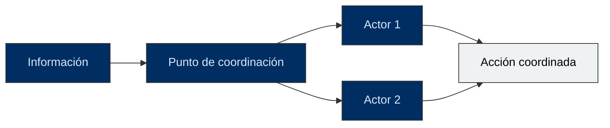

### 3.5 Posibles puntos de falla

Al analizar el flujo de información y los puntos de coordinación, también es importante identificar dónde podrían producirse fallas. La información podría no registrarse, estar desactualizada, no llegar al actor correspondiente o llegar demasiado tarde.

Estas situaciones no necesariamente implican un error de una persona; pueden ser consecuencia de procesos poco claros, sistemas que no se comunican correctamente o falta de mecanismos para verificar que una acción fue realizada.

Identificar estos posibles puntos de falla permite comenzar a pensar en qué aspectos debería ayudar a prevenir o detectar una posible solución de software.

| Posible falla                            | Posible consecuencia                      |
| ---------------------------------------- | ----------------------------------------- |
| Información no registrada                | El siguiente actor desconoce lo ocurrido  |
| Información desactualizada               | Se toman decisiones con datos incorrectos |
| Información no compartida                | Se interrumpe la coordinación             |
| Acción no registrada como realizada      | Puede repetirse o quedar pendiente        |
| Cambio de turno sin información completa | Se pierde continuidad en la atención      |

## 4. Principios para una posible solución

A partir de los problemas y puntos de falla identificados, puedo establecer algunos principios que deberían orientar una posible solución de software. Estos principios no representan todavía una arquitectura o una tecnología específica, sino criterios que considero importantes para que el sistema realmente ayude a mejorar la comunicación, la información y la coordinación.

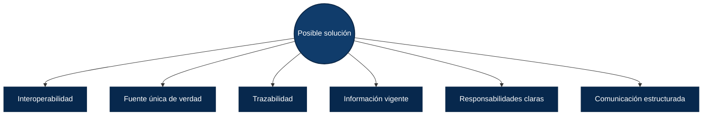

### 4.1 Interoperabilidad

En un sistema de salud pueden existir diferentes sistemas y aplicaciones utilizados por hospitales, laboratorios, EPS y otros actores. La interoperabilidad permitiría que estos sistemas puedan **intercambiar y utilizar información de manera adecuada**, evitando que los datos queden aislados en diferentes sistemas.

Para esta reflexión, considero que una posible solución debería facilitar que la información relevante pueda llegar al actor que la necesita, independientemente del sistema en el que haya sido generada.


### 4.2 Fuente única de verdad

Si diferentes actores pueden registrar o consultar la misma información, es importante evitar que existan múltiples versiones de un mismo dato. Una fuente única de verdad permitiría que los actores autorizados consulten una referencia común y actualizada de la información del paciente.

De esta manera, una modificación realizada en un punto del sistema podría estar disponible para los demás actores que necesiten conocerla, reduciendo el riesgo de trabajar con información diferente o desactualizada.

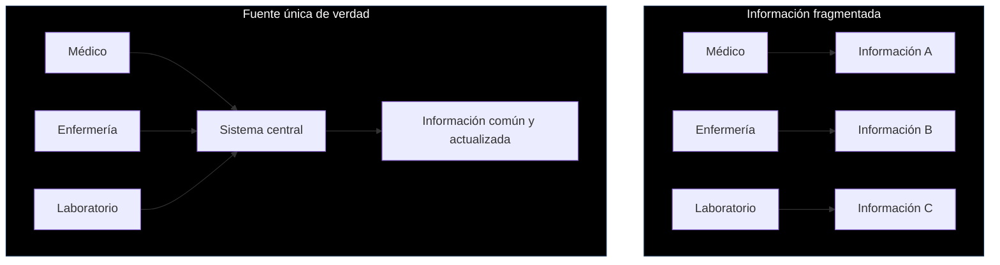

### 4.3 Trazabilidad

La trazabilidad permitiría conocer qué ocurrió con la información durante el proceso: 

+ **¿Quién realizó una acción?**
+ **¿Cuándo se realizó?**
+ **¿Qué cambios se produjeron**?

Esto ayudaría a mantener un historial de las acciones relacionadas con la atención del paciente y permitiría identificar con mayor facilidad qué ocurrió cuando se presenta un problema o una información no coincide con lo esperado.


### 4.4 Información vigente

La información debe mantenerse actualizada para evitar que los diferentes actores trabajen con datos que ya no representan la situación actual del paciente.

Una posible solución debería permitir identificar cuál es la información vigente y cuándo fue registrada o actualizada. De esta manera, los actores autorizados podrían tomar decisiones basándose en la información más reciente disponible.

| Situación                  | Riesgo                                       |
| -------------------------- | -------------------------------------------- |
| Información desactualizada | Tomar decisiones con datos que ya cambiaron  |
| Información vigente        | Trabajar con el estado más reciente conocido |


### 4.5 Responsabilidades claras

En un sistema donde intervienen diferentes actores, es importante que cada uno tenga claramente definido qué información debe gestionar, qué acciones le corresponden y qué responsabilidades tiene dentro del proceso.

Una posible solución debería facilitar la identificación de estas responsabilidades, evitando que una tarea quede sin realizar porque no está claro quién debe ejecutarla o quién debe dar continuidad a una determinada acción.

| Actor       | Responsabilidad                     | Información relacionada |
| ----------- | ----------------------------------- | ----------------------- |
| Médico      | Registrar órdenes y decisiones      | Órdenes médicas         |
| Enfermería  | Ejecutar y registrar acciones       | Medicamentos / cuidados |
| Laboratorio | Registrar resultados                | Resultados de exámenes  |
| Sistema     | Facilitar información y seguimiento | Registros y tareas      |

### 4.6 Comunicación estructurada

La comunicación entre los diferentes actores debe seguir una estructura clara que permita transmitir la información necesaria de forma comprensible y oportuna.

Una posible solución debería facilitar que las comunicaciones importantes queden asociadas al contexto correspondiente, evitando depender únicamente de mensajes informales o de la memoria de las personas. Esto podría ayudar a que la información relevante pueda ser consultada posteriormente por los actores autorizados.


## 5. ¿Qué podría hacer el software?

A partir de los principios anteriores, puedo comenzar a plantear qué funciones podría cumplir una posible solución de software. El objetivo no sería reemplazar las decisiones de los profesionales, sino facilitar el acceso a la información, mejorar la comunicación y apoyar la coordinación entre los diferentes actores.

### 5.1 Centralizar información

Una posible solución podría reunir en un mismo sistema la información relevante del paciente que actualmente puede encontrarse distribuida entre diferentes actores o sistemas.

Esto no significa necesariamente que toda la información deba almacenarse en un único lugar, sino que los actores autorizados deberían poder consultar la información que necesitan desde un punto común, reduciendo la fragmentación y facilitando la continuidad de la atención.

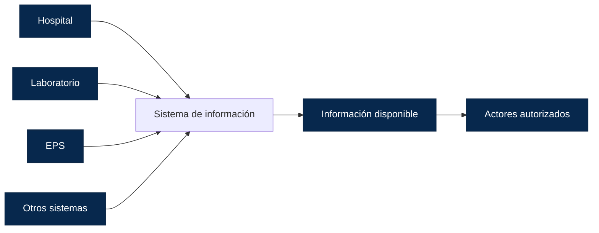

### 5.2 Registrar acciones e información

Una posible solución debería permitir que las acciones realizadas durante la atención de un paciente queden registradas de manera clara y asociadas a la información correspondiente.

No se trataría únicamente de almacenar datos, sino de poder conocer:

+ **¿Qué acción se realizó?**
+ **¿Quién la realizó?**
+ **¿Cuándo ocurrió?**
+ **¿Cuál fue el resultado o estado de dicha acción?**

Esto permitiría que otros actores autorizados puedan consultar posteriormente lo ocurrido y continuar el proceso con mayor contexto.

Por ejemplo, si se genera una orden médica, se administra un medicamento o se realiza un examen, el sistema debería permitir registrar estas acciones y reflejar si se encuentran:

+ **Pendientes**
+ **Realizadas** 
+ **Que requieren alguna acción posterior**

De esta manera, el registro de acciones podría ayudar a reducir situaciones en las que una actividad queda sin continuidad simplemente porque no existe una forma clara de saber si ya fue realizada o quién debe continuar con el proceso.

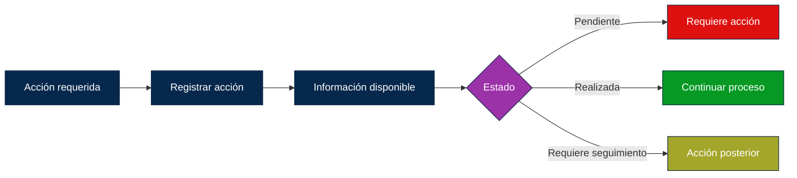

### 5.3 Gestionar tareas pendientes

Una posible solución debería permitir identificar las tareas que aún están pendientes dentro de la atención de un paciente y facilitar su seguimiento por parte de los actores responsables.

Cada tarea debería estar asociada con la información necesaria para comprender

```
1. ¿Qué debe realizarse?
       |
       |_ 2. ¿Quién debe hacerlo?
            |
            |_ 3. ¿Cuál es su estado?
```

De esta manera, las personas involucradas podrían conocer no solo las acciones que ya se realizaron, sino también aquellas que requieren atención.

+ El objetivo sería: 

> _Reducir el riesgo de que una tarea quede olvidada, duplicada o sin responsable, proporcionando una visión clara de_ **qué está pendiente y qué debe ocurrir a continuación**.


### 5.4 Notificar eventos importantes

Una posible solución podría generar notificaciones cuando ocurra un evento que requiera la atención de alguno de los actores involucrados. De esta manera, la información importante no dependería únicamente de que una persona consulte periódicamente el sistema.

Por ejemplo, podría notificarse la disponibilidad de un resultado, la modificación de una orden, el cumplimiento de una tarea o cualquier otro evento que requiera una acción posterior.

Las notificaciones deberían estar dirigidas únicamente a los actores correspondientes y contener la información necesaria para comprender:

+ **¿Qué ocurrió?**
+ **¿Cuándo ocurrió?**
+ **¿Requiere alguna acción?**

El objetivo no sería generar una gran cantidad de alertas, sino facilitar que los eventos relevantes lleguen oportunamente a las personas que necesitan conocerlos y actuar sobre ellos.

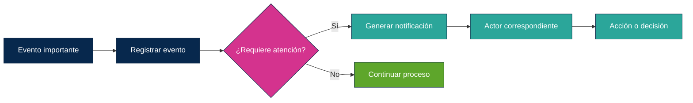

### 5.5 Mantener historial de cambios

Una posible solución debería mantener un historial de los cambios realizados sobre la información relacionada con la atención del paciente. Esto permitiría conocer cómo ha evolucionado la información y evitar que una modificación haga desaparecer completamente el contexto de lo ocurrido anteriormente.

El historial podría permitir identificar:

+ **¿Qué información fue modificada?**
+ **¿Quién realizó el cambio?**
+ **¿Cuándo ocurrió?**
+ **¿Qué se modificó?**

De esta manera, los actores autorizados podrían consultar los antecedentes de una determinada situación cuando sea necesario.

Esto también contribuiría a la trazabilidad del sistema, ya que permitiría reconstruir de manera ordenada los principales cambios ocurridos durante el proceso de atención.

El objetivo no sería conservar información innecesaria, 
> _sino proporcionar un registro que permita comprender_ **qué ocurrió y cómo llegó la información a su estado actual**.


### 5.6 Facilitar la coordinación

Una posible solución debería facilitar la coordinación entre los diferentes actores que participan en la atención de un paciente, permitiendo que cada uno pueda conocer la información necesaria para continuar con el proceso.

El sistema podría relacionar:

+ **Información**
+ **Tareas**
+ **Responsables**
+ **Eventos** 

de manera que:
> las acciones realizadas por un actor puedan servir como punto de partida para las acciones que deben realizar otros. 

Así, por ejemplo: 

+ _la disponibilidad de un resultado podría permitir que el médico conozca que ya puede revisarlo,_
+ _o la realización de una orden podría indicar a otro actor que existe una acción pendiente._


De esta manera, el software no tomaría las decisiones por los profesionales, sino que ayudaría a:

> **conectar las diferentes acciones que forman parte del proceso de atención,** 
 
haciendo más visible qué ocurrió, qué está pendiente y quién debe continuar.

El objetivo sería favorecer la continuidad del proceso y reducir:

1. _La dependencia de comunicaciones informales_
2. _Mensajes aislados_
3. _Que cada persona tenga que conocer por sí misma todo lo que ha ocurrido previamente._

## 6. Una arquitectura conceptual

Después de identificar el problema, los actores involucrados, el flujo de información y algunas de las funciones que podría cumplir una posible solución, considero que el siguiente paso es representar:

+ **¿cómo podrían relacionarse estos elementos dentro de un sistema?**.

En esta etapa no pretendo definir tecnologías, lenguajes de programación, bases de datos o una arquitectura específica. La intención es construir una **visión conceptual** que permita entender qué componentes podrían existir, qué responsabilidad tendría cada uno y cómo se relacionarían entre sí.

Esta representación parte de una idea sencilla:

<span style="color: #00ff00;">_**El sistema debería permitir que los diferentes actores puedan interactuar con la información del paciente, registrar acciones, gestionar tareas, recibir notificaciones y consultar el historial necesario para dar continuidad al proceso.**_</span>


Por lo tanto, esta arquitectura conceptual busca responder principalmente a una pregunta:

> **¿Cómo podrían organizarse los diferentes elementos de una posible solución para facilitar el flujo de información y la coordinación entre los actores involucrados?**

### 6.1 Actores

Los actores representan a las personas, organizaciones o sistemas que interactúan con la solución o que participan de alguna manera en el flujo de información.

Cada actor tendría diferentes responsabilidades y necesidades dentro del sistema. Por esta razón, no todos deberían tener acceso a la misma información ni realizar las mismas acciones. La solución debería permitir que cada uno pueda consultar y gestionar únicamente aquello que corresponda a su participación en el proceso.

Entre los principales actores podrían encontrarse:

| Actor                  | Participación en el sistema                                                        |
| ---------------------- | ---------------------------------------------------------------------------------- |
| Médico                 | Consulta información, registra decisiones y genera órdenes                         |
| Enfermería             | Consulta órdenes, registra acciones y gestiona tareas relacionadas con la atención |
| Laboratorio            | Registra y comunica resultados de exámenes                                         |
| Terapeutas             | Consultan información relevante y registran las acciones realizadas                |
| Administración         | Gestiona información relacionada con procesos administrativos                      |
| EPS                    | Intercambia información relacionada con los servicios y procesos autorizados       |
| Paciente               | Consulta información relacionada con su atención                                   |
| Sistema de información | Facilita el intercambio, registro y disponibilidad de la información               |

La identificación de estos actores permite establecer los límites y responsabilidades de cada participante. A partir de ellos, se puede comenzar a definir 


**Qué información puede consultar cada uno, qué acciones puede realizar y con quién necesita comunicarse**.

### 6.2 Sistema central

En esta arquitectura conceptual, el sistema central sería el punto donde se concentran las principales funciones relacionadas con la gestión de la información y la coordinación de los diferentes actores.

No necesariamente significa que toda la información deba almacenarse físicamente en un único lugar. La idea es que exista un **punto común de interacción** que permita consultar la información disponible, registrar acciones, gestionar tareas, generar notificaciones y mantener el historial de los cambios realizados.

El sistema central también debería encargarse de establecer qué información puede consultar o modificar cada actor, de acuerdo con sus responsabilidades dentro del proceso. De esta manera, los diferentes participantes podrían trabajar sobre una referencia común sin que necesariamente tengan acceso a toda la información existente.

Conceptualmente, este sistema actuaría como un **punto de conexión entre los actores y la información**, facilitando que las acciones realizadas por una persona puedan ser conocidas y utilizadas por quienes necesiten continuar con el proceso.


### 6.3 Servicios

Dentro de esta arquitectura conceptual, los servicios representarían las principales capacidades que el sistema ofrecería a los diferentes actores. 

Los servicios permiten definir 
+ **¿Qué debería ser capaz de hacer el sistema?** 

para cumplir con el objetivo planteado.

Entre ellos podrían encontrarse servicios para consultar y gestionar la información del paciente, registrar acciones, administrar tareas pendientes, generar notificaciones y mantener el historial de cambios.

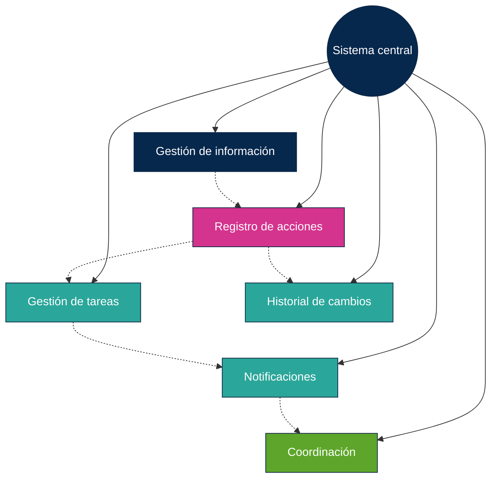

Cada servicio tendría una responsabilidad determinada, pero todos formarían parte de una misma solución y podrían relacionarse entre sí. Por ejemplo, el registro de una acción podría actualizar una tarea pendiente y, dependiendo del evento producido, generar una notificación para otro actor.

De esta manera, los servicios permitirían dividir la solución en responsabilidades claramente identificables, manteniendo como objetivo común:

+ **Facilitar el acceso a la información**
+ **Facilitar La comunicación**
+ **Facilitar la coordinación durante el proceso de atención**

### 6.4 Eventos

Los eventos representarían situaciones relevantes que ocurren durante el proceso de atención y que podrían generar una respuesta dentro del sistema.

Un evento podría producirse cuando, por ejemplo, se registra una nueva orden, se completa una tarea, se obtiene un resultado de examen, se modifica información importante o se presenta alguna situación que requiera la atención de otro actor.


La importancia de los eventos estaría en que permitirían **conectar las diferentes acciones y servicios del sistema**. Cuando ocurre un evento, el sistema podría registrar lo sucedido, actualizar la información correspondiente o notificar al actor que necesite conocerlo.

De esta manera, los eventos ayudarían a que el sistema no dependa únicamente de que una persona consulte constantemente la información, sino que pueda reaccionar ante situaciones relevantes y facilitar la continuidad del proceso.

### 6.5 Integración con sistemas externos

En un sistema de salud es posible que parte de la información necesaria para la atención de un paciente se encuentre en sistemas administrados por diferentes organizaciones. Por esta razón, una posible solución no debería considerarse como un sistema completamente aislado.

La integración con sistemas externos permitiría **intercambiar información con hospitales, laboratorios, EPS u otros sistemas relacionados**, de manera que la información relevante pueda estar disponible para los actores autorizados sin necesidad de registrarla nuevamente en cada sistema.

Por ejemplo, un laboratorio podría generar un resultado y comunicar su disponibilidad al sistema central. De la misma manera, otros sistemas podrían proporcionar información que sea necesaria para continuar con un proceso de atención.

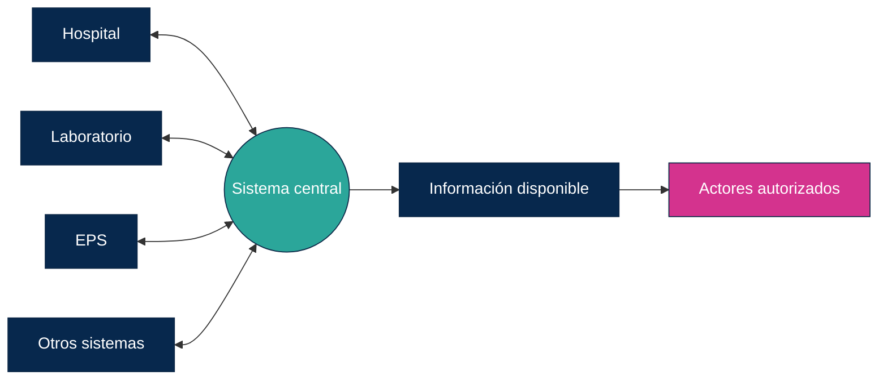

Esta integración debería mantener las reglas de acceso y responsabilidades correspondientes, de manera que cada organización o sistema comparta únicamente la información necesaria y autorizada.

El objetivo sería reducir la fragmentación de la información y facilitar la continuidad del proceso, evitando que la comunicación entre sistemas dependa exclusivamente de procesos manuales.

### 6.6 Mi antiguo ejemplo de Pub/Sub aplicado
> Link al repositorio ➡️ https://github.com/JhAlexP/Patron_Pub_Sub/tree/main🔗

Al comparar este antiguo ejercicio con la reflexión actual, encuentro una relación interesante. En ambos casos aparece la necesidad de que **la información generada en un punto pueda llegar oportunamente a otros sistemas o actores que necesitan utilizarla**.

Por ejemplo, el flujo conceptual podría ser:

**Laboratorio → publicación del evento → sistemas interesados → actualización de la información**

```mermaid
flowchart LR
    L[Laboratorio] --> P((Evento<br/>Resultado disponible))

    P --> C[Sistema de citas]
    P --> H[Historia clínica]

    C --> C2[Información actualizada]
    H --> H2[Información actualizada]

    %% Estilos de los nodos
    style L fill:#07284d,stroke:#0d2847,stroke-width:1px,color:#fff;
    style P fill:#07284d,stroke:#0d2847,stroke-width:1px,color:#fff;
    style C fill:#d4338e,stroke:#0d2847,stroke-width:1px,color:#fff;
    style H fill:#2ba69a,stroke:#0d2847,stroke-width:1px,color:#fff;
    style C2 fill:#d4338e,stroke:#0d2847,stroke-width:1px,color:#fff;
    style H2 fill:#2ba69a,stroke:#0d2847,stroke-width:1px,color:#fff;
```

Sin embargo, en esta reflexión no quiero asumir que _Pub/Sub_ sea necesariamente la solución definitiva. Lo considero más bien un ejemplo de cómo una decisión de arquitectura puede surgir después de comprender el problema y las relaciones entre los diferentes elementos del sistema.

Este ejercicio también me permite observar cómo un mismo concepto de arquitectura puede adquirir un significado diferente cuando se analiza a partir de una situación real.

## 7. Seguridad y privacidad

Al tratarse de un sistema relacionado con la atención de pacientes, la seguridad y la privacidad deberían ser consideradas desde el inicio del diseño y no como características que se agregan posteriormente.

La información gestionada por el sistema podría incluir datos personales, información clínica, resultados de exámenes, medicamentos y otros datos que requieren un manejo cuidadoso. Por esta razón, una posible solución debería garantizar que **la información solo sea accesible y utilizada por los actores que realmente la necesitan y están autorizados para hacerlo**.

Algunos aspectos que deberían considerarse son:

* **Control de acceso:** cada actor debería acceder únicamente a la información y funciones que correspondan a sus responsabilidades.
* **Privacidad:** la información del paciente debería ser protegida y utilizada únicamente para los fines correspondientes.
* **Trazabilidad:** las acciones y modificaciones importantes deberían quedar registradas para conocer quién realizó una acción y cuándo ocurrió.
* **Protección de la información:** los datos deberían contar con mecanismos adecuados para evitar accesos, modificaciones o pérdidas no autorizadas.
* **Disponibilidad:** la información necesaria debería estar disponible para los actores autorizados cuando sea requerida para continuar con el proceso de atención.


En esta etapa no pretendo definir mecanismos técnicos específicos de seguridad, sino reconocer que una arquitectura para este tipo de sistema debe considerar la **confidencialidad, integridad, disponibilidad y trazabilidad de la información** como parte fundamental de su diseño.

La seguridad, por lo tanto, no debería entenderse únicamente como una protección contra ataques externos, sino también como una forma de garantizar que la información llegue a **la persona correcta, en el momento adecuado y bajo las condiciones apropiadas de acceso**.

## 8. ¿Qué pasa cuando el software falla?

Hasta este punto he planteado cómo una posible solución podría ayudar a mejorar la comunicación, el manejo de la información y la coordinación. Sin embargo, también considero necesario plantear una pregunta fundamental: **¿qué ocurre cuando el propio sistema falla?**

En un entorno como el hospitalario, no sería suficiente con diseñar un sistema que funcione correctamente en condiciones normales. También sería necesario pensar qué debería ocurrir cuando la información no está disponible, una acción no puede registrarse, un servicio deja de funcionar o existe algún problema de comunicación entre sistemas.

Una posible solución debería considerar estos escenarios desde su diseño y evitar que una falla del software se convierta automáticamente en una falla del proceso de atención.

Por ejemplo, si el sistema no puede registrar una acción, debería existir alguna forma de identificar que el registro no se realizó correctamente. Si una notificación no puede enviarse, debería ser posible detectar esta situación. Y si un sistema externo deja de responder, los actores involucrados deberían poder conocer que existe una interrupción y contar con un mecanismo para continuar el proceso.

```mermaid
flowchart LR
    A[Acción del usuario] --> B[Sistema]
    B --> C{¿Funcionó correctamente?}

    C -->|Sí| D[Registrar información]
    D --> E[Continuar proceso]

    C -->|No| F[Detectar falla]
    F --> G[Informar situación]
    G --> H[Alternativa para continuar]
    H --> E

    %% Estilos de los nodos
    style A fill:#07284d,stroke:#0d2847,stroke-width:1px,color:#fff;
    style B fill:#07284d,stroke:#0d2847,stroke-width:1px,color:#fff;
    style C fill:#d4338e,stroke:#0d2847,stroke-width:1px,color:#fff;
    style D fill:#2ba69a,stroke:#0d2847,stroke-width:1px,color:#fff;
    style E fill:#d4338e,stroke:#0d2847,stroke-width:1px,color:#fff;
    style F fill:#2ba69a,stroke:#0d2847,stroke-width:1px,color:#fff;
    style G fill:#2ba69a,stroke:#0d2847,stroke-width:1px,color:#fff;
    style H fill:#2ba69a,stroke:#0d2847,stroke-width:1px,color:#fff;
```

Esto plantea otro principio importante:

> **El sistema debe asumir que pueden ocurrir fallas y establecer mecanismos para detectarlas, comunicarlas y permitir la continuidad del proceso.**

Por lo tanto, la confiabilidad de una solución no dependería únicamente de evitar errores, sino también de **cómo responde ante ellos**.

Esta reflexión resulta especialmente importante porque el software sería un apoyo para el proceso de atención y no debería convertirse en un único punto del que dependa absolutamente todo. Siempre debería existir una forma de reconocer una falla y establecer cómo continuar cuando el sistema no puede cumplir temporalmente con su función.

## 9. El software no reemplaza los procesos humanos

A lo largo de esta reflexión he planteado diferentes formas en las que el software podría ayudar a mejorar la comunicación, el manejo de la información y la coordinación dentro de una institución hospitalaria. Sin embargo, considero importante establecer un límite: **el software debe apoyar los procesos humanos, no reemplazarlos por completo**.

La atención de un paciente involucra decisiones, conocimientos, responsabilidades y situaciones que requieren la participación de diferentes profesionales. Un sistema puede facilitar el acceso a la información, recordar tareas, registrar acciones o comunicar eventos importantes, pero no debería asumir por sí mismo las decisiones que corresponden a las personas responsables de la atención.

Por ejemplo, el sistema podría informar que un resultado está disponible, pero corresponde al profesional autorizado interpretarlo. También podría indicar que una tarea está pendiente, pero la decisión sobre cómo realizarla debe seguir los procesos y responsabilidades establecidos.


Esto significa que una posible solución debería buscar un equilibrio entre **automatización y participación humana**. El objetivo del software sería reducir tareas innecesarias, facilitar la comunicación y hacer más visible la información relevante, permitiendo que las personas puedan concentrarse en las actividades que requieren su conocimiento y criterio.

Por esta razón, al diseñar una solución de este tipo, también sería necesario preguntarse:

> **¿Qué debería hacer el software y qué debería seguir haciendo una persona?**

Considero que esta pregunta es tan importante como definir las funcionalidades del sistema, porque una buena solución no necesariamente es la que más procesos automatiza, sino la que **apoya adecuadamente a las personas sin eliminar las responsabilidades que requieren intervención humana**.

## 10. Lo que aprendí de este ejercicio

Este ejercicio me permitió entender que la ingeniería de software no comienza necesariamente escribiendo código. En muchas ocasiones, el primer paso debería ser **comprender el problema, observar cómo funciona el sistema actual y entender cómo las personas, los procesos y la información se relacionan entre sí**.

Al comenzar esta reflexión, mi atención estaba principalmente en las situaciones que observé durante mi hospitalización. Sin embargo, al analizarlas desde una perspectiva de ingeniería, comprendí que detrás de una situación aparentemente sencilla pueden existir diferentes actores, procesos, sistemas y flujos de información que interactúan entre sí.

También pude relacionar una experiencia real con conceptos que anteriormente había estudiado de manera más académica. El ejemplo de **Pub/Sub** que había desarrollado en la asignatura de Arquitectura de Software adquirió un significado diferente al analizar nuevamente el problema desde una situación concreta. Esto me permitió comprender mejor que los patrones y conceptos de arquitectura no deberían aplicarse simplemente porque conocemos una tecnología o queremos utilizarla, sino porque pueden responder a una necesidad previamente identificada.

Otro aprendizaje importante fue entender que **una solución de software no necesariamente consiste en automatizarlo todo**. El sistema debe apoyar a las personas, facilitar su trabajo y proporcionarles información útil, pero algunas decisiones y responsabilidades deben continuar estando en manos de los profesionales correspondientes.

También comprendí que diseñar un sistema no consiste únicamente en pensar en el escenario en el que todo funciona correctamente. Es necesario preguntarse qué ocurre cuando existe un error, cuando la información no está disponible, cuando un sistema externo falla o cuando una persona no puede completar una tarea. En otras palabras, **las fallas también forman parte del problema que debemos diseñar**.

Finalmente, este ejercicio cambió un poco mi manera de observar los problemas cotidianos. Una situación que inicialmente podría parecer simplemente un problema de comunicación puede llevar a preguntas mucho más profundas:

> **¿Qué información se necesita?
> ¿Quién la necesita?
> ¿Cuándo debe estar disponible?
> ¿Qué ocurre si no llega?
> ¿Cómo podemos saber qué ocurrió?
> ¿Y cómo debería responder el sistema cuando algo falla?**

Para mí, ese es uno de los principales aprendizajes de este ejercicio: **antes de pensar en qué tecnología utilizar, debo aprender a entender qué problema estoy intentando resolver y por qué.**

Esta reflexión no pretende demostrar que exista una única solución para las situaciones observadas. Su valor está en haberme permitido aplicar conceptos de ingeniería de software a un contexto real y, al mismo tiempo, reconocer que detrás de un buen diseño existe primero un proceso de observación, análisis y comprensión del problema.

```mermaid
flowchart LR
    A[Experiencia real] --> B[Preguntas]
    B --> C[Comprender el problema]
    C --> D[Analizar información y procesos]
    D --> E[Plantear una posible solución]
    E --> F[Reflexionar sobre lo aprendido]
    F --> G[Mejorar mi forma de pensar como ingeniero]

    %% Estilos de los nodos
    style A fill:#030829,stroke:#0d2847,stroke-width:1px,color:#64e3e1;
    style B fill:#030829,stroke:#0d2847,stroke-width:1px,color:#64e3e1;
    style C fill:#030829,stroke:#0d2847,stroke-width:1px,color:#64e3e1;
    style D fill:#030829,stroke:#0d2847,stroke-width:1px,color:#64e3e1;
    style E fill:#030829,stroke:#0d2847,stroke-width:1px,color:#64e3e1;
    style F fill:#030829,stroke:#0d2847,stroke-width:1px,color:#64e3e1;
    style G fill:#030829,stroke:#0d2847,stroke-width:1px,color:#64e3e1;

```

## 11. Reflexión final

Esta experiencia me permitió observar una situación cotidiana desde una perspectiva diferente. Durante mi hospitalización, mi principal preocupación era mi propia atención y recuperación, pero posteriormente pude analizar algunas de las situaciones que viví desde la perspectiva de alguien que está aprendiendo a diseñar sistemas de software.

Comprendí que muchos problemas relacionados con la información no necesariamente se solucionan simplemente creando una nueva aplicación. Primero es necesario entender **cómo funciona el proceso, quiénes participan, qué información necesitan, cómo se comunican y qué ocurre cuando algo no funciona como debería**.

También pude comprobar que conceptos que anteriormente había estudiado de manera teórica, como la interoperabilidad, la trazabilidad, los eventos, Pub/Sub o la gestión de información, pueden relacionarse con problemas que existen fuera del contexto académico.

Sin embargo, probablemente el aprendizaje más importante fue entender que **la ingeniería de software no consiste únicamente en construir sistemas, sino en intentar resolver problemas reales mediante soluciones que tengan sentido dentro del contexto en el que serán utilizadas**.

No sé si las situaciones que observé podrían resolverse exactamente mediante la arquitectura conceptual planteada en este documento, ni pretendo afirmar que esta sea la solución adecuada. Para llegar a una propuesta real sería necesario investigar mucho más sobre los procesos hospitalarios, las regulaciones, los sistemas existentes, la interoperabilidad y las necesidades de los diferentes actores.

Pero precisamente ahí encuentro el valor de este ejercicio.

Una experiencia personal me llevó a hacer preguntas. Las preguntas me llevaron a analizar un problema. El análisis me permitió relacionarlo con conocimientos que ya tenía y, finalmente, imaginar cómo podría participar el software en una posible solución.

Para mí, este es el verdadero sentido de la reflexión:

> **Aprender ingeniería de software también significa aprender a mirar los problemas del mundo real con curiosidad, hacer preguntas antes de buscar soluciones y utilizar el conocimiento para intentar construir sistemas que realmente aporten valor a las personas.**

```mermaid
flowchart LR
    A[Experiencia] --> B[Preguntas]
    B --> C[Análisis]
    C --> D[Conocimiento]
    D --> E[Nueva perspectiva]
    E --> F[Ingeniería de software]

    %% Estilos de los nodos
    style A fill:#030829,stroke:#0d2847,stroke-width:1px,color:#64e3e1;
    style B fill:#030829,stroke:#0d2847,stroke-width:1px,color:#64e3e1;
    style C fill:#030829,stroke:#0d2847,stroke-width:1px,color:#64e3e1;
    style D fill:#030829,stroke:#0d2847,stroke-width:1px,color:#64e3e1;
    style E fill:#030829,stroke:#0d2847,stroke-width:1px,color:#64e3e1;
    style F fill:#030829,stroke:#0d2847,stroke-width:1px,color:#64e3e1;

```

> Una experiencia puede convertirse en una pregunta; una pregunta, en un problema; y un problema comprendido, en una oportunidad para crear.

### Glosario

+ **EHR / EMR (Historia Clínica Electrónica / Registros Médicos Electrónicos):** Sistemas digitales para almacenar, organizar y consultar el historial médico de los pacientes.

+ Interoperabilidad: Capacidad de los diferentes sistemas de información en salud para intercambiar datos de manera segura y estandarizada

+ **SaMD (Software como Dispositivo Médico):** Programas informáticos que cumplen funciones médicas sin necesidad de estar alojados en un hardware físico exclusivo

+ **SiMD (Software en Dispositivo Médico):** Es el software que viene integrado dentro de un aparato físico para controlarlo o hacer funcionar su hardware.

+ **Ley HITECH (2008):** Impulsó la adopción de tecnologías de información sanitaria y el uso de HCE por parte de los médicos mediante incentivos y normativas de interoperabilidad.

+ **Ley HIPAA:** Protege la privacidad y seguridad de la información médica contenida en las HCE mediante estrictas normas de divulgación.

+ **la Ley 2015 de 2020:** Crea y regula la Historia Clínica Electrónica Interoperable (IHCE). _(Colombia)_

+ **Interoperabilidad:** permite que la información sanitaria electrónica pueda intercambiarse y utilizarse entre diferentes sistemas y organizaciones, con el objetivo de facilitar una atención segura y coordinada

## Referencias

> Normatividad. (s/f). Gov.co. Recuperado el 1 de septiembre de 2026, de https://www.minsalud.gov.co/ihce/Paginas/Normatividad.aspx

> ONC - Office of the National Coordinator for Health IT. (2025, enero 10). Interoperability. ONC - Office of the National Coordinator for Health Information Technology. https://healthit.gov/interoperability/

> (S/f-a). Caseguard.com. Recuperado el 1 de septiembre de 2026, de https://caseguard.com/es/articles/la-ley-hitech-y-la-implementacion-de-las-historias-clinicas-electronicas/

> (S/f-b). Cprcare.com. Recuperado el 1 de septiembre de 2026, de https://cprcare.com/es/course/hipaa/6/