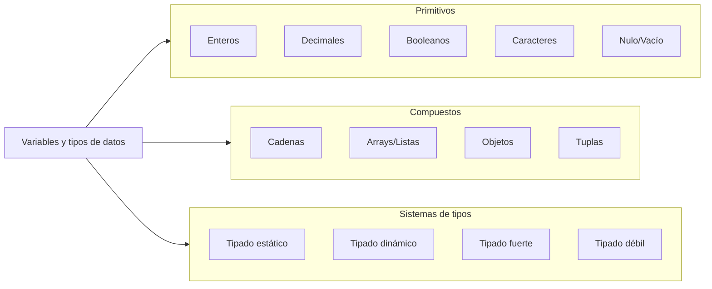
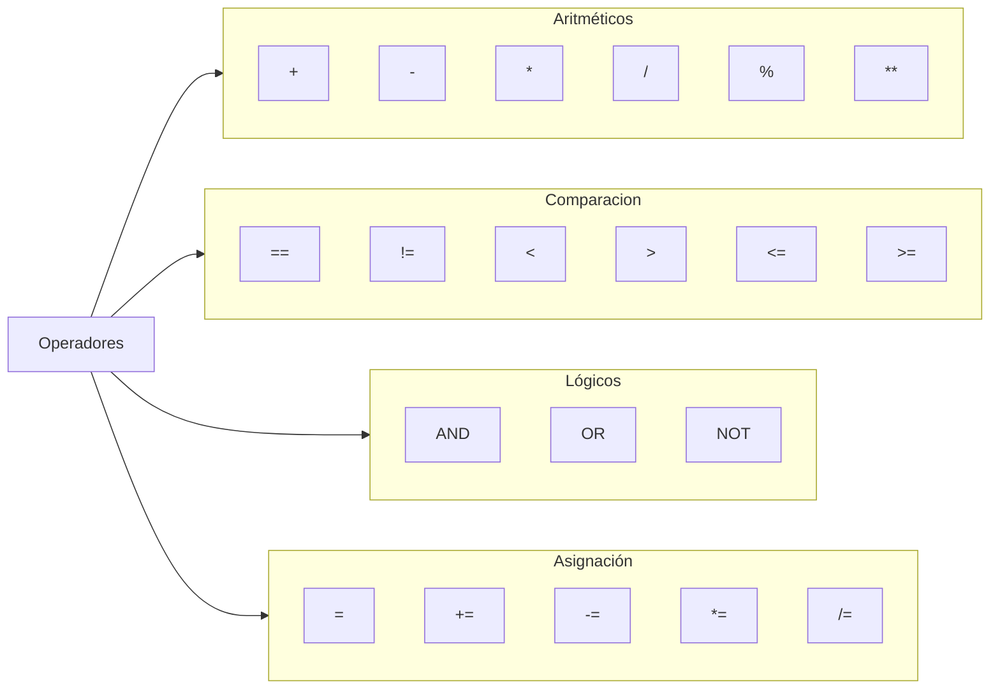
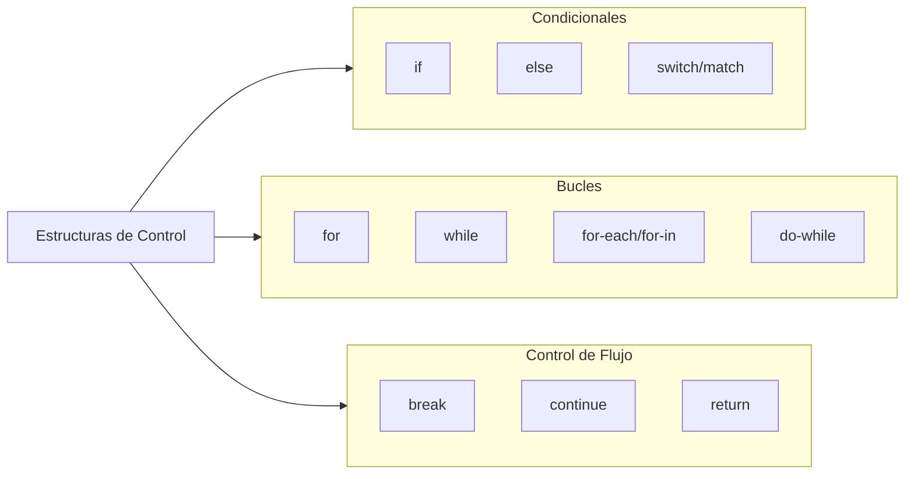
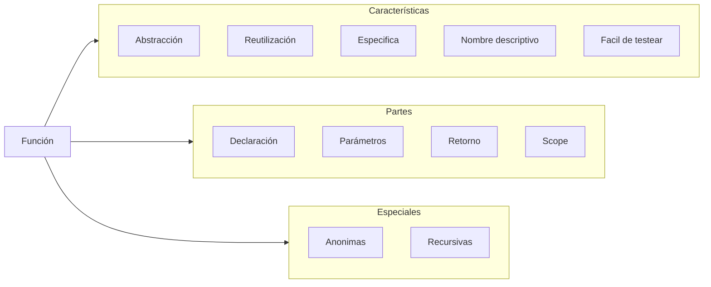

# Fundamentos de Programación

### Sintaxis y Semántica

### Operadores

### Estructuras de control

### Funciones 

Mecanismo principal de:

	+ Abstracción para dividir las tareas de un código
	+ Reutilización de la misma tarea en diferentes partes
	+ Hace solo una cosa muy puntual
	+ Nombre basado en la tarea que se quiere realizar
	+ Fácil de probar por su resultado esperado

#### Partes de una función:

	+ Declaración: Nombre, parámetros y cuerpo.
	+ Datos de entrada: por valor vs. por referencia, valores por defecto.
	+ Retorno de datos: valores de salida, múltiples retornos, void.
	+ Ambiente: ámbito de variables, closures, hoisting.

#### Algunas Tipo de funciones importantes

	+ Funciones anónimas: lambdas, arrow functions, callbacks.
	+ Recursividad: funciones que se llaman a sí mismas.
	

	