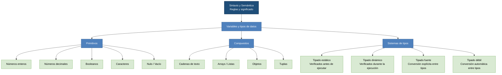

# Fundamentos de Programación

```mermaid
flowchart TD
    A["Sintaxis y Semántica<br/>Reglas y significado"]

    A --> B["Variables y tipos de datos"]

    %% ==========================
    %% Tipos de datos
    %% ==========================
    B --> C["Primitivos"]
    B --> D["Compuestos"]
    B --> E["Sistemas de tipos"]

    %% ==========================
    %% Primitivos
    %% ==========================
    C --> C1["Números enteros"]
    C --> C2["Números decimales"]
    C --> C3["Booleanos"]
    C --> C4["Caracteres"]
    C --> C5["Nulo / Vacío"]

    %% ==========================
    %% Compuestos
    %% ==========================
    D --> D1["Cadenas de texto"]
    D --> D2["Arrays / Listas"]
    D --> D3["Objetos"]
    D --> D4["Tuplas"]

    %% ==========================
    %% Sistemas de tipos
    %% ==========================
    E --> E1["Tipado estático<br/>Verificados antes de ejecutar"]
    E --> E2["Tipado dinámico<br/>Verificados durante la ejecución"]
    E --> E3["Tipado fuerte<br/>Conversión explícita entre tipos"]
    E --> E4["Tipado débil<br/>Conversión automática entre tipos"]

    %% ==========================
    %% Colores
    %% ==========================
    classDef principal fill:#1f4e79,color:#fff,stroke:#0b2c4d,stroke-width:2px;
    classDef categoria fill:#4F81BD,color:#fff,stroke:#1F497D;
    classDef hoja fill:#D9EAD3,color:#000,stroke:#6AA84F;

    class A principal;
    class B,C,D,E categoria;
    class C1,C2,C3,C4,C5,D1,D2,D3,D4,E1,E2,E3,E4 hoja;
```
