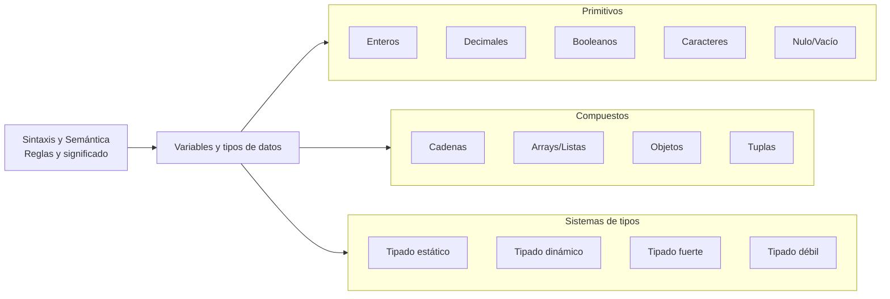

# Fundamentos de Programación

```mermaid
flowchart LR

A["Sintaxis y Semántica<br/>Reglas y significado"]
A --> B["Variables y tipos de datos"]

B --> P
B --> C
B --> S

subgraph P["Primitivos"]
direction TB
P1["Enteros"]
P2["Decimales"]
P3["Booleanos"]
P4["Caracteres"]
P5["Nulo/Vacío"]
end

subgraph C["Compuestos"]
direction TB
C1["Cadenas"]
C2["Arrays/Listas"]
C3["Objetos"]
C4["Tuplas"]
end

subgraph S["Sistemas de tipos"]
direction TB
S1["Tipado estático"]
S2["Tipado dinámico"]
S3["Tipado fuerte"]
S4["Tipado débil"]
end
```