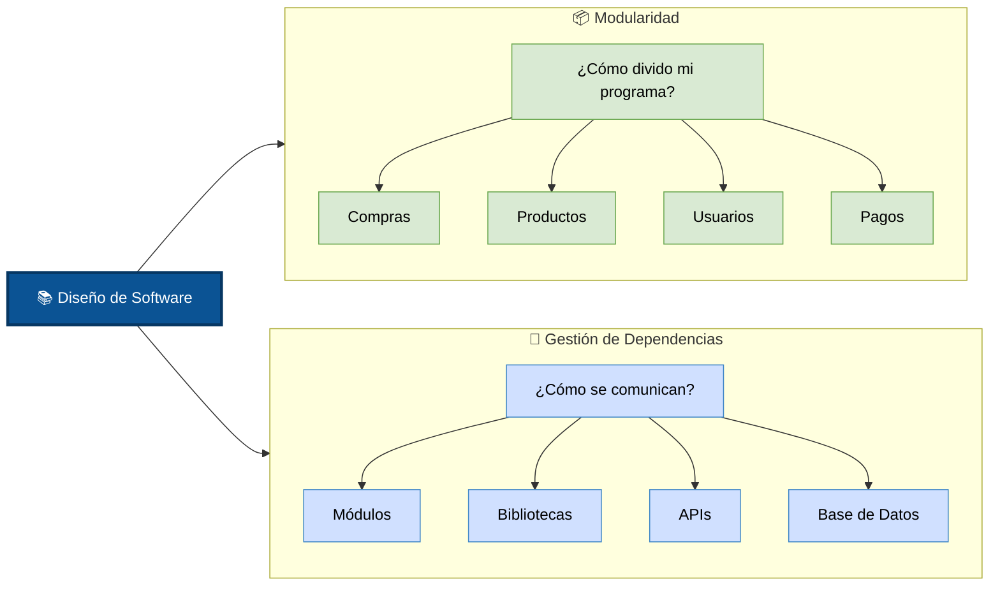
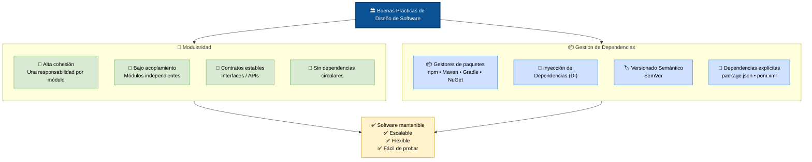

#### 19/07/2026

<details>
<summary>expandir</summary>

##### Hoy aprendí

+ La Tabla Hash es una de las implementaciones concretas más importantes del TDA Diccionario/Mapa.
+ El Nodo de Árbol Binario no suele utilizarse de forma aislada; su propósito es servir como la pieza fundamental para construir todas las variantes de árboles binarios
+ La Matriz de Adyacencia es una estructura concreta para representar grafos mediante una matriz cuadrada
+ La Matriz de Adyacencia es una implementación concreta basada en un arreglo bidimensional
+ La Matriz de Adyacencia (arreglo bidimensional), pero con un propósito distinto: en lugar de almacenar datos en filas y columnas, cada posición representa la existencia o el peso de una conexión entre dos vértices.
```
TDA Grafo
│
├── Matriz de Adyacencia
└── Lista de Adyacencia
```
+ para grafos densos usar Matriz de Adyacencia
+ para grafos dispersos usar Lista de Adyacencia
+ La lista de adyacencia es la otra gran representación física de un grafo


##### Tengo que investigar

+ Comparativa entre las estrcuturas de datos concretas - No lineales

</details>

#### 20/07/2026

<details>
<summary>expandir</summary>

##### Hoy aprendí

+ las estructuras de datos concretas pueden combinarse para implementar un TDA más complejo.
+ árboles y grafos son dos familias distintas de estructuras no lineales: el primero organiza la información de forma jerárquica, mientras que el segundo permite representar relaciones arbitrarias entre elementos.

+ Lo que entendí para escoger una estructura si tengo algunos datos que quiero relacionar, no por jerarquías, me haría las siguientes preguntas:

    1. ¿las relaciones tienen peso o solo necesito relacionarlas?
    2. ¿es un grafo denso o disperso?
	    + si es denso utilizaría una matriz de adyacencia para relacionarlos
	    + si es disperso utilizaría una lista de adyacencia para relacionarlos

+ la mayoría de los lenguajes modernos son multiparadigma

+ Tradicionalmente se dice que:
	+ Procedimiento → realiza una acción.
	+ Función → devuelve un valor.
    + pero en lenguajes modernos ya no existe una diferencia fuerte entre procedimiento y función.

+ Paradigmas tradicionales: describen cómo se estructura y escribe el código.
+ Paradigmas transversales: describe cómo se organizan y ejecutan las tareas.
+ Los paradigmas se pueden usar en simultaneo para crear soluciones en código 
+ Un hilo (o thread) es la unidad más pequeña de procesamiento que puede realizar una tarea


##### Tengo que investigar

+ Sincronización de tareas.
+ Condiciones de carrera (Race Conditions).
+ Deadlocks y Livelocks.
+ Mecanismos de sincronización (Mutex, Semáforos, Monitores, Barreras).
+ Modelos de concurrencia (Memoria compartida, Paso de mensajes, Modelo Actor, CSP).
+ Programación asíncrona (async/await, Promesas, Futures).
+ Programación paralela
+ Programación reactiva
+ Programación dirigida por eventos (Event-Driven Programming)
+ Programación orientada a aspectos (AOP)
+ Programación basada en componentes

</details>

#### 21/07/2026

<details>
<summary>expandir</summary>

##### Hoy aprendí

+ proceso representa una aplicación completa, un hilo representa una tarea específica dentro de esa aplicación.
+ Race Conditions -> el resultado depende del orden en que se ejecutan las tareas
+ La programación asíncrona -> permite iniciar una operación larga sin detener el resto del programa
+ los paradigmas transversales -> Resuelven necesidades puntuales: No definen cómo se modela todo el software, sino cómo se maneja el tiempo, el flujo de datos, la concurrencia o la separación de funciones secundarias
+ La programación paralela representa un paso más allá de la programación concurrente -> busca que esas tareas se ejecuten realmente al mismo tiempo para aprovechar el hardware moderno
+ La mayoría de los sistemas reactivos son asíncronos.
+ La programación reactiva puede verse como una evolución de la programación dirigida por eventos

```
Ejemplo de Diferencias EDP vs Reactiva
|
|____ Programación dirigida por eventos
|       |
|       |_ Cuando haces clic en un botón que guarda un archivo
|
|____ Programación reactiva
        |
        |_ Aplicación recibe continuamente datos de sensores, los filtra, los transforma y actualiza en tiempo real
```

+ preocupaciones transversales (cross-cutting concerns), es decir, aquellas funcionalidades que aparecen repetidamente en muchas partes del sistema.

```
Ejemplo de Diferencias POO vs AOP
|
|____ Programación Orientada a Objetos
|       |
|       |_ Organiza el sistema en objetos que representan el dominio del problema.
|
|____ Programación Orientada a Aspectos
        |
        |_ Extrae las responsabilidades que se repiten en muchos objetos y las aplica automáticamente donde correspondan
```

+ Programación Orientada a Aspectos
```
crearUsuario()←-----|                   |←-- Aspecto Seguridad
                    |_____ Aspectos ____|       
eliminarUsuario()←--|                   |←-- Aspecto Logging
                    |                   |
actualizarUsuario()←|                   |←-- Aspecto Auditoría...
```
+ un `microservicio` es una unidad de despliegue, mientras que un `componente` es una unidad de construcción del software.
+ `los componentes` suelen ejecutarse dentro de una misma aplicación y comparten el mismo proceso.
+ cada `servicio` es una aplicación independiente que se comunica con las demás mediante la red (`HTTP`, `gRPC`, `mensajería`, etc.).


##### Tengo que investigar

+ Patrones de diseño
+ Modularidad y Gestión de Dependencias
+ Manejo de Errores

</details>

#### 22/07/2026

<details>
<summary>expandir</summary>

##### Hoy aprendí


+ **🚨El bajo acoplamiento‼️ Es uno de los ✅_objetivos más importantes_✅ del diseño de software.**

+ La alta cohesión hace que los módulos sean más fáciles de entender y mantener
+ una dependencia puede ser Cualquier componente que un módulo necesite para funcionar.
+ Dependencias internas → Son módulos creados dentro del mismo proyecto. 
+ Dependencias externas → herramientas desarrolladas por terceros. (npm, cargo, pip...) 
+ gestión de dependencias externas → ¿Cómo incorporo componentes externos de forma organizada?



+ Modularidad: decide qué partes tendrá el sistema.
+ Gestión de dependencias: decide cómo colaboran esas partes y cómo utilizan recursos internos o externos.

**Analogia:**

🏢 Construir un edificio
| 1️⃣ Modularidad            | 2️⃣ Gestión de dependencias           |
| --------------------------| --------------------------------------|
| ¿Cómo divido el edificio? | ¿Cómo se conectan esas habitaciones?  |
|📍 Cocina                  | 🚰 Tuberías                          |
|📍 Sala                    | ⚡ Electricidad                      |
|📍 Dormitorio              | 🌐 Internet                          |
|📍 Baño                    | 🚪 Puertas                           |

+ orden lógico que se sigue al diseñar software
	+ organizas el sistema en módulos con responsabilidades claras
	+ estableces cómo interactúan entre ellos y con los recursos que necesitan para funcionar.

+ _La relación entre modularidad y dependencia es uno de los **temas fundamentales del desarrollo de software**, porque:_
	+ **Se diseñan sistemas que pueden crecer, mantenerse y evolucionar con el tiempo**

+ Los módulos deben estructurarse en capas (ej. de presentación a datos) **en una sola dirección**



+ **SemVer (Versionado Semántico)** → convención de numeración de software estructurada como Mayor.Menor.Parche (ej. `2.5.1`).
+ **SemVer (Versionado Semántico)** → indica si una nueva versión es compatible con la anterior y si añade funciones o solo corrige errores
+ *breaking changes* → Cuando se hace cambios incompatibles en la API o en el código que rompen la compatibilidad con versiones anteriores

##### Tengo que investigar

+ arquitectura de software 
+ patrones de diseño 
+ principios SOLID 

</details>
