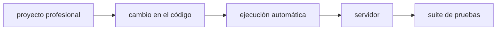
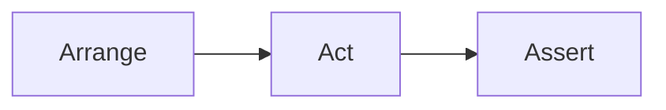

#### 27/07/2026

<details>
<summary>expandir</summary>

##### Hoy aprendí

+ En la práctica profesional, un desarrollador dedica una parte importante de su tiempo a investigar por qué un programa no se comporta como esperaba.
+ :x:"hacer que el error desaparezca" :x: **:white_check_mark: descubrir la causa raíz del problema: white_check_mark: → :white_check_mark: solucionarla de forma correcta :white_check_mark:**
+ **:white_check_mark: El debugging no es únicamente una habilidad técnica, sino también una forma de pensar. :white_check_mark:**

```
Se observa un problema
        │
        ▼
Reproducir el error
        │
        ▼
Recopilar información
        │
        ▼
Encontrar la causa
        │
        ▼
Corregir el código
        │
        ▼
Verificar la solución
        │
        ▼
¿El problema desapareció?
        │
   Sí ─────► Finalizar
        │
        No
        ▼
Seguir investigando
```
+ Es importante cuando se corrigen errores evitar **confundir el síntoma con la causa**
+ ¿Puedo reproducir el error de forma consistente? - Reproducibilidad
+ La depuración consiste precisamente en **verificar las suposiciones.**
+ Uno de los errores más comunes de los principiantes es ignorar el mensaje de error
+ Un error frecuente es leer únicamente la primera línea del mensaje de error
	+ tipo → descripción → archivo y la línea → Stack Trace

| Información         | Significado                              |
| ------------------- | ---------------------------------------- |
| `ZeroDivisionError` | Tipo de error ocurrido.                  |
| `division by zero`  | Descripción del problema.                |
| `archivo.py`        | Archivo donde ocurrió.                   |
| `Línea 25`          | Lugar aproximado donde comenzó el error. |

+ _Archivo y línea_ → No necesariamente indica el sitio exacto del error → pero sí indica **dónde** el programa **descubrió el problema.**
+ Siempre existirán errores, el buen desarrollador no es quien no comete errores sino quien tiene una **excelente depuración**
+ Muchos bugs se resuelven después de un descanso, una ducha, o una noche de sueño.
+ Usa la IA para aprender, no solo para solucionar.
	+ Pega el error y el código relevante aen el chat de la IA, Pregunta no cómo arreglarlo, sino POR QUÉ ocurre

**Testing**

+ Es verificar que el código realmente funcione correctamente y continúe funcionando **cuando evolucione**.
+ Se recomienda tener pocos tests E2E, → centrados en los flujos más críticos del sistema.
+ :key: La pirámide de testing es una de las prácticas fundamentales del desarrollo de software moderno :key:
+ Los test deben estar automatizados:

+ **:diamonds: Un test también es documentación. :diamonds:**
+ La mayoría de los tests modernos siguen el Patrón AAA (Arrange – Act – Assert)



+ TDD → "¿Cómo debería comportarse esta `función`/`componente`/`codigo`?" → mejores interfaces y responsabilidades.

##### Tengo que investigar

+ Refactoring
+ Técnicas Comunes de Refactoring 
+ Deuda Técnica 

</details>

#### 28/07/2026

<details>
<summary>expandir</summary>

##### Hoy aprendí

+ **Refactoring**
+ :boom: "Primero haz que funcione, luego haz que sea limpio." :boom:
+ Si nunca mejoramos el código, termina siendo difícil de entender y modificar.
+ El objetivo **NO** es `agregar` nuevas funcionalidades :fire:
+ :heavy_exclamation_mark: :heavy_equals_sign: refactoring es diferente de optimización
+ A veces un refactoring mejora el rendimiento, pero ese no es su objetivo principal.
+ ¿Cuándo Refactorizar? → **No existe una regla absoluta**
+ ¿Cuándo Refactorizar? → :heavy_exclamation_mark: No todo código imperfecto necesita mejorarse :heavy_exclamation_mark: → **:gem: El tiempo también es un recurso :gem:**

##### Tengo que investigar

+ Refactoring
+ Deuda técnica 

</details>
