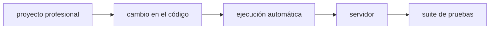
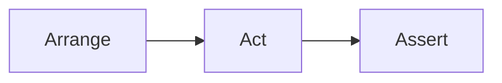

#### 27/07/2026

<details>
<summary>expandir</summary>

##### Hoy aprendí

+ En la práctica profesional, un desarrollador dedica una parte importante de su tiempo a investigar por qué un programa no se comporta como esperaba.
+ :x:"hacer que el error desaparezca" :x: **:white_check_mark: descubrir la causa raíz del problema → :white_check_mark: solucionarla de forma correcta**
+ **:white_check_mark: El debugging no es únicamente una habilidad técnica, sino también una forma de pensar. :white_check_mark:**

```
Se observa un problema
        │
        ▼
Reproducir el error
        │
        ▼
Recopilar información
        │
        ▼
Encontrar la causa
        │
        ▼
Corregir el código
        │
        ▼
Verificar la solución
        │
        ▼
¿El problema desapareció?
        │
   Sí ─────► Finalizar
        │
        No
        ▼
Seguir investigando
```
+ Es importante cuando se corrigen errores evitar **confundir el síntoma con la causa**
+ ¿Puedo reproducir el error de forma consistente? - Reproducibilidad
+ La depuración consiste precisamente en **verificar las suposiciones.**
+ Uno de los errores más comunes de los principiantes es ignorar el mensaje de error
+ Un error frecuente es leer únicamente la primera línea del mensaje de error
	+ tipo → descripción → archivo y la línea → Stack Trace

| Información         | Significado                              |
| ------------------- | ---------------------------------------- |
| `ZeroDivisionError` | Tipo de error ocurrido.                  |
| `division by zero`  | Descripción del problema.                |
| `archivo.py`        | Archivo donde ocurrió.                   |
| `Línea 25`          | Lugar aproximado donde comenzó el error. |

+ _Archivo y línea_ → No necesariamente indica el sitio exacto del error → pero sí indica **dónde** el programa **descubrió el problema.**
+ Siempre existirán errores, el buen desarrollador no es quien no comete errores sino quien tiene una **excelente depuración**
+ Muchos bugs se resuelven después de un descanso, una ducha, o una noche de sueño.
+ Usa la IA para aprender, no solo para solucionar.
	+ Pega el error y el código relevante en el chat de la IA, Pregunta no cómo arreglarlo, sino POR QUÉ ocurre

**Testing**

+ Es verificar que el código realmente funcione correctamente y continúe funcionando **cuando evolucione**.
+ Se recomienda tener pocos tests E2E, → centrados en los flujos más críticos del sistema.
+ :key: La pirámide de testing es una de las prácticas fundamentales del desarrollo de software moderno :key:
+ Los test deben estar automatizados:

+ **:diamonds: Un test también es documentación. :diamonds:**
+ La mayoría de los tests modernos siguen el Patrón AAA (Arrange – Act – Assert)



+ TDD → "¿Cómo debería comportarse esta `función`/`componente`/`codigo`?" → mejores interfaces y responsabilidades.

##### Tengo que investigar

+ Refactoring
+ Técnicas Comunes de Refactoring 
+ Deuda Técnica 

</details>

#### 28/07/2026

<details>
<summary>expandir</summary>

##### Hoy aprendí

+ **Refactoring**
+ :boom: "Primero haz que funcione, luego haz que sea limpio." :boom:
+ Si nunca mejoramos el código, termina siendo difícil de entender y modificar.
+ El objetivo **NO** es `agregar` nuevas funcionalidades :fire:
+ :heavy_exclamation_mark: :heavy_equals_sign: refactoring es diferente de optimización
+ A veces un refactoring mejora el rendimiento, pero ese no es su objetivo principal.
+ ¿Cuándo Refactorizar? → **No existe una regla absoluta**
+ ¿Cuándo Refactorizar? → :heavy_exclamation_mark: No todo código imperfecto necesita mejorarse :heavy_exclamation_mark: → **:gem: El tiempo también es un recurso :gem:**

##### Tengo que investigar

+ Refactoring
+ Deuda técnica 

</details>

#### 29/07/2026

<details>
<summary>expandir</summary>

##### Hoy aprendí

+ **Refactoring Tenicas**
+ Rename (Renombrar) → :boom: "Un buen nombre puede ahorrar muchos comentarios." :boom:
+ El refactoring es una práctica continua → no se considera una tarea excepcional → acompaña al desarrollo diario
+ **Deuda tecnica:**
+ :heavy_exclamation_mark: La deuda técnica aparece cuando posponemos mejoras o tomamos atajos que dificultan el mantenimiento futuro.
+ _"Es el trabajo pendiente que dejamos en el código y que tarde o temprano tendremos que pagar"_
+ **No siempre aparece por malas prácticas → pero no debe perderse de vista** 
+ **:gem: No toda deuda debe resolverse inmediatamente :gem:**
+ _El objetivo es mantenerla bajo control_
+ La deuda técnica está conectada con varios temas:

| Concepto               | Relación con la deuda técnica                                                                         |
| ---------------------- | ----------------------------------------------------------------------------------------------------- |
| **Modularidad**        | Un diseño modular reduce la acumulación de deuda al facilitar cambios aislados.                       |
| **Manejo de errores**  | Un manejo de errores claro evita soluciones improvisadas que generan deuda.                           |
| **Testing**            | Los tests permiten refactorizar con seguridad y reducir deuda técnica.                                |
| **Refactoring**        | Es la principal técnica para disminuir la deuda acumulada sin cambiar el comportamiento del software. |
| **Calidad del código** | Una buena calidad desde el inicio reduce la necesidad de correcciones costosas en el futuro.          |

+ **El refactoring** + _buenos tests automatizados_, mantienen la deuda técnica **bajo control**.

##### Tengo que investigar

+ Datos y comunicacion → Redes Básicas
+ Datos y comunicacion → HTTP/HTTPS

</details>

#### 30/07/2026

<details>
<summary>expandir</summary>

##### Hoy aprendí

### Redes Básicas:
+ El Modelo **Cliente-Servidor** → es una arquitectura de comunicación
+ **Servidor** es la parte del sistema que concentra la lógica principal y protege los datos sensibles.
+ La **IP** identifica un **dispositivo** dentro de una red, no una aplicación.
+ Un **puerto** es un número lógico que identifica una **aplicación o servicio específico** dentro de un dispositivo.
+ `localhost` es un nombre especial que siempre hace referencia al propio dispositivo desde el que se está ejecutando el programa → **útil durante el desarrollo y las pruebas.**

### DNS
+ Si un servidor DNS deja de funcionar, normalmente otro puede responder la consulta.

```mermaid
flowchart LR

    STEP1["① Usuario<br/>Escribe www.github.com"]

    STEP2["② Navegador<br/>Necesita conocer la IP"]

    STEP3["③ Consulta DNS"]

    STEP4["④ DNS responde<br/>140.82.114.4"]

    STEP5["⑤ HTTPS<br/>140.82.114.4:443"]

    STEP6["⑥ Servidor GitHub"]

    STEP1 --> STEP2
    STEP2 --> STEP3
    STEP3 --> STEP4
    STEP4 --> STEP5
    STEP5 --> STEP6

    classDef process fill:#D9EAD3,stroke:#6AA84F,color:#000;
    classDef dns fill:#D0E0FF,stroke:#3D85C6,color:#000;
    classDef server fill:#FCE5CD,stroke:#E69138,color:#000;

    class STEP1,STEP2 process;
    class STEP3,STEP4 dns;
    class STEP5,STEP6 server;
```


+ El **DNS** solo traduce nombres → Una vez obtenida la IP → el DNS deja de intervenir.
+ Cuando un cliente realiza una consulta **DNS**, puede recibir una de varias direcciones **IP** disponibles.

### Protocolos
+ **TCP** → Prioriza la confiabilidad
+ **UDP** → Prioriza la velocidad
+ En el **Modelo OSI** que se compone 7 capas → la capa numero cuatro llamada **Capa de Transporte** es donde generalmente funcionan los protocolos **TCP** y **UDP**
+ La **IANA** (_Autoridad de Números Asignados de Internet, o Internet Assigned Numbers Authority_) es la organización global encargada de coordinar los identificadores técnicos únicos que permiten que todo Internet funcione de forma conectada y sin duplicaciones
+ El _3 de febrero de 2011_ **IANA** entregó los últimos bloques /8 libres de `IPv4` -> Hoy todas las direcciones IPv4 útiles del mundo están ocupadas
+ **ICANN** → _Corporación de Internet para la Asignación de Nombres y Números_
+ La idea central es que **IPv4** sea un subconjunto de **IPv8** -> **IPv4** seguiría funcionando como parte del nuevo protocolo --> Esta es la principal ventaja de **IPv8** frente a **IPv6**

##### Tengo que investigar

+ HTTP/HTTPS en Detalle 
+ Estructura de una Petición HTTP 
+ Estructura de una Respuesta HTTP 
+ Códigos de Estado Importantes 

</details>