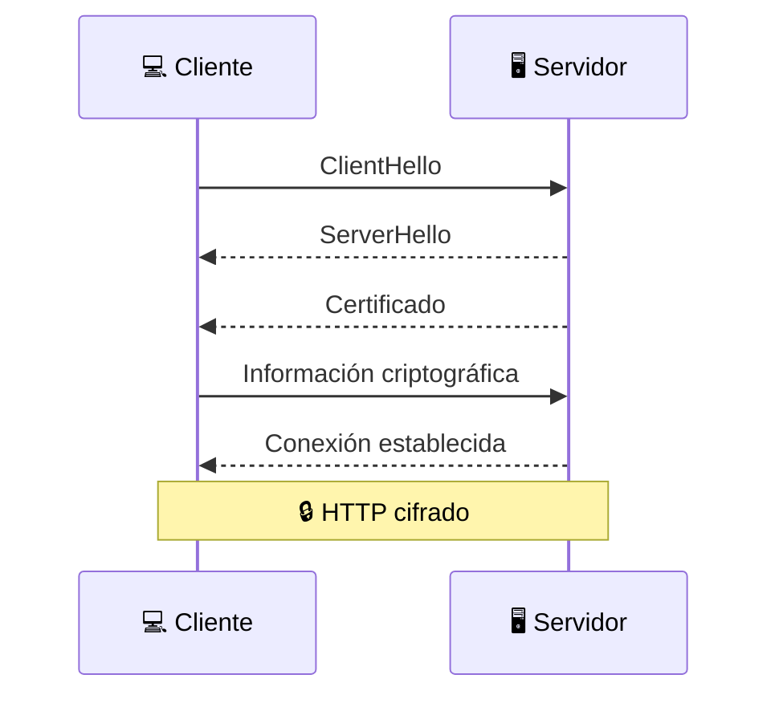

#### 20/09/2026

<details>
<summary>expandir</summary>

##### Hoy aprendí

### HTTP/HTTPS en Detalle 

### `HTTP`
+ Estructura de una ***petición** `HTTP`
	+ Una petición `HTTP` indica qué recurso quiere utilizar el cliente, qué operación quiere realizar, proporciona información adicional mediante **headers** y, cuando es necesario, envía datos en el **body.**

+ Estructura de una **Respuesta** `HTTP` 
	+ La estructura de una respuesta `HTTP`  es muy importante porque te permitirá entender posteriormente los códigos de estado, las APIs, los errores `HTTP` y las herramientas de diagnóstico.
	+ Una respuesta HTTP le indica al cliente qué ocurrió con su petición, proporciona información adicional mediante headers y, cuando corresponde, devuelve datos en el body.

+ HTTP Petición vs Respuesta
	+ «La diferencia fundamental está en la primera línea.»
		+ Petición HTTP → Qué quiere hacer el cliente.
		+ Respuesta HTTP → Qué ocurrió con la petición.
	+ Códigos de estado HTTP → están organizados en cinco grandes categorías
		+ se agrupan según su primer número
			+ 1xx → Información
			+ 2xx → Éxito
			+ 3xx → Redirección
			+ 4xx → Problema con la solicitud
			+ 5xx → Problema en el servidor
		+ Observaciones 
		+ `401 Unauthorized` → Aunque el nombre diga `Unauthorized`, en la práctica HTTP `401` está relacionado principalmente con **autenticación**.
		+ 401 VS 403 
			+ 401 → ¿Quién eres?
			+ 403 → Sé quién eres, pero no tienes permiso.

+ Códigos de Estado HTTP
	+ Los códigos de estado de la respuesta `HTTP`son EXTREMADAMENTE IMPORTANTES para los desarrolladores porque permiten saber rápidamente qué ocurrió.
	+ No es necesario memorizar todos los códigos al principio, pero si es importante recordar los mas frecuentes
	+ Cuando aparezca un codigo HTTP mientras se esta desarrollando, se puede empezar por la siguiente pregunta:
		+ > _**¿Con qué número comienza?**_
	+ | Código  |        Significado                        |
| ------- | ----------------------------------------- |
| **2xx** | Éxito                                     |
| **3xx** | Redirección / caché                       |
| **4xx** | Revisar la petición del cliente           |
| **5xx** | Investigar el servidor o sus dependencias |

	+ No todos los códigos HTTP representan errores. es mejor pensar en ellos como indicadores del resultado de la interacción HTTP, no simplemente como "códigos de error".

##### Tengo que investigar

+ CORS (Cross-Origin Resource Sharing)

</details>

#### 21/09/2026

<details>
<summary>expandir</summary>

##### Hoy aprendí

### CORS — Cross-Origin Resource Sharing
+ Un navegador no permite libremente que una página web lea respuestas provenientes de cualquier origen. CORS es un mecanismo de seguridad de los navegadores que controla cuándo una página web puede realizar solicitudes a un servidor
+ ¿qué es un Origin?
```
          	ORIGIN
               │
     ┌─────────┼──────┐
     │         │      │
  Protocolo  Host   Puerto
```
+ Si cualquiera de estos cambia, tenemos un origen diferente.

### Same-Origin Policy (SOP)
+ Es una política de seguridad restringe cómo una aplicación puede interactuar con recursos de otro origen.
+ **CORS** es principalmente una restricción aplicada por el navegador al acceso de una página a una respuesta cross-origin.
+ CORS no reemplaza HTTP.

</details>

#### 22/09/2026

<details>
<summary>expandir</summary>

##### Hoy aprendí

### HTTPS Y seguridad

+ `HTTPS` -> `HTTP` + `TLS`
+ `HHTPS` y Confidencialidad
+ `HHTPS` e Integridad 
+ `HHTPS` y Autenticidad
+ TLS (Transport Layer Security) -> es el protocolo criptográfico que proporciona la seguridad utilizada por HTTPS.
+ **Man-in-the-Middle (_MITM_)** ocurre cuando un atacante intenta colocarse entre dos participantes de una comunicación.
	+ TLS utiliza criptografía y certificados para dificultar este tipo de ataque.

+ `HTTP` es un Protocolo de aplicación
+ `TLS` se encarga de la Seguridad de la comunicación
+ `TCP` es una capa de Transporte

+ Un certificado digital permite asociar una identidad, como un dominio, con una clave pública.
+ ¿Quién emite los certificados? -> _Certificate Authorities (CA)_ -> El navegador dispone de una lista de autoridades de certificación en las que confía.
+ Cadena de certificados
```
Root CA
   │
   ▼
Intermediate CA
   │
   ▼
Certificado del sitio
   │
   ▼
ejemplo.com
```
+ ¿Qué ocurre cuando visitas HTTPS?

```
1. Cliente
      │
      │ Solicita conexión segura
      ▼
2. Servidor
      │
      │ Presenta certificado
      ▼
3. Cliente
      │
      │ Verifica certificado
      ▼
4. Se establece TLS
      │
      ▼
5. Se establecen claves de sesión
      │
      ▼
6. HTTP protegido
```

+ **TLS Handshake** 



+ Criptografía asimétrica y simétrica
+ Criptografía asimétrica 
```
        Claves
          │
      ┌───┴───┐
      ▼       ▼
   Pública  Privada
      |        |
      ▼        ▼
    puede      debe 
compartirse    mantenerse 
		protegida

```

+ Criptografía simétrica
```
Handshake
    ↓
Criptografía asimétrica / intercambio seguro
    ↓
Establecimiento de claves
    ↓
Clave de sesión
    ↓
Cifrado simétrico de los datos
```

+ HTTPS principalmente cifra:
+ `HTTP Request -> Headers -> Body`
+ `HTTP Response -> Headers -> Body`

+ `HTTPS` Protege la comunicación, pero no corrige vulnerabilidades en el código del servidor.

+ Son conceptos diferentes:
| Concepto           | Primera Línea              |
| -------------------| ---------------------------|
| HTTPS:             | Protege la comunicación    | 
| Autenticación:     | Determina quién eres       | 
| Autorización:      | Determina qué puedes hacer | 

+ 🔒 `https://ejemplo.com` ->  el candado significa que ' La conexión HTTPS/TLS cumple las condiciones de seguridad que el navegador pudo verificar' 

+ HTTP Strict Transport Security — HSTS -> Permite que un sitio indique al navegador que debe utilizar HTTPS para ese dominio.

+ HTTPS y su relación con los certificados: 

```
HTTPS
  │
  └── utiliza TLS
          │
          ├── Cifrado
          ├── Integridad
          └── Autenticación del servidor
                    │
                    ▼
             Certificado digital
                    │
                    ▼
              Autoridad de
              Certificación
```

+ Lo esencial de la lección 

```
                         HTTPS
                           │
                           ▼
                          TLS
                           │
             ┌─────────────┼─────────────┐
             ▼             ▼             ▼
      Confidencialidad  Integridad   Autenticidad
             │                           │
             │                           ▼
             │                      Certificado
             │                           │
             │                           ▼
             │                         CA
             │
             ▼
       Datos protegidos
       durante el tránsito
```

+ 27. ¿Cómo se relaciona con los conceptos anteriores?

```
                   WEB
                    │
                    ▼
              HTTP / HTTPS
                    │
          ┌─────────┴─────────┐
          ▼                   ▼
       Request              Response
          │                   │
          └─────────┬─────────┘
                    ▼
             Status Codes
                    │
                    ▼
                  CORS
                    │
                    ▼
              Seguridad
                    │
          ┌─────────┼─────────┐
          ▼         ▼         ▼
        TLS     Certificados  HSTS
          │
          ▼
      Cifrado
      Integridad
      Autenticidad
```
### Herramientas de Diagnóstico

+ Las herramientas de diagnóstico permiten descubrir dónde está fallando una comunicación: en tu equipo, en la red, en DNS, en el transporte, en HTTP/HTTPS o en la propia aplicación.
+ Cuando algo falla, puedes investigar de abajo hacia arriba
+ Las herramientas de diagnóstico permiten localizar problemas de comunicación comprobando diferentes capas y componentes de una aplicación conectada a Internet.	
+ Lo esencial de las herramientas

+ `ipconfig / ip` → configuración de red local
+ `ping` → conectividad mediante **ICMP**
+ `nslookup` / dig → resolución **DNS**
+ `tracert / traceroute` → ruta hacia el destino
+ `netstat / ss` → conexiones y puertos
+ `curl` → pruebas **HTTP/HTTPS** desde terminal
+ `DevTools` → inspección de **requests, responses, headers, CORS, tiempos y recursos del navegador**
+ `Postman` → pruebas y exploración de _**APIs**_
+ `Wireshark` → captura y análisis de paquetes

</details>

#### 24/09/2026

<details>
<summary>expandir</summary>

##### Hoy aprendí

### Testing y Calidad del Código — Conceptos complementarios

+ Prueba caja negra y prueba de caja blanca -> Las dos técnicas son complementarias.
+ Los tests unitarios, de integración y E2E son ejemplos de pruebas dinámicas.
+ La automatización permite repetir pruebas rápidamente y es especialmente importante para las pruebas de regresión.
+ Cada vez que se modifica una parte importante del sistema, conviene volver a ejecutar las pruebas relevantes.
+ Pruebas de Rendimiento -> permite conocer cómo cambia el rendimiento a medida que aumenta la carga.
+ Pruebas de Compatibilidad -> su objetivo es identificar problemas producidos por diferencias entre plataformas o componentes.
+ Una documentación incorrecta puede provocar errores incluso cuando el software funciona correctamente.
+ La trazabilidad facilita el control del proyecto y permite demostrar que los requisitos importantes fueron verificados.
+ Las métricas deben utilizarse para apoyar decisiones, no simplemente para producir números.

</details>