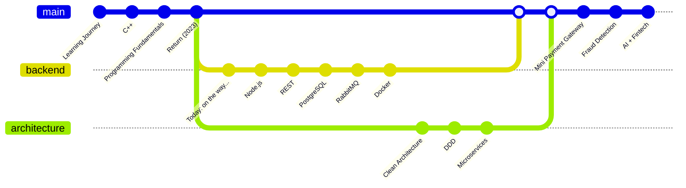

# 📚 Learning Journey

### :back::end: ... :soon: 

> *From understanding financial fraud to building the software that helps prevent it.*

Welcome to my learning journey.

This repository documents my path as a Software Engineering student, the technologies I'm learning, the projects I'm building, and the lessons I collect along the way. More than a collection of notes, this repository represents the evolution of my career and my long-term goal of designing software for the financial technology industry.

---

# What You'll Find Here

This repository serves as my personal engineering journal.

It includes:

* Study notes organized by topic.
* Architecture and design decisions.
* Weekly learning summaries.
* Research notes.
* References to books, documentation, and articles.
* Links to personal software projects.
* Reflections about engineering challenges and lessons learned.

---

# Areas I'm Currently Learning

* Backend Engineering
* Distributed Systems
* Software Architecture
* Payment Systems
* Event-Driven Architecture
* REST APIs
* Messaging Systems
* PostgreSQL
* Go
* Node.js
* Rust
* Docker
* Cloud Computing
* Fraud Detection Technologies
* Secure Software Design

---

# Projects

This learning journey is closely linked to the software projects I want to start developing very soon.

Some examples include:

* Mini Payment Gateway
* Payment Transaction Simulator
* Fraud Detection Experiments
* Event-Driven Microservices
* Architecture Pattern Implementations
* Software Engineering Study Projects

Each repository would document not only the final implementation but also the engineering decisions, challenges, research process, and lessons learned throughout the development.

---

Thank you for visiting my Learning Journey.